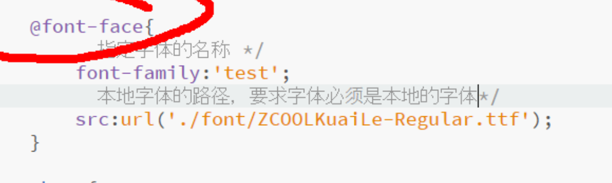

## 五种字体族

> 1. 衬线字体：serif，现实中常用的衬线字体有`宋体`、`Times`、`Georgia`。
> 2. 无衬线字体：sans-serif，现实中常用的无衬线字体有`Helvetica`、`Verdana、` 、`Arial`、`微软雅黑`。
> 3. 等宽字体：monospace，现实中常用的等宽字体有`Consolas`、`Courier New`，常用作代码编写的一类字体，等宽容易对齐。
> 4. 草书字体，cursive，现实中常用的草书字体有`Comic Sans`。
> 5. 装饰字体：fantasy。
>
> font-family使用注意：
>
> 1. 使用font-family属性设置字体，font-family属性值可以设置多个属性值，这些属性值是有优先级的，浏览器会优先使用前面的字体，只有当电脑没有安装该字体时，才会使用后面列出的字体。
> 2. 对于一些字体名带有中文、空格或者特殊字符，一律使用双引号引起来。

```css
/* 这句代码的意思是告诉浏览器从前来说匹配，当前电脑是否按照了这些字体中的任意一个，如果当前电脑没有安装"微软雅黑", Arial, Helvetica这几个字体的话，最后一个参数告诉电脑随便使用任意一个无衬线字体显示网页。 */
font-family: "微软雅黑", Arial, Helvetica, sans-serif;
```


## @font-face

> @font-face和font-family区别：
>
> 1. @font-face用来指定浏览器使用某一个具体字体显示网页，字体需要从服务器获取。
> 2. 这种方式引入字体时，会牵扯到版权问题，用了人家的字体就要给钱，建议找开源免费的字体。而使用上面方式引入时没有版权问题，使用电脑自带的字体。




