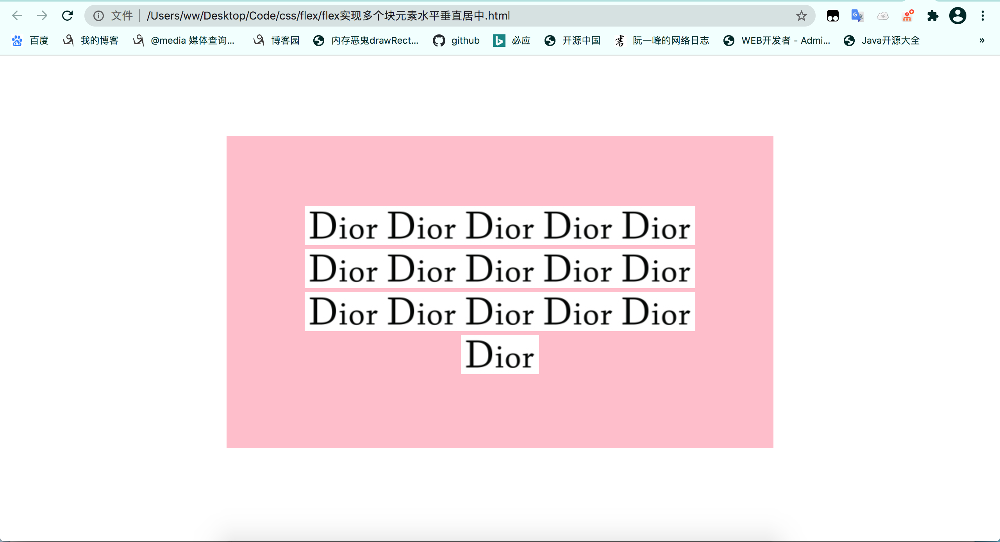
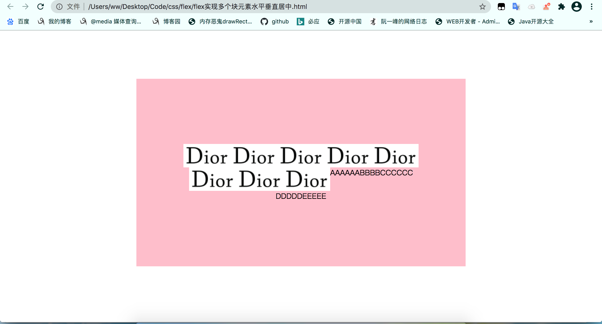

# css居中方式

> css居中方式，有的通过给父元素添加属性，实现元素居中，有的通过给元素自身设置属性实现居中。
>
>  
>
> 下面的css代码中：
>
> 1. parentNode：表示需要居中的元素的父元素。
> 2. sonNode：表示需要居中的元素

## 元素水平居中

### 行内元素水平居中

> 行内元素的水平居中方案(多个行内元素或行内块也适用该方案)：
>
> 1. 父元素添加`text-align: center`属性
> 2. 父元素添加两个属性`display: table-cell`，`text-align: center;`
>
> 上述方案需要水平居中的元素的显示样式display 是 `inline`，`inline-block`，`inline-table` 或者`inline-flex`。

```css
/* 给父元素设置text-align，适用于行内元素和行内块 */
.parentNode{
  text-align: center;
  width: 100px;
  height: 40px
}
```

### 块元素水平居中

> 单个块元素水平居中方式(`无需知道居中元素宽高`)：
>
> 1. margin，margin-left和margin-right为auto。
> 2. flex：父元素开启flex，并且align-items为center。
>
>  
>
> 多个块元素水平居中实现方案：
>
> 1. 将多个块元素包含在一个块元素中，外层块元素使用margin水平居中。
> 2. 将这些块元素转成行内元素( `inline`，`inline-block`，`inline-table` 和 `inline-flex`都可以)，父级元素使用text-align。
> 3. flex：父元素开启flex，并且align-items为center。

#### 单个块元素水平居中

```css
/* 单个块元素水平居中，设置当前元素的margin, 水平方向设为auto，浏览器会自动让元素居中。 */
.sonNode{
  margin: 0 auto;
}
```

#### 多个块元素水平居中

```html
<style>
  .parentNode{
    width: 300px;
    height: 200px;
  }
  
  .container{
    margin: 0 auto;
  }
</style>

<div class="parentNode">
  <div class="container">
		<div class="sonNode"></div>
		<div class="sonNode"></div>
		<div class="sonNode"></div>
  </div>
</div>
```

```html
<style>
  .parentNode{
    width: 300px;
    height: 200px;
    text-align: center;
  }
  
  .sonNode{
			display: inline-block;
  }
</style>

<div class="parentNode">
		<div class="sonNode"></div>
		<div class="sonNode"></div>
		<div class="sonNode"></div>
</div>
```


```html
<style>
  .parentNode{
    width: 300px;
    height: 200px;
    display:flex;
		jusitfy-content:center
  }
  
  .sonNode{
			display: inline-block;
  }
</style>

<div class="parentNode">
		<div class="sonNode"></div>
		<div class="sonNode"></div>
		<div class="sonNode"></div>
</div>
```


## 元素垂直居中

### 行内元素的垂直居中

> 单个行内垂直居中方式：
>
> 1. line-height = 外层元素的高度。
> 2. 转换成块元素，使用块元素的垂直居中方式。
> 3. 使用table-cell实现，父元素添加两个属性`display: table-cell`，`vertical-align: middle;`
>
> 多个行内元素垂直居中方式：
>
> 1. 使用一个块元素将所有行内元素包裹起来，让块元素垂直居中。
> 2. 使用table-cell实现，父元素添加两个属性`display: table-cell`，`vertical-align: middle;`

```html
<!-- 使用table-cell实现垂直居中 -->
<!DOCTYPE html>
<html>

<head>
    <style>
        .container {
            width: 200px;
            height: 500px;
            display: table-cell;
            /* 设置行内元素垂直居中 */
            vertical-align: middle;
            /* 设置行内元素水平居中 */
            text-align: center;
        }
        span{
            background-color: pink;
        }
    </style>
</head>

<body>
    
    <div class="container">
    <span>BBBB</span>
       <span>BBBB</span>
       <span>BBBB</span>
       <span>BBBB</span>
       <span>BBBB</span>
       <span>BBBB</span>
    </div>

</body>

</html>
```


### 块元素的垂直居中

> 块元素垂直居中方式(`无需知道居中元素宽高`)：
>
> 1. 定位+margin，子元素top和botton为0，margin-top和margin-bottom为auto。
> 2. 定位+transform，子元素top为50%，translateY(-50%)。
> 3. flex：父元素开启flex，并且align-items为center。
>
> 块元素垂直居中方式(`需要知道居中元素宽高`)：
>
> 1. 定位+负margin：子元素top为50%，margin-top为负自身高度一半。
> 2. 定位+calc：子元素top = calc(50% - 自身高度一半);


## 元素水平垂直居中

### 行内元素水平垂直居中

> 单个行内元素水平垂直居中
>
> 1. line-height = 外层元素的高度，text-align=center。
> 2. 转换成块元素，使用块元素的水平垂直居中方式。
> 3. 使用table-cell实现。
>
> 多个行内元素水平垂直居中
>
> 1. 使用table-cell实现， 父元素添加 display: table-cell;、vertical-align: middle、text-align: center;这三个代码。
> 2. 外层套一个块元素，使用块元素的水平垂直居中方案。

### 块元素水平垂直居中

> 水平垂直居中方式的区别：
>
> 1. 方式1、方式2、方法5无需知道居中元素的宽高，而方式3和方式4需要知道居中元素的宽高。

```css
/* 方式1: 使用定位 + margin方式*/
.sonNode{
    width: 100px;
  	height: 100px;
  
 		position:absolute;
  	left: 0;
  	right: 0;
   	top: 0;
    bottom: 0;
    margin: auto;
}
```

```css
/* 方式2: 使用定位 + transform，left和top设置元素位置为父元素宽高一半，使用transform回退自身宽高一半*/
.sonNode{
    width: 100px;
  	height: 100px;
  
 		position:absolute;
  	left: 50%;
   	top: 50%;
		transform: translate(-50%, -50%);
}
```

```css
/* 方式3: 定位 + 负margin，需要知道元素宽高，left和top设置元素位置为父元素宽高一半，使用margin回退自身宽高一半 */
.sonNode{
    width: 100px;
  	height: 100px;
  
 		position:absolute;
  	left: 50%;
   	top: 50%;
		margin: -50px 0 0 -50px;
}
```

```css
/* 方式4: 定位 + calc， 需要知道元素宽高*/
.sonNode{
    width: 100px;
  	height: 100px;
  
 		position:absolute;
  	left: calc(50% - 50px);
   	top: calc(50% - 50px);
		margin: -50px 0 0 -50px;
}
```

```css
/* 方式5: 使用flex */
.parentNode{
  	width: 200px
    height: 100px;
  
    display: flex;
  	justify-content: center;
  	align-items: center;
}
```


### 多个块元素的水平垂直居中

> 方式：
>
> 1. 使用一个块元素将多个块元素包裹起来，转换成单个块元素的水平垂直居中。
> 2. 使用flex实现水平垂直居中

```html
<!-- #container中内部元素水平垂直居中显示 -->
<!DOCTYPE html>
<html>
<head>
    <style>
        body,
        html {
            height: 100%;
            overflow: hidden;
        }

        #container {
            width: 500px;
            height:400px;
            background-color: pink;
            position:absolute;
            left: 0;
            right:0;
            top:0;
            bottom:0;
            margin:auto;

            /* 开启flex */
            display: flex;
            /* 水平方向居中 */
            justify-content: center;
            /* 如果伸缩项目有多行时，侧轴方向居中 */
            align-content: center;
            /* 一行装不下时换行显示 */
            flex-wrap: wrap;
            padding-left: 100px;
            padding-right: 100px;
            ;
        }
    </style>
</head>

<body>
    <div id="container">
        <div></div>
        <div></div>
        <div></div>
        <div></div>

        <div></div>
        <div></div>
        <div></div>
        <div></div>

        <div></div>
        <div></div>
        <div></div>
        <div></div>

        <div></div>
        <div></div>
        <div></div>
        <div></div>
    </div>

</body>

</html>
```





## 问题

> 当伸缩容器中出现不同显示样式的元素时，设置水平垂直居中时，是否显示不一样。

```html
<!DOCTYPE html>
<html>

<head>
    <style>
        body,
        html {
            height: 100%;
            overflow: hidden;
        }

        #container {
            width: 500px;
            height:400px;
            background-color: pink;
            position:absolute;
            left: 0;
            right:0;
            top:0;
            bottom:0;
            margin:auto;

            /* 开启flex */
            display: flex;
            /* 水平方向居中 */
            justify-content: center;
            /* 如果伸缩项目有多行时，侧轴方向居中 */
            align-content: center;
            /* 一行装不下时换行显示 */
            flex-wrap: wrap;
            padding-left: 100px;
            padding-right: 100px;
            ;
        }

        img{
            vertical-align: middle;
        }
    </style>
</head>

<body>
    <div id="container">
        <div></div>
        <div></div>
        <div></div>
        <div></div>
        
        
        
        
        <span>AAAAAA</span>
        <span>BBBB</span>
        <span>CCCCCC</span>
        <span>DDDDD</span>
        <span>EEEEE</span>
    </div>

</body>

</html>
```

