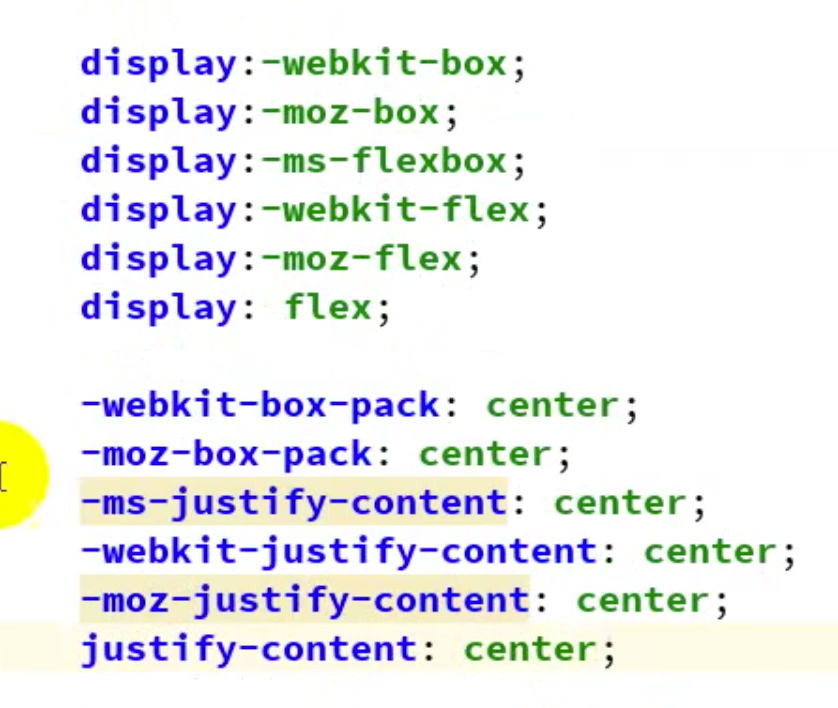

# 兼容性



> CSS中所有带有前缀的属性都是实验版属性或者属性值，并不是正式版，为了新技术的推广，不影响到原来的属性，给属性或者属性值添加前缀，告诉开发者该属性名或者属性值为实验版，随时可能废弃。
>
> 
>
> flex技术就有三个版本：旧版、过渡版和最新版，旧版和过渡版的属性都有前缀。
>
> 
>
> -webkit：带有这个前缀为chrome和safari浏览器定义的测试版css属性。
>
> -moz：带有这个前缀为火狐浏览器定义的试版css属性。
>
> -mz：带有这个前缀为IE浏览器定义的试版css属性。


 ## 旧语法


```css
// 设置伸缩容器
display: -moz-box | -webkit-box;
display: -moz-inline-box | -webkit-inline-box;

// 主轴方向
-wekkit-box-orient：horizontal | vertical | inline-axis | block-axis
-moz-box-orient：horizontal | vertical | inline-axis | block-axis

// 主轴对齐方式
-webkit-box-pack：start | center | end | justify
-moz-box-pack：start | center | end | justify

// 侧轴对齐方式
-webkit-box-align：start | end | center | baseline | stretch
-moz-box-align：start | end | center | baseline | stretch

//伸缩项目伸缩，伸缩项目的伸缩比例相同
-webkit-box-flex：<number>
-moz-box-flex：<number>

// 伸缩项目排序
-webkit-box-ordinal-group：<integer>
-moz-box-ordinal-group：<integer>
```

## 过渡版语法


> 针对`IE10版本`的浏览器的flex语法，其它浏览器使用无效。

```css
// 设置伸缩容器
display: -ms-inline-flexbox | -ms-flexbox;

// 主轴方向
-ms-flex-direction: row | row-reverse | column | column-reverse;

// 主轴对齐方式
-ms-flex-pack：start | center | end | justify

// 侧轴对齐方式
-ms-flex-align：start | end | center | baseline | stretch

//伸缩项目伸缩，伸缩项目的伸缩比例相同
-ms-flex: [ [ <positive-flex> <negative-flex>? ] || <preferred-size> ] | none

// 伸缩项目排序
-ms-flex-order：<integer>;
```

## 总结


>浏览器兼容：
>
>1、IE10才开始兼容，使用过渡版语法，从IE11开始兼容新版语法。
>
>2、火狐、chrome、safari有两个大版本语法，旧版语法和新版语法。
>
>
>
>IE、火狐、chrome和Safari新版语法：
>
>​		这些浏览器对于新版本的语法有两套，一种是加前缀的，一种是不加前缀的，最上面的图片已经展示了两种语法。
>
>​		新版1.0：-webkit-justify-content、-moz-justify-content、-mz-justify-content
>
>​		新版2.0：justify-content