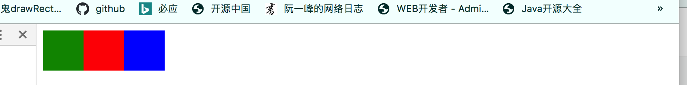

# 伸缩容器属性

>display：flex、inline-flex
>
>flex-direction: 设置主轴方向，默认为row。
>
>flex-wrap: 设置是否换行
>
>justify-content：设置伸缩项目在主轴方向上的对齐方式。
>
>align-items：设置伸缩项目在侧轴方向上的对齐方式，`只适用于伸缩项目只有一行的情况`。
>
>align-content：设置伸缩项目在侧轴方向上的对齐方式，`只适用于伸缩项目多行的情况`。
>
>
>
>flex-flow：复合属性，等于flex-wrap + flex-direction

## display的flex与inline-flex

>flex与inline-flex的区别就像block与inline-block区别一样。
>
>不同点(`在不设置伸缩容器的width时`)：
>
>​	1、设置为flex的伸缩容器的width == 父控件的width，设置为inline-flex的伸缩容器的width == 内部所有伸缩项目的width之和。
>
>​	2、flex和block一样，都是独占一行，而inline-flex与inline-block一样，按编写顺序从左到右排。
>
>
>
>相同点(在不设置伸缩容器的heigth时)：
>设置为flex或inline-flex的伸缩容器的height == 内部所有伸缩项目的height的最大值。
>

```html
<!DOCTYPE html>
<html lang="en">
<head>
    <meta charset="UTF-8">
    <title>Title</title>
    <style>

        .heads div{
            width: 50px;
            height:50px;
        }
        .heads div:nth-child(1){
            background-color: green;

        }

        .heads div:nth-child(2){
            background-color: red;
        }

        .heads div:nth-child(3){
            background-color: blue;
            width: 50px;
            height:50px;
        }

        .heads{
            background-color: orange;
            height: 50px;
          	display: flex; // 下图效果1
            display: inline-flex; // 下图效果2
        }

    </style>
</head>
<body>
    <div class="heads">
        <div></div>
        <div></div>
        <div></div>
    </div>

</body>

</html>
```

效果1

效果2


## flex-direction

>设置主轴方向，属性值：
>
>row： 主轴方向水平，从左到右
>
>row-reverse：主轴方向水平，从右到左
>
>column：主轴方向垂直，从上到下
>
>Column-reverse：主轴方向垂直，从下都上


## flex-wrap

>当伸缩容器中的伸缩项目width之和 > 伸缩容器的width时，为了伸缩项目不会溢出，会对伸缩项目进行收缩。为了保证伸缩项目既不会被压缩，又不会溢出，使用flex-wrap，让伸缩项目换行。
>
>
>
>属性值说明：
>
>​	nowrap：默认值，不进行换行，默认就是项目被压缩。
>
>
>
>​	wrap：换行，当项目按照主轴方向排列时，没有足够空间摆放时，该项目会按照侧轴方向换行排列。第二张图就是因为div4没有足够空间方向，按照侧轴方向(从上到下)，换到下一行。
>
>
>
>wrap-reverse：换行，与wrap换行摆放顺序相反，按照侧轴的逆向方向换到下一行。第三张图就是因为div4没有足够空间方向，按照侧轴方向逆方向(从下到上)，换到上一行。


## justify-content

>该属性用来设置伸缩项目的主轴方向对齐方式。
>
>
>
>属性值：
>
>flex-start：主轴起点对齐，默认值
>
>flex-end ：主轴懂点对齐
>
>center：中间对齐
>
>space-between：两端对齐，即两边的伸缩项目紧贴伸缩容器边界，伸缩项目之间间距相等。
>
>space-around：主轴方向上，每个项目之间都有间距，并且容器边界到项目的间距是项目之间间距的一半。


## align-items

>设置伸缩项目侧轴方向对齐
>
>属性值：
>
>flex-start：侧轴方向起点对齐。
>
>flex-end：侧轴方向终点对齐。
>
>center：侧轴方向中心对齐
>
>baseline：侧轴方向基线对齐，就是按照伸缩项目中文字的基线对齐，这是文字在一个水平线上。
>
>stretch：`默认值`，侧轴方向起点对齐，在不设置伸缩项目高度时，会对伸缩项目侧轴方向进行拉伸，使其等于伸缩容器高度。
>
>
>
>第6张图设置为baseline的效果。


## align-content

>设置换行时，行与行之间的对齐方式，或者说是主轴之间的对齐方式，
>
>属性值：
>
>flex-start：侧轴方向起点对齐。
>
>flex-end：侧轴方向终点对齐。
>
>center：侧轴方向中心对齐
>
>space-between：侧轴方向，两端对齐，项目与容器之间没有间隙，项目之间间隙相同。
>
>space-around：侧轴方向上，每行项目之间都有间距，并且容器边界到相邻行项目的间距是各行项目之间间距的一半
>
>stretch：`默认值`，侧轴方向起点对齐，在不设置伸缩项目高度时，会对伸缩项目侧轴方向进行拉伸，使其等于伸缩容器高度。
>
>
>
>
>
>使用该属性的前提：伸缩容器中的项目出现了`换行的效果`，或者说有多个主轴，这个属性才能有效。


# 伸缩项目属性

>flex-grow	设置伸缩项目的扩展比率。
>flex-shrink	设置伸缩项目的收缩比率。
>flex-basis	设置伸缩项目的收缩基准值。
>flex	复合属性，flex-grow, flex-shrink 和 flex-basis的简写。
>order	设置伸缩项目的排列顺序，数值越小，排列越靠前。
>align-self	设置伸缩项目自身在侧轴方向上的对齐方式。


## flex-grow

> 当主轴方向上容器长度 > 容器内部各个项目之和时，可以使用该属性将剩余空间瓜分。
>
> 瓜分的计算公式：(当前项目的flex-grow / 各个项目的flex-grow) * 容器剩余空间
>
> 属性值：
>
> 0：不拉伸，即不参与剩余空间的瓜分。
>
> 1：瓜分一个单位空间。
>
> n：瓜分n个单位空间。
>
> 
>
> 注意：这里没有指定宽度，而是主轴方向上项目的长度，也就是说如果主轴水平则根据项目width进行伸缩，如果主轴方向为垂直则根据项目的height进行伸缩。


## flex-shrink

>当`主轴方向`上容器长度 < 容器内部各个项目之和时，可以使用该属性设置的比例和自身长度进行收缩。
>
>瓜分的计算公式：(当前项目的flex-shrink * 当前项目的长度) / (各个项目的flex-shrink * 各项目的长度所得结果之和) * 溢出的长度
>
>属性值：
>
>0：不收缩。
>
>1：`默认值`，收缩一个单位空间。
>
>n：收缩n个单位空间，不能设置为负值。
>
>
>
>注意：
>
>1. 这里没有指定宽度，而是主轴方向上项目的长度，也就是说如果主轴水平则根据项目width进行伸缩，如果主轴方向为垂直则根据项目的height进行伸缩。
>2. 伸缩项目不能无限收缩，收缩到内部文字或者图片撑起的宽度或者高度就会停止收缩。

>下面例子：
>
>伸缩容器主轴方向：row
>
>伸缩容器宽度：200px
>
>各个伸缩项目宽度：50px，70px，100px,  30px
>
>各伸缩项目shrink：2，       3，       4，        1
>
>
>
>第1个伸缩项目最终宽度；50 - (50×2) / (50×2 + 70 ×3 + 100 ×4 + 30 × 1) ×(50 + 70 + 100 +30 -200) = 43.244
>
>第2个伸缩项目最终宽度；70-(70×3) / (50×2 + 70 ×3 + 100 ×4 + 30 × 1) ×(50 + 70 + 100 +30 -200) = 55.8108
>
>第3个伸缩项目最终宽度；100-(100×4) / (50×2 + 70 ×3 + 100 ×4 + 30 × 1) ×(50 + 70 + 100 +30 -200) = 72.973
>
>第4个伸缩项目最终宽度；30-(30×1) / (50×2 + 70 ×3 + 100 ×4 + 30 × 1) ×(50 + 70 + 100 +30 -200) = 27.973

## flex-basis

>该属性的理解：
>
>​		该属性是用来划分伸缩容器的剩余空间(或者说是在给伸缩项目设置宽度)，即当前容器还有多少宽度没有被使用，flex-grow和flex-shrink会根据这个属性划分出来的剩余空间进行伸缩。
>
>  
>
>该属性的取值：
>
>1. 百分比 。
>2. 像素值。
>3. auto，伸缩项目的宽度看width属性值，如果没有设置width属性，则看项目中内容的宽度。
>
> 浏览器参考伸缩项目宽度的优先级：
>
>​		max-width=min-width = min-height = max-height > flex-basis > width > content宽度。
>
>​		主轴方向为水平：当同时设置width和`flex-basis(该值不为auto)`时，width将会失效，使用flex-basis代替width。
>
>​		主轴方向为垂直：当同时设置height和`flex-basis(该值不为auto)`时，height将会失效，使用flex-basis代替height。
>
> 
>
>浏览器如何计算伸缩项目宽度：
>
>  		1.  情景1，所有伸缩项目flex-basis=0%时，所有伸缩项目宽度都为0，此时伸缩容器的宽度就是剩余空间，按照各个伸缩项目的flex-grow值，按比例分别。
>  		2.  情景2，伸缩项目flex-basis=auto时，查看各自伸缩项目中的width值，伸缩容器的宽度减去所有伸缩项目的宽度为剩余空间，按照各个伸缩项目的flex-grow值，按比例分别。

```html
<!-- 计算伸缩容器中每个伸缩项目的宽度 -->
<!DOCTYPE html>
<html lang="en">
    <head>
        <meta charset="UTF-8" />
        <meta name="viewport" content="width=device-width, initial-scale=1.0" />
        <title>flex auto</title>
        <style>
            .grid {
                background-color: #f4f7f8;
                overflow: hidden;
                display: flex;
            }
            .grid-cell {
	              border 1px solid orange;
                width: 110px;
                min-width: 0;
                background-color: #1b5385;
                color: white;
                font-family: monospace;
                font-size: 13px;
                text-align: center;
            }
        </style>
    </head>
    <body>
        <div class="grid">
          <!--  伸缩项目的flex-basis使用三种类型值，计算各个伸缩项目宽度
								div1的基础宽度：20px；
								div2的基础宽度：110px(flex-basis为auto时，看width，没有width看内部元素宽度)
								div3的基础宽度：0px
								
								因此伸缩容器的剩余宽度 = 伸缩容器宽度 - 130px。
								每个伸缩项目最终的宽度 = 基础宽度 + (伸缩容器的剩余宽度) / 3;
					-->
            <div class="grid-cell" style="flex: 1 1 20px">1 / 2</div>
            <div class="grid-cell" style="flex: 1 1 auto">auto</div>
            <div class="grid-cell" style="flex: 1 1 0%">auto</div>
        </div>
    </body>
</html>

```

## flex复合属性

> flex: flex-grow   flex-shrink   flex-basis;
>
>  
>
> flex复合属性的几种特殊值：
>
> 1. `flex:1`，相当于`flex: 1  1  0%`，表示伸缩容器中各个伸缩项目在主轴方向等宽，或者等高。
> 2. `flex:auto`，相当于`flex:1 1 auto`，按照自身的宽或者高进行伸缩。
> 3. `flex: 0 auto`，相当于`flex: 0 1  auto`，只收缩不拉伸。
> 4. `flex:none`，相当于`flex:0 0 auto`，不伸也不缩	
> 5. `flex:initial`，相当于`flex: 0 1 auto`，只收缩不拉伸
>
> 
>
> 注意：
>
> * flex-grow和flex-shrink这两个属性只能设置为正整数，不能带单位，也不能是百分比。
> * flex-basis属性值设置的是伸缩项目的宽度，因此它的取值与width一样，只能是百分比或者是带单位的值。


## order

> 作用：
>
> 1、设置伸缩容器中伸缩项目在主轴方向上的排序顺序，值越大越靠近主轴终点，可以为负值。
>
> 2、针对伸缩容器中设置了定位的伸缩项目的覆盖顺序，较小的值将会被覆盖，可以为负值。
>
> 该属性默认值为0


## align-self

>align-items是对伸缩容器中所有项目进行侧轴对齐，而align-self是对某个伸缩项目设置单独的侧轴对齐方式。
>
>属性值：
>
>auto：默认值，继承伸缩容器中align-items设置的值。
>
>其它值：效果与align-items一样。
>
>
>
>特别说明：
>
>stretch属性值，在侧轴方向对伸缩项目进行拉伸，使其等于容器长度。`如果侧轴为垂直，则不能设置height，侧轴为水平，则不能设置width，否则该属性值不会拉伸`。
>
>


# 问题：

## 伸缩容器小于任意一个伸缩项目，下面代码效果？


```
<style>

        .heads div{
            width: 50px;
            height:50px;
        }
        .heads div:nth-child(1){
            background-color: green;
        }

        .heads div:nth-child(2){
            background-color: red;
        }

        .heads div:nth-child(3){
            background-color: blue;
            width: 50px;
            height:50px;
        }

        .heads div:nth-child(4){
            background-color: green;
        }

        .heads div:nth-child(5){
            background-color: red;
        }

        .heads div:nth-child(6){
            background-color: blue;
            width: 50px;
            height:50px;
        }

        .heads{
            background-color: orange;
            height: 50px;
            width: 150px;
            display: flex;
            flex-direction: column;
            flex-wrap: wrap;
        }

    </style>
</head>
<body>
    <div class="heads">
        <div>1</div>
        <div>2</div>
        <div>3</div>
        <div>4</div>
        <div>5</div>
        <div>6</div>
    </div>
</body>
```


## flex-basis与width或height同时设置

> flex-basis根据主轴方向来影响width和height。
>
> 当主轴方向水平时，flex-basis、width和height同时设置，width将会失效，flex-basis代替width。
>
> 当主轴方向垂直时，flex-basis、width和height同时设置，height将会失效，flex-basis代替height。
>
> 
>
> 在项目拉伸或者收缩时，项目世纪宽或者高是参照flex-basis计算出来的。


## order的排序是否根主轴方向有关？

>伸缩容器中的伸缩项目是按照主轴方向进行排序的，例如主轴方向从上到下时，order越大的伸缩项目越靠下。