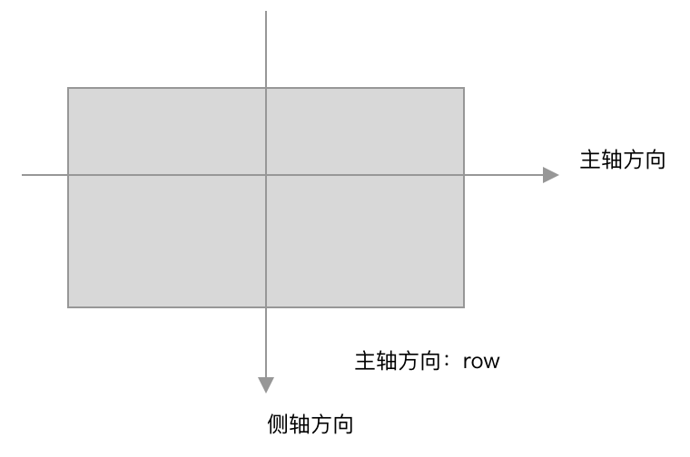
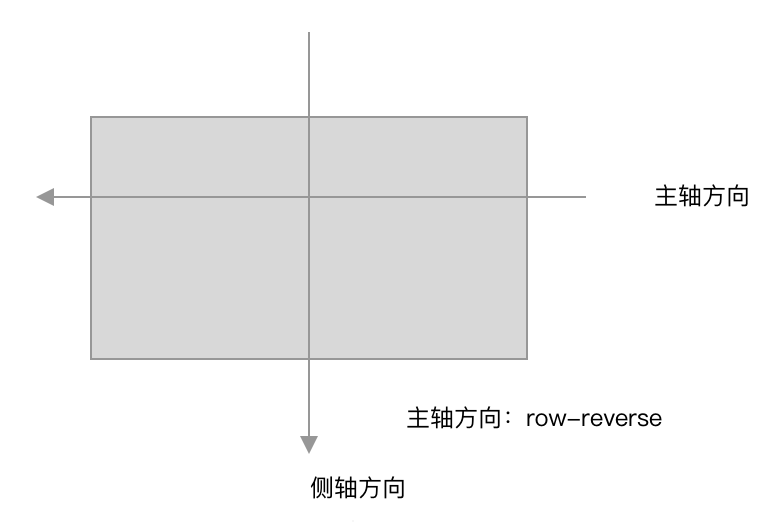
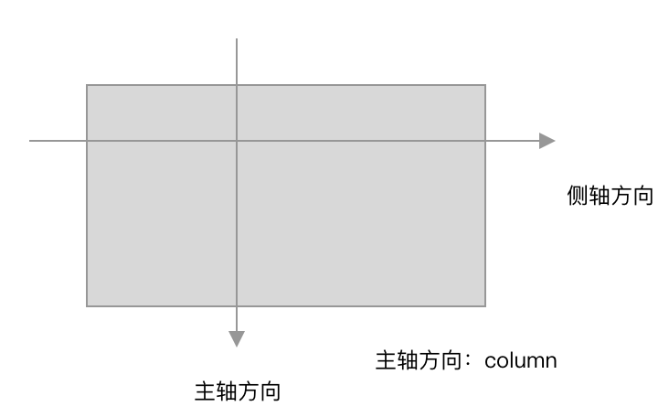
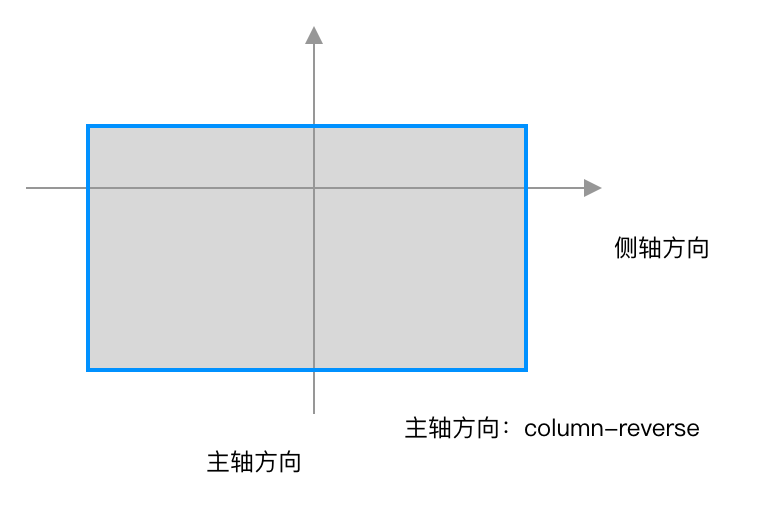

# flex


>flex为css提供的又一种布局方式，为伸缩盒技术。
>
>
>
>flex中的基本概念：
>
>* 伸缩容器：使用display：flex修饰的控件，被称为伸缩容器。
>* 伸缩项目：伸缩容器中的子元素被称为伸缩项目。
>* 主轴方向：伸缩项目排列方向。
>* 侧轴方向：与主轴垂直的方向。
>
> 
>
>影响主轴方向的因素：flex-direction(主轴方向可以水平可以垂直)和direction(主轴方向只能水平)，这两个属性任意一个都会影响主轴方向，但是浏览器优先看flex-direction属性。
>
> 
>
>影响侧轴方向的因素：
>
>1. flex-direction：当设置为column和column-reverse是，侧轴方向变成`水平`并`从左向右`。
>2. flex-wrap：该属性为当项目过多是否需要换行显示，需要根据flex-direction来决定侧轴方向。使用wrap-reverse表示侧轴方向翻转。
>   1. `row` - ` wrap`：主轴水平从左向右，侧轴从上到下
>   2. `row-reverse` - ` wrap`：主轴水平从右向左，侧轴从上到下
>   3. 
>   4. `row` - `wrap-reverse`：主轴水平从左向右，侧轴从下到上
>   5. `row-reverse` - `wrap-reverse`：主轴水平从右向左，侧轴从下到上
>   6. 
>   7. `column` - `wrap`：主轴垂直从上到下，侧轴从左到右
>   8. `column-reserve` - `wrap`：主轴水平从下到上，侧轴从左到右
>   9. 
>   10. `column` - `wrap-reserve`：主轴垂直从上到下，侧轴从右到左
>   11. `column-reserve` - `wrap-reverse`：主轴水平从下到上，侧轴从右到左




## 伸缩特性

> 1. 当一个元素定义为伸缩容器时，它的直接子元素都会变成伸缩项目，但是它的孙子元素以及更深层的元素还是默认的显示模式，块元素标签为block，行内元素标签还是inline，不会受到祖先元素为伸缩容器的影响。
>
> 2. flex技术中的属性是`不会被继承`的，也就是说伸缩容器设置了主轴方向时，伸缩项目变成伸缩容器时，不会继承父元素设置的主轴方向。
>
> 3. 父子元素都是伸缩容器时，父元素改变主轴方向，不会影响子元素(即是父元素的伸缩项目，同时又是一个伸缩容器)的主轴方向。
>
> 4. 伸缩容器中各个伸缩项目会随着伸缩容器`主轴方向`上`大小`的改变，而拉伸或者收缩。但是伸缩时，只能对宽高和间距进行伸缩，不能对文档中的内容进行伸缩，例如图片和文字，无法随着浏览器的大小进行放大和缩小，控件只能缩小到一定程度(被其中内容撑开的大小)。
>
> 5. 使用flex和inline-flex修饰的元素与使用block和inline-block修饰的元素没有区别，flex修饰的元素与block一样，独占一整行；inline-flex与inline-block一样，它们不同的地方在于内部子元素的处理。flex和inline-flex会对子元素进行伸缩，即使子元素设置具体像素大小，而block和inline-block宽度的改变，不会影响到设置具体像素的子元素。
>
>    
>
> 注意：`flex技术中的属性都没有继承性。`

## flex、float和盒子模型的配合

> 声明为flex的伸缩容器也可以使用浮动，由于flex效果相当于block，每个伸缩容器必须独占一行，可以使用float让伸缩容器在一行中。允许使用margin、padding和border这些属性。

## flex 实现水平垂直居中方式


方式1：统一在父元素上设置

```CSS
.fater{
		display:flex;
  	justify-content:center;
  	align-items:center;
  
}
```


方式2：父元素和子元素都设置

```
.fater{
		display:flex;
}

.son{
		margin: auto;
}
```

