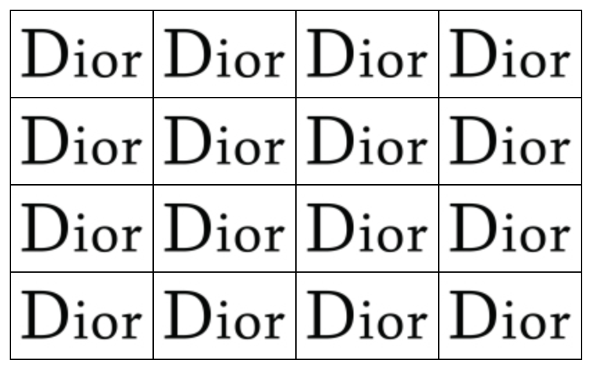

# 边框设置问题

> 如何实现单元格边框为1px，并且单元格之间间距为1px，像下面的图片中展示的样式，单元格之间的边框都是1px，而不是2px。


## 实现方式

> 1. 使用table标签实现
> 2. 设置每个单元格的右边框和下边框，设置父元素的上边框和左边框。
>    1. 使用border实现的局限性是单元格不能翻转，由于每个单元格只设置了右边框和下边框，因此左右旋转时，出现右边框消失问题。
>    2. 使用padding和margin实现。

### table实现方式

```html
<!DOCTYPE html>
<html>

<head>
    <style>
        table{
            border: 1px solid black;
            /* 边框融合，实现单元格间距为1px */
            border-collapse: collapse;
            /* 开启盒子模式的怪异模式 */
            box-sizing: border-box;
        }
        td{
            border: 1px solid black;
            height: 60px;
            /* 内容垂直居中 */
            vertical-align:middle;
            /* 行内块留白问题 */
            font-size: 0;
        }
    </style>
</head>

<body>
    <table>
        <tr>
            <td></td>
            <td></td>
            <td></td>
            <td></td>
        </tr>
        <tr>
            <td></td>
            <td></td>
            <td></td>
            <td></td>
        </tr>
        <tr>
            <td></td>
            <td></td>
            <td></td>
            <td></td>
        </tr>
        <tr>
            <td></td>
            <td></td>
            <td></td>
            <td></td>
        </tr>
    </table>
</body>

</html>
```


### margin+padding实现方式

```html
<!DOCTYPE html>
<html>

<head>
    <style>
        #container{
            width: 404px;
            height: 204px;
            /* 使用padding设置单元格的上边框和左边框 */
            padding-left: 1px;
            padding-top:1px;
            /* 使用父元素背景色充当单元格边框颜色 */
            background-color: black;
        }
        div div{
            float: left;
            width: 100px;
            height:50px;
            /* 使用margin设置单元格的下边框和右边框 */
            margin-right:1px;
            margin-bottom: 1px;
        }

    </style>
</head>

<body>
    <div id="container">
        <div></div>
        <div></div>
        <div></div>
        <div></div>

        <div></div>
        <div></div>
        <div></div>
        <div></div>

        <div></div>
        <div></div>
        <div></div>
        <div></div>

        <div></div>
        <div></div>
        <div></div>
        <div></div>
    </div>
    
</body>

</html>
```


> 上面两种方案的展示效果如下图所示。

