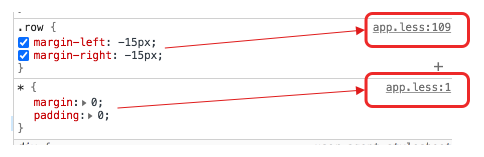

# less使用

> `less是什么`：
>
>  
>
>  less编译后生成的文件：
>
> 1. css文件，less编译后生成的css文件。
> 2. css.map文件，less与css转换时的映射文件，方便代码调试，在chrome控制台中可以查看当前css代码是由那句less生成的。
>
> 
>
> 
>
> `less编译方式`：
>
> 1. 在浏览器中编译，引入一个js文件，在html文件中使用link引入less文件，使用js文件进行编译转换成css文件，效率非常慢。
> 2. 在服务器中编译，在开发中，内置less编译插件，实时生成less对应的css文件，html文件中使用link引入的是css文件，效率快。

## 导入其它less文件

> less可以实现模块化，将不同的内容放在不同的less文件中，使用`@import`将其引入到需要的less文件中。
>
>  
>
> @import格式：`@import (keyword) '文件路径'`，单双号都行。
>
> 
>
> @import几种keyword参数：
>
> 1. `reference`: 引入一个 `less` 文件，但是不会编译它，只是使用。
> 2. `inline`: 引入文件，但是不会编译，只会输出。一般用在 `less` 不支持的 `css` 特性，你可以单独写一个 `css` 然后引入，`less` 不会对它做任何事，只是会在最后输出它。
> 3. `less`: 把文件当做一个 `less`，无论它的扩展名是什么。
> 4. `css`: 把文件当做一个 `css` 无论它的扩展名是什么。
> 5. `once`: `@import` 语句的默认行为。这表明相同的文件只会被导入一次，而随后的导入文件的重复代码都不会解析。
> 6. `multiple`: 允许导入同名文件多次。
> 7. `optional`: 如果文件没有找到就继续编译。如果没有这个选项，当找不到文件的时候会终止编译并且抛错。

## less中的变量

> less变量声明格式：`@变量名 : 变量值`
>
> 
>
> less变量保存的值：
>
> 1. 属性值，使用时的格式为`@变量名`
> 2. 属性名，使用时的格式为`@{变量名}`
> 3. 选择器名称，使用时有两种格式：
>    1. 当变量值带有选择器标识符时为`@{变量名}`，例如@wrap=.warp，使用时为@{wrap}。
>    2. 当变量值不带选择器标识符时为`选择器标识符@{变量名}`，例如@wrap=warp，使用时为`#@{wrap}`。

```less
// 保存属性值
@width : 100px;
// 保存属性名
@bgc : background-color;
// 保存选择器
@selector1 : #wrap;
@selector2 : container;

@{selector1}{
	  @{bgc} : red;
  	width : @width;
}

#@{selector2}{
  	@{bgc} : red;
  	width : @width;
}


// -- less转换成css样式
#wrap {
  background-color: red;
  width: 100px;
}
#container {
  background-color: red;
  width: 100px;
}
```


### 变量值的拼接

> less提供了字符串拼接功能，实现将变量值与字符串进行拼接，一般用在选择器拼接中，在bootsrap大量使用变量值拼接生成群组选择器。
>
>  
>
> less变量值拼接方式：
>
> 1. `~'字符串@{变量名}'`。
> 2. 在选择器中直接插入一个变量值，`选择器@{变量名}`。

```less
@width : 100px;
@height : 200px;
@size : ~'当前容器宽度为@{width}, 高度为@{height}';

// 拼接选择器
@selector1 : .sel1;
@selector2 : .sel2;
@selector3 : .sel3;

// 拼接字符串
@sels : ~'@{selector1}, @{selector2}, @{selector3}';

  @{sels}{
  background-color : red;
  width:100px;
  height:100px;
}

// 在选择器名称中直接拼接
.box @{selector3}{
  height:400px;
}


```


### 变量值的运算符

> less支持`算数运算符`、`比较运算符`、`逻辑运算符`，这些运算符都是用在`when`语句中。
>
> ​	
>
> 算数运算：
>
> 1. less允许参与运算的操作数携带单位。
> 2. 计算结果的单位为第一个操作符的单位，如果第一个操作符没有单位则找第二个运算，第二个也没有继续向下找。
>
> 比较运算：
>
> 1. less支持的比较运算符有，`>、<、>=、<=、=`。
> 2. less的比较规则，
>    1. 变量值都为数字时，可进行比较，返回true和fase。
>    2. 变量值都为字符串时，
>       1. 进行相等比较，根据两个字符串是否相同，返回true和fase。
>       2. 进行大小比较时，结果都是false。
>    3. 两个不同类型数据进行比较时，例如字符串和数字，返回的都是false。
>
> 逻辑运算符：less支持三种逻辑运算符，`not`、`and`、`or`。
>
>  
>
> when语句：
>
> ​		when语句是less提供的条件判断语句，用在选择器中，表示当前when中条件成立时，将该选择器转移成css格式。
>
> ​		when语句格式为：`selector when (条件){ less或者css语句 }`

```less
// 运算时单位参照
@ws : 1em + 100px;
@hs : 1px + 100em;
@pading : 1% + 100 + 30px;
@mar : 1 + 100 + 30px;
pre{
    width: @ws;
    height: @hs;
    padding: @pading;
    margin: @mar;
}

@var1 : str;
@var2 : str;
// 当@var1与@var2值相等时，将该选择器编译成css
iframe when(@var1 = @var2){
    width: 100px;
    height:100px;
}

@var3 : 13;
@var4 : 12;
// 当@var3大于@var4值时，将该选择器编译成css
iframe when(@var3 > @var4){
    background-color: red;
}

@var5 : a;
@var6 : 12;
// 当其中条件为false时，将该选择器编译成css
iframe when not (@var5 > @var6){
    padding: 10px;
}

// 复杂逻辑运算
iframe when (not (@var5 > @var6)) and (@var3 > @var4){
    margin: 30px;
}


// 转成css文件
pre {
  width: 101em;
  height: 101px;
  padding: 131%;
  margin: 131px;
}
iframe {
  width: 100px;
  height: 100px;
}
iframe {
  background-color: red;
}
iframe {
  padding: 10px;
}
iframe {
  margin: 30px;
}
```

### 变量作用域

> ​		less中是存在变量作用域的，因此在使用注意less作用域规则。
>
>  
>
> less的两种局部作用域：
>
> 1. mixin函数中定义的变量，保存在局部作用域中。
> 2. 选择器中定义的变量，保存在局部作用域中。
>
> less的作用域规则：
>
> 1. less中的变量有点像JS中的变量提升，当同一个作用域中定义多个同名变量时，都会将其提到less代码开头，后写的覆盖先写。
> 2. 当前作用域中找不到变量时，去外层作用域中找。

```less
// 作用域
@temp: 12px;
#sel1{
    @temp: 20px;
    width: @temp;
    @temp: 30px; // less对变量进行变量提升。
}
#sel2{
    width: @temp;
}


// less编译成css
#sel1 {
  width: 30px;
}
#sel2 {
  width: 12px;
}
```


### 将属性名变成变量使用

> less中通过在属性前添加`$`，可以将属性当成变量使用，给其它属性设置属性值，这种方式常常用在关联属性上，例如要让容器的高度与宽度一致。

```less
@w:30px;
div{
  width: @w;
  height: $width;
}
```


## less中的嵌套

> ​		less嵌套结构是less提供的一种书写后代选择器的写法，提供一种代码结构，增强可读性。由于在less文件也支持直接编写css文件，因此使用css的后代选择器和使用嵌套写法实现的效果一样。
>
>  
>
> &的用法：
>
> ​		嵌套中使用`&`实现访问父选择器名称，实现css其他组合选择器，例如自代选择器、兄弟选择器等等，
>
>  

```less
// 使用css方式实现后代选择器
.div1 .div2{
    width: 30px;
}
// 使用嵌套方式实现后代选择器
.div1{
    .div2{
        width: 30px;
    }
}

// 使用css方式实现子代选择器
.div1 + .div2{
    width: 30px;
}
// 使用嵌套方式实现子代选择器
.div1{
    & + .div2{
        width: 30px;
    }
}

 
// 不使用&后，编译成css的结果
.div1{
    div1 + .div2{
        width: 30px;
    }
}

.div1 .div1 + .div2{
  width: 30px;
}
```


## less中的继承

> ​	less中提供了继承机制，也就是说可以使用继承将在，将已编写的选择器中的属性值添加到新的选择器中，大大提高代码复用性，并减少了代码量。
>
>  
>
> less的继承写法：
>
> 1. 写在选择器中时，`选择器名称:extend(选择器名称)`。
> 2. 创建选择器并添加继承时，`选择器名称:extend(选择器名称){}`。
> 3. 继承的选择器后面添加`all`，`选择器名称:extend(选择器名称 all)`，`选择器名称:extend(选择器名称 all){}`。
>
>  less的理解：
>
>   *  当选择器A继承选择器B时，相当于在选择器B后面添加一个选择器A，组成群组选择器。
>   *  当继承的选择器是一个群组选择器时，会在它们每个选择器后面添加一个选择器A，组成群组选择器。
>   *  当继承的选择器B后面添加了all时，表示将使用选择器A替换所有选择器中出现选择器B的选择器。(后面会举例)
>
> 
>
> less继承的注意事项：
>
> - 选择器和扩展之间是允许有空格的：`pre:hover :extend(div pre)`.
> - 可以有多个扩展: `pre:hover:extend(div pre):extend(.bucket tr)`， 注意这与 `pre:hover:extend(div pre, .bucket tr)`一样。
> - 扩展必须在最后 : `pre:hover:extend(div pre).nth-child(odd)` 这种用法就是错误的。
> - 如果一个规则集包含多个选择器，所有选择器都可以使用 `extend` 关键字。
> - 伪类选择器顺序必须相同。比如 `.selector:extend(link:visited:hover)` 是无法匹配 `link:hover:visited` 的。
> - `*.class` 和 `.class` 不能匹配
> - 使用 `nth` 表达式的时候，参数必须完全相等，比如 `1n + 3` 和 `n + 3` 不能匹配。
> - 属性选择器的属性值是否使用引号，以及使用的是单引号还是双引号，不影响匹配。
> - 继承不会在任何使用变量的规则上生效，使用变量的规则会被继承忽略。
> - 在 `@media` 中的 `extend` 只会匹配相同媒体查询的规则。比如 `@media print` 和 `@media screen` 不会相互匹配。嵌套的媒体查询也不会匹配。
> - 最外层的选择器会匹配到媒体查询内部的规则。

```less
// less继承写法
.hd1{
    width: 30px;
}

.hd2:extend(.hd1){
    height:30px;
}

// 转成css
.hd1,
.hd2 {
  width: 30px;
}
.hd2 {
  height: 30px;
}
```

```less
// less继承的是一个群组时，会与群组中的每个选择器组成群组选择器。
.hd1{
    width: 30px;
}
.hd2{
    height: 30px;
}
.hd1.hd2{
    background-color: red;
}

.hd3:extend(.hd1, .hd2){

}

// 转成css，.hd3分别与.hd1选择器和.hd2选择器组成了群组选择器。
.hd1,
.hd3 {
  width: 30px;
}
.hd2,
.hd3 {
  height: 30px;
}
.hd1.hd2 {
  background-color: red;
}
```

```less
// 使用all，会扩大继承的筛选范围，只要其它选择器中还有该继承的选择器，就会继承。

.hd1{
    width: 30px;
}
.hd2{
    height: 30px;
}
.hd1.hd2{
    background-color: red;
}

.parent .hd1{
  margin:10px;
}

.son .hd2{
  padding: 10px;
}

.hd3:extend(.hd1 all, .hd2){

}

// 中间转换，为了更好理解，只写继承相关的css选择器
.hd3{
    width: 30px;
}
.hd3{
    height: 30px;
}

.hd3.hd2{
    background-color: red;
}

.parent .hd3{
  margin:10px;
}


// 最终css样式
.hd1,
.hd3 {
  width: 30px;
}
.hd2,
.hd3 {
  height: 30px;
}
.hd1.hd2,
.hd3.hd2 {
  background-color: red;
}

.parent .hd1, .parent .hd3{
  margin:10px;
}

.son .hd2{
  padding: 10px;
}
```


## less中的合并

> ​	less合并，将css中的两个属性值融合成一个。属性名后面添加`+`或者`+_`

```less
// less
.mixin() {
  box-shadow+: inset 0 0 10px #555;
}
.myclass {
  .mixin();
  box-shadow+: 0 0 20px black;
}

//Outputs
.myclass {
  box-shadow: inset 0 0 10px #555, 0 0 20px black;
}


// less
.mixin() {
  transform+_: scale(2);
}
.myclass {
  .mixin();
  transform+_: rotate(15deg);
}

//Outputs
.myclass {
  transform: scale(2) rotate(15deg);
}
```


## less中的mixin函数

> less提供的自定义函数功能。
>
>  
>
> less的mixin函数格式：
>
> 1. `选择器{ css样式}`，这种方式定义的mixin会被翻译到css文件中，既当成选择器又当成mixin函数。
> 2. `选择器(参数名1:默认值 ; 参数名2: 默认值){ css样式}`，这种方式定义的mixin不会被翻译到css文件中，只当成mixin函数。
>
> mixin函数规则：
>
> 1. 在调用函数时，必须保证函数在调用时，每个形参都有值(实参或者默认值)，否则不能调用。
> 2. 第二种函数格式，不会被编译到css文件中，形参选择器。

```less
// less
.sel-mixin1{
    background-color: red;
}

.sel-mixin2(@w){
    background-color: red;
    width: @w;
}

h1{
    .sel-mixin2(12px);
}


// css
.sel-mixin1{
    background-color: red;
}

h1 {
  background-color: red;
  width: 12px;
}
```

### mixin函数重载

> 1. mixin函数支持函数重载，重载条件为参数格式，只有参数个数不同才认为是重载，否则都被看成同一个函数。
> 2. mixin函数支持重复定义，不会被覆盖，当调用时，所有同名同参数个数的函数都会调用。
>
> 重载的理解：
>
> 1. less根本不支持什么重载，只不过允许less中定义同名函数，在调用时会调用所有同名函数。这些同名函数的参数列表必须都设置默认值，否则像下面调用.sel-mixin函数时传入一个参数，会调用所有.sel-mixin函数，由于后两个函数有两个参数，因此第二个参数没有传值也没有默认值，less编译报错(违反less的mixin函数规则)。

```less
.sel-mixin(@w:10px){
    width: @w;
}

.sel-mixin(@w: 10px; @h: 10px){
    min-width: @w;
    min-height: @h;
}

.sel-mixin(@d: 10px; @e:10px){
    max-width: @d;
    max-height: @e;
}


h1{
    // 函数重载，需要注意给重载的其它函数的参数列表中的所有参数设置默认值，否则调用时会出错
     .sel-mixin(10px);
    // 这句话写不写都会调用上面三个函数。
    //.sel-mixin(10px; 20px);
}

// css
h1 {
  width: 10px;
  min-width: 10px;
  min-height: 10px;
  max-width: 10px;
  max-height: 10px;
}
```


### mixin函数参数列表

> 1. 允许给参数设置默认值，在调用mixin函数时，必须给所有没有默认值的参数设置实参才可以调用。
> 2. 调用时可以指明参数名称，此时传参无需遵守参数列表顺序。
> 3. mixin函数支持`@arguments`变量，和JS中的arguments功能一样，接收所有传入的参数。
> 4. mixin函数支持可变参数，使用`rest...`或者`...`接收可变参数，前者会将没有形参保存的参数保存到rest变量中。

```less
.sel-mixin1(@w: 10px; @h){
    width: @w;
    height:@h;
}

.sel-mixin2(@w: 10px; @h){
    margin: @w;
    padding:@h;
}

.sel-mixin3(@w; @tyle; @color){
    border: @arguments;
}


h1{
    // 调用时指定形参名称，因此传入实参属性按照自己喜好。
    .sel-mixin1(@h:20px; @w:10px);
    // 调用时没有形参名称，因此需要按照函数定义时的参数列表顺序赋值。
    .sel-mixin2(10px; 20px);
    // 使用@arguments变量
    .sel-mixin3(1px; solid; red);
}


// css
h1 {
  width: 10px;
  height: 20px;
  margin: 10px;
  padding: 20px;
  border: 1px solid red;
}
```

### 读取函数的属性

> less允许将函数当初对象来使用，读取其中的属性值。
>
> 
>
> less读取函数属性值格式：
>
> 1. `选择器[属性名]`
> 2. `选择器(参数列表)[属性名]`
>
> 说明：当中括号中没有传递属性名时，默认去该选择器最后一个属性的属性值，

```less
.sel-mixin1{
    min-width: 20px;
    min-height: 20px;
}

.sel-mixin2(@d: 10px; @e:10px){
    max-width: @d;
    max-height: @e;
}


h1{
    // 两种读取属性值方式
    min-width: .sel-mixin1[min-width];
    max-height: .sel-mixin2(@e:30px)[max-height];
}


// css
h1 {
  min-width: 20px;
  max-height: 30px;
}
```


## less自带的一些函数

> - `iscolor`
> - `isnumber`
> - `isstring`
> - `iskeyword`
> - `isurl`
> - `ispixel`
> - `ispercentage`
> - `isem`
> - `isunit`


## less综合应用

> 使用less实现栅格布局

```less
.generate-columns(@n; @i:1) when(@i <= @n){
  .col-ml-@{i}{
    width: ~''@i/@n * 100%;
  }
	.generate-columns(@n, (@i + 1));
}

// 调用函数
.generate-columns(4);


// css
.col-ml-1 {
  width: 25%;
}
.col-ml-2 {
  width: 50%;
}
.col-ml-3 {
  width: 75%;
}
.col-ml-4 {
  width: 100%;
}
```

