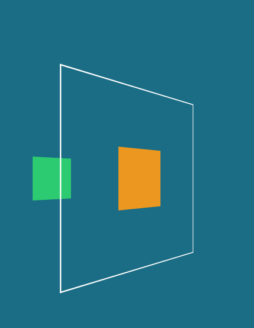
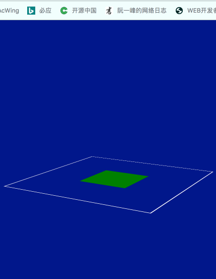
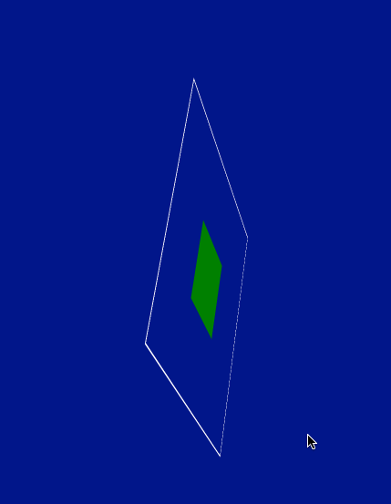
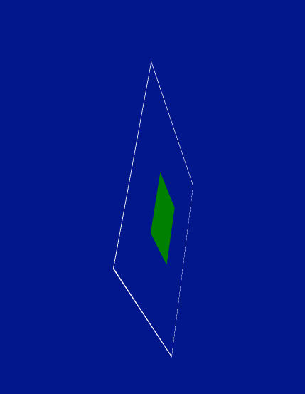
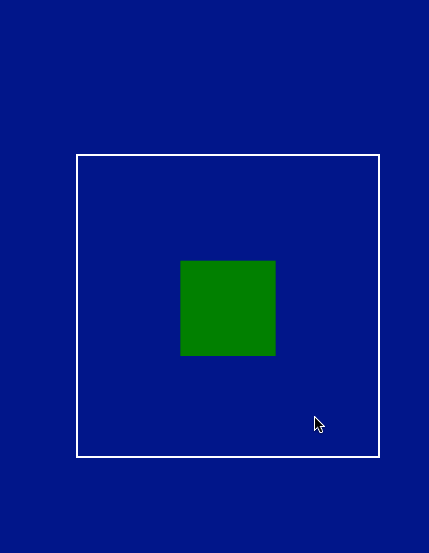
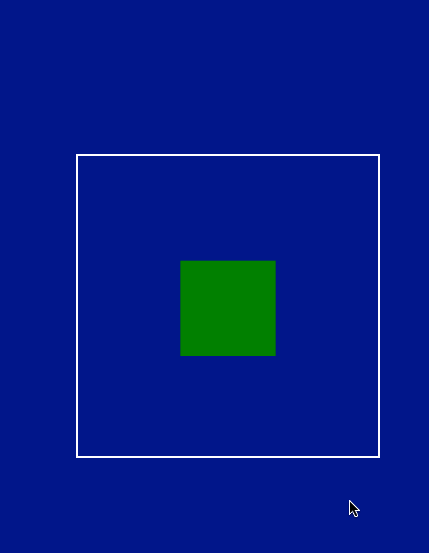

z轴不能设置百分比，因为元素在z轴没有尺寸。

transform的变化不会叠加的，它是基于未形变前的状态进行变形的。

transform: tranlateX(20px) tranlateX(20px) tranlateX(20px) tranlateX(20px); === transform: tranlateX(80px);


1. 不设置父元素景深时，
   1. 当父元素和子元素z轴方向相同时，并且给子元素添加景深时， 改变子元素在z轴的位置，反应在页面上的效果就是子元素的放大和缩小。
   2. 当父元素和子元素z轴方向不同时，并且给子元素添加景深时， 改变子元素在z轴的位置，反应在页面上的效果就是子元素脱离父元素进行形变。
   3. 当父元素和子元素z轴方向相同时，并且不给子元素添加景深时， 改变子元素在z轴的位置，反应在页面上的效果没有任何效果。

在进行3D变换时，如果想要子元素有3D空间感，必须在父元素上添加景深。


平移、缩放和旋转的基准点：

1. X轴
   1. 平移时，以元素中心点为基准点沿着X轴方向移动
   2. 旋转时，以穿过元素中心点并且与X轴平行的直线为旋转轴，进行选择。
   3. 缩放时，以元素中心点为基准点沿着X轴方向移动
2. Y轴
   1. 平移时，以元素中心点为基准点沿着Y轴方向移动
   2. 旋转时，以穿过元素中心点并且与Y轴平行的直线为旋转轴，进行选择。
   3. 缩放时，以元素中心点为基准点沿着Y轴方向移动
3. Z轴
   1. 平移时，沿着穿过元素中心点并且与Z轴平行的直线移动，与之前其它轴平移不同的时，`元素会以中心点为基准点放大或者缩小`。
   2. 旋转时，就是默认的2D选择，沿着沿着穿过元素中心点并且与Z轴平行的直线为轴进行选择。
   3. 缩放时，元素自身不会进行任何缩放并且位置不会动，而是延长或者缩短了Z轴，反映到页面上就是子元素(子元素必须z轴方向设置了距离tranlateZ(-200px))距离父元素近或者远了。



如何实现这个效果：

1. 父元素：
   1. transform: **perspective**(500px) **rotateY**(45deg);
   2. transform-style: preserve-3d ;
   3. transition: 1s;
2. 子元素：
   1. transform:  **translateZ**(-300px)
3. hover时修改父元素的transform
   1.  transform: **perspective**(500px) **rotateY**(45deg)  **scale3d**(1,1,2) **translateZ**(30px) 

scale3d用来让子元素向后移动，translateZ用来让父元素向前移动


在子元素没有使用transform时，子元素的x、y和z轴的方向 == 父元素的x轴、y轴和z轴


```
实现卡片翻转效果的关键，不加该字段会导致fan zhuan s
{
backface-visibility:hidden;
-webkit-backface-visibility:hidden;	/* Chrome 和 Safari */
-moz-backface-visibility:hidden; 	/* Firefox */
-ms-backface-visibility:hidden; 	/* Internet Explorer */
}
```


transform参数叠加是有顺序的，

`transform: rotateX(45deg) rotateY(45deg)`和`transform: rotateY(45deg) rotateX(45deg)`的最终效果是不一样的。


> transform-origin: x轴 y轴 z轴
>
> 1. 如果z轴旋转时，2d旋转，默认在中心点，设置哪个点就围绕哪个点旋转，即使基准点在元素外部。
> 2. x轴和y轴的旋转，默认是自转，(left top)、(left bottom)为左翻页，(right top)、(right bottom)为右翻页，设置轴时，会实现图片的立体旋转，例如3D旋转相册(下图为3D旋转相册)。




transform参数堆叠顺序不同，效果不同，主要因为transform-origin的影响例如：

```css
transform-origin: top left;

// 该元素上移50%，然后以自己中心点旋转
transform: rotate(0deg) translate(-50%, -50%);
hover：transform: rotate(360deg) translate(-50%, -50%);

// 该元素上移50%，然后以元素左上角旋转
transform: translate(-50%, -50%) rotate(0deg) ;
hover：transform: translate(-50%, -50%) rotate(360deg);
```


出现原因在于，先rotate，沿着左上角旋转，然后回到原先位置，然后以后的图片的基准点向上平移，所以出现了图1效果；先向上平移，基准点向上平移，再旋转时，以新的基准点旋转，因此出现了图2效果。

`参数堆叠会改变基准点位置，虽然效果上同时执行，但是后一个变形会参照前一个变形后的新基准点进行变形。`


景深或者叫透视，有两种添加方式：

1. 给当前想要透视的元素本身添加透视，即perspective(1000px)
2. 给当前想要透视的元素的父元素添加透视，即transform-style: preserve-3d

透视是为了让2D能展示出3D的空间感，给想要透视的元素身上添加透视，就相当于父元素是一张纸，用纸来承载子元素，而给父元素添加透视，相当于将父元素变成一个空间，承载子元素，因此用户看到的效果就不一样了。(左图为给自身添加透视，右图为给父元素添加透视)




给自己本身加透视只是为了自身在进行x轴或者y轴时有空间感。(左图为旋转的元素没有加透视，右图为旋转元素添加透视)

