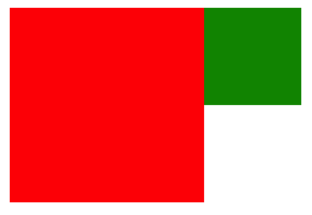

# DOM事件

>​		DOM版本：DOM0、DOM1、DOM2和DOM3，其中在DOM0和DOM2中定义着DOM事件。DOM2版本是对DOM0中的事件进行补充。`DOM0事件多用于PC端，DOM2事件多用于移动端。`
>
> 
>
>​	DOM中一个事件触发由三部分组成：
>
>1. 事件源：与用户进行交互的标签。
>2. 事件对象：event对象，保存着事件的详细信息。
>3. 事件处理函数：用来处理事件。
>
>

## DOM事件

> 鼠标事件类型：
>
> 		* click：鼠标在当前元素上点击
> 		* dblclick：鼠标在当前元素上鼠标双击
> 		* mousemove：鼠标在当前元素上移动
> 		* mouseover：鼠标移入当前元素
> 		* mouseout：鼠标移出当前元素
> 		* mouseenter：鼠标移入当前元素
> 		* mouseleave：鼠标移出当前元素
> 		* mousedown：鼠标按下
> 		* mouseup：鼠标抬起
> 		* mousewheel：鼠标滚轮滑动
>
> 键盘事件类型：
>
> * keydown：键盘按下
> * keyup：键盘抬起
> * keypress:键盘按下（中文输入法不能触发，英文状态下可以触发，因为文本被输入到文本框中）
>
> 表单元素事件类型：
>
> * blur:失去焦点
> * focus:获取焦点
> * change:内容改变
> * select:被选中事件

```html
<!DOCTYPE html>
<html lang="en">

<head>
    <meta charset="UTF-8">
    <title>Title</title>
    <style>
        .class1{
            background-color: red;
            width: 100px;
            height: 100px;
            margin: 30px 0 0 30px;
        }

        .class2{
            background-color: green;
            width: 100px;
            height: 100px;
            margin: 30px 0 0 30px;
        }
        
    </style>
</head>

<body>
    <div class="class1"></div>
    <div class="class2"></div>
    <script>
        var div1 = document.querySelector('.class1');
        var div2 = document.querySelector('.class2');
        div1.onmousemove = function(event){
            // 适配IE浏览器，低版本IE会将event放在window中。
            event = event || window.event;
            console.log('DOM0方式绑定事件，鼠标位置', event.clientX, event.clientY);
        }

        div2.addEventListener('mouseover', function(event){
             // 适配IE浏览器，低版本IE会将event放在window中。
             event = event || window.event;
             console.log('鼠标移入元素');
        }, false);
        div2.addEventListener('mouseout', function(event){
            // 适配IE浏览器，低版本IE会将event放在window中。
             event = event || window.event;
             console.log('鼠标移出元素');
        }, false);


    </script>
</body>

</html>
```

### 鼠标事件(移入移出)

> mouseover、mouseout与mouseenter、mouseleave的区别：
>
> ​		当鼠标从当前元素移入子元素时，mouseover和mouseout会识别到，认为鼠标移出了当前元素进入了子元素的区域中，而mouseenter和mouseleave会忽略，认为虽然进入子元素中，但是子元素嵌套在当前元素中，因此还是当前元素区域内。
>
>  `一句话总结：移入子元素时，是否触发离开事件。`
>
> 举例说明：
>
> ​		mouseover和mouseout将父子元素看成海洋和岛屿的关系，父元素是海洋包含着岛屿，人从海洋进入岛屿时，人不在海上，他在陆地上。
>
> ​		mouseenter和mouseleave将父子元素看成房子和客厅，父元素就是房子包含着客厅，人进入屋子走到客厅，人还是再屋子里。

```html
<!DOCTYPE html>
<html lang="en">

<head>
    <meta charset="UTF-8">
    <title>Title</title>
    <style>
        .class1{
            background-color: red;
            width: 100px;
            height: 100px;
            margin: 30px 0 0 30px;
        }

        .class2{
            background-color: green;
            width: 100px;
            height: 100px;
            margin: 30px 0 0 30px;
        }

        .class1 div:nth-child(1){
            background-color: green;
            width: 50px;
            height: 50px;
            margin-left: 100px;
        }

        .class2 div:nth-child(1){
            background-color: red;
            width: 50px;
            height: 50px;
            margin-left: 100px;
        }
        
    </style>
</head>

<body>
    <div class="class1">
        <div></div>
    </div>
    <div class="class2">
        <div></div>
    </div>
    <script>
        var div1 = document.querySelector('.class1');
        var div2 = document.querySelector('.class2');

      	// 给div1添加mouseover和mouseout事件
        div1.addEventListener('mouseover', function(event){
             // 适配IE浏览器，低版本IE会将event放在window中。
             event = event || window.event;
             console.log('鼠标移入元素，mouseover');
        }, false);
        div1.addEventListener('mouseout', function(event){
            // 适配IE浏览器，低版本IE会将event放在window中。
             event = event || window.event;
             console.log('鼠标移出元素，mouseout');
        }, false);

	      // 给div2添加mouseenter和mouseleave事件
        div2.addEventListener('mouseenter', function(event){
             // 适配IE浏览器，低版本IE会将event放在window中。
             event = event || window.event;
             console.log('鼠标移入元素，mouseenter');
        }, false);
        div2.addEventListener('mouseleave', function(event){
            // 适配IE浏览器，低版本IE会将event放在window中。
             event = event || window.event;
             console.log('鼠标移出元素，mouseleave');
        }, false);
    </script>
</body>

</html>
```

### 鼠标滚轮事件

> 鼠标滚轮触发条件：
>
> ​		将鼠标移入设置鼠标滚轮事件的元素中，滚动滚轮时会触发当前元素的鼠标滚轮事件的回调函数。
>
>  
>
> 滚动方向：(deltaY、deltaX、wheelDeltaY、wheelDeltaX)
>
> 1. IE/chrome，通过wheelDelta属性判断滚动方向
>    1. 向下滚动，往页尾方向移动，返回负值，值为多少不重要。
>    2. 向上滚动，往页首方向移动，返回正值，值为多少不重要。
> 2. FireFox，通过event.detail属性判断滚动方向(与IE/chrome相反)
>    1. 向下滚动，往页尾方向移动，返回正值，值为多少不重要。
>    2. 向上滚动，往页首方向移动，返回负值，值为多少不重要。

```html
<!DOCTYPE html>
<html lang="en">

<head>
    <meta charset="UTF-8">
    <title>Title</title>
    <style>
        html{
            background-color:yellow;
            height: 100%;
        }

        body{
            height: 1000px;
            width: 40px;
            background-color: red;
        }
    </style>
</head>

<body>
    <div class="class1">
        <div></div>
    </div>
    <div class="class2">
        <div></div>
    </div>
    <script>

        document.addEventListener('mousewheel', function(event){
             // 适配IE浏览器，低版本IE会将event放在window中。
             event = event || window.event;
             console.log('鼠标移入元素，mouseover' + event.wheelDeltaY); // 查看chrome浏览器滚动
        }, false);
 
    </script>
</body>

</html>
```


### 键盘事件

> 键盘事件注意：
>
> 1. 想要触发键盘事件，当前元素必须获取到焦点，否则即使键盘输入也没有反应。
> 2. 键盘输入后需要通过`keycode`属性判断输入的什么。
> 3. 每点击一个键位就触发一次键盘事件。
>
> 
>
> 可以获得焦点的元素：(表单元素)
>
> + input
> + button
> + textarea
> + select。
>
> 不能获得焦点的元素，就是那些不能交互的元素，例如div、p、h1、ul-li、table等元素，给元素添加`tabindex属性`或者`contenteditable属性`，让这些元素可以获得焦点，触发键盘监听。

```html
<!DOCTYPE html>
<html lang="en">
  <head>
  	<style>
      div{
        width:100px;
        height:100px;
        background-color:red;
      }
    </style>
  </head>
  <body>
  		<div class="div1" tabindex='1'></div>
    	<div class="div2"></div>
    <script>
      
      // 点击div1可以选中，因此可以捕获键盘事件。
      let div1 = document.querySelector('.div1');
      div1.onkeydown = function(event){
        // 兼容IE
        event = event || window.event;
        // 读取键盘按键与按键对应的ascii码
				console.log(event.keyCode, event.key);
      }
      
      // div2无法触发键盘监听，因为鼠标点击div2没有反应，无法捕捉键盘监听。
      let div2 = document.querySelector('.div1');
			div1.onkeydown = function(event){
        event = event || window.event;
				console.log(event.keyCode, event.key);
      }
    </script>
  </body>
</html>
```


### 表单事件


## DOM0与DOM2事件绑定

> DOM0中规定的事件绑定和解绑非常简单：
>
> 1. 绑定，每个DOM对象中都有以on开头的属性，这些都是DOM提供的事件监听属性，给它们设置事件回调方法后，绑定了事件。
> 2. 解绑，将以on开头的属性值为null，则解除当前事件的绑定。
>
> DOM2中规定的事件绑定和解绑：
>
> 1. 绑定，通过addEventListener和attachEvent方法为DOM对象绑定事件。
> 2. 解绑，removeEventListener和detachEvent方法为DOM对象解除事件绑定。
>
> 
>
> DOM0中事件绑定原理：
>
> ​		DOM对象中将鼠标、键盘和表单事件的事件回调函数做出以on开头的属性，当DOM对象触发事件时，会调用对应的on开头的属性中执行的事件回调函数，例如绑定了onclick属性(点击事件)，当点击这个DOM对象时，JS引擎会调用DOM对象的onclick属性中的函数。
>
>  
>
> DOM2中事件绑定原理：
>
> ​		浏览器有一个事件池，专门用来保存DOM对象的事件，当DOM对象绑定一个事件时，会将相关信息(元素，事件类型，回调函数)保存在这个事件池中，事件触发时JS引擎会去事件池中查找对应回调函数，当给该DOM对象的事件绑定了多个回调函数，按照添加顺序依次调用。
>
>  
>
>  
>
> DOM0和DOM2事件绑定区别：
>
> 1. DOM0事件绑定是将DOM事件的回调函数放在DOM对象身上，而DOM2事件绑定是将DOM事件的回调函数放在一个事件池中统一管理。
> 2. DOM0事件绑定，一个事件只能绑定一个回调函数；DOM2事件绑定，一个事件可以绑定多个回调函数。
> 3. DOM0的事件传递机制为冒泡，而DOM2的事件传递机制可以选择(冒泡或者捕获)。

```html
<!DOCTYPE html>
<html lang="en">

<head>
    <meta charset="UTF-8">
    <title>Title</title>
</head>

<body>
    <button id="id1">DOM0方式</button>
    <button id="id2">DOM2方式</button>
    <script>
      
      	// DOM0事件绑定
        var btn1 = document.querySelector('#id1');
        btn1.onclick = function(event){
            // 适配IE浏览器，低版本IE会将event放在window中。
            event = event || window.event;
            console.log('DOM0方式绑定事件，鼠标位置', event.clientX, event.clientY);
        }

        // DOM2事件绑定
        var btn2 = document.querySelector('#id2');
      	// btn2使用DOM2方式绑定了两个点击事件。
        btn2.addEventListener('click', function(){
            // 适配IE浏览器，低版本IE会将event放在window中。
            event = event || window.event;
            console.log('DOM2方式绑定事件，鼠标相对于视口左上角位置', event.clientX, event.clientY);
        }, false);

        btn2.addEventListener('click', function(){
            // 适配IE浏览器，低版本IE会将event放在window中。
            event = event || window.event;
            console.log('DOM2方式绑定事件，鼠标相对于按钮左上角位置', event.offsetX, event.offsetY);
        }, false);


    </script>
</body>

</html>
```

### DOM2事件绑定兼容性

> DOM2中规定的事件绑定和解绑：
>
> 1. IE9及以上版本、其它浏览器
>    1. 绑定：addEventListener(事件类型，回调函数，事件是否冒泡)，false表示冒泡，默认是false。
>    2. 解绑：removeEventListener(事件类型，回调函数，事件是否冒泡)。
> 2. IE8以及以下版本
>    1. 绑定：attachEvent('on' + 事件类型，回调函数)，`事件类型要加on`
>    2. 解绑：detachEvent('on' + 事件类型，回调函数)，`事件类型要加on`
>
> IE8及以下版本事件绑定问题：
>
> 1. 当给DOM对象的某个事件添加多个回调函数时，其他浏览器按顺序执行，IE8及以下版本是乱序执行。
> 2. 回调函数中的this指向，其他浏览器是当前触发事件的元素对象，而IE8及以下版本是window。
>
>  
>
> 事件解绑时的巨坑：
>
> ​		`绑定和解绑时的回调函数对象必须是同一个，否则事件不能解绑，下面就是绑定和解绑使用同一个回调函数，这样才能解绑成功`。

```html
<!DOCTYPE html>
<html lang="en">

<head>
    <meta charset="UTF-8">
    <title>Title</title>
</head>

<body>
    <button id="id1">DOM2方式兼容性，绑定</button>
  <button id="id2">DOM2方式兼容性，解绑</button>
    <script>
      
        // DOM2事件绑定
        var btn1 = document.querySelector('#id1');
      
      	// 不能使用匿名函数直接注册，否则无法解绑。
      	function clickFun(event){
	          // IE8及以下版本的事件对象保存在window中
            event = event || window.event;
            console.log('DOM2方式绑定事件，鼠标相对于视口左上角位置', event.clientX, event.clientY);
         };
      
	      // 其他浏览器绑定事件，如果该属性在，表示为其他浏览器
      	if(btn1.addEventListener){
          btn1.addEventListener('click', clickFun, false);
        }else{
          // 给IE8及以下版本绑定事件
          btn1.attachEvent('onclick', clickFun);
        }
      
      
      	// btn2使用DOM2方式绑定了两个点击事件。
      	if(btn2.removeEventListener){
          btn2.removeEventListener('click', clickFun, false);
        }else{
        	btn2.detachEvent('onclick', clickFun)  
        }

    </script>
</body>

</html>
```

## 事件Event

> 

### 事件流(事件传播机制)

> 历史中对于事件的传播机制存在两种方式：
>
> 1. 由网景公司提出的事件捕获，事件捕获流程是从外向内传播，当点击一个元素时，事件从document对象沿着DOM树，一层层的向目标元素传递，当传递到触发点击事件的元素身上时停止。
> 2. 由微软公司提出的事件冒泡，事件冒泡流程是从内向外传播，当点击一个元素时，事件从当前元素沿着DOM树，一层层向着root节点传播，当传递到document对象时停止。
>
>  
>
> 目前DOM0使用的是事件冒泡的事件传递机制，而DOM2使用的是标准事件传播机制，标准事件传播机制分为三个阶段：
>
> 1. 捕获阶段，事件从外传递到触发事件的元素身上，其中每层元素如果监听了该事件，也会调用事件回调函数。
> 2. 目标阶段，调用元素绑定的事件回调函数，处理事件。
> 3. 冒泡阶段，事件从元素向外传递，直到document对象停止，其中每层元素如果监听了该事件，也会调用事件回调函数。
>
> DOM2绑定事件时，只能使用一种事件传播机制触发回调方法，默认为false，冒泡，true为捕获。

```html
<!DOCTYPE html>
<html lang="en">

<head>
    <meta charset="UTF-8">
    <title>Title</title>
  	<style>
      #div1{
        width:200px;
        height:200px;
        background-color:red;
      }
        #div1{
        width:100px;
        height:100px;
        background-color:green;
        margin-left: 200px;
      }
    </style>
</head>

<body>
 		<div id="div1">
  			<div id="div2"> </div>    
	  </div>
    <script>
      	let div1 = document.querySelector('#div1');
      	//	 false表示冒泡，即在冒泡阶段触发点击事件回调函数
				div1.addEventListener('click', function(){
          console.log('红色div被点击');
        }, false);
      
      
	      let div2 = document.querySelector('#div2');
				divw.addEventListener('click', function(){
          console.log('绿色div被点击');
        }, false);
    </script>
</body>

</html>
```

效果图

> 测试：点击子元素，即绿色div时，绿色div先触发点击事件，然后在红色div触发点击事件。
>
>  
>
> 测试结论：
>
> 1. 点击子元素时，由于冒泡机制，父元素也会触发点击事件的回调函数。
> 2. 事件是沿着DOM树的路径进行传播的，即使子元素位置不在父元素内部，父元素也会触发点击事件的回调函数。


event.target到底是谁


## 默认行为


```javascript
//标准
event.preventDefault();
//非标准
event.returnValue = false;
//兼容写法：
event.preventDefault 
	? event.preventDefault()
	: event.returnValue = false;
```


