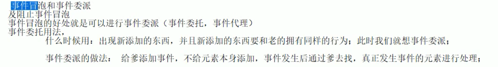
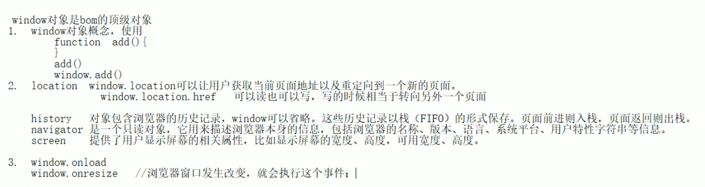
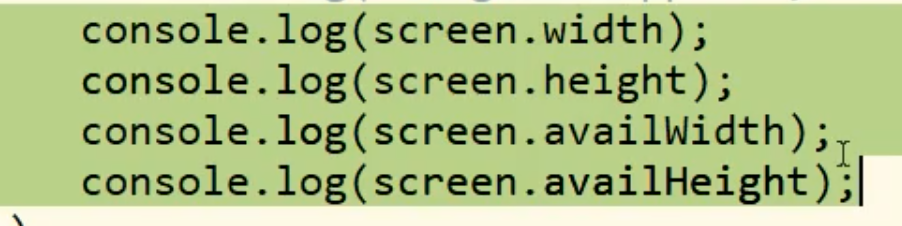
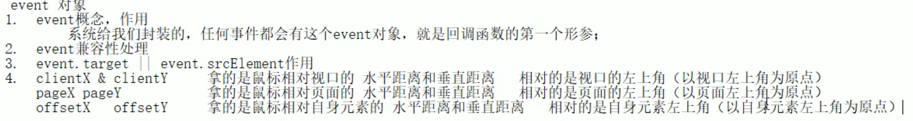

# 事件绑定

DOM版本：DOM0、DOM1、DOM2和DOM3

DOM0中添加了事件是以on开头

DOM2中又扩充了一些其他事件

DOM0事件多用于PC，DOM2事件多用于移动端

事件绑定和解除

> 
>

事件流--事件传播

三种事件流：

1. 捕获事件流(网景公司提出)
2. 冒泡事件流(IE公司提出)
3. DOM标准事件流(包含三个阶段，捕获，获取元素，然后冒泡)

DOM2提供的方法可以选择是使用捕获事件流还是冒泡事件流。

DOM0事件都是冒泡事件流

阻止冒泡事件流：

1. IE9及以上和其它浏览器，事件对象，event.stopPropagation()

事件处理函数

function(event){

​	event = event || window.event; //这句代码处理event兼容性，低版本IE浏览器的event对象不会传给事件处理函数，而是保存在window对象中。

}

事件委派：

事件委派优点：节省内存空间，提供代码的复用性。

event.target；获取当前发生事件的子元素。，高版本浏览器使用

event.srcElement :获取当前发生事件的子元素，低版本浏览器使用

srcNode = event.target || event.srcElement

事件委派对鼠标移入移出的影响

onmouseout与onmouseover：对父元素添加移入移出，当鼠标从父元素移到子元素时，会有一个元素切换的效果。

onleave与onmouseseeter：对父元素添加移入移出，当鼠标从父元素移到子元素时，没有元素切换，即even.target找不到具体的事件源，因此让所有子元素都添加效果。

因此事件委派的时候，还是使用onmouseout和onmouseover。

screenX与screenY是永远相对于屏幕的左上角的距离

JS操作的标签都是行内样式，防止css样式权限过高导致js修改完没有效果，因此js操作的都是行内样式。