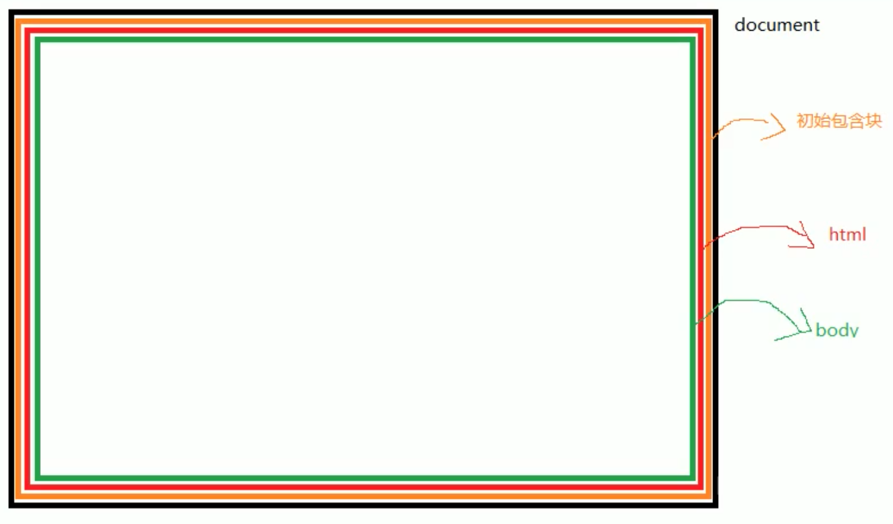
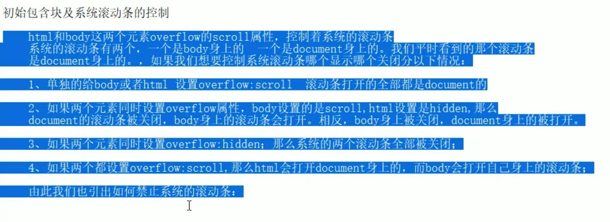

定时器是异步操作：

setTimeout()

setInerval()

clearTimeout()

clearInterval()

setInterval和settimeout使用区别：

定时器要添加在全局变量，不要定义在局部作用域中。

## 元素定位在视口左上角时，此时滚动页面，元素会跟着滚动，还是一直定位在视口左上角？

文档树结构：

document ——> 初始包含块 --> html --> body

因此父元素没有position为static时，子元素使用定位时，定位基点为初始包含块的左上角。

初始包含块大小：打开浏览器时第一屏大大小。

禁用系统滚动条

html, body{

​	height :100%,

​	overflow : hidden;

}

为啥html的height设置为100%？这里说明了网页宽高的计算问题：

宽高：对于非块级元素，没有设置宽高时，宽高为0，或者有内容撑起宽高，或者

​			对于块级元素，没有设置宽高时，宽度为能设置的最大宽度，即父元素的宽度，高度或者为0，或者内部子元素撑起来的高度，或者设置宽高，或者使用百分比参照父元素宽高(注意此时父元素要不设置了具体宽高，要么有设置了百分比，不能再有子元素撑起来，使用百分比时，需要设置html高度百分比，因为html和body没有高度，完全有子元素撑起来的，但是初始包含块有高度，因此使用height：100%设置高度)。

行内元素能设置宽高吗？	

全局捕获 setCapture()：给元素添加全局捕获后，后序鼠标所有操作都会让该元素来处理。

### 浏览器默认事件：

选中文字可以拖拽，点击a标签可以自动跳转。

取消Dom0默认行为，事件回调方法返回false。

取消DOM2默认行为，event.preventDefault();

