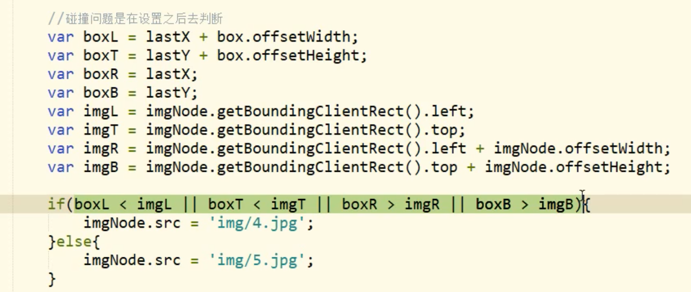
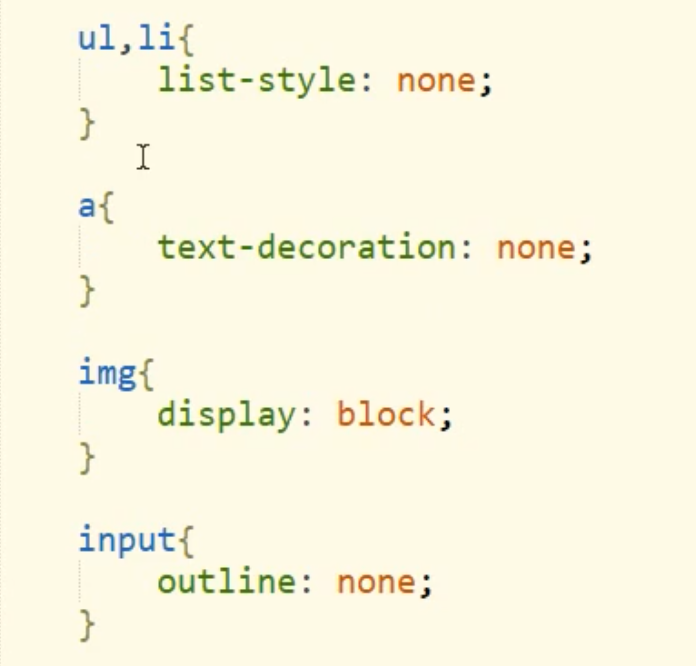
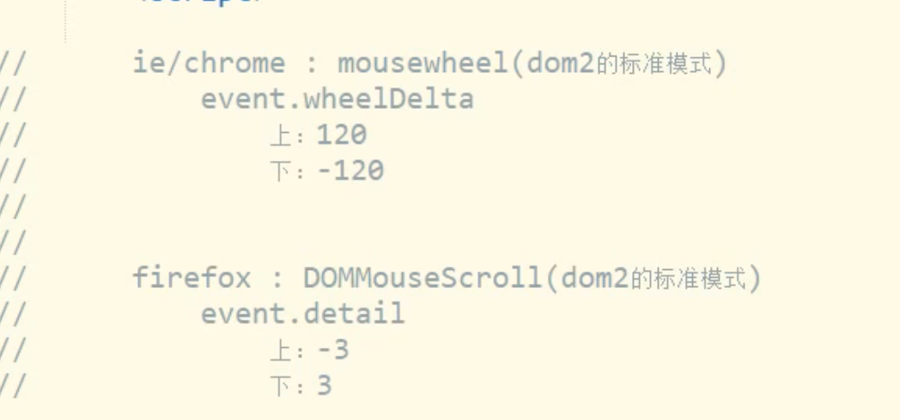

碰撞和边界检测的区别：

碰撞时设置后，再检测位置，只有碰撞了才能检测

边界检测时，先检测位置，再设置，防止碰撞

盒子中行内元素的局中：

text-align：center；

line-height ： 盒子高度;

盒子中块元素的局中：

1. position：absolute; width:50%; transform:translate(-50%);
2. position: absolute; margin:auto; left:0,; top:0; right:0; bottom:0;

块中行内块局中：

1. position: absolute; margin:auto; left:0,; top:0; right:0; bottom:0;
2. text-align：center；line-height ： 盒子高度; vertical-align : middle;(取出图片底部白边)

getBoundingClientRect()

滚动条高度 / 屏幕高度 == 屏幕高度 / 内容高度 == 滚动条滚动距离 / 内容滚动距离。

可以将滚动条理解为可视窗口，包含滚动条的控件为内容，滚动条滚动相当于包含滚动条的控件在一点点向上移动。

鼠标滚轮：

隐藏方式：visibility 、display

