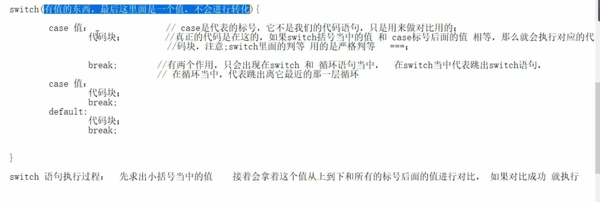
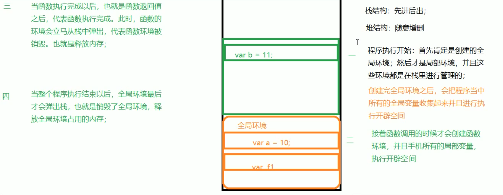
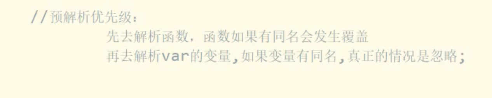
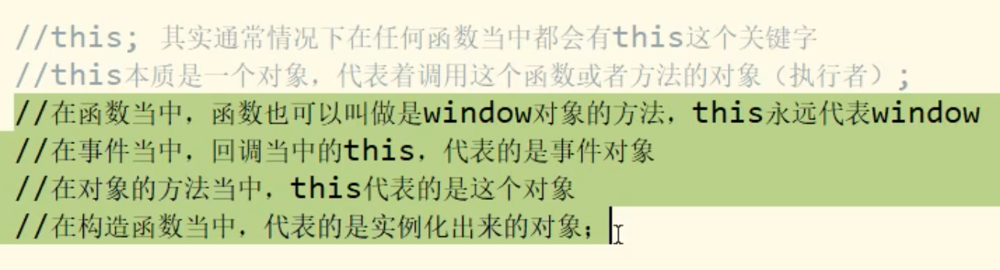

动画过度和定时器实现的区别：

定时器实现元素的变化是按照时间一步步累加出来的。

动画过渡实现元素的变化，是将元素瞬间改变成最终值，然后显示一个过渡动画。

例如设置元素向右平移1000px，

使用定时器实现，每100毫秒移动10px，10s后移动到位置。

使用动画过渡实现，首先将元素直接设置为1000px，然后过程使用动画来实现，动画的步辐无法控制。


正则一般匹配到第一个就停止查找了。


总结：

变量定义，var a = 12  === var a;  a = 12;

null作用：

1. 变量将要保存的时引用类型，目前为空。
2. 全局作用域中释放内存。

对象：

1. 数组：即是数组又是对象，当数组操作元素，当对象操作属性和方法。
2. 函数：函数就是对象，当普通函数用执行内部代码，当构造函数用创建对象，当对象用，操作函数中的属性和方法(Person,prototype)。




if语句中的条件最后计算出一个值，并转换成boolean	


程序运行时内存：







```javascript
console.dir(a);
console.dir(a());
var a = '我是变量'
function a(){ console.log('aaaa')};
console.dir(a);
function a(){ console.log('bbbb')};
var a = '我是变量2'
console.dir(a);

// 下面是预解析：
function a(){ console.log('bbbb')};
var a;
var a;
console.dir(a);
console.dir(a());
a = '我是变量';
console.dir(a);
a = '我是变量2';
console.dir(a);

```


对象的属性操作：

1. 点语法
2. 在中括号中+字符串，来访问

obj['name']和obj[name]，带引号与不带引号的区别，不带引号当成变量看，获取变量中的值，带引号为字符串，用来访问和设置对象属性。


this



