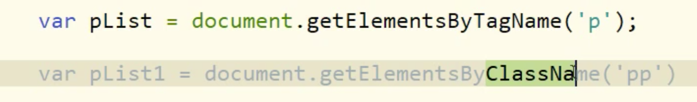
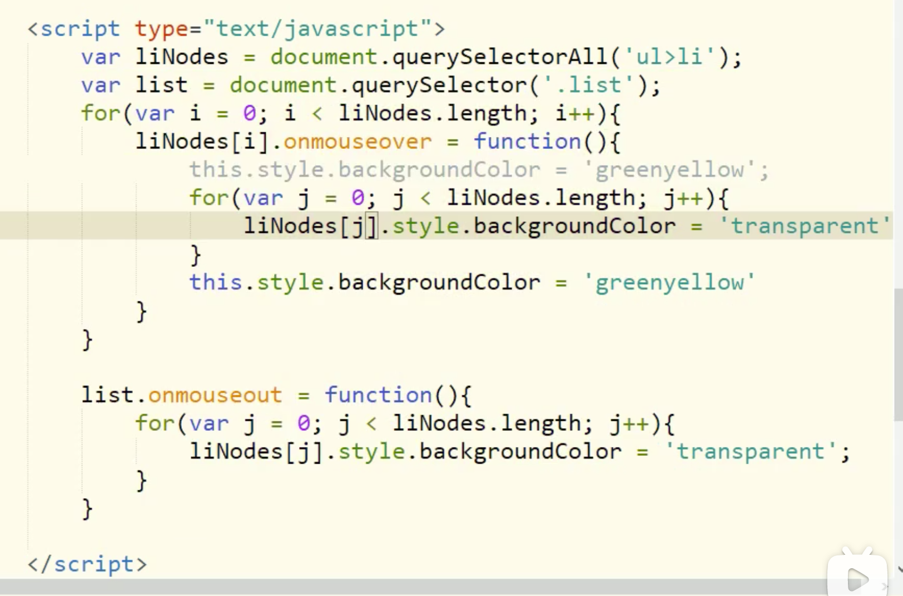

window.onload，页面渲染完毕后的触发事件，当页面加载完成后会调用window.onload属性中指向的函数。

页面在渲染时，会建立document树，此时由于document树没有建立完成，不能使用DOM接口操作文档，有可能获取不到节点。

使用DOM接口的地方：

1. 在window.onload的方法中。
2. 在绑定的交互事件方法中使用


这种方式是否可以获取document对象，点击按钮是否可以出现弹框


行内块的缺点：底部有个缝隙，由于基线造成的，将其改成块元素，或者调整基线vertical-align:middle


对于css中逻辑上应该使用boolean表示的，没有使用boolean表示，在JS中中一律用boolean表示。例如单选框，不选择则不写该属性，选择中为checked。


实例

点击小图切换大图





```html
<!-- 如果只想修改p标签下span标签的内容，使用前三种方式无法精准的获取想要的节点，而使用后两种方式，可以一句代码精准的定位到想要的节点。 -->
<p>
  <span class="titleStyle">内容1</span>
</p>
<div>
  <span class="titleStyle">内容2</span>
</div>

<script>
	window.onclick = function(){
    var spanNode = document.querySelect('p .titleStyle');
  }
</script>
  
```


Onmousemove：鼠标在移动

onmousevoer和onmouseout：鼠标移入移出

onmounseenter和onmouseleave：鼠标移入移出

onclick、onmousedown、onmouseup和ondbclick：鼠标点击


Box-size：当前元素的总长度和总宽度的计算方式。

Box-size:content-box；width=contentWidth，height=contentHeight。

Box-size:border-box；width=borderWidth+paddingWidth+contentWidth，height=borderHeight+paddingHeight+contentHeight。


鼠标移入列表的某个项时高亮，移出时恢复。



实现思路：

1. 排他法，上面就使用排他法，优点就是节省内存空间。少定义移出事件函数和函数对应的作用域链。
2. 给元素添加移入和移出两个事件

排他法：

将所有元素都设为同一个样式，然后在单独修改想要修改的元素的样式。


总结常用的并记住常用的一些属性设置，多多理解二八原则 ，理解使用该技术后有什么影响

元素隐藏的方式：并且隐藏后是否占用空间

display：none；

visiplity：

opasity

宽高任意为零

translate，将其移出可视区域

旋转90度，使用户眼睛和图形平行

缩放为0


焦点是啥？，获得焦点和失去焦点


按下键盘任意一个键都会触发回调方法。


随机颜色


对应div这种标签本身没有焦点这一说，即给div添加焦点事件，不会响应，因此使用tabindex属性，让div可以响应焦点事件。


outline：none


# css BFC机制


轮播图中左右按钮渐变效果


淘宝二级菜单


# 相对定位与绝对定位

top：50%，相对于谁的高度的百分比

translateY(-50%)：相对于谁的高度的百分比

如何实现元素的对齐，左对齐，X轴居中对齐、Y轴居中对齐，中心对齐


transform属性的赋值，是覆盖操作，而不是基于上一步结果进行下一步操作。

Box.style.transform = translateY(100px);

Box.style.transform = translateY(-100px);

结果为元素向上移动-100px，而不是先移动100px然后再移动-100px


# 表单类型标签

input、select、option、textarea、button、datalist、keygen、output

