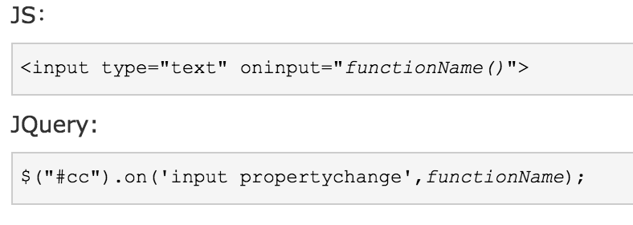
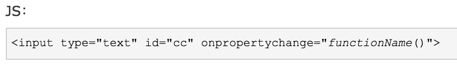

# input框的input事件和change事件区别


 input输入框的onchange事件，要在 input 失去焦点的时候才会触发；

​    在输入框内容变化的时候不会触发change，当鼠标在其他地方点一下才会触发；

   onchange 事件也可用于单选框与复选框改变后触发的事件。

   demo如下： 

[](javascript:void(0);)

```
<script>
    function myFunction(){
        var x=document.getElementById("fname");
        x.value=x.value.toUpperCase();
     }
</script>
</head>
<body>

   输入你的名字: <input type="text" id="fname" onchange="myFunction()">
   <p>当光标离开输入框后，函数将被触发，将小写字母转为大写字母。</p>
</body>
```

[](javascript:void(0);)

 

##   onchange事件兼容性

   onchange event 所有主要浏览器都支持；

   onchange 属性可以使用于：<input>, <select>, 和 <textarea>。

 

###    INPUT事件

   oninput 事件在用户输入时触发，它是在元素值发生变化时立即触发；

   该事件在 <input> 或 <textarea> 元素的值发生改变时触发。

   缺陷：从脚本中修改值不会触发事件。从浏览器下拉提示框里选取值时不会触发。IE9 以下不支持，所以IE9以下可用onpropertychange 事件代替。

  

##    **onpropertychange事件**

   onpropertychange会实时触发，会在元素的属性改变时就触发事件。当元素disable=true时不会触发。

   缺陷：只在IE 下支持，其他浏览器不支持，用oninput来解决。

  