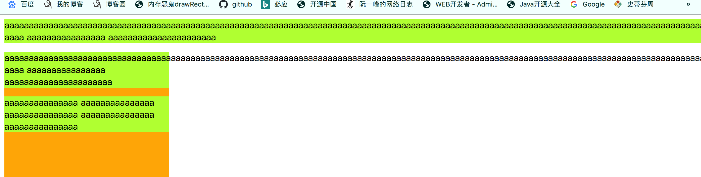

# 视口、html、body以及内部元素的宽高

> 问题：
>
> 1. 页面中的元素的大小与位置是基于谁建立的，或者说参照物是谁？ --- 基于包含块
> 2. 什么是包含块、什么是初始包含块？
>
>  
>
> `视口：`浏览器的显示网页的窗口。

## 什么是包含块

> 
>
> `包含块`	
>
> ​		任何涉及到布局的问题都需要一个参照物，大到城市的规划，小到房屋的装饰，它们都需要一个参照物作为标准，网页布局也是一样需要一个这样的参照物，这个参照物就是包含块。
>
> ​		包含块并不是一个固定的标签元素，而是每个元素选择参照的那个标签就是该元素的包含块，举个例子，在body中定义一个div时，那么div的位置就是参照body内部content区域左上角为原点计算出来的，因此body就是div的包含块。
>
> ​		
>
> ​		`在文档流中，任何一个元素的包含块都是它的直接父元素，对于使用定位的元素它的包含块是离它最近的非static定位的祖先元素`。
>
> ​	
>
> `初始包含块`
>
> ​		根标签元素的包含块就是初始包含块(即html标签的初始包含块)，初始包含块 == 浏览器可视窗口的位置(0, 0)和大小。当用户拉伸或收缩浏览器时，可视窗口的大小会反正改变，相应的初始包含块也会随之改变。

## 元素位置、宽高

> 浏览器对于元素位置宽高设置分为两类：
>
> 1. 初始包含块
> 2. 标签元素

### 初始包含块

> ​		初始包含块的位置为视口的左上角，宽高为视口的宽高，浏览器打开网页时，有浏览器根据自身呈现网页区域的宽高给初始包含块设置值。

### 元素的位置和宽高

> 元素的宽高的情况：
>
> 1. 当元素为行内元素时：
>    1. 当没有设置元素宽高时，如果元素中有内容，则元素的宽高由内容的宽高来决定，即由内容撑起宽高。
>    2. 当设置宽高时，高度无效，高度由内容高度决定，宽度等于设置的宽。
> 2. 当元素为行内块时：
>    1. 当没有设置元素宽高时，如果元素中有内容，则元素的宽高由内容的宽高来决定，即由内容撑起宽高。
>    2. 当设置宽高时，元素的宽高由设置值决定。
> 3. 当元素为块元素时：
>    1. 当没有设置元素宽高时，如果元素中有内容，则元素的宽高由内容的宽高来决定，即由内容撑起宽高。
>    2. 当设置宽高时，元素的宽高由设置值决定。
>
> 总结：`没有设置宽高时，元素的宽高由内容宽高决定，当设置宽高时，行内元素、行内块和块元素根据自己特点决定。`

### 包含文本的元素的宽高

> ​		包含文本的元素例如p标签、span标签等的宽高的确定是由内部文本来决定(效果元素必须包裹住内部文本)：
>
> 1. 当行内元素最简单，因为所有文本在一行显示，高度固定，宽度要长于文本的长度，使元素可以将其包裹。
> 2. 当为块元素时，有两种情况：
>    1. 没有过长的单词时，块元素宽度为父元素的宽度，一行显示不开换行，块元素的高度= 单行高度 * 行数。
>    2. 存在过长的单词(超过父元素的宽度)并且块元素的父元素为body时，块元素的宽度为这个过长单词的宽度，其它文本换行显示，块元素的高度= 单行高度 * 行数。
>    3. 存在过长的单词(超过父元素的宽度)并且块元素的父元素为非body时，块元素的宽度为父元素宽度，其它文本换行显示，块元素的高度= 父元素 * 行数。
>
> 单词：
>
> 1. 没有空格的连续数字。
> 2. 没有空格的连续字母。
> 3. 每个中文字就是一个单词。

```html
<!DOCTYPE html>
<html>

<head>
    <style>
        html,
        body {
            height: 100%;
            width: 100%;
            overflow: hidden;
        }

        p {
            background-color: greenyellow;
        }
    </style>
</head>

<body>
    <!-- p元素父元素为body时，单词超过视口宽度，p元素宽度=单词宽度 -->
    <p>aaaaaaaaaaaaaaaaaaaaaaaaaaaaaaaaaaaaaaaaaaaaaaaaaaaaaaaaaaaaaaaaaaaaaaaaaaaaaaaaaaaaaaaaaaaaaaaaaaaaaaaaaaaaaaaaaaaaaaaaaaaaaaaaaaaaaaaaaaaaaaaaaaaaaaaaaaaaaaaaaaaaaaaaaaaaaaaaaaaaaaaaaaaaaaaaaaaaaaaaaaaaaaaaaaaaaaaaaaaaaaaaaaaaaaaaaaaaaaaaaaaaaaaaaaaaaaaaaaaaaaaaaaaaaaaaaaaaaaaaaaaaaaaa
        aaaa aaaaaaaaaaaaaaaa aaaaaaaaaaaaaaaaaaaaaa</p>

    <div style="width:300px; height:300px; background-color: orange;">
        <!-- p元素父元素为div时，单词超过视口宽度，p元素宽度=父元素宽度 -->
        <p>aaaaaaaaaaaaaaaaaaaaaaaaaaaaaaaaaaaaaaaaaaaaaaaaaaaaaaaaaaaaaaaaaaaaaaaaaaaaaaaaaaaaaaaaaaaaaaaaaaaaaaaaaaaaaaaaaaaaaaaaaaaaaaaaaaaaaaaaaaaaaaaaaaaaaaaaaaaaaaaaaaaaaaaaaaaaaaaaaaaaaaaaaaaaaaaaaaaaaaaaaaaaaaaaaaaaaaaaaaaaaaaaaaaaaaaaaaaaaaaaaaaaaaaaaaaaaaaaaaaaaaaaaaaaaaaaaaaaaaaaaaaaaaaa
            aaaa aaaaaaaaaaaaaaaa aaaaaaaaaaaaaaaaaaaaaa</p>
        <p>aaaaaaaaaaaaaaa aaaaaaaaaaaaaaa aaaaaaaaaaaaaaa aaaaaaaaaaaaaaa aaaaaaaaaaaaaaa</p>
    </div>

</body>

</html>
```




## 获取初始包含块宽高、html宽高、body宽高

> 初始包含块的宽高获取：
>
> 1. document.documentElement.clientWidth; --- 获取初始包含块的宽度，即视口宽度。
> 2. document.documentElement.clientHeight; --- 获取初始包含块的高度度，即视口高度。
> 3. document.body.clientWidth; --- 获取初始包含块的宽度，即视口宽度。
> 4. document.body.clientHeight; --- 获取初始包含块的高度度，即视口高度
>
> Html的宽高获取：
>
> 1. document.documentElement.offsetWidth; --- 获取html标签的宽度。
> 2. document.documentElement.offsetHeight; --- 获取html标签的高度度。
>
> Body的宽高获取：
>
> 1. document.body.offsetWidth; --- 获取body的宽度。
> 2. document.body.offsetHeight; --- 获取body的高度度。