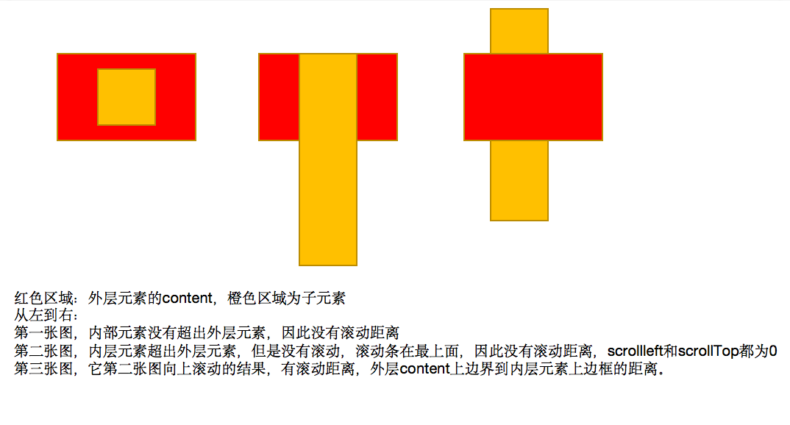

# 鼠标的位置

> JS提供了三种获取鼠标位置的方式：
>
> 1. clientX和ClientY：以可视窗口左上角为原点，鼠标的坐标，浏览器显示网页的窗口。
> 2. screenX和screenY：以显示器屏幕左上角的坐标为原点，鼠标的坐标。
> 3. pageX和pageY：以网页的页面左上角的坐标为原点，鼠标的坐标。
> 4. offsetX和offsetY：以事件源的左上角为原点，鼠标的坐标，不同浏览器参照的原点不同。
>
> pageX和pageY的理解：
>
> ​	网页页面的大小不等于浏览器显示网页窗口的大小，应该理解为UI设计师的网页设计原型图的左上角为原点，鼠标放在这张原型图上的坐标。
>
> 
>
> offsetX和offsetY原点说明：
>
> 1. chrome浏览器：参照原点为元素边框左上角，即盒子模型中边框左上角。
> 2. IE和火狐浏览器：参照原点为元素内容左上角，即盒子模型中content左上角。
>
> 因此当鼠标在元素边框中时，IE和火狐浏览器的offsetX和offsetY显示负值。
>
> 
>
> 兼容性：
>
> 1. screenX、screenY、clientX和clientY所有浏览器都支持。
> 2. offsetX和offsetY是IE9、chrome、火狐、safari都支持。
> 3. pageX和pageY是IE不支持，使用event.x和event.y。

```html
<!DOCTYPE html>
<Html>
    <style>
        body,html{
            margin:0;
            padding: 0;
            border: 0;
        }

        body{
            width:100px;
            height:100px;
            background-color: red;
            margin-top:500px;
            margin-left: 10px;;
        }
        html{
            background-color: blue;
            height:1000px;
        }
    </style>
    <body>
        <script>
            var bodyNode = document.querySelector('body');
            bodyNode.onclick = function(event){
                // 鼠标距离屏幕左上角的坐标
                console.log('screen', event.screenX, event.screenY);
                // 鼠标距离浏览器显示网页窗口的左上角的坐标
                console.log('client', event.clientX, event.clientY);
                // 鼠标距离所在元素左上角的坐标
                console.log('offset', event.offsetX, event.offsetY);
                // 元素当前所在的页面具体位置 + 鼠标在当前元素内部的位置
              	var pageX = event.pageX || event.x; // 兼容IE
                var pageY = event.pageY || event.y; // 兼容IE
                console.log('page', event.pageX, event.pageY);
            }
          
        </script>
    </body>
</Html>
```


# 元素的大小和位置

## 元素大小

> JS提供了三种获取元素大小的属性
>
> 1. clientWidth和clientHeight：元素的content+padding * 2，元素不算边框，内容+内边距大小
> 2. offsetWidht和offsetHeight：元素的content+padding * 2 + border * 2，元素的内容+内边距+边框的大小
> 3. scrollWidth和scrollHeight：计算的是元素内部大小。
>    1. 当内部元素完全在当前元素pading+content面积内部时，scrollWidth和scrollHeight =外部元素的 clientWidth和clientHeight。
>    2. 当内部元素至少一个坐标轴超出了当前元素padding+content面积时，例如x轴超出y轴没有超出时，scrollWidth = 内部元素的margin-left + 内部元素的offsetWidth + 外部元素的padding，scrollHeight = 外部元素的clientHeight。
>
> 总结：
>
> ​		clientWidth和offsetWidth分别计算的是不带边框元素的宽度和带边框时元素的宽度。
>
> ​    	scrollWidth计算的是当前盒子中所装内容的宽度，没超过盒子大小时，表示盒子的容量，超过盒子时表示内部元素真实的宽度。

```html
<!DOCTYPE html>
<html>
    <head>
        <style>
            html{
                height: 100%;
            }
            body{
                height: 1000px;
            }

            #div1{
                width: 100px;
                height: 100px;
                background-color: greenyellow;
                padding: 50px;
                border: 20px solid orange;
            }

            #div2{
                width: 50px;
                height: 50px;
                background-color: red;
            }

            #div3{
                width: 100px;
                height: 100px;
                background-color: aqua;
            }

            #div4{
                width: 50px;
                height: 50px;
                background-color: red;
                border: 20px solid blue;
                padding: 50px;
                margin-left:20px;
            }

        </style>
    </head>

    <body>
        <div id="div1"> 
            <div id="div2"></div>
        </div>

        <div id="div3"> 
                <div id="div4"></div>
        </div>

    <script>
        var div1 = document.querySelector("#div1");
       

        div1.onclick = function(){
            // div1的content + padding * 2的长度
            console.log("clientWidth && clientHeight", div1.clientWidth, div1.clientHeight);
            // div1的content + padding * 2 + border * 2 的长度
            console.log("offsetWidth && offsetWidth", div1.offsetWidth, div1.offsetHeight);
            // div1的容量
            console.log("scrollWidth && scrollHeight",div1.scrollWidth, div1.scrollHeight);

            // 当内部元素位置超出div1content+padding的面积时，显示内部元素真正的宽高。
            var div2 = document.querySelector("#div2");
            div2.style.marginLeft = 201 + 'px';
            div2.style.marginRight = 201 + 'px';
            console.log("scrollWidth && scrollHeight",div1.scrollWidth, div1.scrollHeight);

            // 当内部元素大小超过div1content+padding的面积时，显示内部元素真正的宽高。
            // div2.style.marginLeft = 0 + 'px';
            // div2.style.width =  151 + 'px';
            // div2.style.height = 151 + 'px';
            console.log("div1: scrollWidth && scrollHeight",div1.scrollWidth, div1.scrollHeight);
        }

        // 测试当内部元素超出外部元素时，外部元素的scrollWidth如何计算
        var div3 = document.querySelector("#div3");
        div3.onclick = function(){
            var div4 = document.querySelector("#div4");
            // div4.offsetWidth + div4.margin-left + div3.padding
            console.log("div3: scrollWidth && scrollHeight",div3.scrollWidth, div3.scrollHeight);
        }

    </script>
    </body>
</html>
```

## 元素的位置

> JS提供三种读取元素位置：
>
> 1. clientLeft和clientTop：读取当前元素左边框和上边框的宽度。
> 2. offsetLeft和offsetTop：当元素处于定位中时，读取元素的坐标值。
>    1. 当元素以及包含它的父元素、祖先元素都没有开启定位时，原点为网页的左上角，可以理解为当前元素距离UI设计师的原型图左上角的坐标。
>    2. 当元素的父元素或者某个祖先元素开启定位时，则原点为`开启定位的这个元素的padding区域的左上角`。
> 3. scrollLeft和scrollTop：盒子中内容向左和向上滚动的距离。这个值可读可写，设置位置可以不加px
>    1. 当内部元素没有超出该元素时，scrollLeft和scrollTop为0，即没有可滚动的空间。
>    2. 当内部元素超出该元素content时，无论是使用margin还是修改宽高方式，scrollLeft和ScrollTop为内部承载元素的虚拟元素的滚动距离。
>
> clientLeft、clientTop、offsetLeft和offsetTop是只读属性，而scrollLeft和scrollTop可读可写。

```html
<!DOCTYPE html>
<html>
    <head>
        <style>
            html{
                height: 100%;
            }
            body{
                height: 1000px;
            }

            #div5{
                width:100px;
                height:100px;
                background-color: orange;
                margin-top: 40px;
                margin-left: 40px;
                /* 开启后父元素定位后，看看子元素参照的原点 */
                padding-left: 10px;
                padding-top: 10px;
                border: 10px solid red;
                position: relative;
                overflow:auto;
            }

            #div5 div{
                margin-top:30px;
                width: 50px;
                height: 50px;
                background-color: lime;
                border: 10px solid blue;
                
            }
        </style>
    </head>

    <body>

        <div id="div5">
            <div id="div6"></div>
        </div>

    <script>
      
        var div6 = document.querySelector("#div5 div");
        var div5 = document.querySelector("#div5");
        div6.onclick = function(event){
            event = event || window.event;
            var target = event.target || event.srcElement;
          
          	//  div6上边框和左边框宽度
            console.log("clientLeft && clientRight", target.clientLeft, target.clientTop);
            // div6定位坐标
            console.log("offsetLeft && offsetTop", target.offsetLeft, target.offsetTop);
            // div5内容滚动距离
            console.log("scrollLeft && scrollTop", div5.scrollLeft, div5.scrollTop);
        }
    </script>
    </body>
</html>
```

## JS为何不使用width和height获得元素宽高

> 上面介绍了JS获取元素宽高的方式，但是为何不直接通过objNode.style.width和objNode.style.height来读写元素宽高？
>
> 
>
> ​		由于开发时大部分情况都是使用外部式或者嵌入式方式给元素添加样式，很少使用内联式(直接将css样式写在标签中)，而使用JS操作标签属性时都是使用内联式方式，因此在开发时没有用内联式设置标签属性时，读取的都是空字符串。

```html
<!DOCTYPE html>
<html>
    <head>
        <style>
            html,body{
                height: 100%;
                overflow: hidden;
            }

            #div1{
                width: 50px;
                height: 50px;
                background-color: greenyellow;
            }


        </style>
    </head>

    <body>
        <div id="div1"></div>
        <div id="div2" style="width:50px; height:50px; background-color: red;"></div>

    <script>
	      // 使用内嵌式设置样式，使用JS读取width和height属性
        var div1 = document.querySelector("#div1");
        console.log(div1.style.width, div1.style.height);
      
	      // 使用内联式设置样式，使用JS读取width和height属性
        var div2 = document.querySelector("#div2");
        console.log(div2.style.width, div2.style.height);
        
    </script>
    </body>
</html>
```

## 属性说明：

> 这些属性的读写性：
>
> 只读属性：
>
> 1. clientWidth、clientHeight、clientLeft、clientTop。
> 2. offsetWidth、offsetHeight、offsetLeft、offsetTop
> 3. scrollWidth、scrollHeight
>
> 可读可写属性：
>
> 1. scrollLeft和scrollTop。
>
> 对于只读属性的设置：下面的例子

```html
<!DOCTYPE html>
<html>
    <head>
        <style>
            html, body{
                height: 100%;
                overflow: hidden;
            }

            #div1{
                width: 100px;
                height: 100px;
                background-color: greenyellow;
                padding: 50px;
                border: 20px solid orange;
            }

        </style>
    </head>

    <body>
        <div id="div1"> </div>
    <script>
        var div1 = document.querySelector("#div1");
       

        div1.onclick = function(){
            // div1的content + padding * 2的长度
            console.log("clientWidth && clientHeight", div1.clientWidth, div1.clientHeight);
            // div1的content + padding * 2 + border * 2 的长度
            console.log("offsetWidth && offsetWidth", div1.offsetWidth, div1.offsetHeight);
             // div1的定位
             console.log("offsetLeft && offsetTop", div1.offsetLeft, div1.offsetTop);

            // 设置元素的边框、内边距、content宽高、以及定位，其实就是使用JS在标签内部添加css样式(内联式)
            div1.style.padding = '10px 10px 10px 10px';
            div1.style.border = '10px solid red';
            div1.style.width = '50px';
            div1.style.height = '50px';
            div1.style.position = 'absolute'
            div1.style.left = '40px';
            
        }
    </script>
    </body>
</html>
```


# 难点总结


## scrollWidth和scrollHeight

> 下图解释了scrollWidth和scrollHeight值的计算原理。
>
> 
>
> scrollWidth和scrollHeight只有在子元素超出父元素content+paddig区域，出现滚动条时，才有使用的意义，scrollWidth和scrollHeight和clientWidth、clientHeight一样。


## offsetLeft和offsetTop


## scrollLeft和scrollTop

> 通过修改scrollLeft和scrollTop的值可以控制内部页面滚动的到哪里，或者说显示那个区域的内容。



# 视口宽高

> 视口宽高时浏览器显示网页区域的宽高，两种方式可以拿到：
>
> 1. document.documentElement.clientHeight 和 document.documentElement.clientWidth
> 2. document.body.clientHeight 和 document.body.clientWidth
>
> 使用body获取存在的问题：
>
> 由于在IE6以及以下版本，使用document.documentElement是获取不到视口的宽高的，因此使用body获取，但是使用body获取的问题在于开发者可以操作body的外边距、设置边框、设置宽高，此时使用body的clientWidth和clientHeight获取不到真正的视口宽高。

```html
<!DOCTYPE html>
<html>
    <head>
        <style>
            html{
                height: 300px;
                border: 20px solid green;
            }

            body{
                border: 20px solid red;
                height:100%;
            }

        </style>
    </head>

    <body>
       
    <script>
      /*
      * 视口宽高：511  595
      * html宽高：470 300
      * body宽高：415 300
      */
        console.log(document.documentElement.clientWidth, document.documentElement.clientHeight);
        console.log(document.body.clientWidth, document.body.clientHeight);
    </script>
    </body>
</html>
```


