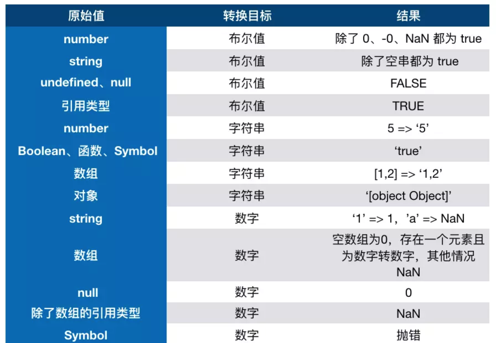

# JS数据类型分类

> JS中有两大数据类型，基本数据类型和引用类型
>
> 基本数据类型：number、string、boolean、null、undefined
>
> 引用类型：Object以及Object

## 基本类型

>JS中基本类型，保存在栈内存空间，由系统对作用域对象的压栈和出栈操作，实现基本类型内存空间的销毁。
>
>

### number

> JS中的数字不使用单独的类型表示整型和浮点型，统统用number。number类型即可以表示整型也可以表示浮点型。
>
> 
>
> JS引擎会自动对number进行优化，例如使用浮点型表示的整型数据时，会自动转换成整型，节省内存空间。例如12.0，系统会自动转换成12。

### string

> JS中字符串使用string类型表示，特点：
>
>  	1. 不可变字符串，即无法对字符串中的单个字符进行修改、插入和删除操作。`字符串的拼接原理是创建一个新字符串保存`。

### boolean

> JS中的布尔类型，只有两个值，true、false。

### null与undefined

> JS提供了中单独的基本类型来区分引用类型变量未初始化和空值的情况。
>
> undefined：表示当前变量没有进行初始化，该变量的栈内存空间保存的是乱码，变量不能使用。
>
> null：表示当前变量已经初始化了，该变量的栈内存空间可以使用，只是未保存数据。
>
> 
>
> 举例：从房间里找出一个装满垃圾物品的箱子(开辟内存空间，未初始化情况)，将箱子中的物品清空(内存空间初始化但未赋值)，将有用的东西保存在箱子中(给内存空间赋值。)


## 引用类型

> `引用类型由两部分内存空间组成`
>
> 1. 一个是保存在栈内存空间的变量，保存对象在堆内存的地址.
> 2. 另一个就是保存在堆内存空间中的对象本体。JS对于对象的操作通常是借助变量来实现。
>
> 
>
> `引用类型的内存管理`：
>
> 由两部分组成，变量内存空间由系统完成，堆中的内存由JS引擎提供的垃圾回收机制来完成，垃圾回收机制会定期对堆内存中无用的对象进行内存空间的释放，`因此对于不需要的对象请立即将指向该对象的变量设为null`，保证在下次垃圾回收机制运行时释放该对象。

## 类型转换


### 转换成string

>
>
>boolean-->string：true转换成` 'true'`，false转换成` 'false'`。
>
>number-->string: 转换成字符串表示的数字。
>
>对象-->string: 调用`valueOf函数，如果没有实现valueOf方法则调用toString()方法，将其转换成字符串`。
>
>null->string: 转换成` 'null'`。
>
>undefined-->string: 转换成` 'undefined'`。

### 转换成number

> 
>
> boolean-->number：true转换成` '1'`，false转换成` '0'`。
>
> string-->number: 调用Number()对字符串进行转换，字符串只能含有数字、小数点和负号，否则转换失败，例如'-12.23'可以转换，'-12.23a'不能转换。
>
> 对象-->number: 调用`valueOf函数，如果没有实现valueOf方法则调用toString()方法，转换成数字`。
>
> null->number: 转换成` 0`。
>
> undefined-->number: 转换成` NaN`。
>
> 
>
> 对于不能转换成数字的其它类型，统统用`NaN`表示，not a number。

### 转换成boolean

>
>
>number-->boolean：true转换成` '1'`，false转换成` '0'`。
>
>string-->boolean: `非空字符串为true，空字符串为false`。
>
>对象-->boolean: 对象存在为 true，对象不存在为false，即`保存对象的变量为null时，为false`。
>
>null->boolean:`  false`。
>
>undefined-->boolean: `false`。
>
>
>
>
>
>JS提供Boolean()函数将其它类型转换成boolean类型。

### 转换成对象

>JS提供了内置引用类型来实现基本类型对象话，基本包装类型String、Boolean和Number，将基本类型转换成对象。
>
>基本包装类型对象的创建方式有两种：
>
>1. 最常见的方式，由系统创建，用完后立即销毁，生命周期非常短，例如，基本类型是没有方法的，但开发中常常看见基本类型使用点语法调用函数，其实是系统帮我们创建了一个该类型的基本包装类型对象，调用完方法后会立即销毁。
>2. 由开发者手动创建。

```js
var str = 'aaaaa';
console.log(str.length()); // 此时系统帮我们创建了一个String类型对象。将字符串封装在里面，调用完length后，自动销毁。
```

## 对象的转换过程

```javascript
var obj1 = new Object();
obj1.valueOf = function(){
  return '12';
}

var obj2 = new Object();
obj2.toString = function{
  return '12'
}

console.log(Number(obj1));// 调用obj1的valueOf方法将其转换成基本类型(string)，然后再转换成需要的基本类型(number)。
console.log(Number(obj2));// 调用obj2的toString方法(obj2没有实现valueOf方法)将其转换成基本类型，然后再转换成需要的基本类型(number)。
```

> 对象的类型转换过程分为2步：
>
> 1. 对象-->基本类型，调用valueOf方法，先将对象转换成基本类型(有可能不是需要的基本类型)，没有实现valueOf方法，则调用toString方法实现。
> 2. 基本类型-->基本类型，使用基本类型转换函数，将基本类型转换成需要的基本类型。
>
> 从上面看出对象转换的过程，先将对象转换成基本类型，转换成什么类型具体要看valueOf或者toString方法返回值类型，然后转换成特定的基本类型。

