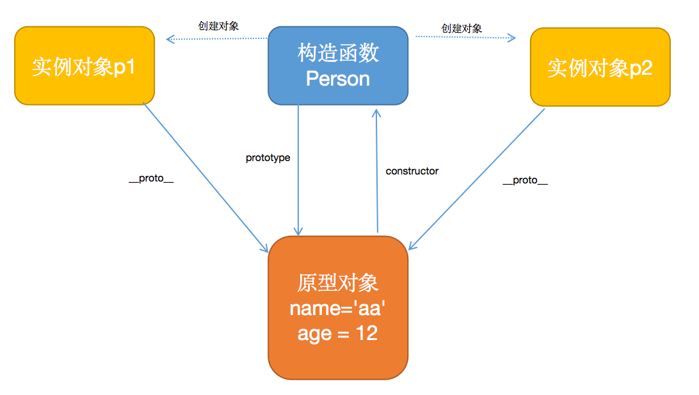
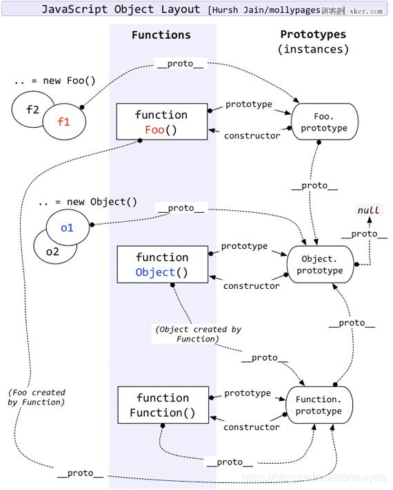
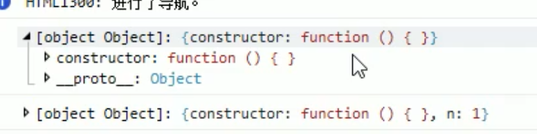
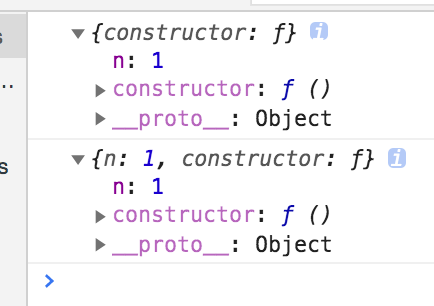

# 原型对象与原型链

## 函数对象

> JS中函数是对象，因此JS的函数既可以当函数用，也可以当普通的对象使用，称之为函数对象。
>
> 1. 当函数用，执行函数体中的代码。
> 2. 当对象用，操作其中的属性，例如prototype。


## JS原型对象

> ​		JS中的函数是Function类型的实例对象，在创建函数对象时，会创建一个Object类型的实例对象，并将该实例对象作为函数对象的prototype属性，这个Object类型的实例对象就是原型对象。

### 原型对象的作用

> ​		在基础篇的对象文章中，在构造函数中定义属性和方法，生成的每个实例对象都会有自己独立的属性和方法，相互不会共享，每个实例对象都需要开辟格外的内存空间保存共享的属性和方法，造成堆内存的浪费和代码复用性差。
>
> 时
>
> ​		为了解决提供实例对象中共享属性和方法的复用性，JS提供了原型对象来保存，每个实例对象都会有一个属性来指向原型对象。

### 原型对象介绍

> 1. 它是函数创建时的衍生品，每个函数都会有自己独立的原型对象。
> 2. 原型对象是一个Object类型的实例对象。
> 3. 构造函数的prototype属性和构造函数创建的实例对象中的\__proto__属性都指向该原型对象。
>
> 显示原型对象和隐式原型对象：
>
> 1. 显示原型对象：构造函数中的prototype属性指向的对象。
> 2. 隐式原型对象：实例对象的\__protp__属性指向的对象。
>
> 在之前的JS版本中，\__proto__属性是不可使用的，因此不能通过实例对象直接访问原型对象，所以将实例对象指向的原型对象为隐式原型对象，其实本质都是同一个对象。

#### 原型对象、实例对象和构造函数关系

> 1. 构造函数使用prototype引用原型对象。
> 2. 原型对象使用constructor属性指向构造函数。
> 3. 实例对象使用\__proto__属性指向原型对象。
>
> 下图中展现了三者的关系。

```javascript
function Person(){
}
var p1 = new Person();
// 给显示原型对象，添加属性
Person.prototype.name = 'aa';
// 给隐式原型对象，添加属性
p1.__proto__.age = 12;
// 两种方式都是给实例对象添加共享属性。
console.log(p1.name, p1.age); // aa, 12
var p2 = new Person();
console.log(p2.name, p2.age); // aa, 12
```



## 原型链

> 原型链就是实例对象在调用属性和方法时，寻找的路径。由各个实例对象的\__proto__属性组成的一个链表结构，JS引擎会按照这个链表结构来搜索需要调用的属性和方法。

### 实例对象调用属性和方法的过程

> 1. 在实例对象的内存空间寻找目标属性和方法，找到则调用，找不到进入下一步。
> 2. 根据\__proto__属性找到原型对象，在原型对象的内存空间寻找目标属性和方法，找到则调用，找不到进入下一步。
> 3. 根据原型对象的\__proto__属性找到原型对象的原型对象，在原型对象的内存空间寻找目标属性和方法，找到则调用，找不到进入下一步。
> 4. 当找到Object函数的显示原型对象时，如果找到调用，找不到进入下一步。
> 5. 由于Object的显示原型对象的原型对象为null，因此访问属性的结果为undefined。
>
> 总结成一句话：实例对象在调用属性和方法时，找不到相应属性和方法时，调用语句返回值为undefined。

```javascript
function Person(){
}
var p1 = new Person();
// 给显示原型对象，添加属性
Person.prototype.name = 'aa';
// 由于没有找到age属性，因此p1.age语句返回值为undefined
console.log(p1.name, p1.age); // aa, 12
p1.getName() // 报 getName is not function 的错误，因为p.getName结果为undefined，undefined以函数方式调用当然报错了。

```


### 原型链的结构图

> ​         之前说过原型对象是普通的Object对象，因为创建构造函数的同时，会创建一个Object实例对象作为构造函数的原型对象，因此所有的原型对象最终的原型对象都会指向Object构造函数的原型对象。
>
> 
>
> 分析：
>
> 1. Foo、Object、Function由于都是函数对象，因此都是Function构造函数的实例对象，因此它们的原型对象为Function构造函数的显示原型对象，由于Function的原型对象都是通过Object构造函数创建的，因此Foo、Object和Function这几个函数对象的原型链为：`Function的显示原型对象 `--> `Object的显示原型对象` --> `null`
> 2. f1和f2是实例对象，因此它们的原型链为：`Foo的显示原型对象` --> `Object的显示原型对象` --> `null`
>
> 下图有两种原型链：一种是函数对象的原型链，一种是实例对象的原型链

```javascript
function Foo(){ }
var f1 = new Foo();
var f2 = new Foo();
var o1 = new Object();
var o2 = new Object();
```




> 上图的问题：
>
> 1. Function函数对象的显示原型对象和隐式原型对象是同一个(一般函数的显示原型对象和隐式原型对象是不同的)，因此造成了
>
>    var Function = new Function()，自己创建自己的情况。
>
> 2. Object函数是有Function函数创建的，而Function函数的显示原型对象的\__proto__属性又指向了Object函数的显示原型对象。
>
> 上面的两个问题属于鸡生蛋蛋生鸡的问题，相互是由对方生成。实际上都是由JS引擎直接创建，并建立关联。

## instanceof原理

> instanceof操作符是用来判断某个实例对象是否是某个类型的实例对象，它所判断的依据就是该类型的原型对象是否在该实例对象的原型链中。

```javascript
// Foo.__proto__ --> Function.prototype --> Object.prototype
function Foo(){}
// f1.__proto__ --> Foo.prototype --> Object.prototype
var f1 = new Foo();
console.log(f1 instanceof Foo);  // true
console.log(f1 instanceof Object);  // true
console.log(Foo instanceof Function); // true

// Object.__proto__ --> Function.prototype --> Object.prototype
console.log(Object instanceof Object); // true
console.log(Object instanceof Function); // true
// Function.__proto__ --> Function.prototype --> Object.prototype
console.log(Function instanceof Object); // true
console.log(Function instanceof Function); // true
```


## 浏览器差异

> 有时会看到先后两句代码执行时，内存中对象属性一致，例如下面代码中，A函数原型对象中的n属性是后加的，但是打印原型对象内存时，却有属性n。
>
> 
>
> Chrome:第一句打印原型对象的结果就像给变量赋值一样，在给原型对象设置属性后，会改变，chrome会实时修改对象的变化。
>
> IE：与Chrome相反，打印出来的东西就像给常量赋值一样会写死不会改变，修改原型对象，不会影响打印的结果。

```javascript
var A = function(){ }
console.log(a.prototype);
A.prototype.n = 1;
console.log(a.prototype);
```

IE浏览器中上面代码打印结果：



chrome浏览器中上面代码打印结果：



