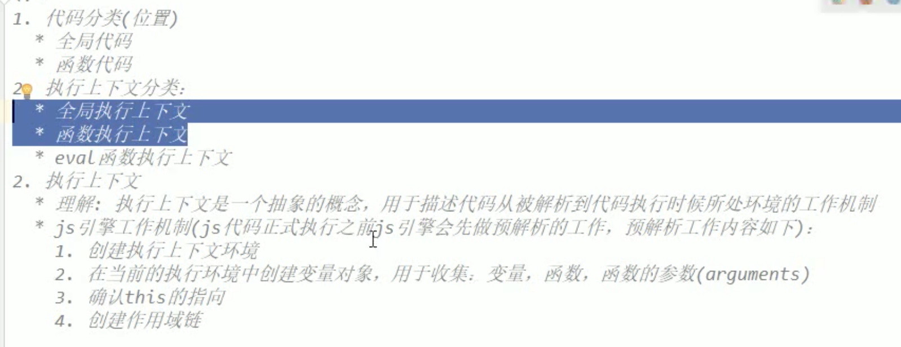

# 预解析

> JS引擎在执行代码之前会进行一些准备操作，配置代码的运行环境。
>
> 
>
> 预解析流程：
>
> 1. 建立当前代码的执行环境，如果当前代码没有在函数中，则建立全局作用域，反之建立局部作用域，反映在栈内存空间就是建立变量对象并将其压入栈。
> 2. 搜素作用域中的代码，将以`var声明的变量`、`函数声明方式声明的函数`、`函数参数`和`this`添加到变量对象中。
> 3. 确定this指向。
> 4. 创建作用域链( 这里在作用域链中讲解 )。

## 变量提升和函数提升

> 所谓的变量和函数的提升就是指的预解析流程中的第2部，将特定方式创建的变量和函数添加到最近作用域的变量对象中。
>
> 
>
> 提升条件：
>
> 1. 使用var关键字声明的变量
> 2. 使用函数声明方式创建的函数
> 3. 如果是在函数体中，函数参数也会提升。
>
> 变量、函数和函数参数的提升区别：
>
> 1. 变量提升，在变量对象中开辟内存空间，不初始化。
> 2. 函数提升，在变量对象中开辟内存空间，对内存空间初始化，赋值为函数地址。
> 3. 函数参数提升，在变量对象中开辟内存空间，对内存空间初始化，赋值为实参的值。
>
> 总结一句话：预编译阶段代码没有运行，只是对代码运行时所需变量开辟内存空间，创建函数和函数参数比创建变量多一步就是变量的初始化。


### 预编译中出现同名函数变量和变量

> 变量之间同名：后面的同名变量将忽略，因为预编译只是提前开启内存空间，既然已经为变量开辟了内存空间，就不需要再开辟一次。
>
> 
>
> 函数变量与变量同名：已经为变量开辟内存空间，后面遇到同名的变量声明或者函数声明时，如果是变量则忽略，如果是函数则给变量设置新值(新函数地址)。

```javascript
console.log('--------------------------------------------------------')
/*
*
*/
function a(){  } 
var a; 

// 预解析结果：
var a = function(){};
// 全局变量对象中已经有a了，不需要在定义了，忽略

console.log('--------------------------------------------------------')
var b = 2;  
function b(){} 

// 预解析结果：
var b = undefined;  // 变量对象中给变量b开辟内存空间。
b = function(){ }  // 变量b已经开辟内存空间，因此进行初始化操作。
b = 2  // 预编译结束，代码开始运行。

console.log('-----------------------函数表达式---------------------------------')
var b = 2;  
var b = function(){} 

// 预解析结果：
var b = undefined;
b = 2；
b = function(){ }
```

### 预编译分析

>下面代码中，一共进行了三次预编译：
>
>1. 全局预编译阶段
>2. bar函数执行时的预编译阶段
>3. foo函数执行时的预编译阶段

```javascript
var a = 10;
var bar = function(x){
  var b = 5;
  foo(x + b);
}
var foo = function(y){
  var c = 5
  console.log(a + c + y);
}

bar(10);
```

####  全局预编译阶段

> 1. 创建全局作用域的变量对象。
> 2. 在变量对象中为变量a、变量bar、变量foo和 this开辟内存空间，对bar、foo和this初始化，前两者指向相应的函数对象，this指向全局作用域的变量对象(window)。

#### bar函数执行的预编译阶段

> 1. 创建局部作用域的变量对象。
> 2. 在变量对象中为变量x、变量b和 this开辟内存空间，并初始化this变量，指向局部作用域的变量对象。
> 3. 创建作用域链：bar作用域 --> 全局作用域

#### foo函数执行的预编译阶段

> 1. 创建局部作用域的变量对象。
> 2. 在变量对象中为变量c、变量y和 this开辟内存空间，并初始化this变量，指向局部作用域的变量对象。
> 3. 创建作用域链：foo作用域 --> 全局作用域

## 全局预解析和局部预解析区别

> 全局预解析：程序运行之前，对全局执行上下文中，定义的变量和函数进行内存分配，并保存到全局变量对象中。
>
> 局部预解析：函数调用之前，对函数内部的执行上下文中，定义的局部变量和局部函数进行内存分配，并保存到局部变量对象中。
>
> 
>
> 区别：
>
> 1. 在解析位置不一样，解析次数不一样，在程序运行整个生命周期中，全局预解析只执行一次，局部预解析发生在每次函数调用时。
> 2. 部分浏览器会对局部预解析进行优化，对于定义在局部作用域的函数没有使用(`调用或者作为返回值返回`)就不会为其分配内存空间，浏览器会将其看成注释，而定义在全局作用域的函数，不管是否调用过都会为其分配内存空间并保存在全局变量对象中。

```javascript
// 查看全局执行上下文和atest1函数的局部执行上下文，看看对应的变量对象中是否定义了aTest2和test函数。
function atest1(){
   function test(){
     
   }
}

atest1();
function aTest2(){
  
}

// 比较上下两份代码，看看atest1函数在预解析时，局部变量对象中是否有test函数。
function atest1(){
   function test(){
     
   }
  
  return test;
}

atest1();
function aTest2(){
  
}
```


## 预编译总结

> 1. 预编译是在代码执行前所做的准备工作，创建执行环境，相应的变量的内存空间。
> 2. 程序启动和每次的函数调用都会发生预编译，也就是说`每次进栈操作都会伴随着预编译`。
>    1. 程序启动时，创建全局作用域，并为全局作用域中声明的变量开辟内存空间。
>    2. 每次函数调用时，创建局部作用域，并为局部作用域中声明的变量开辟内存空间。
> 3. 对作用域中使用var、函数声明方式和函数参数方式创建的变量进行提升，只有函数参数和函数声明方式会初始化内存空间。

## 测试题


### 测试题1

> 这一题要注意在局部作用域中函数参数也是函数内部定义的变量，因此参与局部预编译，和使用var创建的变量不同，会进行初始化操作。

```javascript
function foo(a){
   console.log(a, bbc);
   var a = 12;
   function bbc(){   }
}

foo(1); // 1，f bbs(){  }

// 预编译后的代码
 //全局作用域
 var foo = function(a){ ... }
 foo(1);
                       
 // foo函数作用域
 var a = 1;
 var bbc = function(){  };
 console.log(a, bbc);
 a = 12;
```

### 测试题2

> 这一题主要的迷惑点是if语句中定义的变量b，JS中没有块作用域，因此变量b是定义在全局变量中，因此进行变量提升将其添加到全局作用域的变量对象中。

```javascript
console.log(b);  // undefined
if(!(b in window)){
	var b = 12;
}
console.log(b); // undefined

// 预编译后的代码
var b;
console.log(b);  // undefined
if(!(b in window)){
b = 12;
}
console.log(b); // undefined
```

### 测试题3

> 这道题考验的是变量和函数同名时，预编译结果，上面提到了预编译就是为将要运行的代码所需的变量开辟内存空间，因此当已经开辟了同名内存空间时，会直接忽略，如果是函数则初始化内存空间函数。

```javascript
var c = 12;
function c(c){
	console.log(c);
	var c = 1;
}
console.log(c); // 12

// 预编译后的代码：
var c = function(c){
  console.log(c);
	var c = 1;
}
c = 12;
console.log(c); // 12
```

### 测试题4

> 执行几次预编译操作？ --- 5次，全局作用域一次，递归函数4次

```javascript
console.log(i);
var i = 1;
foo(1);
function foo(i){
  if(i == 4){
    return ;
  }
  console.log(i);
  foo(i+1);
  console.log(i);
}
console.log(i)

//打印结果：
undefined
1
2
3
3
2
1
1
```





