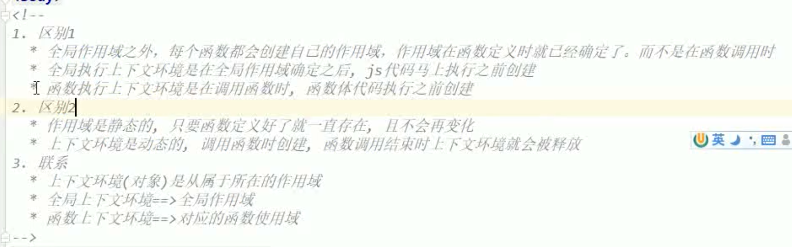

# 作用域链

> JS有两种链条：
>
> 1. 原型链，提高对象的代码复用，对象调用属性和方法时，查找路径。
> 2. 作用域链，指定函数、变量的使用区域，函数中访问的变量时，查找的路径。
>
> ES5作用域类型：
>
> 1. 函数作用域，在函数体内的编写的代码都是属于函数作用域。
> 2. 全局作用域，未被任何函数包裹的代码都是属于全局作用域。
> 3. 伪块级作用域，块级作用域是ES6新添加的功能，因此在ES6之前需要使用其它技术模拟块作用域。

## 作用域、执行上下文和变量对象关系

> 作用域：
>
> ​		这个概念的提出是为了程序员交流，一般阅读代码时，将函数体成为函数作用域，没有被任何大括号包裹的全局作用域。
>
> 
>
> 执行上下文：
>
> ​		是程序运行或者函数调用时，JS引擎会开辟一块栈内存空间，例如全局执行上下文是当程序运行时系统为其在栈内存中开辟的内存空间，用来保存执行过程中需要创建的变量、函数；局部执行上下文是函数调用时，系统为函数开辟的栈内存空间，保存函数执行时创建和调用的变量和函数。
>
> 
>
> 变量对象：
>
> ​		 与执行上下文对应关系，在开辟的栈内存空间中创建的对象，程序运行时创建的变量和函数其实是保存在当前执行上下文的变量对象中，因此在执行上下文创建的变量和函数都是变量对象的属性。
>
>  
>
> 作用域、执行上下文和变量对象的区别(`在于生命周期的不同`)：
>
> ​	作用域是用来进行开发人员交流的，代码编写完成后，就会一直存在，与代码一样的生命周期，代码没删作用域就不会消失。
>
> ​	执行上下文和变量对象是程序运行的产物，有自己的生命周期，全局上下文和全局变量对象的生命周期为程序运行的生命周期，而`局部上下文和局部变量对象的生命周期是每当函数调用时创建，函数返回时销毁`。
>
> 
>
> 下面的例子来看看各个执行环境的变量对象

```javascript
/**
 * 代码分析：
 * 下面代码存在3个作用域：全局作用域和2个局部作用域。
 * 下面代码存在4个执行上下文：全局执行上下文和fn1函数的执行上下文。上面说过了执行上下文的生命周期是以函数调用开始以函数返回结束。
 * 下面代码存在4个变量对象：变量对象是伴随着执行上下文的产生而产生，伴随着执行上下文的销毁而销毁。
 * 代码中全局变量对象为：window，保存着变量a、函数fn1和函数fn2。
 * 代码中的局部变量对象为：fn1函数的变量对象，保存变量a1、this
 * 
*/
var a = 'aaa';
var fn1 = function(){
   var a1 = 'aaa1';
};
function fn2(){
  var a2 = 'aaa2';
}
// 调用了fn1函数，创建fn1函数执行上下文。
fn1();
fn1();
fn1();
```

### 全局执行上下文

> 全局执行上下文：
>
> ​		 生命周期以程序运行时开始，程序销毁时结束，所有未被任何代码块包含的创建变量和函数的代码运行后，会被添加到全局执行上下文变量对象window中，它们都作为全局变量对象的属性存在。(window是浏览器创建的一个显示的可以访问的全局变量对象，不使用浏览器运行时无法访问这个全局变量对象)。
>
> 
>
> 全局执行上下文(window)保存数据：
>
> 1. 函数，在堆内存中开辟内存空间保存函数对象，在全局变量对象中开辟内存空间保存函数地址。
> 2. var定义的变量，在全局变量对象中开辟内存空间保存变量值。
> 3. 对象，在堆内存中开辟内存空间保存普通对象，在全局变量对象中开辟内存空间保存对象地址。
> 4. 系统内置的函数。

### 函数执行上下文

> 函数执行上下文：
>
> ​		生命周期以函数每次调用开始，函数返回结束，函数内部创建变量和函数的代码运行后，会被添加到当前函数执行上下文的变量对象中，它们都是该变量对象的属性，该变量对象无法访问。
>
> 
>
> 函数执行上下文保存数据：
>
> 1. 函数，在堆内存中开辟内存空间保存函数对象，在函数变量对象中开辟内存空间保存函数地址。
> 2. var定义的变量，在函数变量对象中开辟内存空间保存变量值。
> 3. 函数参数，在函数变量对象中开辟内存空间保存变量值。
> 4. 对象，在堆内存中开辟内存空间保存普通对象，在函数变量对象中开辟内存空间保存对象地址。
> 5. this，保存函数调用者信息。

```javascript
/**
 * 代码分析：
 * fn2变量对象中的值：
 * 1. 函数参数num1
 * 2. 函数参数num2
 * 3. 变量a1
 * 4. 对象obj1
 * 5. fn3函数
*/
function fn1(){
    function fn2(num1, num2){
        var a1 = 'aa'
        function fn3(){  }
        var obj1 = new Object();
    }
    fn2();
}
```


### 伪块级执行上下文

> JS没有块级作用域，因此也就没有块级执行上下文。一般利用匿名函数来实现块级执行上下文功能，和函数执行上下文一样。

```javascript
// 使用匿名函数自调用实现了块级作用域
function fn1(){
    (function(){
        var a1 = 'aa'
        function fn3(){  }
        var obj1 = new Object();
    })();
}
```

## 作用域链介绍

> 作用域链作用：实现函数内部可以访问外部的变量。
>
> 作用域链结构：是一个数组结构，数组元素为各个执行上下文的变量对象，数组尾部保存的一定是全局变量对象。
>
> 作用域链的创建：
>
> 1. 全局作用域链：只有一个元素的数组，元素为全局变量对象。
> 2. 局部作用域链：当前执行函数创建的变量对象以及包含它的函数的变量对象所组成的数组。

### 作用域链位置

> 全局作用域链：		
>
> ​		程序启动时，浏览器就会在栈内存中创建一个全局变量对象。
>
> 
>
> 局部作用域链：
>
> ​		每个函数对象内部有一个不可访问的属性` [[scopes]]`，这是一个数组属性保存了当前函数的作用域链，函数执行过程中，每访问一个变量时，都会去函数的这个属性中查找是否有该名称的变量，如果找不到则直接报错。

```javascript
/**
 * fn3作用域链：fn3的[[scopes]]属性，[fn3变量对象，window]
 * fn2作用域链：fn2的[[scopes]]属性，[fn2变量对象，fn1变量对象，window]
 * fn1作用域链：fn1的[[scopes]]属性，[fn1变量对象，window]
*/
var a = 1;
function fn1(){
    function fn2(){
        console.log(a); // 1
    }
}

function fn3(){
    var a = 2;
    fn1();
}
// 调用fn3
fn3();
```


### 变量和函数作用域的所属

> ​		JS中根据变量和函数定义的位置来决定它们所在的执行上下文，而不是使用的时候。尤其是函数的作用域链，下面的例子来说明：

```javascript
/**
 * fn1打印结果是1，为何？
 * 查看fn1函数的作用域链，fn1是在全局作用域中定义，在fn2函数作用域中调用，我们说过确定作用域看在哪里定义而不是使用，
 * 因此fn1的作用域链为：[window]
*/
var a = 1;
function fn1(){
    console.log(a); // 1
}
function fn2(){
    var a = 2;
    fn1();
}
fn2();
```

### 作用域链创建流程

> 作用域链的创建: 创建函数时，会初始化函数对象中的[\[scopes]]属性，保存当前函数所在函数或者全局作用域的作用域链。
>
> 
>
> 下面代码中的所有函数的作用域：
>
> `fun3作用域链`：fun3函数对象创建时建立，[window]
>
> `Fun4作用域链`：fun4函数对象创建时建立，[window]
>
> `fun5作用域链`：fun5函数对象创建时建立，[fun4，window]，这是闭包特性，函数内部使用外层函数变量时，该函数会作用域链会保存外层函数的变量对象。
>
> `fun6作用域链`：fun6函数对象创建时建立，[fun4，window]，这是闭包特性，函数内部使用外层函数变量时，该函数会作用域链会保存外层函数的变量对象。

```javascript
function fun3(){
  var c = 13;
  function fun4(){
  	var b = 12;
	  function fun5(){
  		var d = 14
  		function fun6(){
    		console.log(b);
  		}
    	return fun6;
      }
      var f = fun5();
      f();
	}
  fun4();
}
fun3();
```

> 浏览器对闭包的作用域链优化：
>
> 1. 如果闭包只使用了外层函数变量对象的部分变量，则当外层函数执行完毕时，没有被使用的变量会被销毁，例如fun1中定义的变量c。
> 2. 如果闭包没有使用外层函数定义的变量时，闭包的作用域链不会保存该外层函数的变量对象，例如fun6函数只使用了fun4函数中的变量b，因此fun6定义时的作用域链为[fun4， window]。


## 词法作用域(静态作用域)和动态作用域

> 作用域分为两种类型：
>
> 1. 词法作用域(静态作用域)，作用域在代码编写时确定，大部分语言都是词法作用域，java、C++、C等语言。
> 2. 动态作用域，作用域在代码运行时才能确定，bash

## 测试题


### 测试题1-预解析过程

> 分析程序运行各个作用域链的生命周期和变化。
>
> 全局预解析过程：
>
> 1. 创建全局执行上下文和全局变量对象。
> 2. 为使用var定义的变量和函数声明方式开辟内存空间，并保存在全局变量对象中。
> 3. 创建函数对象，让window中对应的函数变量指向函数对象，在函数对象的构造函数中初始化作用域链，将window对象添加到scope数组中。
>
> 局部预解析过程：
>
> 1. 创建当前函数执行上下文和变量对象。
> 2. 将当前变量对象插入到函数的作用域数组头部。
> 3. 为使用var定义的变量和函数声明方式开辟内存空间，并保存在当前函数变量对象中。
> 4. 创建内部函数对象，让变量对象中对应的函数变量指向内部函数对象，在内部函数对象的构造函数中初始化作用域链，对当前函数的作用域链进行拷贝，保存到内部函数的scope属性中。

```javascript
// 创建全局作用域：进行全局预解析--> 创建全局执行上下文--> 创建全局变量对象 --> 将全局作用域中定义的变量和函数添加到全局变量对象中。
var a = '123';
var b = 'abc';

// 创建fn1的作用域链,[window]，这个过程在全局预解析中完成。
function fn1(){
 //创建fn1作用域：进行fn1局部预解析--> 创建fn1执行上下文 --> 创建fn1变量对象 --> 将fn1中定义的变量和函数添加到fn1的变量对象中。
 // [fn1, window]
	var a = '456';
	var c = 'def';
	console.log(a,b);
	
  // 创建fn2的作用域链,[fn1, window]，这个过程在全局预解析中完成。
	function fn2(){
  //创建fn2作用域：进行fn2局部预解析--> 创建fn1执行上下文 --> 创建fn1变量对象 --> 将fn1中定义的变量和函数添加到fn1的变量对象中。
  // [fn2, fn1, window]
		console.log(c,d);
  // 删除fn2作用域链中的fn2变量对象，[fn1, window]
	}
	fn2();
  // 删除fn1作用域链中的fn1变量对象，[window]
}

fn1();
```

### 测试题2

```javascript
// 考察函数作用域创建流程
var x = 10;
function fun1(){
	console.log(x); // 10
}

function show(){
	var x = 20;
	fun1();
}

show();
```

### 测试题3

```javascript
// 考察预编译
console.log(fn); // undefined
var fn = function(){
  console.log(fn); // 打印函数体
}
fn();
```

### 测试题4

```javascript
/** 考察函数作用域创建流程，JS没有块作用域，因此fun2是在全局作用域中创建，fun2调用时的作用域为[fun2, window],
 *	fun2是obj2的属性，而obj2是window对象的属性，因此fun2函数只能访问到obj2，而不能直接访问fun2属性。
*/

var obj2 = {
	fun2: function(){
			console.log(fun2); // 报错，fun2 is not define
	}
}

obj2.fun2();
```


