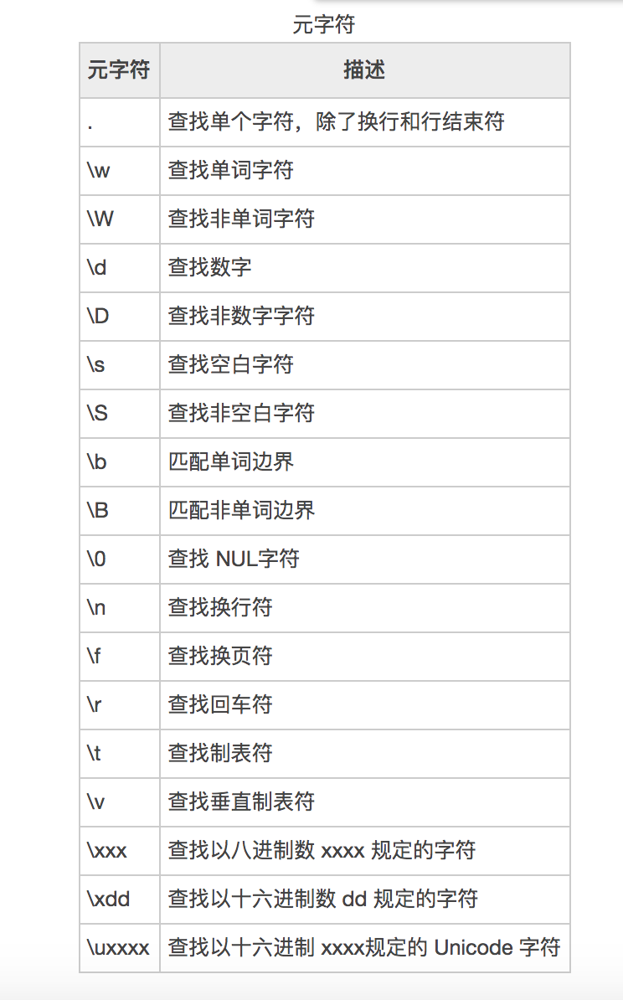

# 正则表达式基础

> javascript中有两种写法：
>
> 1. `/正则表达式/模式`，例如`let reg = /[a-z0-9]+/gi`
> 2. 正则对象，RegExp对象，例如`let reg = new RegExp('[a-z0-9]+', 'gi')`
>
> 推荐使用第一种方式，它是第二种方式简写，就像基本包装类型。

## 元字符

>1. `.`：匹配任何字符除了换行符和行结束符。
>2. `\s`：匹配所有的出现的空格，回车符、制表符、换行符




```javascript
// .无法匹配换行符和行结束符
let source = 'aaaaaa\nbbbb';
let reg = /.+/i;
console.log(source.match(reg)) // aaaaaa
```


## 原子表

> 原子表：用来限定正则表达式的某个位置字符只能匹配哪些字符，`只是一个字符的可选范围`。
>
> 格式：`[字符|元字符]`。
>
> 例子：
>
> 1. `[abcdef_,.]`：表示正则表达式中该位置的字符必须是中括号列出来的字符。
> 2. `[a-z0-9]`：简写形式，匹配`26个英文字母`和`数字0～9`
> 3. `[\s\S]`：匹配所有字符，\s表示空格，\S表示非空的字符，合起来代表所有字符。

```javascript
// 设置的正则表达式需要匹配3个字符，第一个字符可以是1、2、3，第二个字符可以是a，b，c，第三个字符可以是b，c，d
let source = '0123abc';
let reg = /[123][abc][bcd]/;
console.log(source.match(reg)) // [ '3ab', index: 3, input: '0123abc', groups: undefined ]
 
// 没有匹配到，原字符串中符合正则表达式中的第三个字符是d、e、f的情况。
reg = /[123][abc][def]/;
console.log(source.match(reg)) // null

// 验证正则表达式中的中括号代表一个字符
reg = /[123]/;
console.log(source.match(reg)) // [ '1', index: 1, input: '0123abc', groups: undefined ]
```


## 字符界限

> 字符边界符：
>
> 1. `^`：字符串的开头与正则表达式开头进行匹配，如果字符串的第一个字符匹配不上时，正则匹配失败。
> 2. `$`：字符串的结尾与正则表达式结尾进行匹配，如果字符串的第一个字符匹配不上时，正则匹配失败。
>
> 格式：`/^正则表达式$/`。
>
> 例子：
>
> 1. `/^131[0-9]{8}/`，字符串的数字必须以131开头，否则匹配不上。
> 2. `/[0-9]{8}414$/`，字符串的结尾必须以414结尾，否则匹配不上。
> 3. `/^131[0-9]{4}5614$/`，字符串必须以131开头，以5614结尾，否则匹配不上。
>
> 
>
> 注意：`字符边界常用做表单验证。`

```javascript
// 字符串不是以131开头，因此匹配失败
let source = 'abc13145465656';
let reg = /^131[0-9]{8}/;
console.log(source.match(reg)) // null

// 字符串以131开头，匹配成功
source = '13110805614';
reg = /^131[0-9]{8}/
console.log(source.match(reg)) // [ '13110805614', index: 0, input: '13110805614', groups: undefined ]

// 字符串以5614结尾，匹配成功
reg = /[0-9]{7}5614$/
console.log(source.match(reg)) // [ '13110805614', index: 0, input: '13110805614', groups: undefined ]

// 字符串以131开头，以5614结尾，匹配成功
reg = /^131[0-9]{4}5614$/
console.log(source.match(reg)) // [ '13110805614', index: 0, input: '13110805614', groups: undefined ]
```


## 模式修饰符

> 模式修饰符：定义了正则表达式的匹配方式。
>
> 正则表达式的常用模式修饰符：
>
> 1. g：全局匹配，从字符串中找到第一个匹配的子串后，继续寻找，直到将整个字符串查找完。
> 2. i：匹配查找时忽略大小写，默认是不忽略。
> 3. y：默认匹配，找到字符串的匹配的一个子串就停止匹配查找。
> 4. s：匹配查找时，将字符串中的换行符都当成普通的空格符，然后进行查找。
> 5. m：将字符串以换行符为界，分割成多个子串，每次匹配只查找当前行。
> 6. u：表示按unicode(utf-8)匹配（主要针对多字节比如汉字）

```javascript
// -y  匹配到第一个子串就停止
let source = 'abcabbcabbbcabbbbcABC';
let reg = /a[b]+c/y;
console.log(source.match(reg)) // [ 'abc', index: 0, input: 'abcabbcabbbcabbbbcABC', groups: undefined ]

// -g 全局匹配，找到所有匹配的子串
reg = /a[b]+c/g;
console.log(source.match(reg)) // [ 'abc', 'abbc', 'abbbc', 'abbbbc' ]

// -i 全局匹配忽略大小写
reg = /a[b]+c/gi;
console.log(source.match(reg)) // [ 'abc', 'abbc', 'abbbc', 'abbbbc', 'ABC' ]

// -s 将换行变成空格，该模式修饰符一般用在.这个匹配字符上，因为.不能匹配换行。
source = 'abbbbbbbb\nc';
reg = /a.+c/;
console.log(source.match(reg)) // null
reg = /a.+c/s;
console.log(source.match(reg)) // [ 'abbbbbbbb\nc', index: 0, input: 'abbbbbbbb\nc', groups: undefined ]

// -m 多行匹配，将换行符作为字符串结束符，将字符串分割成一个个子串，然后匹配每个子串，使用gm模式相当于匹配多个字符串。
source = 'abcabbc\nabbbbc';
reg = /^a.+c$/g;
console.log(source.match(reg)); // null
reg = /^a.+c$/gm;
console.log(source.match(reg)); // [ 'abcabbc', 'abbbbc' ]

// -u u模式用来匹配中文等这种unicode编码
source = 'a中国地大物博c';
reg = /a\p{sc=Han}+c/gu;
console.log(source.match(reg)); // [ 'a中国地大物博c' ]
```


## JS中正则表达式的方法 

>  字符串方法：
>
> 1. search(str|reg)，查询字符串中是否包含子串，接收字符串或者正则表达式，返回子串下标，查询不到返回`-1`。
> 2. match(str|reg)，匹配字符串中符合正则表达式的子串。
> 3. replace(str|reg, '')，将子串替换成指定子串，返回替换后的字符串，接收字符串或者正则表达式。
> 4. split(str|reg)，将字符串拆分成数组，支持正则表达式
> 5. matchAll(str|reg)，相当于正则对象中的exec函数，用来解决全局匹配时丢失匹配到的子串的详细信息(子串的位置，原子组内容等)。

```javascript
// 查询字符串中以d开头中间为n个b以c结尾的子串的位置
let source = 'abcabbcabbbcabbbbcABC';
let reg = /a[b]+c/y;
console.log(source.search(reg)) // 0

// 查询字符串中以d开头中间为n个b以c结尾的子串的位置
reg = /d[b]+c/y;
console.log(source.search(reg)) // -1

// 找出字符串中所有以a开头以c结尾的子串
source = 'abcaddcaeeecafcarrrrc';
reg = /a.+?c/g;
console.log(source.match(reg)) // [ 'abc', 'addc', 'aeeec', 'afc', 'arrrrc' ]

```


### replace函数使用正则表达式

```javascript
// 将url替换成https协议，如果没有www，添加www。
source = 'http://baidu.sina.com.cn';
// 使用原子组将正则表达式分组
reg = /^(http)([s]?:\/\/)(www\.)?(\w+\.)(\w+\.)*(com|cn|org|net)$/;

// 替换正则表达式匹配的字符串
let newSource = source.replace(reg, (v, ...args0)=>{
    // args0接收所有原子组中匹配的子串，v表示匹配到的子串
    console.log(v, args0);
    // 修改第0个原子组，将其改为https
    args0[0] = 'https';
    // 添加www
    args0[2] = args0[2] || 'www.';
    // 将修改后的原子组截取并拼接起来
    return args0.splice(0,6).join('');
});
console.log(newSource); // https://www.baidu.com.cn

/* args0参数的数据结构
[
  'http',
  '://',
  undefined,
  'baidu.',
  'com.',
  'cn',
  0,
  'http://baidu.sina.com.cn'
]
*/
```

### split函数

>  将字符串分割成数组，使用正则表达式适配更多的分割方式，下面代码中充分展示了使用正则表达式优势，可以适配多种类型分隔符，下面有三种格式时间，一个正则直接搞定。

```javascript
let source = '2020-01-02';
let arrs = source.split(/[-/_]/);
console.log(arrs);

source = '2020/01/02';
console.log(source.split(/[-/_]/));

source = '2020_01_02';
console.log(source.split(/[-/_]/));
```


### match函数

> 不同的正则表达式模式修饰符，match函数返回的值不同，
>
> 1. 非模式修饰符g时，返回的是一个针对匹配到的子串在字符串中的详细信息的数组对象。
> 2. 模式修饰符g时，返回的是一个所有子串的数组对象。

```javascript
/*
    返回的是匹配到的第一个子串在字符串中的详细信息。
    [   'a',            // 匹配出来的子串
        index: 0,       // 子串在字符串中的下标位置
        input: 'aaab',  // 字符串内容
        groups: undefined  // 分组的别名
    ]
*/
let source = 'aaab';
let reg = /a/;
console.log(source.match(reg)); 

// 返回的是匹配到的每个子串
source = 'aaab';
reg = /a/g;
console.log(source.match(reg));  // [ 'a', 'a', 'a' ]
```


### matchAll函数

> 为了解决match函数在全局匹配时就是匹配到的子串的详细信息，而产生了该函数。`该函数只能在高版本浏览器中使用`

```

```


自己实现matchAll函数

```javascript
let source = 'aaabaaabaaa';
let reg = /[a]+/i;

// 递归实现全局匹配
String.prototype.matchAll = function(reg, source){
    // 获取匹配的子串
    let res = this.match(reg);
    // 如果子串的数组存在
    if(res){
        // 保存原始的字符串
        res['input'] = source || this.valueOf();
        // 原始字符串替换掉已经匹配到的子串
        let str = this.replace(res[0], '^'.repeat(res[0].length));
        // 递归调用
        let arrs = str.matchAll(reg, res['input']);
        // 返回匹配到详细信息，将其包装成数组返回
        return [res,...arrs];
    }else{
        // 当子串不存在时，即匹配完成，返回空数组。
        return [];
    }
}
console.log(source.matchAll(reg));
```


### exec函数

> exec函数不管在g模式下还是在非g模式下，返回的都是一个匹配到的子串在字符串中的详细信息。
>
> exec在不同模式下的区别：
>
> 1. 非g模式下，多次调用exec函数，返回的都是匹配到的第一个子串在字符串中的详细信息。
> 2. g模式下，多次调用exec函数，返回的是所有匹配到的子串在字符串中的详细信息。
>
>  
>
> 正则表达式对象中有一个lastIndex属性，通过该属性实现全局匹配模式，指定下一次从字符串哪个位置执行正则匹配。

```javascript
// 返回的都是匹配到的第一个子串在字符串中的详细信息。
let source = 'aab';
let reg = /a/;
console.log(reg.exec(source)); // [ 'a', index: 0, input: 'aaab', groups: undefined ]
console.log(reg.exec(source)); // [ 'a', index: 0, input: 'aaab', groups: undefined ]
console.log(reg.exec(source)); // [ 'a', index: 0, input: 'aaab', groups: undefined ]


// 返回的是所有匹配到的子串在字符串中的详细信息。
source = 'aab';
reg = /a/g;
// 从字符串第0个位置开始匹配
console.log(reg.lastIndex, reg.exec(source));  // 0 [ 'a', index: 0, input: 'aab', groups: undefined ] 
// 从字符串第1个位置开始匹配
console.log(reg.lastIndex, reg.exec(source));  // 1 [ 'a', index: 1, input: 'aab', groups: undefined ] 
// 从字符串第2个位置开始匹配
console.log(reg.lastIndex, reg.exec(source));  // 2 null 
// 从字符串第0个位置开始匹配
console.log(reg.lastIndex, reg.exec(source));  // 0 [ 'a', index: 0, input: 'aab', groups: undefined ] 
// 从字符串第1个位置开始匹配
console.log(reg.lastIndex, reg.exec(source));  // 1 [ 'a', index: 1, input: 'aab', groups: undefined ] 
// 从字符串第2个位置开始匹配
console.log(reg.lastIndex, reg.exec(source));  // 2 null 

 
// 使用while循环来获取所有匹配到的子串，匹配不到时exec函数返回null。
let res;
let arrs = [];
while(res = reg.exec(source)){
    arrs.push({content: res[0], index: res[1]});
}
console.log(arrs);
/* 
[
  { content: 'a', index: undefined },
  { content: 'a', index: undefined }
]
*/
```

