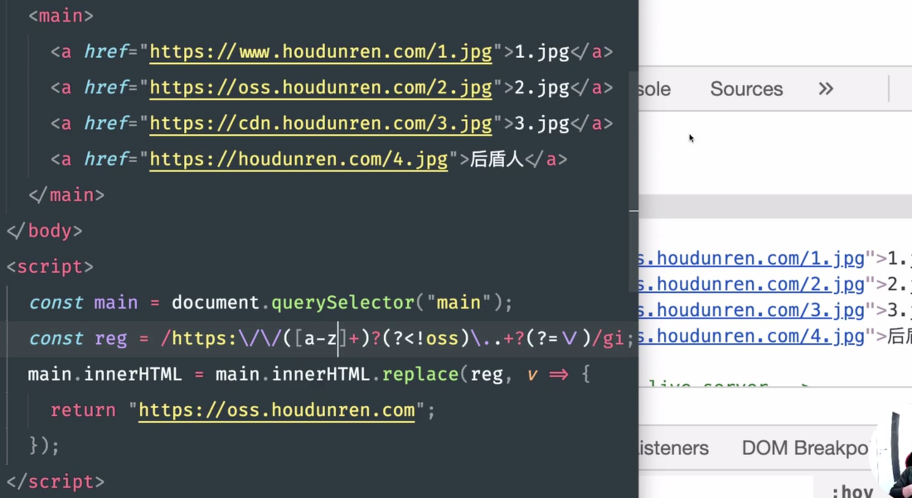

# 正则表达式实战

## 验证密码

> 规则：
>
> 1. 密码必须输入5～15位。
> 2. 密码由大小写英文字母、数字和特殊字符组成(,._?@#$%^&*!()[]{}-+)组成
>
> 注意点：
>
> 1. 在中括号中的`.`、`[`、`]`、`+`、`-`都需要转义。

```html
<!DOCTYPE html>
<html>
    <head></head>
    <body>
        <input type="text">
        <script>
            let inp = document.querySelector('input[type="text"]');
            inp.addEventListener('keyup', e=>{
                let value = e.target.value;
                console.log(value);

              /* 使用正则数组 + every函数实现让字符串验证多个正则表达式 
              */
                let reg = [
                    /[\S]{5,15}/,
                    /[A-Z]+/,
                    /[0-9]+/,
                    /[,\._?@#$%^&*!()\[\]{}\-\+]+/
                  // 也可以使用 /[,\._?@#$%^&*!()\[\]{}\-\x2b]+/，使用16进制表示+等特殊字符。
                ];
                let result = reg.every(temp=>{
                    return temp.test(value);
                });
                console.log('aaa', result);
                console.log(reg[0].test(value))
                console.log(reg[1].test(value))
                console.log(reg[2].test(value))
                console.log(reg[3].test(value))
            });
        </script>
    </body>
</html>
```


## 将html中的span标签替换成h4标签

```html
<!DOCTYPE html>
<html>
    <head></head>
    <body>
        <span>hello world</span>
        <span>I'm super man</span>
        <p>哈哈笑</p>
        <span>这是一个美丽的地方</span>
        <script>
          	// 在*后面添加？，禁止贪婪 
            let reg = /<(span)>(.*?)<\/(\1)>/gi;
            // 将网页中所有span替换成h4
            document.body.innerHTML = document.body.innerHTML.replace(reg, (v, p1, p2)=>{
                return  `<h4 style='color:red'>${p2}</h4>`;
            });
        </script>
    </body>
</html>
```


## 给网页中的某些文本添加超链接

```html
<!DOCTYPE html>
<html>
    <head></head>
    <body>
        <span>床前明月光，疑是地上霜。举头望明月，低头思故乡。</span>
        <script>
            let reg = /明月/gi;
            // 将网页中的明月都添加上超链接
            document.body.innerHTML = document.body.innerHTML.replace(reg, (v)=>{
                return  `<a href='https://www.baidu.com/s?wd=%E6%98%8E%E6%9C%88'>${v}</a>`;
            });
        </script>
    </body>
</html>

<!-- 简便写法，使用$& -->
<!DOCTYPE html>
<html>
    <head></head>
    <body>
        <span>床前明月光，疑是地上霜。举头望明月，低头思故乡。</span>
        <script>
            let reg = /明月/gi;
            // 将网页中的明月都添加上超链接
            document.body.innerHTML = document.body.innerHTML.replace(reg, `<a href='https://www.baidu.com/s?wd=%E6%98%8E%E6%9C%88'>$&</a>`);
        </script>
    </body>
</html>
```


## 规范网页中的url

> 1. 给所有url添加www
> 2. 将所有网页的http换成https

```html
<!DOCTYPE html>
<html>
    <head></head>
    <body>
        <a href="https://www.baidu.com">百度</a>
        <a href="http://taobao.com">淘宝</a>
        <a href="http://jd.com">京东</a>
        <script>
            let reg = /<a href=["'](http):\/\/(?<!www\.)([\w\d]+)\.([\w\d]+\.)*(com|cn|net|org)/gi;

            // 将url中非https和没有加www的网址全部补全。
            document.body.innerHTML = document.body.innerHTML.replace(reg, (v, ...args0)=>{
                console.log(v, args0);
                // http -> https
                args0[0] += 's';
                // <a href="https://www.taobao.
                let temp = `${v.slice(0,9)}${args0[0]}://www.${args0[1]}.`;
                // 将后面的顶级域名补全
                for(let i=2 ; i<args0.length-2;i++){
                    if(args0[i] != undefined){
                        temp += args0[i];
                    }
                }
                return temp;
            });
        </script>
    </body>
</html>
```


## 修改网页中某些url


## 使用正则表达式提取a标签中的href值和内容

> match函数的g模式的缺点是丢失详细信息，默认模式岁让有详细信息，但是只匹配一个 
>
> 使用matchAll函数来实现

```html
<!DOCTYPE html>
<html>
    <head></head>
    <body>
        <a id ="aa" href="https://www.baidu.com">百度</a>
        <a class="bbb" href="http://taobao.com">淘宝</a>
        <a href="http://jd.com">京东</a>
        <script>
        let reg = /<a.*?href=["'](?<link>.*?)['"]>(?<value>.*?)<\/a>/gi;
        let arrs = [];
        // 通过matchAll函数获取所有匹配到的字符串的详细信息
        for (let iterator of document.body.innerHTML.matchAll(reg)) {
            arrs.push(iterator['groups']);
          console.log(iterator);   
        }
        console.log(arrs);
        </script>
    </body>
</html>
```


## 匹配汉字


## 使用断言，将价格都补到小数点后两位


## 使用断言修改替换网页中所有url

> 使用了前置断言和后置断言

```html
<!DOCTYPE html>
<html>
    <head></head>
    <body>
        <a id ="aa" href="https://www.baidu.com">百度</a>
        <a class="bbb" href="http://taobao.com">淘宝</a>
        <a href="http://jd.com">京东</a>
        <script>
        // url前面必须是href="，后面必须是"
        let reg = /(?<=href=(['"])).+(?=\1)/gi;
        document.body.innerHTML = document.body.innerHTML.replace(reg, 'http://js.com')
        </script>
    </body>
</html>
```


## 使用断言给电话号抹去后四位

```javascript
let str = `
        张三：13120204514
        李四：13452768789`;
let reg = /(?<=\d{7})(\d{4})/gi;
str = str.replace(reg, v =>{
		return '*'.repeat(4);
});
console.log(str);
```


##  将网页中非`oss.houdunren.com`的网址替换成`oss.houdunren.com`。




## 使用断言限制输入的内容中不能有脏字

```html
<!DOCTYPE html>
<html>
    <head></head>
    <body>
        <input type="text">
        <script>
        let inp = document.querySelector('[type=text]');
        // 使用断言设置输入的内容中不能按钮脏字
        let reg = /^(?!.*(fuck|操).*).*$/;
        inp.addEventListener('keyup', e=>{
            let value = e.target.value;
            console.log(value.match(reg));
        });
        </script>
    </body>
</html>
```


## 使用正则表达式将网页中的某些内容提取出来，转换成json

```javascript
let source = `
#1 js, 200集 #
#2 html, 90集 #
#3 css, 150集 #
#4 www.baidu.com # 广告地址
#5 jquery, 100集 #
`;

let reg = /^\s*#\d\s.+\s#$/gm;
source = source.match(reg).map(v=>{
    // 删除匹配到的字符串中的#和#数字
    reg = /#\d?/gi;
    let temp = v.replace(reg, '');
    // 删除字符串中的空格
    reg = /\s/gi;
    temp = temp.replace(reg, '')

    // 将字符串拆分成数组，并进行数组的解构
    let [name, value] = temp.split(',');
    // 使用对象简写方式创建对象
    return {name, value};
});

console.log(source);
// 转成json字符串，第三个参数为对字符串进行缩紧
console.log(JSON.stringify(source, null, 2));
console.log(JSON.stringify(source, null, 0));
```


```javascript
// 上段代码运行结果
[
  { name: 'js', value: '200集' },
  { name: 'html', value: '90集' },
  { name: 'css', value: '150集' },
  { name: 'jquery', value: '100集' }
]

// 缩紧2个字符
[
  {
    "name": "js",
    "value": "200集"
  },
  {
    "name": "html",
    "value": "90集"
  },
  {
    "name": "css",
    "value": "150集"
  },
  {
    "name": "jquery",
    "value": "100集"
  }
]

// 不缩紧
[{"name":"js","value":"200集"},{"name":"html","value":"90集"},{"name":"css","value":"150集"},{"name":"jquery","value":"100集"}]


```


## 将数字转成金额表示

```javascript
 var f = '99999999999'.replace(/\d{1,3}(?=(\d{3})+$)/g, '$&,');
console.log(f); // 99,999,999,999
```

