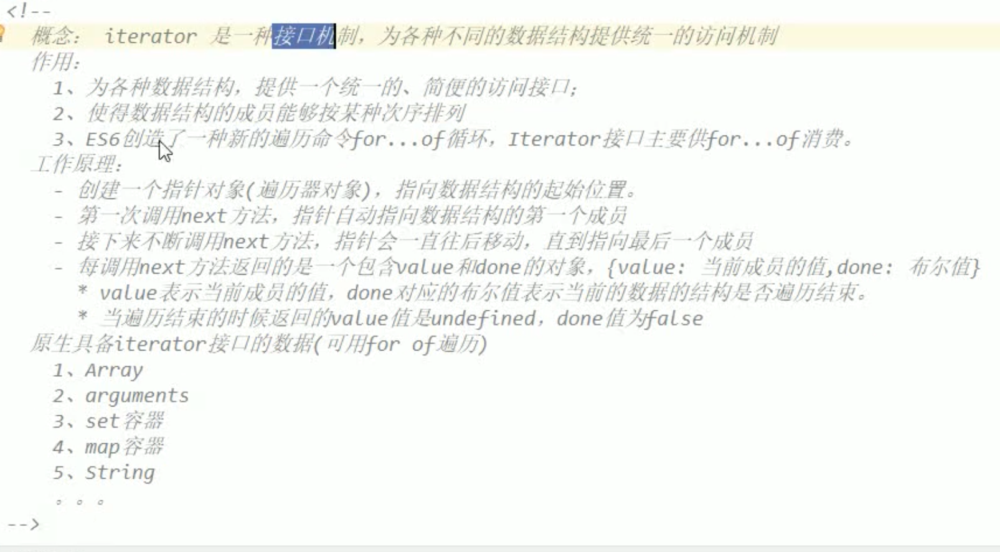

# ES6新增特性

> 1. let、const关键字
> 2. 变量的解构赋值
> 3. 模版字符串
> 4. 对象的简化写法
> 5. 箭头运算符
> 6. 三点运算符
> 7. 形参默认值
> 8. Iterator遍历器
> 9. class关键字

## let和const关键字

> ES6引入的新特性，块作用域和常量。
>
> let关键字：与var一样，都是用来定义变量的，只是在作用域上不同。
>
> const关键字：引入常量。
>
>  
>
> let和const关键字定义的变量永远不会保存在window变量对象中，var关键字定义的变量永远不会保存在script和block变量对象中。

### let介绍

> let的作用就是为了替代var：
>
> let的优点就是var的缺点：
>
> 1. let变量在块作用域中有效，引入了块级作用域，let定义的变量并不会添加到window对象中，而是保存到script、block或者函数变量对象中。
> 2. 不能重复定义同名变量。
> 3. 初始化前不能使用，即变量为undefined时不能访问。

```javascript
// 1. let变量在块作用域中有效，定义在块级作用域let变量，跳出块级作用域就销毁。
{
  var a = 12;
  let b = 13;
  // let a = 14; 报错：Identifier 'a' has already been declared
}

console.log(a);
console.log(b); // 报错：b is not defined


// 2. 不能重复定义
var c = 12;
var c = 13;
let c = 14; // 不过用什么关键字定义的变量，不能在使用let关键字定义同名变量。


// 3. 初始化前不能使用。
console.log(d); // undefined，变量提升
var d = 13;

console.log(e); // Cannot access 'e' before initialization，变量e未初始化
let e;
console.log(e);// Cannot access 'e' before initialization，变量e未初始化
e = 14;
console.log(e); 14
```

### const介绍

> const用来定义常量，ES5中只能让标识符大写，提示开发者这是一个常量，不要修改变量的值。
>
> const和let一样：
>
> 1. 在块作用域中有效。
> 2. 不能重复定义。
> 3. 初始化前不能使用，即变量为undefined时不能访问。
>
> const要求：
>
> 1. 使用const定义变量时，定义的同时必须初始化。
> 2. const变量初始化后不允许修改。


### var、函数、const和let的预解析

> 预解析流程：
>
> 1. 全局预解析时，将var变量和函数添加到window对象中，如果存在let和const变量，则创建script变量对象，并将let和const变量添加到script变量对象中，所有函数的作用链尾部都变成`script--> window`。
> 2. 块预解析时，当程序进入代码块时，查看是否有let或const变量，没有则直接执行代码，有则进行预解析，创建block变量对象，将所有let和const变量添加到block变量对象，然后在执行代码。
> 3. 函数调用时的预解析，var、let和const一样，都会添加到函数执行上下文的变量对象中。
>
> 预解析后变量存储位置：
>
> 1. 在全局作用域中定义的变量，let和const定义的变量会添加到script变量对象中，var和函数声明方式创建的函数添加到window。
> 2. 在块作用域中，let和const定义的变量，会添加到block变量对象中，var和函数声明方式创建的函数添加到window。
> 3. 在函数作用域中定义的变量，会添加到函数执行上下文的变量对象中。

```javascript
// fun1作用域链([[scopes]])：block(保存变量b) --> script(保存变量a) --> window
var a = 1;
let b = 2;
const c = 3;

{
    var d = 4
    let e = 5;
    const f = 6;
		
    function fun1() {
        var g = 7
        let h = 8;
        const i = 8;
        console.log(a, b, c, d, e, f, g, h, i);
    }
  
  	let fun2 = function(){ } // block和window中都有fun1和fun2属性。
    console.log();
}
fun1();
```

### script和block变量对象创建条件

> ES5中只有两种变量对象，全局变量对象和函数变量对象，ES6又增加了两种script和block变量对象。
>
> 
>
> script变量对象创建条件(在全局预编译时创建)：
>
> 1. 必须在全局作用域中使用let或者const定义变量。
>
> block变量对象创建条件(下面两个条件满足一个就行)：
>
> 1. 全局作用域或者代码块中存在let或者const定义的变量，并且块作用域中使用let、const创建变量，或者函数声明方式创建函数。
> 2. 块作用域中使用let或者const定义变量。
>
> block变量对象生命周期：
>
> ​		开始：在块预编译过程创建。
>
> ​		结束：在代码块执行完毕返回时，block变量对象出栈，并销毁。

```javascript
// 由于全局作用域中存在let或者const创建的变量，因此在全局预编译中创建script变量对象。
let arrs = [1, 2, 3, 4, 5];
for(var i=0; i<arrs.length; i++){
		// 不会创建block变量对象，没有满足条件
		console.log(arrs[i]);
}

for(let i=0; i<arrs.length; i++){
		// 会创建block变量对象，代码块中使用let定义了变量i。
		console.log(arrs[i]);
}
```

## 模版字符串

> ES6提供了另一种字符串拼接方式。模版：\`abcd${obj.name}\`

```javascript
/**
* ES6提供了另一种字符串拼接方式
* ``定义字符串不变的部分。
* ${}定义字符串可变部分。
*/
let obj1 = {username:'tom', age:13};
let strOfES5 = '我的名字：' + obj1.username + '，我的年龄：' + obj1.age;
let strOfES6 = `我的名字：${obj1.username}, 我的年龄：${obj1.age}`;
```

## 简化对象写法

> 1. 当属性名与赋值的变量名相同时，省略赋值语句。
> 2. 省略函数定义的function关键字。
>
> 使用简化对象写法，可以更方便的设置函数返回值。

```javascript
var usename = 'aaa';
var age = 12;

// -------------------------------常规书写方式-----------------------------------
var obj1 = {
  usename: usename,
  age : age,
  show : function(){
    console.log(this.username, this.age);
  }

}

// -------------------------------简化书写方式-----------------------------------

// 全局作用域中有u和age，因此省略赋值语句。
var obj1 = {
	usename,
	age,
	show(){
		console.log(this.usename, this.age);
	}
}


// 简化和正常写法参杂可以不？可以。
var obj2 = {
  useName : 'bbb',
  age,
  show1 : function(){},
	show2(){ }
};

// -------------------------------简化书写方式应用-----------------------------------
function demo(){
  let username = 'bbb';
  let age = 12;
  let show = function(){};
  // 作为函数返回值，使用简化对象实现函数返回多个参数。
  return {username, age, show};
}
```


## 解构赋值

### 对象和数组的解构

> 对象与数组的解构：将数组的元素或者对象的属性快速批量提取出来，放在当前作用域中。
>
>  对象解构：
>
> 1. 格式：var/let/const {对象属性名1，对象属性名2} = 实例对象。
>2. 要求：解构时，变量名必须等于实例对象的属性名，否则取不出来，变量值都是undefined。
> 3. 存放位置：
>    1. 解构的对象在全局作用域中，解构变量保存在全局作用域中，区别，使用var保存在window，let/const保存在script。
>    2. 解构的对象在函数作用域中，解构变量保存函数变量对象中。
>    3. 解构的对象在块作用域中，使用var定义的解构变量保存在window，使用let/const定义的解构变量保存在script。
> 
> 数组解构：
>
> 1. 格式：var/let/const [变量名1， 变量名2] = 实例对象。
>2. 如果想要取出特定位置的数据，必须给出空位，下面代码中提取第4个元素时标识出前三个空位。。
> 3. 解构越界位置元素时，返回undefined。let[,,,a] = [1];

```javascript
// 全局作用域
var obj1 = { username: 'aaaa', age: 12 };
var { username, age } = obj1;
console.log(username, age);

var arr1 = [1, 2, 3, 4, 5];
// 提取前三个元素
var [a1, a2, a3] = arr1;
// 提取第四个元素，不给前面的元素命名，表示不获取前三个解构元素。
var [,,,a4] = arr1;
console.log(a1, a2, a3, a4);

var [,,,,,,,a7] = arr1; 
console.log(a7); // undefined

```

### 解构与简化对象应用

> 1. 作为函数参数，使用解构，提取实参中对象的某些属性。
> 2. 给函数参数解构出来的变量设置默认值。

```javascript
// 解构对象的应用，提取对象中需要的部分。
function fun1({ className, address }) {
    console.log(className, address);
}
var person = {
    username: 'Tom',
    age: 24,
    className: '剑桥工程学院',
    address: 'China',
    phone: '13131311313'
};

fun1(person);

// 简化对象的应用
function fun2(){
  var username = "Tom";
  var age = 12;
  
  return {username, age};
}
var obj = fun2();
console.log(obj.username, obj.age);
```

### 设置解构默认值

```javascript
// 接收返回值时，使用解构赋值，对于没有的属性，设置默认值
let {username, age, ts=12} = function demo(){
    let username = 'bbb';
    let age = 12;
    let show = function(){};
    // 作为函数返回值，使用简化对象实现函数返回多个参数。
    return {username, age, show};
  }
console.log(username, ts);

// 函数参数设置解构赋值时，设置默认值
function demo1({url, params='aaa'}){
  console.log(url, params);
}
let p = {url: 'url'};
demo1(p);

// ES6 内部使用严格相等运算符（`===`），判断一个位置是否有值。所以，只有当一个数组成员严格等于`undefined`，默认值才会生效。
let [x = 1] = [undefined];
x // 1

let [x = 1] = [null];
x // null
```


## 箭头函数

> ES6中提供的一个新匿名函数写法，常用于回调函数。
>
> 写法：
>
> 1. 无参，一条语句写法：() => console.log();
> 2. 一个参数：i => i+2; `箭头后面不加大括号，则return，即i => return i+2;`
> 3. 多个参数：(i, j) => i+j;
> 4. 多条语句：(i, j) => {var sum = i+j; console.log(); }
>
> 箭头函数特点：
>
> 1. 箭头函数的this是所在执行上下文的this，这点和普通函数不同，普通函数this是由调用者决定。
> 2. 箭头函数的函数体只有一条语句时，系统会将该语句的结果作为返回值，多条语句时不写return语句，返回值为undefined。
> 3. 箭头函数不能作为构造函数使用，因为this的特殊性。
>
> 箭头函数return写法注意：
>
> 1. 如果箭头函数右边直接跟表达式，则执行箭头函数时，自动将表达式结果return。
> 2. 如果箭头函数右边直接跟着大括号，则表示函数体，箭头函数运行与普通函数一样return undefined，需要手动添加return。
> 3. 如果想要让箭头函数自动返回一个对象，但是对象都是以大括号开始，则在大括号外部包裹一个小括号，这样箭头函数运行会自动添加return。

```javascript
// ----------------------------常规函数---------------------------------
function fun1(){
    console.log('常规函数');
}

// -----------------------------箭头函数------------------------------------

// 无参数箭头函数，无参时不能省略括号，它是占位的。
var fun2 = () => 1+2; 
console.log(fun2()); // 只有一条语句，会自动将语句执行结果当作返回值返回。

// 一个参数箭头函数
var fun3 = i => console.log(i + 3);
console.log(fun3(12)); // 只有一条语句，会自动将语句执行结果当作返回值返回。

 // 多个参数箭头函数
 var fun4 = (i, j) => i + j;
console.log(fun3(1, 2)); // 只有一条语句，会自动将语句执行结果当作返回值返回。

// 多条语句的箭头函数
var fun5 = i => {
    var j = i * 3;
    return j;   // 当有多条语句时，不写return语句默认返回undefined。
};
console.log(fun5(12));

// fun6 和fun3都返回undefined，但是undefined产生方式不同，fun3时console.log方法执行结果，fun6是系统自动添加的return undefined。
var fun6 = i => {
    var j = i * 3;
    console(j);
};

// -----------------------------箭头函数return------------------------------------
let fun7 = () => 1+1; 
let fun8 = () => { return 1+1;}
let fun9 = () => ({name:'aaa', age:18});

// fun9函数应用实例，用户列表与当前页面显示model不匹配时，想要将列表数组中的对象转换一下。
let models = userList.map((user)=>({
  	name: user.username,
  	adds: user.address,
  	avatar_url: user.icon_url
}));
```

### 箭头函数的this

> 箭头函数this(在定义时由外层的this决定)：
>
> 1. 当在函数体内，定义箭头函数时，箭头函数的this == 外层函数的this。
> 2. 当箭头函数不被任何函数体嵌套时，箭头函数this == window。
>
> 普通函数thi(在调用时)s：
>
> 1. 当被对象调用时，函数的this == 实例对象。
> 2. 当将函数当构造函数使用时，函数的this == 函数创建的实例对象。
> 3. 当直接调用函数时，函数的this == window。

```javascript
var username = 'Jarry';
var obj1 = {
    username : 'Tom',
    show1(){
      	// 箭头函数this == 外层函数的this == show1的this == obj1
        return (temp) =>{
            console.log(this.username +', '+ temp); // Tom, 111
        }
    },
    show2(){
      	// 普通函数的this == window
        return function(temp){
            console.log(this.username +', '+ temp); // 
        }
    }
}

obj1.show1()('111');
obj1.show2()('111');

// -------------------------------------------------------------------

var btn1 = document.getElementById('id1');
var btn2 = document.getElementById('id2');
var btn3 = document.getElementById('id3');

var obj1 = {
    show1(btn){
        btn.onclick = function(){
            console.log(this); //
        }
    },

    show2(btn){
        btn.onclick = (btn) => {
            console.log(this);
        }
    },

    show3 : (btn) => {  // window
        btn.onclick = (btn) => {
            console.log(this);  // show3的this
        }
    }
};

obj1.show1(btn1);
obj1.show2(btn2);
obj1.show3(btn3);
```


## 形参默认值

> ES6中可以给形参设置默认值，当不传入参数时，默认使用形参默认值。

```javascript
// 定义函数时，在形参后面跟一个`=`设置一个默认值，当调用函数时，没有传递数据时形参使用该默认值。
function fun(arr = []){
	arr.forEach(function(item, index){
			console.log(item, index);
	});
}

var arr = [1, 2, 3, 4];
fun(arr);
```

## 三点运算符

> 三点运算符功能：
>
> 1. 作为可变参数使用。
> 2. 对数组进行拆包

### 实现可变参数功能

> 与其它语言可变参数功能类似，当函数可以接收不固定个数数据时，可以使用可变参数接收。
>
> 使用要求： 必须放在函数参数列表最后一个。
>
>  
>
> 可变参数与arguments区别：
>
> 1. 可变参数是真正的数组，而不是arguments那样的伪数组，因此可以调用数组方法。
> 2. 可变参数只会收集未被函数参数命名的参数，argument会收集传入函数的所有参数

```javascript
// 定义了一个可变参数arrs，arrs = [3, 4, 5, 6, 7, 8]
function fun(num1, num2, ...arrs){
    console.log(arguments, arrs);

    arrs.forEach((item, index) =>{
        console.log(item, index);
    });
  }

fun(1, 2, 3, 4, 5, 6, 7, 8);
```

### 数组拆包

> 三点运算符拆包原理，底层其实调用的iterator接口，对数组进行遍历获取数组中的每个元素。因此任何实现了iterator接口的对象都可以使用三点运算符进行拆包。

```javascript
let arr = [1, 6];
let arr2 = [2, 3, 4, 5];

let arr3 = [1, ...arr2, 6]; 
console.log(arr3); // 1, 2, 3, 4, 5, 6

let obj = {name : 'kebo', age: 43};
console.log(...obj); // Object对象没有实现iterator接口，因此不能拆包。
```

## Symbol

> ES6新增的一种基本数据类型。
>
> 引用Symbol的原因：
>
> ​		由于ES5及以下版本中，对象的属性名其实使用字符串表示的，很容易造成命名冲突，因此为了从根本上解决对象属性名冲突的问题，ES6引入了Symbol基本数据类型。
>
>  
>
> Symbol特点：
>
> 1. 它是一种基本数据类型，ES6中6种基本类型：string、boolean、number、undefined、null、`Symbol`。
> 2. Symbol值是唯一的，使用Symbol函数创建，任意两个Symbol值都不相同。
> 3. Symbol值不与任何其它类型进行运算，包括字符串。
> 4. Symbol作为对象属性名时，不会被for-in、for-of遍历出来。
>
> Symbol创建方式：
>
> 1. 无参数创建：var s1 = Symbol();
> 2. 字符串参数创建：var s2 = Symbol('one');，字符串只是Symbol值的描述。

```javascript
// 任意两个Symbol值都不会相同
var s1 = Symbol();
var s2 = Symbol();
// 使用字符串，是为了给symbol值添加描述，方便开发者区分两个symbol是代表什么意义。
var s3 = Symbol('one');
var s4 = Symbol('one');
console.log(s1 === s2); // false
console.log(s3 === s4); // false
console.log(s2 === s3); // false
console.log(s1, s3); // Symbol() Symbol(one)
console.log(typeof s3); // Symbol
console.log(s3.toString(), s3.description); // Symbol(one) one
```


### Symbol用途

> 1. 作为枚举值。
> 2. 作为对象的属性名。
>
> ES6后对象的属性名类型：
>
> 1. string类型
> 2. Symbol类型

#### 作为枚举值

```javascript
// 使用Symbol作为枚举值，开发者其实不关心枚举值内容是什么，只关心枚举值之间是否可以被区分，消除魔术字符串
const netStatus = {
  connecting : Symbol(),
  connect : Symbol(),
  disconnect : Symbol(),
  none : Symbol
};

var status = netStatus.connect;
switch(status){
  case netStatus.connect:{
    console.log('连接')
    break;
  }
  case netStatus.connecting:{
    console.log('连接中')
    break;
  }
  case netStatus.disconnect:{
    console.log('断开')
    break;
  }
  case netStatus.none:{
    console.log('无状态')
    break;
  }
}


console.log('---------------------下面就是使用魔术字符串---------------------------')
// 这种方式大大增加了字符串与switch语句之间的耦合性，修改麻烦，很容易影响其它代码。
var status = 'connect';
switch(status){
  case 'connect':{
    console.log('连接')
    break;
  }
  case 'connecting':{
    console.log('连接中')
    break;
  }
  case 'disconnect':{
    console.log('断开')
    break;
  }
  case 'none':{
    console.log('无状态')
    break;
  }
}
```

#### 作为对象属性名

> symbol作为属性名时，使用for-in、for-of、getOwnPropertyNames方式是遍历不出来的。
>
> ES6提供两种遍历symbol属性名的方式：
>
> 1. getOwnPropertySymbols()
> 2. Reflect.ownKeys()
>
> 注意：symbol值是唯一的，因此使用symbol类型作为对象属性名时，需要拿到这个唯一值才能访问对象属性。

```javascript

class CustomCollection {
    // 这个symbol值作为对象属性名，需要保存，否则之后无法访问这个属性。
    static size = Symbol('size');
    constructor() {
        // 该symbol属性用来记录对象保存了多少个元素。
        var size = CustomCollection.size;
        this[size] = 0;
    }

    // 给对象添加属性
    add(item) {
        var size = CustomCollection.size;
        this[this[size]] = item;
        this[size] += 1;
    }

		// 删除元素
    remove(item) {
        let size = CustomCollection.size;
        let index = -1;
	      // 遍历集合查询目标元素
        for (let it in Object.getOwnPropertyNames(this)) {
            if (this[it] == item) {
                index = it;
                break;
            }
        }
        if (index == -1) {
            return false;
        }
				// 填补空位
        for (index; index < this[size] - 1; index++) {
            this[index] = this[parseInt(index) + 1];
        }
				// 删除多余属性
        delete this[index];
      	// 修改元素个数
        this[size]--;

        return true;
    }

		// 根据索引值获取元素
    get(index) {
        return this[index];
    }

    // 查看对象有多少个属性
    static sizeOf(instance) {
        var size = CustomClazz.size;
        return instance[size];
    }
}


let c = new CustomCollection();
c.add(100); c.add(101); c.add(102); c.add(103); c.add(104); c.add(105);
c.remove(103);

for (let it in Object.getOwnPropertyNames(c)) {
    console.log(c[it]);
}
console.log(c.get(3));

let src = Reflect.ownKeys(c); // 返回一个属性名组成的数组
console.log(src); // [ '0', '1', '2', '3', '4', Symbol(size) ]
console.log(Object.getOwnPropertySymbols(c)); // [ Symbol(size) ]
```

### Symbol.for()，Symbol.keyFor() [§](https://es6.ruanyifeng.com/#docs/symbol#Symbol-for，Symbol-keyFor)

>前面说过Symbol值是唯一的，因此如果丢失了该Symbol值的引用，则永远都不会获取到了，这也是为什么作为对象的属性名时，需要保存它的引用。
>
>ES6提供了Symbol.for()函数可以获取同一个Symbol值，原理：
>
>​		在全局作用域中创建一个对象，用来保存Symbol值，属性名为Symbol值的描述，属性值为Symbol值，如果对象中没有则创建一个Symbol值。

```javascript
/**
 *  在全局变量对象中创建一个专门保存Symbol值的对象，对象结构：
 * {
 *     foo : Symbol('foo'),
 *     bar : Symbol('bar')
 * }
*/
let s1 = Symbol.for('foo');
let s2 = Symbol.for('foo');
console.log(s1 === s2); // true

let s3 = Symbol('foo');
console.log(s3 === s1); // false
```


### Object内置的11个Symbol值

> ES6自定义了11个Symbol值，给对象使用。

#### Symbol.iterator(iterator接口实现)

> 实例对象中使用该Symbol值保存实现iterator功能的方法。例如for-of、三点运算符能遍历对象的本质是，调用对象的Symbol.iterator属性实现对象遍历。
>
> 
>
> 原生支持iterator接口的数据类型：
>
> 1. Array
> 2. Set容器
> 3. Map容器
> 4. String
> 5. arguments

```javascript
// 查看Symbol.iterator值
console.log(Symbol.iterator) // Symbol(Symbol.iterator)

// -------------------------检查Array实例对象可以用for-of遍历的原因-------------------------
var arrs = ['aaa', 'bbb', 'ccc', 'ddd'];
for (const iterator of arrs) {
    console.log(iterator);
}
console.log(...arrs);

// 修改Symbol.iterator属性后，下面报错：arrs is not iterable，数组arrs不可迭代，说明for-of、和三点运算符通过调用Symbol.iterator属性绑定的函数进行遍历。
Array.prototype[Symbol.iterator] = undefined;
console.log(...arrs);
for (const iterator of arrs) { 
    console.log(iterator);
}

```

> Iterator是一种接口机制，为各种类型数据提供统一的遍历方法。
>
> 遍历器原理：
>
> 1. 创建一个遍历器对象，指向需要遍历的对象的起始元素。
> 2. 第一次调用遍历器对象的next方法，让指针指向起始元素。
> 3. 每调用一次next方法，指针对象向后移指向下一个元素，并返回一个包含value和done属性的对象。
>    1. 当后面还有元素时，done为false。
>    2. 当后面没有元素时，done为true。
>
> iterator机制实现：对象在遍历时，会查询对象是否实现了Symbol.iterator方法，没有则不可使用for-of、三点运算符迭代对象。

```javascript
// 让自定义对象实现iterator接口，实现for-of、和三点运算符对自定义对象的遍历。
class Person1{
    constructor(name, age, sex, address, phone){
        this.name = name;
        this.age = age;
        this.sex = sex;
        this.address = address;
        this.phone = phone;
    }

  	// 创建Symbol.iterator属性名，遍历时会调用该属性名下的应的方法。
    [Symbol.iterator](){
        let index = 0;
        // 返回一个遍历器对象，对象中有一个next方法，用来访问需要遍历的对象中的下一个元素。
        return {
            // 使用箭头函数，实现this == 外层函数this，不用再使用let that = this;来特地保存了。
            next: () => {
                let properties = Object.keys(this);
                return index >= properties.length ? {value : properties[index], done : true } : {value : properties[index++], done : false } 
            }
        }
    }
}

let pss = new Person1(
    'Tom',
    13,
    '男',
    '南京路48号公寓',
    '13474849994'
);

for (const iterator of pss) {
    console.log(iterator);
}
```





