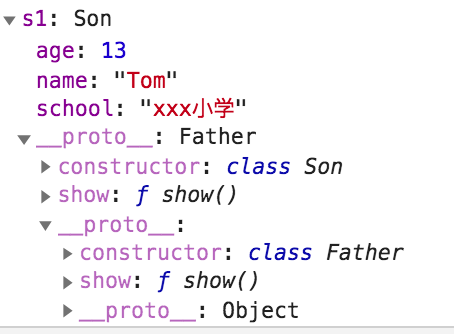
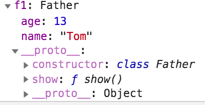

# ES6创建类

>1. 必须要有一个名为constructor的方法做为该类的构造方法。
>2. 所有该类的实例对象属性都必须在constructor构造方法中定义。
>3. 类中所有没在constructor构造方法的属性，必须添加static关键字，作为类属性。

```javascript
class Person(){
  
  // 定义的属性为类属性，换句话说底层是给构造函数添加type属性。
  static type = "Person";
  
  // 所有实例对象的属性，必须在constructor中定义。
  constructor(name, age){
    this.name = name;
    this.age = age;
  }
  
  show(){
    console.log(this.name, this.age);
  }
}

var p = new Person('Tom', 13);
p.show();
console.log(Person.type);
```


## 类继承

> 使用extends关键字来给类建立继承关系，使用super调用父类构造方法。

```javascript
class Father{
  
  // 定义的属性为类属性，换句话说底层是给构造函数添加type属性。
  static type = "Father";
  
  // 所有实例对象的属性，必须在constructor中定义。
  constructor(name, age){
    this.name = name;
    this.age = age;
  }
  
  show(){
    console.log(this.name, this.age);
  }
}


class Son extends Father{
  constructor(name, age, school){
    // 调用父类构造方法
    super(name, age);
    this.school = school;
  }
  
  // 重写父类的方法，其实在Son类型的显示原型对象中添加一个show方法。
  show(){
    console.log(this.name, this.age, this.school);
  }
}

var f1 = new Father('Tom', 13);
f1.show();
var s1 = new Son('Tom', 13, 'xxx小学');
s1.show();
```

### 类继承原理

> ES6中没有实现真正的继承，其实是语法糖，底层还是和ES5一样，使用原型链实现的。

```javascript
function Father(name, age){
  Father.type = 'Father';
  this.name = name;
  this.age = age;
  
  if('function' == Father.prototype.show) return;
  // 添加公共方法
	Father.prototype.show = function(){
    console.log(this.name, this.age);
  }
}

function Son(name, age, school){
  Father.call(this, name, age);
	this.school = school;
}

  // 使用原型链实现继承
Son.prototype = Object.create(Father.prototype);
Son.prototype.show = function(){
  console.log(this.name, this.age, this.school);
};

var f1 = new Father('Tom', 13);
f1.show();
var s1 = new Son('Tom', 13, 'xxx小学');
s1.show();
```

### 内存结构图

> 下图是上面代码执行后的原型链图。s1中有两个show，子类重写了父类的show方法。




## 差缺补漏

> 展示一些非常规的写法

### 派生的类不写contructor方法

> 下面代码中Person类派生了Child类，并且在Child定义中没有写constructor函数。
>
> 从代码运行结果上分析，在Child类中定义constructor方法，其实是重写父类方法，只有在需要给子类添加新属性时，才需要重写contructor方法，其它情况无需重写。

```javascript
class Person{
  constructor(a, b){
    this.a = a;
    this.b = b;
  }

  demo(){
    console.log('aaa')
  }
}

class Child extends Person{

}

let c = new Child(1,2);
c.demo(); // aaa
console.log(c.a, c.b); // 1, 2
```

