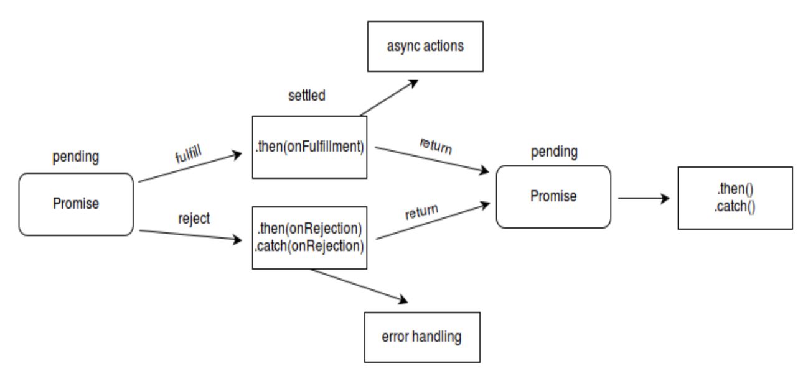

# Promise

> Promise 是异步编程的一种解决方案，比传统的解决方案——回调函数和事件——更合理和更强大。它由社区最早提出和实现，ES6将其写进了语言标准，统一了用法，原生提供了`Promise`对象。
>
> 所谓`Promise`，简单说就是一个容器，里面保存着某个未来才会结束的事件（通常是一个异步操作）的结果。从语法上说，Promise 是一个对象，从它可以获取异步操作的消息。Promise 提供统一的 API，各种异步操作都可以用同样的方法进行处理。


## Promise与传统纯回调方式的区别

> 对于需要有依赖的异步任务，纯回调方式使用回调函数嵌套方式实现多个异步任务的同步执行。
>
> 下面使用定时器模拟多个相互依赖的异步任务。

```javascript
// 使用纯回调函数的方式
console.log('开始执行任务1')
setTimeout(()=>{
  console.log('任务1执行完毕');
  let a = 1; // 异步任务1请求结果
  console.log('开始执行任务2');
  setTimeout((a)=>{
	    console.log('任务2执行完毕')
    	let b = 2+a; // 异步任务2 请求结果
      console.log('开始执行任务3');
 		  setTimeout((b)=>{
         let c = 3+b; // 异步任务3:请求结果
         console.log('任务3执行完毕', c)
        
    	}, 1000);
  }, 1000);
}, 1000);
```

```javascript
// 使用Promise方式
// 开始执行任务1
const p1 = new Promise((resolve, reject)={
  setTimeout(()={
    let a = 1;// 异步任务1请求结果
    resolve(a);
  }, 1000);
});

p1.then((value)=>{
  	// 开始执行任务2
		return new Promise((resolve, reject)=>{
        setTimeout(()=>{
   				 let b = 2 + value;
           resolve(b);
 			  });
    });
})
.then((value)=>{
  	// 开启执行任务3
  	return new Promise((resolve, reject)=>{
      	setTimeout(()=>{
          let c = 3 + value;
          resolve(c);
        });
    });
})
.then((value)=>{
  console.log(value) // 输出执行完3个异步任务的结果
})
.catch((reason)=>{
  console.log(reason); // 输出其中某个异步任务错误的结果
});
```


## Promise基本使用

> Promise对象有三种状态：
>
> 1. pending，异步任务正在执行
> 2. resolved，异步任务执行成功
> 3. rejected，异步任务执行失败
>
> Promise对象状态转换只有两种：
>
> 1. pending --> resolved
> 2. pending --> rejected
>
> 也就是说不支持`resolved--> resolved`，`resolved-->rejected`，`rejected-->resolved`，`rejected-->rejected`

### Promise执行流程



```javascript
// Promise构造函数，接收一个函数，函数中包含着需要执行的异步任务。
let p1 = new Promise((resolve, reject)={
		// 封装异步任务
  	setTimeout(()=>{
  			// 根据异步任务执行结果调用，函数参数列表中的两个函数类型的参数
  			if(success){
  					resolve(data); // 执行成功后，通过resolve函数，将异步任务执行成功后的结果传递给回调函数。
				}else{
          	reject(error); // 执行失败后，通过reject函数，将异步任务执行失败后的原因传递给回调函数。
        }
		}, 1000);
});

// then函数绑定回调函数，并返回一个新的Promise对象，用来实现链式调用。
p1.then((value)=>{
  	console.log(value);
}, (error)={
  	console.log(error);
});
```


### Promise原型对象中的方法

> Promise原型对象的方法：
>
> 1. then()，绑定执行成功和失败的回调函数，并返回一个新Promise对象，用于链式调用。
> 2. catch()，绑定一个失败的回调函数，并返回一个新Promise对象，用于链式调用
> 3. finally()，在promise结束时，无论结果是fulfilled或者是rejected，都会执行指定的回调函数

#### then函数

> then函数返回值根据回调函数返回值的情况而定：
>
> 1. 回调函数返回值为非Promise对象，undefined或者其它数据类型，则then函数返回值为resolved状态的Promise对象，即Promise.resolve(回调函数返回值)。
> 2. 回调函数中抛出异常时，则then函数返回值为rejected状态的Promise对象，即Promise.reject(error)。
> 3. 回调函数返回值为Promise对象，则then函数返回一个与回调函数同状态和同数据的Promise对象。
>
> 
>
> then函数的两个参数都是可选，因此：
>
> 1. 当then(undefined, funcError)时，then函数内部会使用默认的成功回调函数，即`value => value`，将数据封装成resolved状态的Promise对象返回。
> 2. 当then(funcSuccess, undefined)时，then函数内部会使用默认的失败回调函数，即 `throw error`，将数据封装成rejected状态的Promise对象返回。

#### catch函数

> catch函数是对then函数的封装。
>
> 一般在开发中，调用then函数时不传第二个失败的回调函数，而是在链式调用最后添加一个catch函数，`也就是错误传递`。

```javascript
function catch(onRejected){
  return this.then(undefined, onRejected);
}
 
// 常见写法
let p1 = new Promise((resolve, reject)=>{
   resolve(1);
});

// 最后添加一个catch用来接收之前链式调用时，某一个环节出现的错误
p1.then().then().then().catch(); 
```

#### finally函数

> 


### Promise函数对象中的方法

> Promise构造函数：接收一个函数，该函数中可以编写异步任务，函数参数为`resolve`和`reject`


## 链式调用


### 错误穿透

### 中断错误


执行结果：记住只有rejected、resolved状态的promise才会被添加到微队列中。then绑定回调函数，如果promise对象为非pending状态，则将对应的回调函数添加到微队列中。

```html
<!DOCTYPE html>
<html lang="en">
<head>
  <meta charset="UTF-8">
  <title>12_Promise相关面试题4</title>
</head>
<body>

    <script>
      /*
      宏: []
      微: []
      */
      setTimeout(() => {
        console.log("0")
      }, 0)
      new Promise((resolve,reject)=>{
        console.log("1")
        resolve()
      }).then(()=>{        
        console.log("2")
        new Promise((resolve,reject)=>{
          console.log("3")
          resolve()
        }).then(()=>{      
          console.log("4")
        }).then(()=>{       
          console.log("5")
        })
      }).then(()=>{  
        console.log("6")
      });
    
      new Promise((resolve,reject)=>{
        console.log("7")
        resolve()
      }).then(()=>{         
        console.log("8")
      })
    </script>

    
</body>
</html>
```


