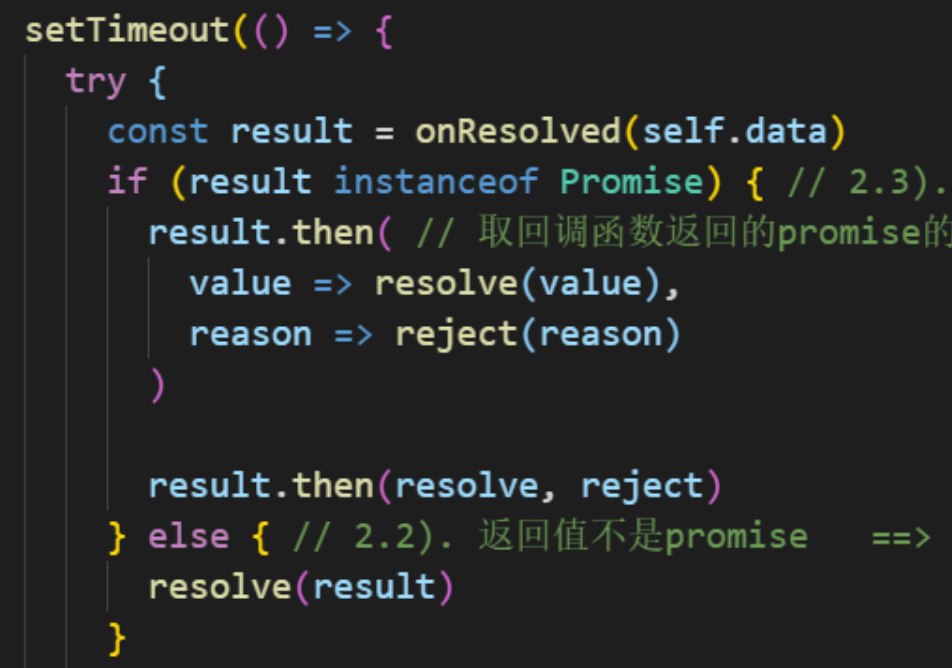
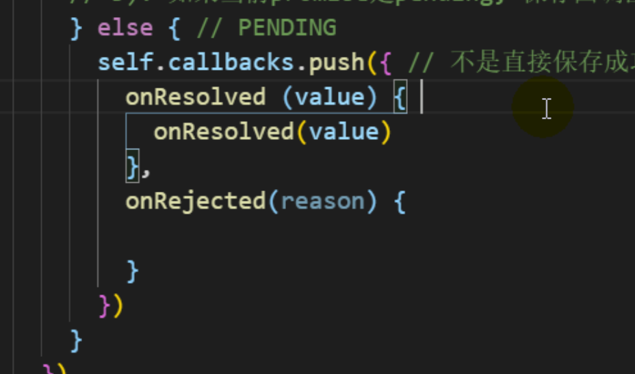
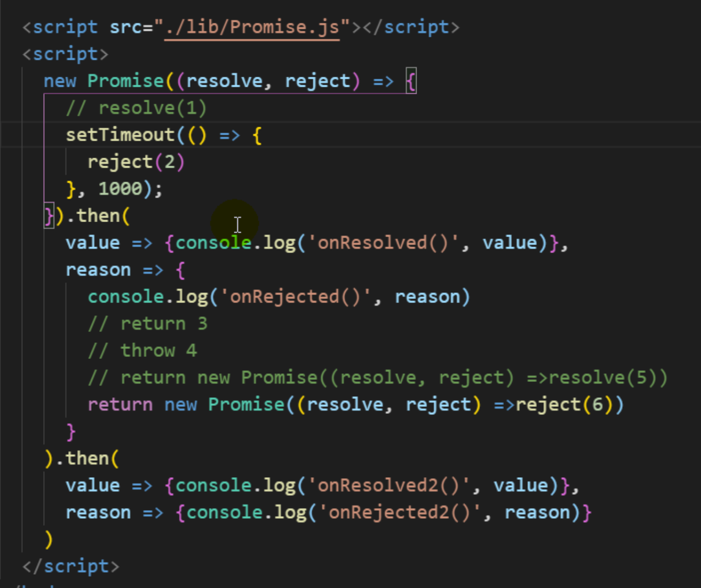
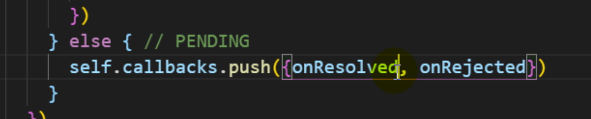
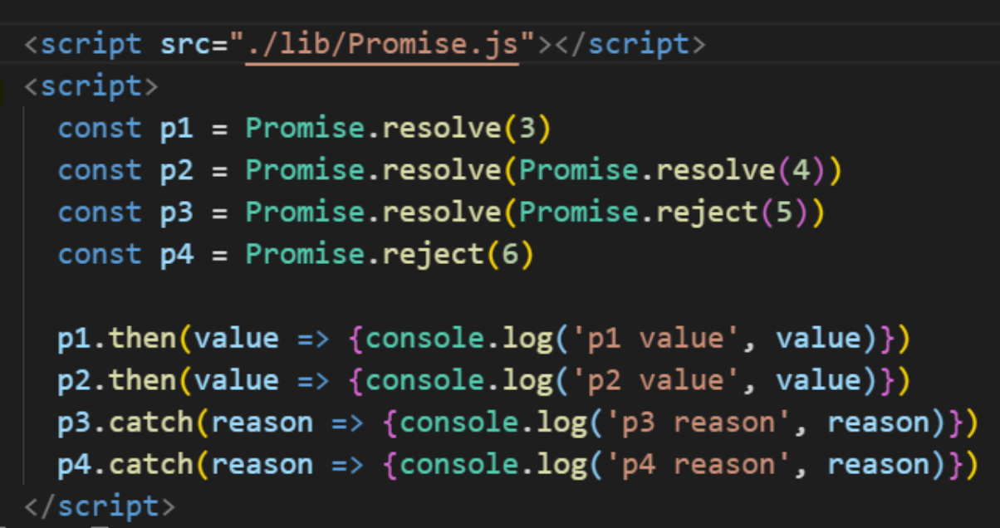

弄明白result.then(resolve,reject);

then函数实现方式：

1. 视频实现，先创建一个Promise对象，将then函数的代码包裹起来。
2. 我的想法，在需要的时候创建一个Promise对象

这段代码中，onResolved方法是递归调用吗？

onResolved()方法是异步调用吗？

then函数的写法，当promise状态为pending时

为何第2个then函数中定义的函数类型参数没有被执行？

执行结果为何是3、6、4、5

视频中的then定义在实例对象中，then定义在原型对象中可以吗？

asyn函数中虽然使用await，但是不会阻塞主线程。

asyn与await如何配合实现异步请求同步执行？

asyn与aswit配合时，如何设置错误处理