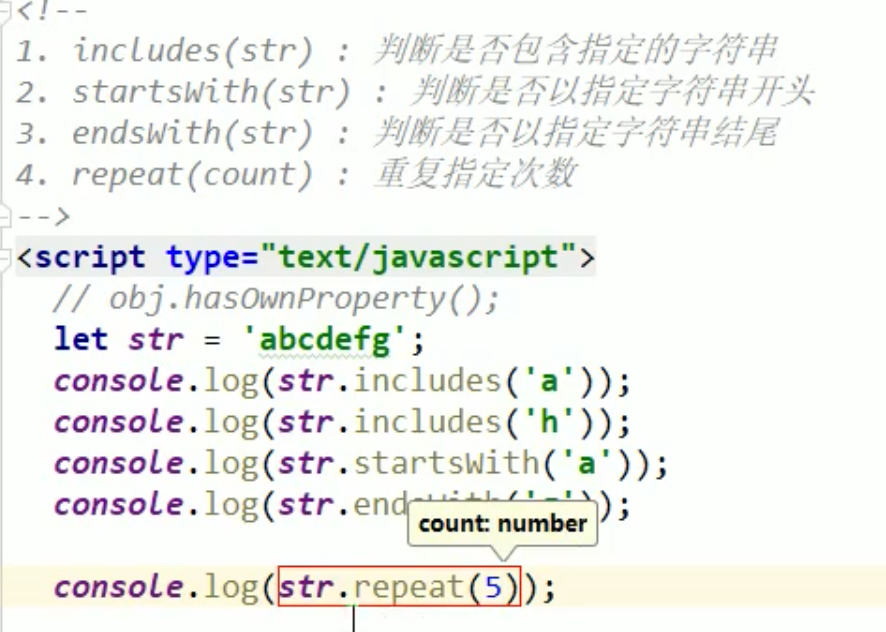

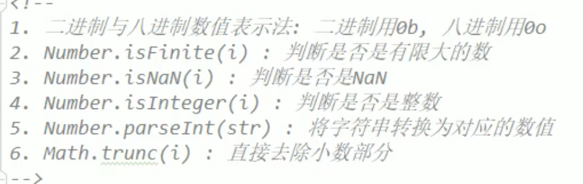

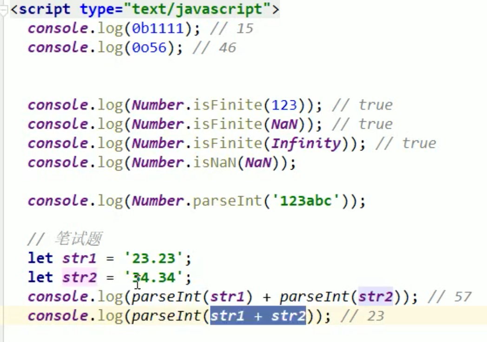


API中一看到类型.方法，这是函数对象中的方法，实例对象无法使用，因此from和of给Array函数对象使用，find和findIndex是给Array实例对象使用

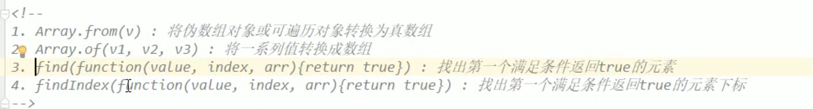

```javascript
var rel = 0;
[1,2,3,4].forEach(function(result, index, arr){
		if(result > 3){
			rel = result;
			return;
		}
    console.log(result, index, arr);
});


[1,2,3,4].find((value, index, arr) => if(value > 3) return true;);

// 两种方式那种好，find方法好，因为找到目标元素就会停止遍历，而forEach会将整个数组进行遍历。
```


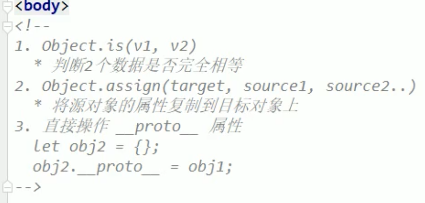

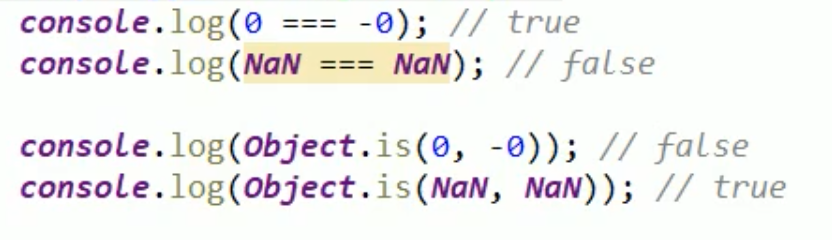

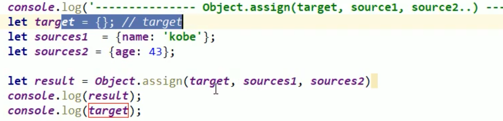


\__proto__属性在ES6可以访问，ES5中无法访问。


map初始化时，必须是二维数组

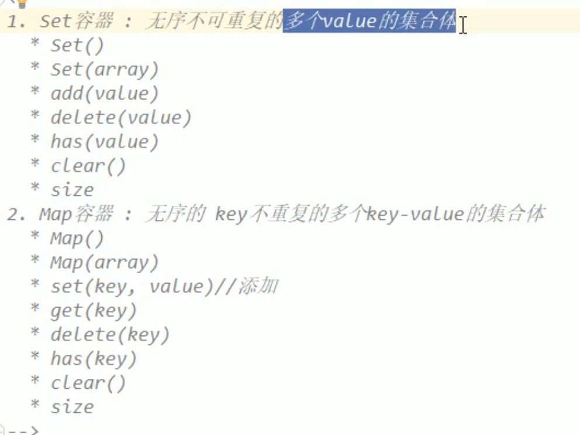


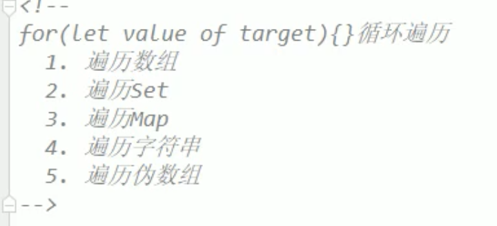

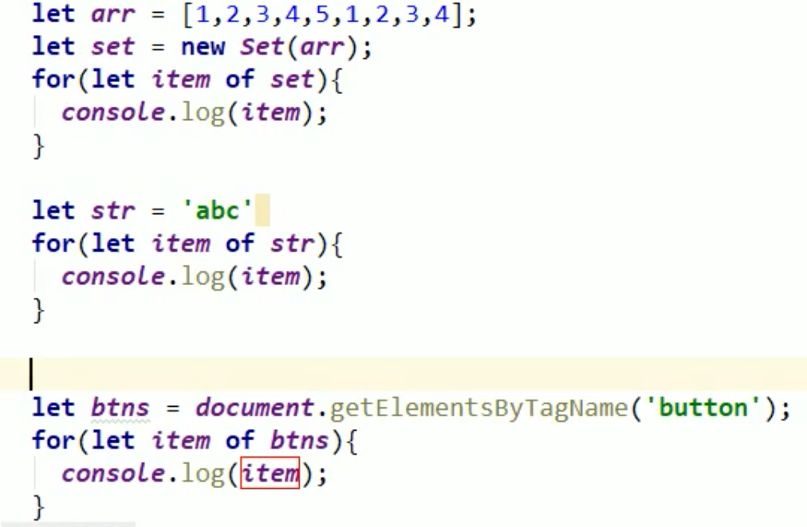


### 数组去重

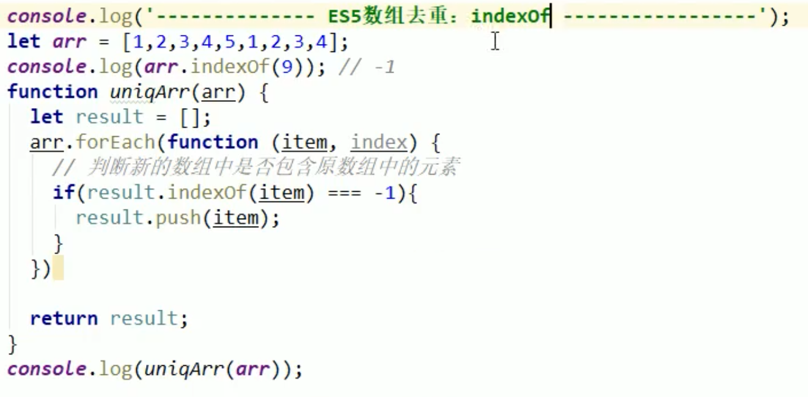

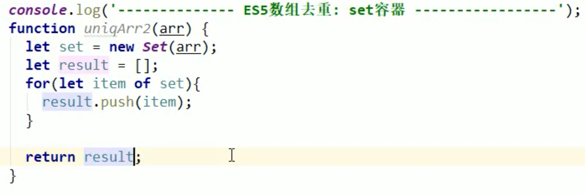

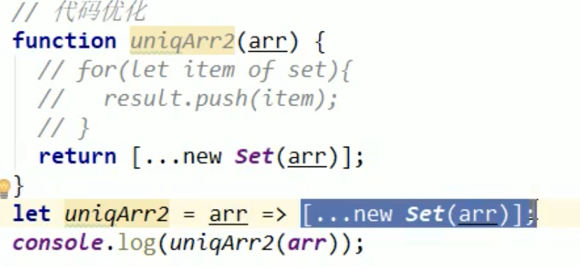

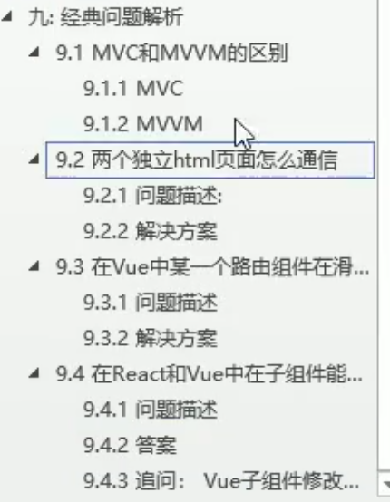


### 克隆

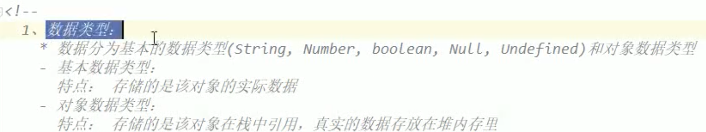

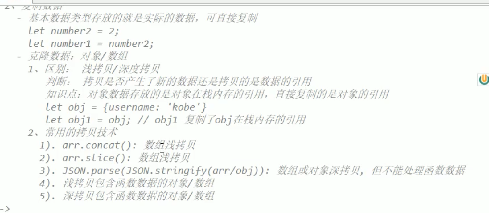

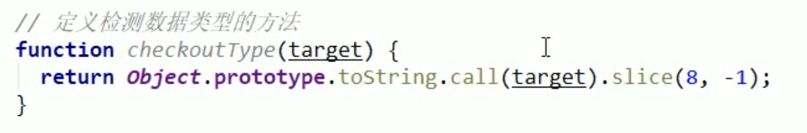

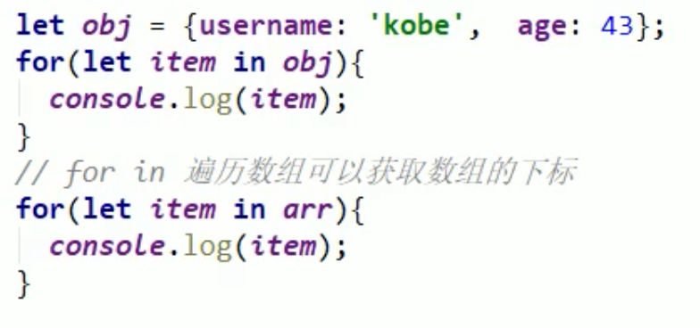

深拷贝和浅拷贝区别：

深拷贝，修改新拷贝的引用类型数据，不会影响原来的引用类型数据。浅拷贝相反。

```javascript
var obj1 = {name : 'aaa', age : 12};
var obj2 = {};
Object.assign(obj2, obj1); // 无法判断Object.assign方法是否是深拷贝还是浅拷贝，因为对于基本类型深拷贝和浅拷贝一样。


var obj3 = {name : 'aaa', age : 12， type : {sex : 'as'}};
var obj4 = {};
Object.assign(obj4, obj3); // Object.assign方法是浅拷贝。
obj4.type.sex = 'F';


```


JS的变遍历方式：

for-of

...

forEach

for-in

普通for循环


#### 手写clone方法


实现深拷贝


#### JSON对象可以处理Object及子类型的实例对象，如果实例对象中有函数会如何处理？


## ES7

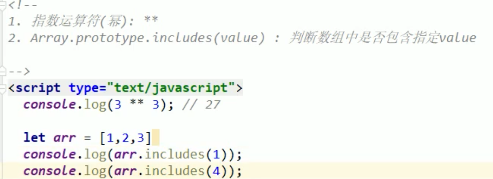


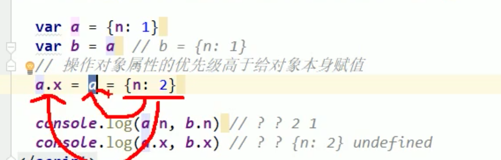

a.x = a = {n : 2} ==> a.x = {n : 2}; a = {n : 2}


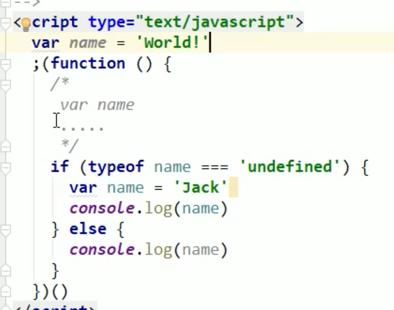

函数自调用时前面加一个分号，防止上面的没有加分号导致代码解析报错。


这段代码的问题

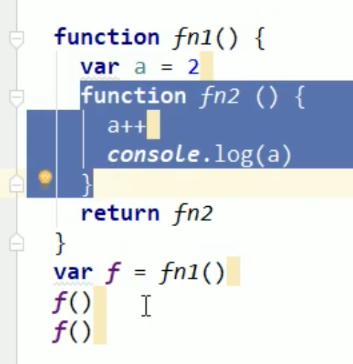

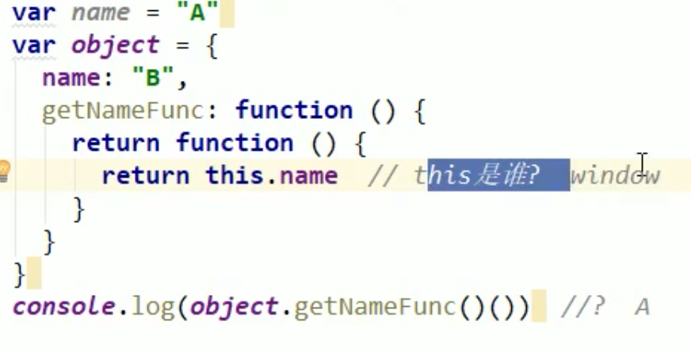

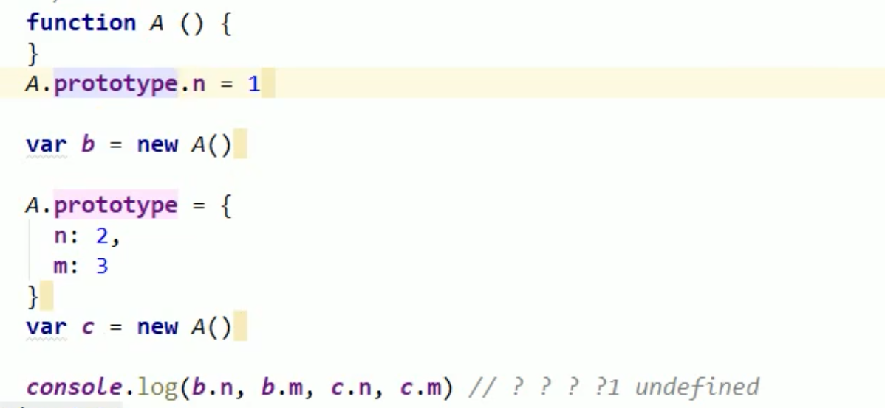

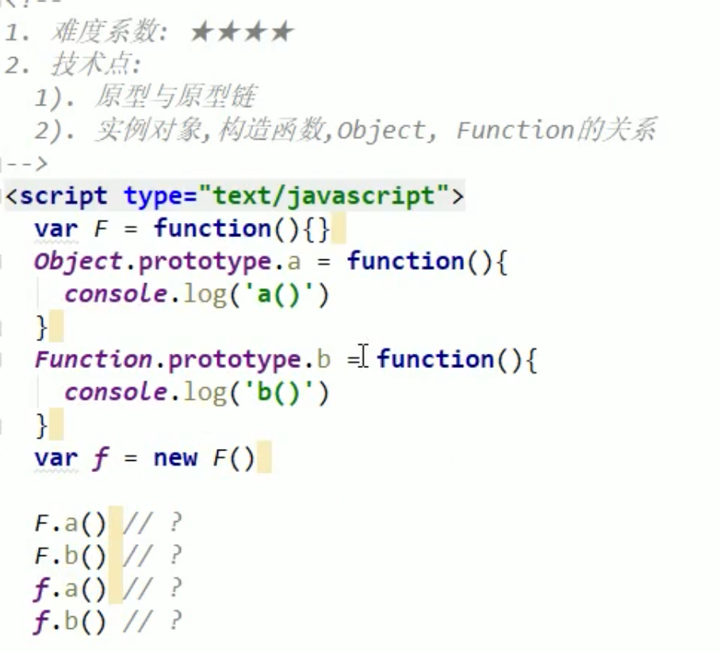

```javascript
function Person(){
  getA = function(){console.log(10)};
  return this;
}

Person.getA = function(){console.log(20)};
Person.prototype.getA = function(){console.log(30)};
var getA = function(){console.log(40)};
function getA(){console.log(10)};

Person.getA();
getA();
Person().getA();
getA();
new Person.getA();
new Person().getA();
```

