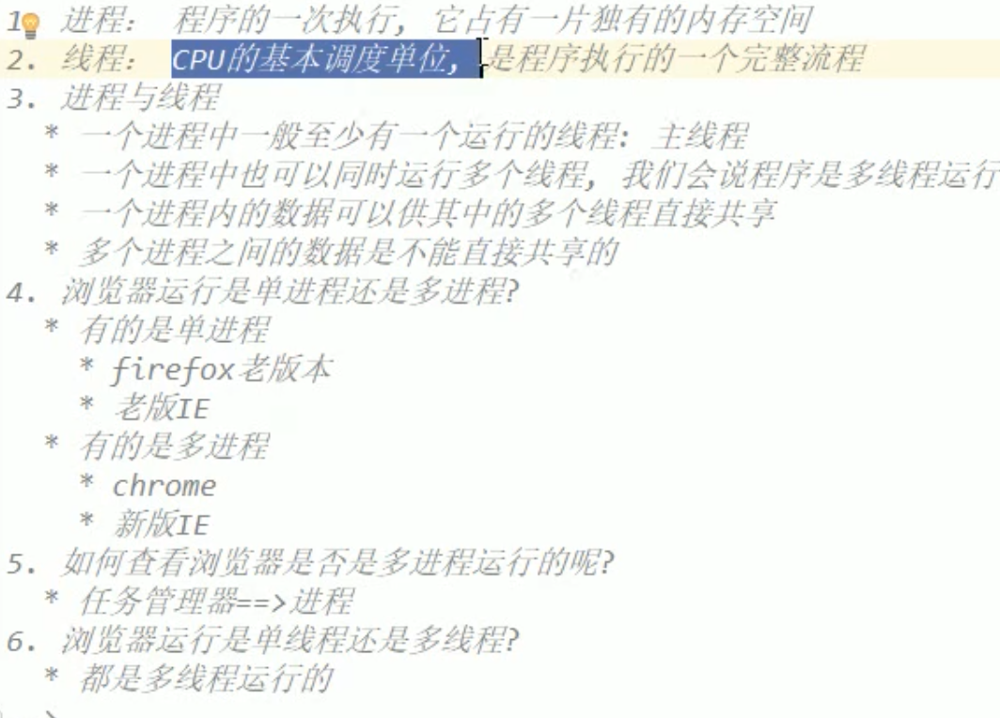
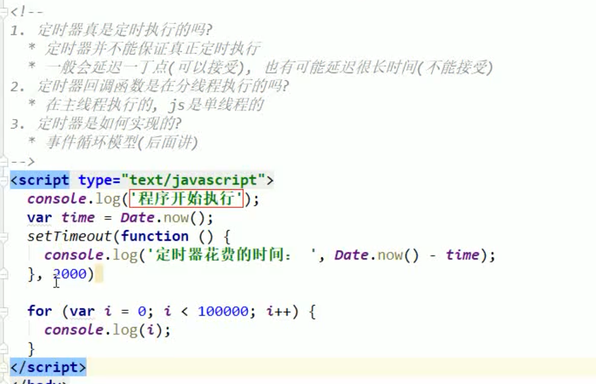
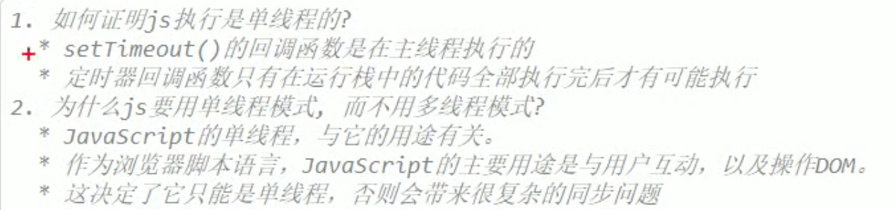
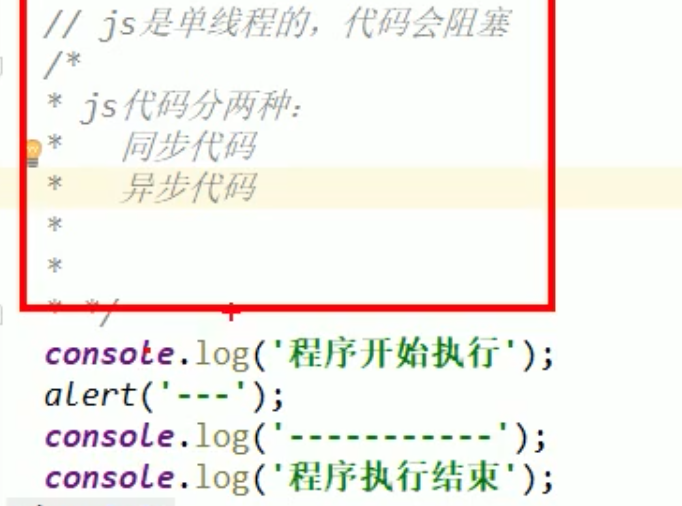
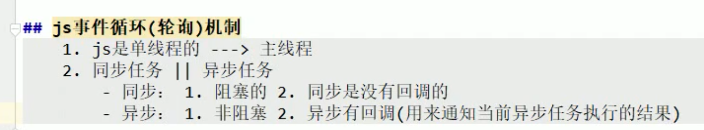
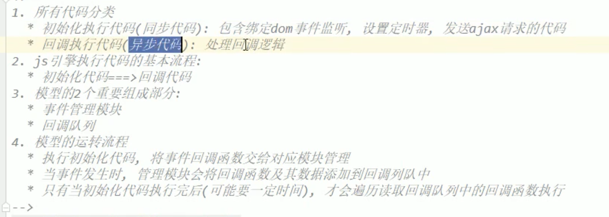
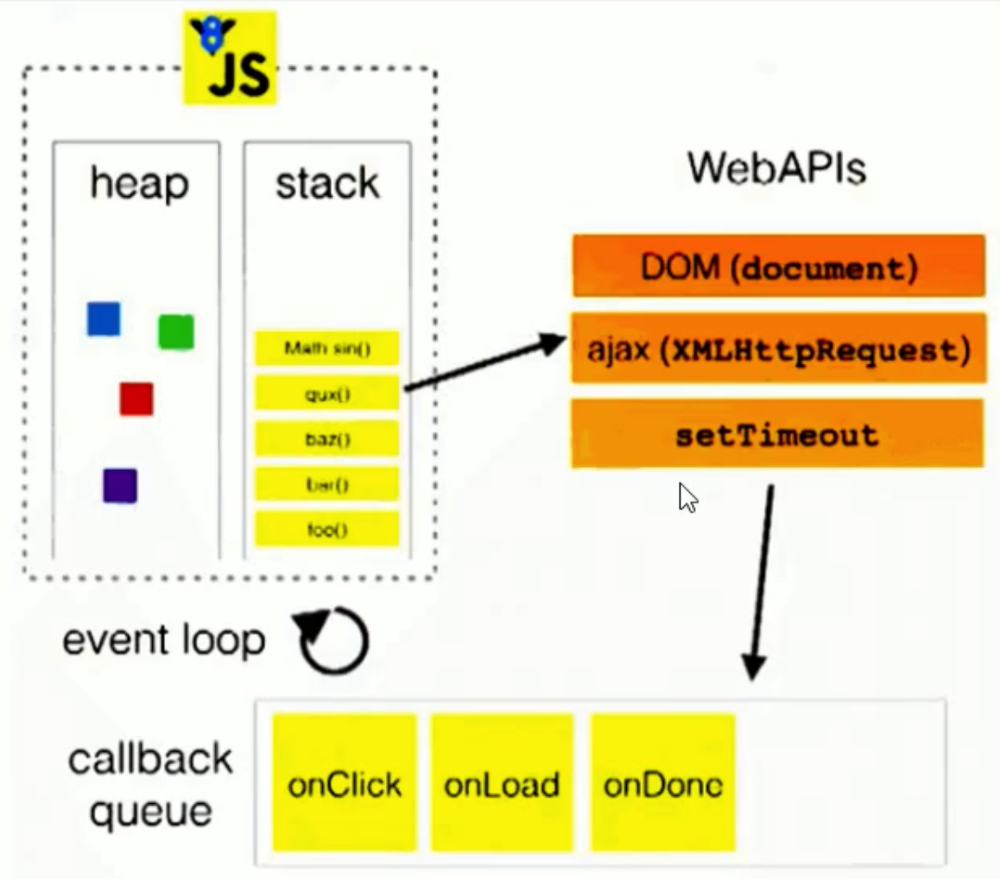
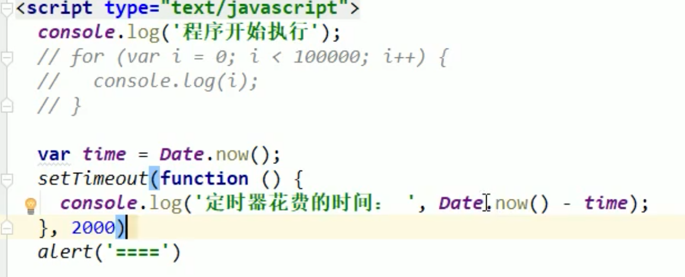
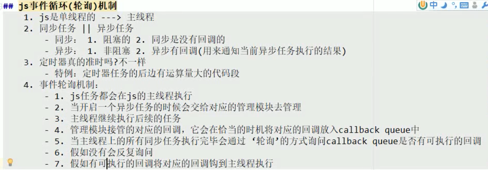

单进程：

老版本火狐

老版本IE

多进程多线程：

新版本火狐

chrome

新版IE

单进程：每个程序代表一个进程，通过任务管理器去查看。chrome中每开一个窗口就开启一个进程，每开一个标签页就是在该进程中开启一个线程。

老版本火狐单进程单线程：

优点：减少了CPU的消耗，多线程需要切换运行，因此开的线程越多切换频率越大，消耗CPU时间越多，因此单线程高效。

缺点：一损俱损，一个标签页崩溃，也就是运行该标签页的线程崩溃，也就是所有标签页都崩溃。

千万不要在定时器代码后面添加运算量巨大的代码，这样导致定时误差非常大

同步没有回调的原因：代码是顺序，后面代码会等待前面代码执行完才会执行。

## 事件循环

事件循环图：类似于iOSrunloop，等待主线程所有代码执行完成后，查看callback queue是否有需要执行的回调函数，有则执行，没有则在下一次event loop中再次查看

event回调函数在哪里执行？  --- 在JS的主线程中执行

定时器的回调函数在哪里执行？ --- 在JS的主线程中执行

#### 定时器需要销毁吗？

影响定时器不准时是哪一个阶段，第5个阶段