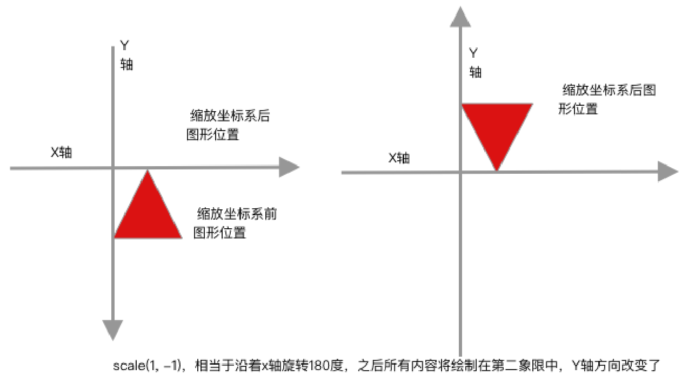

# canvas标签

> canvas为H5新增的标签，用来实现绘图功能。canvas标签为`行内块`，可以将其当成一个img标签。
>
> ​	
>
> canvas标签与img的区别：
>
> 1. canvas中可以添加子元素，而img标签是自结束标签。
> 2. canvas标签的兼容性，在canvas标签添加兼容标签，当浏览器支持canvas标签时，浏览器不会解析canvas标签中的内容，当浏览器不支持canvas标签时，浏览器将其当成一个span标签，读取其中内容显示。

```html
<!-- width和height用来定义canvas标签的宽高 -->
<canvas width=400 height=500>
 		<!-- 该浏览器不支持canvas标签，显示内部图片 -->
  	
</canvas>
```

## canvas属性

> canvas标签只有两个属性：`width`和`height`，这两个属性默认值为`300px * 150px`
>
> 
>
> 存在两种设置canvas宽高的方式，1是通过属性直接设置，2是通过css设置，两者的区别：
>
> * 使用属性设置宽高时，设置的是画布的宽高，改变画布宽高时，其中绘制的内容的大小不会改变。
> * 使用css设置宽高时，设置的是浏览器渲染的宽高，是先将绘制的内容绘制在默认宽高的画布上， 然后伸缩画布到指定的宽高，这样会导致`绘制的内容变形`。
>
> `不要使用css给canvas设置宽高的效果，会造成图形的变形和失真。`

```html
<!DOCTYPE html>
<html>

<head>
    <meta charset="utf-8" />
    <style type="text/css">
        #cav {
          background-color: coral;
        }
	      #cav1{
          background-color: green;
          width:400px;
          height:400px;
      }
    </style>
</head>

<body>
    <canvas id="cav" width="400px" height="400px"></canvas>
  	<canvas id="cav1"></canvas>
  
  	<script>
  			var cav1 = document.querySelector('#cav');
      	var ctx1 = cav1.getContext('2d');
      	ctx1.fillStyle = "#0000ff";
      	ctx1.fillRect(50, 50, 100, 100);
      	
	      var cav2 = document.querySelector('#cav1');	
        var ctx2 = cav2.getContext('2d');
      	ctx2.fillStyle = "#0000ff";
      	ctx2.fillRect(50, 50, 100, 100);
    </script>
</body>

</html>
```


## 绘图上下文

> 绘图上下文：可以理解画布，想要在canvas中绘制图形，必须要获得canvas对应的绘制上下文。
>
> 
>
> 绘图上下文维度：
>
> 1. 2d：获取绘制2d图形的上下文，getContext('2d')
> 2. Webgl：获取绘制3d图形的上下文，getContext('webgl')

### 绘图坐标系

> 绘图上下文的坐标系：
>
> ​		以canvas标签的左上角为原点，水平向右为X轴方向，垂直向下为Y轴方向，垂直屏幕指向用户方向为Z轴方向。


### 绘图步骤

> 1. 获取canvas元素对象
> 2. 通过canvas对象获取该对象的绘制图形上下文。
> 3. 开启路径。
> 4. 绘制图形。
> 5. 根据路径绘制图形。

```html
<html>
  <body>
    <canvas class="cas">
    	当前浏览器不支持canvas标签
    </canvas>
  </body>
  
  <script>
	  // 1、获取canvas标签
		var canvasNode = document.querySelector('.cas');
    // 2、获取当前canvas的绘图上下文
    var ctx = canvasNode.getContext('2d');
    // 3、开启路径
    ctx.beginPath();
    // 4、制定绘制的路线
    ctx.moveTo(10, 10);
    ctx.lineTo(100, 10);
    // 5、根据路径描边，将路线画到画布上。
    ctx.stroke();
    
  </script>
</html>
```


### beginPath()-开启路径

> beginpath()作用：
>
> 1. 绘制路径，相当于画家在绘画时的草图，先在页面上使用铅笔绘制一个草图，然后在进行上色。
> 2. 隔离其它的绘制，绘制新草图，使用新画笔(画笔颜色和宽度等重新设置)上色，也可以理解为创建了一个绘制作用域，调用stroke和fill方法时，只能对作用域中的路径进行上色。
>
> ` beginPath：`
>
> ​		开启路径其实是创建一个列表，调用绘图方法生成的子路径都会保存到这个列表中(例如线、弧形等等)，而每次这个方法调用之后，列表清空重置，然后我们就可以重新绘制新的图形。`这就是隔离的实现原理`。
>
> 
>
> 想在画布上绘制三条颜色不同，宽度不同，位置不同的线条：
>
> ​		左图为不使用beginPath()隔离时的绘制结果，右图为使用beginPath()隔离时的绘制结果，上面beginPath第二条作用说了用来隔离两次绘制。
>
>  


```js
// 绘制第一条线段
ctx.lineWidth = 30;
ctx.strokeStyle = 'red';
ctx.moveTo(100, 100);
ctx.lineTo(300, 100);
ctx.stroke();

// 绘制第二条线段
ctx.lineWidth = 20;
ctx.strokeStyle = 'green';
ctx.moveTo(100, 200);
ctx.lineTo(300, 200);
ctx.stroke();

// 绘制第三条线段
ctx.lineWidth = 10;
ctx.strokeStyle = 'orange';
ctx.moveTo(100, 300);
ctx.lineTo(300, 300);
ctx.stroke();

// 可以看出stroke()会将所有设置的路径都绘制绘制一遍。
```

```javascript
// 绘制第一条线段
ctx.beginPath();
ctx.lineWidth = 30;
ctx.strokeStyle = 'red';
ctx.moveTo(100, 100);
ctx.lineTo(300, 100);
ctx.stroke();

// 绘制第二条线段
ctx.beginPath();
ctx.lineWidth = 20;
ctx.strokeStyle = 'green';
ctx.moveTo(100, 200);
ctx.lineTo(300, 200);
ctx.stroke();

// 绘制第三条线段
ctx.beginPath();
ctx.lineWidth = 10;
ctx.strokeStyle = 'orange';
ctx.moveTo(100, 300);
ctx.lineTo(300, 300);
ctx.stroke();

// 可以看出beginPath()会将路径进行隔离，设置stroke()方法绘制的范围。
```


### 绘图上下文属性

>绘图上下文属性：
>
>* lineWidth：设置描边的线条粗细。
>* strokeStyle：设置描边的线条颜色。
>* fillStyle：设置填充的颜色。
>* lineCap：线段的始末样式 
>* lineJoin：线段的转角样式
>
>lineCap：
>
>* butt:  线段末端以方形结束。(默认值)
>* round :  线段末端以圆形结束
>* square:  线段末端以方形结束，这个方形的width=线宽的一半，height=线宽。
>
>lineJoin：
>
>- round : 圆角
>- bevel : 斜角，无锋利的尖
>- miter : 直角

### 绘图上下文绘制线条方法

> 
>
> * beginPath()：创建绘制路径
> * moveTo()：设置绘制路径的起始点，每次调用beginPath时，都需要调用该方法，用来指定绘制的起始位置。
> * lineTo()：设置绘制路径的终点，需要指定起始点。
> * Stroke()：对设置的路径画到画布上。
> * fill()：对设置的路径包裹的区域填充到画布上。
> * closePath()：将路径的终点和起点使用线段连接起来，形成一个闭合区域，当起点与终点已经连接时，该函数不做任何操作。
> * arc()：用来绘制一个圆弧，包含起点和终点无需指定起始点
> * arcTo()：用来绘制一个圆弧，第二种画圆弧方式，效果与arc一样，只是参数不同，需要指定起始点。
> * quadraticCurveTo()：绘制二次贝塞尔曲线。
> * bezierCurveTo()：绘制三次贝塞尔曲线。
>
> arc函数参数说明：`绘制时0度为绘制上下文X轴，顺时针角度为正值，逆时针角度为负值`
>
> 1. 圆心X轴坐标
> 2. 圆心Y轴坐标
> 3. 圆半径
> 4. 绘制的起始角度
> 5. 绘制的结束角度
> 6. 绘制方向，false为逆时针方向
>
> 通过控制角度和绘制方向，来得到优弧(大于180度)和劣弧，例如30度～90度，顺时针方向获得劣弧，逆时针方向为优弧，总结规律：
>
> 1. 角度为正值时，顺时针为劣弧，逆时针获得优弧。
> 2. 角度为负值时，顺时针为优弧，逆时针为劣弧。
>
>  
>
> arcTo函数参数说明：`两个切线形成的圆弧`
>
> 1. 两条切线相交点的X轴坐标
> 2. 两条切线相交点的Y轴坐标
> 3. 一条切线的某个点的X轴坐标
> 4. 一条切线的某个点的Y轴坐标
> 5. 圆半径
>
> 通过两个切线来画圆弧，通过三个点+一个半径得到圆弧。


### 绘制图形的方法

> * fillRect(x, y, width, height)：绘制一个实心矩形
> * strokeRect(x, y, width, height)：绘制一个空心矩形
> * clearRect(x, y, width, height)：清空某个范围中绘制的图形，非常常用。
>
> 方法说明：
>
> 1. 前两个方法是封装方法，内部开启一个新路径，然后画一个矩形，然后调用fill或者stroke方法。
> 2. 最后一个方法用来清空指定区域中绘制的图形。

### 绘制注意事项

> 1. 每次调用beginpath()方法后，如果先调用哪些没有起始点的绘制路径函数，需要指定一个起始点，否则没有起始点的绘图路径函数绘制的路径会因为没有起始点而无法生效。
> 2. 在一次绘制过程中，浏览器会将所有绘制的路径使用线段连接，分两种情况：
>    1. 对于没有起始点的绘制路径函数(lineTo方法)，它的起始点为上一个路径的终点。
>    2. 对于有起始点的绘制路径函数(arc方法)，浏览器会使用线段将上一个路径的终点和当前绘制路径的起点相连。

```javascript
var ctx = cavans.getContext('2d');
ctx.beginPath();
ctx.moveTo(0,0); // 给路径指定起始点，为后面
ctx.lineTo(10, 10); // linetTo函数没有起始点，因此使用上一个路径终点(0,0)
ctx.lineTo(30, 10); // linetTo函数没有起始点，因此使用上一个路径终点(10,10)
ctx.arc(40,50, 30, 0, Math.PI, false); // arc函数带有起始点，因此使用上一个路径终点与它的起始点相连。
ctx.lineTo(70, 10); // linetTo函数没有起始点，因此使用上一个路径终点。
```


## 形变与状态保存

> canvas的形变指的是对坐标系进行形变操作，例如旋转、平移和伸缩操作。
>
> canvas支持保存某一时刻的坐标系和恢复之前的坐标系。

### 形变操作

> 形变操作：
>
> * translate (x, y)：坐标系位移，x表示X轴的偏移量，y表示Y轴偏移量
> * scale(x, y)：坐标系缩放，默认为1，大于1放大，小于1缩小，负值相当于将坐标轴翻转。
> * rotate(弧度)：坐标系旋转，弧度为正值顺时针旋转，弧度为负值逆时针旋转，默认x轴方向为3点钟方向。

#### 平移坐标系

> 使用translate()方法，将绘图上下文的坐标原点进行位移，下图表示将坐标系原点移动到(200, 200)的位置，之后绘制的图片从(200, 200)开始。

```javascript
var node = document.querySelector('canvas');
var ctx = node.getContext('2d');
ctx.translate(200, 200);
ctx.beginPath();
ctx.fillStyle="green";
ctx.fillRect(0,0, 100, 100);
```


#### 旋转坐标系

> rotate()旋转坐标系，接收数据的单位为`弧度`，因此需要将角度转换成弧度，如图展示，向下旋转弧度为正值。
>
>  
>
> 角度转换成弧度公式：`x / 180 * Math.PI`。


```javascript
var node = document.querySelector('canvas');
var ctx = node.getContext('2d');
ctx.rotate(60 / 180 * Math.PI);
ctx.beginPath();
ctx.fillStyle="green";
ctx.fillRect(0,0, 100, 100);
```

#### 缩放坐标系

> scale(x, y)接收两个参数，X轴方向缩放和Y轴方向缩放，默认为scale(1, 1)，即X和Y轴不进行缩放。
>
>  
>
> 参数取值情况：
>
> 1. `>1`：对X轴或者Y轴进行拉伸操作，之前绘制的图形，1点 = n个像素。
> 2. `0~1`：对X轴或者Y轴进行收缩操作，之前绘制的图形，1点 = 1/n个像素。
> 3. `-1 ~ 0`：对X轴或者Y轴进行翻转180度，然后进行收缩操作，之前绘制的图形，1点 = 1/n个像素。
> 4. `< -1`：对X轴或者Y轴进行翻转180度，然后进行拉伸操作，之前绘制的图形，1点 = n个像素。
> 5. `1`：默认取值，不进行缩放。
> 6. `-1`：对X轴或者Y轴进行翻转180度。
>
> 注意：
>
> 		1. 在使用图形上下文绘制时，`不缩放缩放情况下，1个单位 == 1个逻辑像素`。如果我们设置缩放因子是 0.5，1 个单位就变成对应 0.5 个逻辑像素，这样绘制出来的形状就会是原先的一半。同理，设置为 2.0 时，1 个单位就对应变成了 2 像素，绘制的结果就是图形放大了 2 倍。
>   		2. `X轴缩放为-1，表示Y轴方向旋转180度，Y轴缩放-1，表示X轴方向旋转180度，并且坐标系方向指向相反方向`
>
>  
>
> scale应用：
>
> ​		由于设置为-1的特性，可以使用scale实现对图片的翻转操作。

```javascript
var node = document.querySelector('canvas');
var ctx = node.getContext('2d');
ctx.scale(1, -1); // 将坐标系沿着X轴方向旋转180度。
ctx.beginPath();
ctx.fillStyle="green";
ctx.fillRect(0,0, 100, 100);
```




```javascript
let canvas = document.querySelector('canvas');
let ctx = canvas.getContext('2d');
// 创建图片对象
let img = new Image(200, 200);
// 设置图片路径
img.src = './1.jpg'
// 当图片加载完成后，将图片绘制到canvas上。
img.onload = function(){
	ctx.drawImage(img, 0, 0, 200, 200);
}
            
// 设置坐标系沿X轴旋转180度。
ctx.scale(1, -1);
// Y轴正方向为向上，canvas只显示第三象限内容，图片由于坐标系的旋转跑到第二象限，因此需要向负方向平移200单位。
ctx.translate(0, -200);
```


### 状态保存

> ​		由于canvas支持坐标系的变换，变换完需要恢复到默认的坐标系，需要记住坐标系发生哪些形变操作，非常麻烦，因此canvas提供了记录和返回当前坐标系的方法。
>
>  
>
> * save()：状态保存，将当前绘制上下文的状态保存起来，包括lineWidth、fillStyle、strokeStyle、lineCap、lineJoin、当前形变状态等等信息。
> * restore()：恢复之前保存的绘制上下文状态。
>
> save和restore函数的理解：
>
> 1. save不光是保存坐标系状态(translate、scale、rotate)，还保存着当前给上下文设置的属性值，lineWidth、fillStyle、strokeStyle等信息。
> 2. save和restore在代码中是成对出现的，并且可以嵌套使用，就像大括号的功能一样划分作用域。
>
> ​	
>
> 对于save和restore函数使用的误解：
>
> ​		之前在使用这两个函数时，以为使用save函数保存完，可以无限使用restore重置为保存的绘制上下文状态。
>
>  
>
> save和restore实现原理：
>
> ​		它们是使用栈结构来实现状态保存，每调用一次save，会将ctx信息保存到栈中，每调用一次restore，会将栈顶的ctx信息出栈。

```javascript
// 使用代码块来理解save和restore函数
{  // save
  { // save
    { // save
      
    } // restore
  } // restore
} // restore
```


## canvas标签和绘图上下文的的兼容性处理

> 对应IE8及以下版本浏览器会将canvas标签当成一个div标签，显示其中的内容，而高版本会忽略其中内容。

```html
<!-- width和height用来定义canvas标签的宽高 -->
<canvas width=400 height=500>
 		<!-- 该浏览器不支持canvas标签，显示内部图片 -->
  	
</canvas>
<script>
		(function(){
      var canvas = document.querySelector('canvas');
      // 判断当前浏览器是否支持canvas，不支持则不在进行绘制操作。
      if(!canvas.getContext) return;
      let ctx = canvas.getContext('2d');
      // 绘图操作
    });
		
		
</script>
```


## 动态修改canvas标签宽高

> ​		canvas标签支持使用JS修改其宽高，但是需要注意的是，如果画布上已经有内容了，一旦修改了canvas标签的宽高时，画布中的内容会清空。