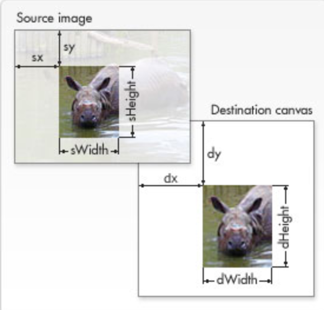
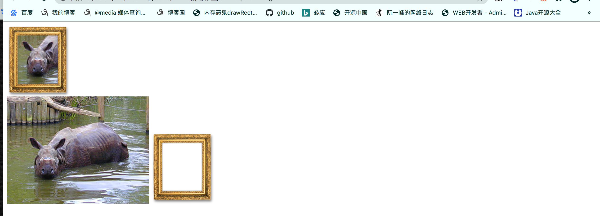

# 绘制图片

> canvas支持将图片绘制到canvas区域中，可以用于图片的合成、只有浏览器支持的图片格式，canvas都能绘制。

## 绘制的图片源

>canvas允许通过下面几种方式获取图片：
>
>1. Image对象，创建image对象，设置src获取图片。
>2. img标签，读取img标签中的图片。
>3. 其它的canvas标签，将其它画布的内容当成图片。
>4. video标签的第一帧作为图片源。
>
>src加载图片方式：
>
>1. 设置url地址，注册load事件，监听图片下载完毕，然后做操作。
>2. 通过data:url方式，即将图片资源转成成base64，直接赋值给src，这种方式好处是图片直接写在js文件或者html文件中，减少图片网络请求，缺点无法复用，如果另一个地方也需要该图片时，也需要写一份。
>
>canvas绘制图片注意点：
>
>1. 保证调用drawImage方法时，图片资源已经下载到本地，否则绘制不到canvas中。
>2. 将其它canvas标签中的内容到该canvas时，必须保证其它canvas标签内容已经绘制完毕，否则绘制不成功。

```html
<html>
<head>
    <style>
        #source{
            width: 200px;
            height: 150px;
        }
        video{
            width: 200px;
            height:100px;
        }
    </style>
</head>
<body>
    <canvas id="canvas1" width="300" height="300"></canvas>
    <canvas id="canvas2" width="300" height="300"></canvas>
    <canvas id="canvas3" width="300" height="300"></canvas>
    <div style="display: none;">
        
        
        <video id="vid" src="./EP03.mp4" controls></video>
    </div>
    <script>
        function draw() {
            var canvas = document.getElementById('canvas1');
            var canvas2 = document.getElementById('canvas2');
            var ctx = canvas.getContext('2d');
            var ctx2 = canvas2.getContext('2d');
            // 方式1：通过image创建图片对象
            var img = new Image(200, 150);
            img.src = "https://mdn.mozillademos.org/files/5397/rhino.jpg";
            img.onload = function(){
                ctx.drawImage(img, 0, 0, 200, 150); 
                ctx3.drawImage(img, 0, 0, 200, 100);
            }
      
            // 方式2：img标签中的图片绘制到canvas，由于方法被添加到window.onload中
            var imgs = document.querySelector('#frame');
            ctx.drawImage(imgs, 0, 200, 200, 150);

            // 方式3：其它canvas中的内容绘制到canvas，等待canvas对象绘制完成后，再绘制。
            setTimeout(function(){
                ctx2.drawImage(canvas, 0, 0, 300, 300);
            }, 10);
        }
        window.onload = function(){
            draw();
        }
    </script>
</body>

</html>
```


## 绘制方法

> 绘制上下文提供了drawImage方法，将图片绘制到canvas上。
>
> 
>
> 使用方式：
>
> drawImage(img, x, y)：从canvas的(x,y)为起始点绘制图片资源，图片会以原始尺寸显示。
>
> drawImage(img, x, y, width, height)：从canvas的(x,y)为起始点绘制图片资源，并将图片压缩到width和height大小。
>
> drawImage(img, x, y, width, height, sx, sy, width, sheight)：做图片切片。

### 图片切片

> drawImage(image, sx, sy, sWidth, sHeight, dx, dy, dWidth, dHeight)参数说明：
>
> 1. Image：图片资源，img对象或者标签节点。
> 2. sx：绘制到canvas上的起始点X轴坐标。
> 3. sy：绘制到canvas上的起始点Y轴坐标。
> 4. sWidth：绘制到canvas上的图片width。
> 5. 参数5：绘制到canvas上的图片height。
> 6. 参数6：图片资源切片的起始点X轴坐标。
> 7. 参数7：图片资源切片的起始点Y轴坐标。
> 8. 参数8：图片资源切片的width。
> 9. 参数9：图片资源切片的height。
>
> 下图展示了图片切片的运作方式，截取source image中的一小段放到canvas中。



 

> 下面使用切片实现相框效果

```html
<html>

<body>
    <canvas id="canvas" width="150" height="150"></canvas>
    <br>下面展示canvas中所使用的资源图片
    <div>
        
        
    </div>
    <script>
        function draw() {
            var canvas = document.getElementById('canvas');
            var ctx = canvas.getContext('2d');

            // Draw slice
            ctx.drawImage(document.getElementById('source'),
                33, 71, 104, 124, 21, 20, 87, 104);

            // Draw frame
            ctx.drawImage(document.getElementById('frame'), 0, 0);
        }
        // 将绘制方法放在window.onload回调函数中，保证绘制时图片已经下载完成
        window.onload = function(){
            draw();
        }
    </script>
</body>

</html>
```




## 控制图片缩放时的绘制

> 过度缩放图像可能会导致图像模糊或像素化。您可以通过使用绘图环境的[`imageSmoothingEnabled`](https://developer.mozilla.org/zh-CN/docs/Web/API/CanvasRenderingContext2D/imageSmoothingEnabled)属性来控制是否在缩放图像时使用平滑算法。默认值为`true`
>
>  
>
> ctx.mozImageSmoothingEnabled = false;
> ctx.webkitImageSmoothingEnabled = false;
> ctx.msImageSmoothingEnabled = false;
> ctx.imageSmoothingEnabled = false;