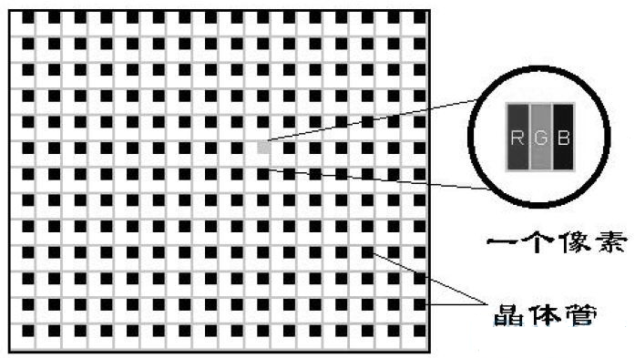
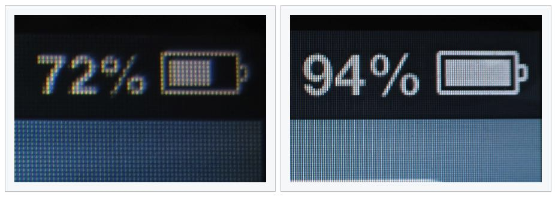
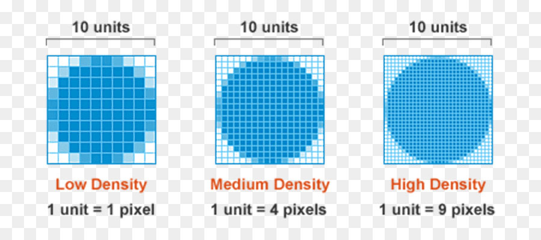
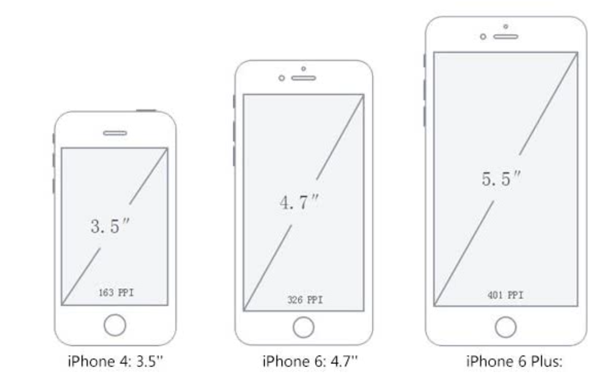
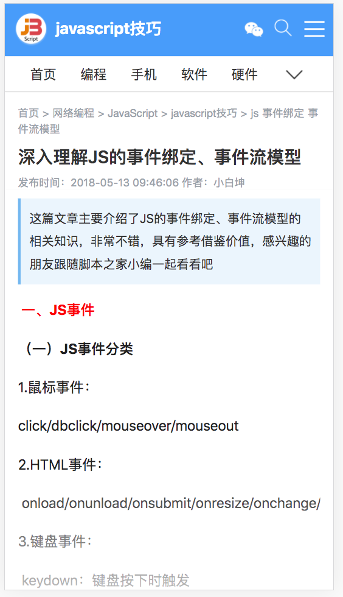

# 基本概念

## 单位

> css中有两种单位分别为，`绝对单位`和`相对单位`。
>
>  
>
> 绝对单位：pt
>
> 相对单位：px、rem、em、vm

### pt与px

> * `px`：屏幕显示的相对单位，屏幕是由一个个点阵组成，1px代表n个屏幕发光的灯泡，但灯泡有大小之分，会在PPI和DPI解释。
> * `pt`：现实中的固定可测量的长度单位，不是以屏幕的点作为衡量，而是以长度衡量，`1英寸 = 72pt`这是固定写死的单位换算，和1cm=10mm一样。
>
> 举例说明：
>
> ​		例如在屏幕中显示2条横线，长度分别为72px和72pt，使用72pt的横线为1英寸长，因此无论屏幕分辨率和PPI如何变，横线的长度就是1英寸(可以使用尺子量)；使用72px的横线会随着屏幕的分辨率、PPI以及DPR的不同，横线的长度发生改变。
>
> 
>
> pt与px的换算关系：
>
> ​		1英寸 = 72 * 1pt = ppi * 1dp(这里的dp为物理像素1px)，1pt = ppi / 72 (px)。`检测100pt在手机显示为多少px？`

### rem与em

> * `rem`：是参照html标签的font-size属性值，例如html的font-size=30px时，1rem = 30px。`需要注意rem最小值为12px，当html的font-size值小于12px时，1rem = 12px，不会再小了`。
> * `em`：是参照自身元素的font-size属性值，但是font-size属性有继承性，因此当前元素没有设置，父元素设置时，参照父元素的font-size。使用em时，font-size可以设置为0px。
>
> `rem和em的用处`：
>
> ​		rem和em这两个单位一般用在移动端网页上，由于移动端屏幕过于小并且尺寸不一，如果使用px或者pt单位，那么需要给每种设置一套css样式，开发成本高非常难以维护，因此使用rem或em来实现移动端屏幕的适配问题，根据屏幕尺寸改变rem或em的参照值大小，实现屏幕的适配问题。(在后面移动端适配中会讲解)。
>
>  
>
> `rem和em的区别`：
>
> ​		由于rem是参照html标签的font-size属性，因此当html标签的font-size改变时会影响当前页面所有使用rem单位的元素；em是参照当前元素的font-size属性，但是由于font-size的继承性，导致开发者需要实时明确使用em单位的地方，参照的是哪个元素的font-size。
>
>  
>
> `rem和em的用法`：
>
> 1. rem用在对网页整体适配，实现不同屏幕显示时，缩放页面，达到页面效果一样。
> 2. em用在对网页局部内容的适配，对于需要经常变动的地方，使用em，保证不会影响页面其它部分。
>
> 下面是使用em单位时，参照物不同最终换算出的px会不同

```html
<!-- 
			计算当前div3的宽高：
			div3.font-size继承自div2.font-size，div2.font-size使用em单位，因此参照父元素div1的font-size.ss
			div3.font-size = div2.font-size = div1.font-size * 1.5 = 20 * 1.5 = 30px;
			div3.width = div3.height = 30px * 1.5 = 45px
-->
<style>

  #div1{
    font-size:20px;
  }
  
  #div2{
    font-size:1.5em; /* font-size: 1.5 * 20px = 30px */
  }
  
  #div3{
    width:1.5em;
    height:1.5em;
  }
</style>

<div id='div1'>
	<div id='div2'>
		<div id='div3'>

		</div>
	</div>
</div>
```

### vw、vh、vmax、vmin

> 这些单位是使用比例实现，参照布局视口的宽高，实现响应式布局。
>
>  
>
> `vw`：参照布局视口的宽度，1vw =1% * 布局视口宽度
>
> `vh`：参照布局视口的高度，1vw = 1% * 布局视口高度
>
> `vmax`：参照布局视口的宽高最大值，例如视口w:800px，h:1000px，1vmax = 1% * 布局视口高度 = 10px，视口高>视口宽，因此参照视口高
>
> `vmin`：参照布局视口的宽高最小值，例如视口w:800px，h:1000px，1vmin = 1vw = 1% * 布局视口宽度 = 8px，视口高>视口宽，因此参照视口宽
>
>  
>
> vmax与vmin作用：
>
> ​	这两个单位主要用在移动端横竖屏中，在横竖屏切换时，字体不会改变，因为vmin和vmax无论横竖屏如何切换，总会操作视口宽高的最小值和最大值。

## (设备|逻辑)像素、像素密度、设备像素比

>  `DP(device pixel)`：
>
> ​		设备物理像素点，指的是屏幕上的发光灯泡，我们现实中所说的屏幕分辨率1920 * 1080就是说屏幕宽度有1920个dp，高度有1080个dp。
>
> 
>
> `DIP(device independent pixel)`：
>
> ​		设备逻辑像素点(设备无关像素点)，这个单位的提出是为了解决屏幕视频的问题，以前的屏幕都是一个像素点对应一个屏幕的灯泡，因此没有这个逻辑像素点，但是自从苹果公司的retina屏幕出现，兴起了高清屏的概念，出现了1个像素点对应多个屏幕灯泡的情况，因此为了更好的适配屏幕，提出了逻辑像素点，在页面布局时不用考虑屏幕是否为高清屏，设备显示时有设备根据自己的屏幕特点相应的处理(像素点*n，图片使用高清图)。
>
> 
>
> `PPI和DPI`：
>
> ​		像素密度，两者都是描述像素密度，但是PPI针对屏幕，DPI针对打印机。表示`1英寸中有多少个像素点`，手机屏幕的PPI计算为`屏幕斜线的像素点/屏幕尺寸`，苹果给出的一个标准，手机屏幕达到 300PPI、平板屏幕达到 220PPI、笔记本电脑屏幕达到 200PPI 即可认为是 Retina 屏幕。
>
>  
>
> `DPR(device pixel Ratio)`：
>
> ​		设备像素比，用来指定页面无缩放时，逻辑像素与物理像素对应比值，换句话说`1个逻辑像素对应几个物理像素，它们之间的换算公式为1px=dpr^2*dp`，DPR是通过PPI计算出来的，DPR = floor(PPI / 160)。例如iphone的DPR为 386ppi / 160 = 2.05

### 这些概念提出的意义

> `像素密度提出的意义`：
>
> ​		让用户区分屏幕是否为高清屏的一个指标，我们之间说了屏幕是由一个个发光的小灯泡组成，因此只关注屏幕分辨了，灯泡的大小就可以随意关闭，例如13寸电脑的屏幕横向屏幕分辨率为1080，5寸手机的屏幕横向屏幕分辨率也为1080，此时哪个屏幕显示效果好，很明显是手机，因为它的灯泡做的更小。这就是为何要提出像素密度的原因，只提分辨率是耍流氓，只有PPI高的屏幕才能算好的显示屏幕。
>
>  
>
> `逻辑像素的提出意义`：
>
> ​		为了解决2k、4k屏的适配问题，2k和4k屏幕的提出并不是为了增大屏幕的显示面积让屏幕显示更多的内容，因为在不适配的情况下，在普通屏中显示的页面放在高清屏中会变得很小(尺寸没变，像素点多了)。如果给每个高清屏编写一份代码，大大提高工作量和维护成本，因此提出了逻辑像素概念，让开发者针对逻辑像素开发，显示时系统根据屏幕的像素比进行放大。
>
>  
>
> `PPI高的屏幕好处`：
>
> ​		提高屏幕的显示效果，对于位图来说，放在PPI低的屏幕上，再高清的图片也是有锯齿的，放在PPI高的屏幕上，更小屏幕显示，小会让用户忽略其中的细节。
>
>  
>
> 下面图片展示的内容：
>
> 1. 图1：屏幕的的组成，有一个个发光灯泡组成。
> 2. 图2：高清屏相比于普通屏显示的效果更好，颗粒感更弱。
> 3. 图3：展示了1逻辑像素对应n个物理像素，例如1px = 9dp。
> 4. 图4：展示了屏幕尺寸是屏幕斜边长度。






## 位图和矢量图

> `位图图像`：亦称为点阵图像或栅格图像，是由单个的像素点组成的。放大后会失真。
>
> `矢量图`：也称为面向对象的图像或绘图图像，在数学上定义为一系列由线连接的点。放大后不会失真。
>
>  
>
> 如何完美的展示位图：
>
> ​		位图由于是由一个个像素点组成的，因此无论放大还是缩小都会让位图失真，因此位图最好的呈现方式是一个位图像素对应一个物理像素，这样才能完美的展示。

## 屏幕、浏览器和视口

> 屏幕宽高：screen.width、screen.height。
>
> 浏览器宽高：window.outerWidth和window.outerHeight。
>
> 视口宽高：视口宽高有两种方式获取：
>
> 1. document.documentElement.clientWidth和clientHeight，浏览器显示网页区域的宽度和高度。
> 2. window.innerWidth和innerHeight，浏览器的显示网页区域的宽度和高度。
>
>  两者获取视口宽高的区别：
>
> ​		当浏览器没有显示滚动条时，两者是相等的；当浏览器出现滚动条时，clientWidth和clientHeight不包含滚动条的宽高，innerWidth和innerHeight包含滚动条宽高。
>
> 
>
> 注意：视口即呈现网页的区域，`视口的宽高都是使用的逻辑像素`，而不是物理像素。

### 移动端和PC的视口

> PC中只有一个视口，它的大小为初始包含块的大小，移动端有三个视口：
>
> 1. 布局视口，虚拟的布局视口（layout viewport)，专门用来进行网页布局使用，使用的document.documentElement.clientWidth获取。
> 2. 视觉视口，用户可见区域，也就是展示网页的区域，在不缩放的情况下等于布局视口，使用window.innerWidth获取
> 3. 理想视口，`屏幕的逻辑像素 == 布局视口宽高`。
>
>  
>
> `视觉视口存在的意义`：
>
> ​		主要用在网页的缩放上，当网页进行缩放时，布局视口不会改变，而视觉视口会随着网页的变化而变化，网页放大时视觉视口变小，网页缩小时视觉视口变大。
>
>  
>
> `布局视口为何宽度为980px`：
>
> ​		在早期移动端刚兴起时，许多网站的网页并没有对手机进行适配，因此为了让这些网页也可以在手机中显示，因此将视口宽度设为980px，但是网页在屏幕中显示的非常非常小。
>
>  
>
> `理想视口存在的意义`：
>
> ​		为了解决手机适配问题，虽然将视口设置为980px可以展示网页，但是内容非常非常小，必须要放大显示，因此将视口宽度设置为屏幕的逻辑像素，然后再以这个宽度进行适配，展示效果会非常好。
>
>  
>
> `下图展示内容`：
>
> ​		下图中展示了同一个页面不同适配方式，左边图片视口宽度为980px，展示的样式与PC端显示的一模一样，但是缺点字体非常小，体验差；右边图片视口宽度为手机的逻辑像素375px(iphone6)，根据手机逻辑像素重新布局，展示样式与PC端完全时两个样式，优点是显示效果好，体验好，缺点是由于PC和移动端样式不一样，导致用户以为访问错了网页。




### 移动端和PC缩放

> PC放大时
>
> - 布局视口变小
> - 视觉视口变小
> - 元素的像素大小不变
>
> PC缩小时
>
> - 布局视口变大
> - 视觉视口变大
> - 元素的像素大小不变
>
> 移动端放大时
>
> - 布局视口不变
> - 视觉视口变小
>
> 移动端缩小时
>
> - 布局视口不变
> - 视觉视口变大
>
> <span style="color:#ee0b41">注意：移动端缩放不会影响页面布局</span>

 

### 移动端理想视口实现

>  使用meta标签的viewport属性来设置布局视口宽度，当布局视口宽度==屏幕逻辑视口宽度是为理想视口。
>
> <meta name="viewport" content="width=device-width, initial-scale=1.0, user-scaleable=no,maximum-scale=1.0, minimum-scale=1.0">
>
> * width：设置视口的宽度，两种值，一种为具体的像素值，另一种为device-width。
> * initial-scale：当前屏幕逻辑像素/布局视口宽度。
> * maximum-scale：当前屏幕逻辑像素/视觉视口宽度
> * minimum-scale：当前屏幕逻辑像素/视觉视口宽度
> * user-scaleable：是否支持用户缩放手势，或者说网页是否可以缩放。
>
> initical-scale如何确定布局视口宽度：
>
> ​		屏幕逻辑像素是屏幕自带属性，比值也知道了，因此布局视口宽度=屏幕逻辑像素 / initical-scale，例如手机为iphone6，initical-scale为0.5时，布局视口的宽度 = 375 / 0.5 = 750px。
>
>  
>
> width和initical-scale都设置视口宽度，听谁的：
>
> ​		浏览器会去两个值的最大值。
>
>  
>
> maximum-scale如何控制缩放比例：
>
> ​		和initical-scale计算布局视口一样，可以计算出视觉视口最大宽度是多少。因为移动端缩放只能改变视觉视口，因此控制视觉视口宽度缩放的最大最小值。
>
>   
>
>  `注意：一般移动端的网页都不建议缩放，大部分适配移动端的网页，在移动端浏览器中打开无法缩放，但是在safari浏览器中不认识user-scaleable属性，因此即使设置为no，也依然允许缩放。`

> 对于initical-scale到底影响着啥？
>
> ​		它其实用来控制视觉视口，例如：逻辑像素/布局视口 = 0.5时，布局视口宽度>手机宽度，网页显示的样式为整体缩小；逻辑像素/布局视口 = 2时，布局视口宽度<手机宽度，网页显示的样式为整体放大；相当于页面显示后，使用捏合手势放大或者缩小网页。
>
> 理想视口是啥？
>
> 布局视口 == 手机逻辑像素宽高 == 视觉视口(逻辑像素/布局视口)

### 刘海屏问题

> 对于iphoneX这些具有刘海屏的手机，使用`viewport-fit:cover`，解决网页在刘海屏中的留白问题。

```html
<!-- 1. 布局视口宽度=屏幕逻辑像素；
		 2. 网页缩放比例为1，即不缩放；
		 3. 禁止用户手动缩放
     4. 适配刘海屏-->
<meta name="viewport" content="width=device-width, initial-scale=1.0, user-scaleable=no,maximum-scale=1.0, minimum-scale=1.0, viewport-fit=cover">
```


## css像素转换

> ​		在css使用相对单位都是基于逻辑像素，而非物理像素来算的，因此在css中设置一个div的宽为100px时，在2倍屏中为200px，在3倍屏中为300px。这种转换过程由浏览器根据屏幕信息自动进行转换，开发者只需要关系网页在1倍屏情况下如何展示，浏览器会根据屏幕信息对页面进行放大处理。

### 针对高清屏的素材

>网页中的图片分为两种情况：
>
>1.  网页内结构图片，例如一些背景图、图标和轮播图。
>2. 有用户输入的图片，例如电商网站中用户商品评价中添加图片。
>
>高清屏加载网页时的图片选择：
>
>​		在适配高清屏时，两种图片的处理是不同的，对于网页内结构的图片，会根据屏幕是2x还是3x屏，去加载不同尺寸的图片；对于有用户上传的图片，一般所有屏幕都使用1x图，如果想要这些图片也进行高清屏的适配，则需要后端人员配合，生成对应的2x或者3x图片。
>
> 
>
>高清屏显示网页的缺点：由于高清屏需要2x或者3x图，这些高清图比1x图要多4倍或9倍的像素点，因此高清屏加载图片比普通屏更加耗费流量，适配的越好耗费的流量越大。

### css加载高清图

> css通过媒体查询实现针对不同屏幕加载不同图片。   
>
> 使用的媒体特性为：
>
> 1. -webkit-min-device-pixel-ratio，应用于chrome、safari和高版本PC或者移动端火狐浏览器中。
> 2. min--moz-device-pixel-ratio，应用在低版本的PC火狐浏览器中，因此在适配移动端时基本用不上。

```css

.photo {width:100px;height:100px;}
.photo {background-image: url(image100.png);}

/* 如果设备像素大于等于2，则用2倍图 */
@media only screen and (-webkit-min-device-pixel-ratio: 2),
only screen and (min--moz-device-pixel-ratio: 2) {
  .photo {
    background-image: url(image200.png);
    background-size: 100px 100px;
  }
}

/* 如果设备像素大于等于3，则用3倍图 */
@media only screen and (-webkit-min-device-pixel-ratio: 3),
only screen and (min--moz-device-pixel-ratio: 3) {
  .photo {
    background-image: url(image300.png);
    background-size: 100px 100px;
  }

```

