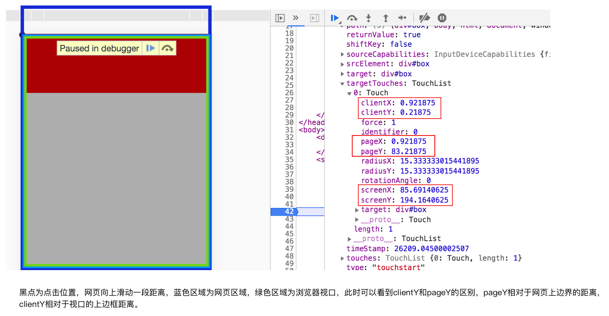

# 移动端事件

> 移动端也遵循PC的事件传播机制，事件捕获和事件冒泡，最常用的是事件冒泡。
>
> `冒泡事件传播路径`：
>
> ​		当触发某个元素的某个事件时，事件从当前元素传递到父元素，一直到window对象，例如点击一个元素时，该元素和该元素的所有祖先元素的click事件都会被触发。
>
>  
>
> `多点触控`：多点触控由苹果公司设计的，即支持多个手指同时触发事件，例如捏合手势(缩放事件)，手机最大支持5根手指同时操作屏幕，即只能识别到5个。
>
>  
>
> `事件处理`：
>
> ​		当一个元素触发事件时，该元素的所有祖先元素都会接收到该类型事件，但是接收不等于处理，因此当元素存在该事件回调函数时，就会调用该函数，没有则继续向父元素传递。

## 事件处理过程

> 事件处理过程：
>
> 1. 调用当前元素的事件处理函数，然后将事件传递给父元素。
> 2. 父元素如果有该事件的处理函数则调用，没有则继续向其父元素传递。
> 3. 一层层传递，... --> body--> html --> document对象 --> window对象，直到传递给window对象，如果有该事件的处理函数则调用，没有则移除该事件，表面该事件已经处理完毕。如果中间元素的事件回调函数调用stopPropagation，阻止事件传播，浏览器也会认为事件传播完毕。
> 4. 由浏览器开启最初触发该事件的元素的默认行为。

## 移动端触摸事件

> 移动端的触摸事件：
>
> 1. `touchstart`：当手指按在元素上，会触发该元素的touchstart事件，会调用该元素、其所有祖先元素和window中的touchstart回调函数。
> 2. `touchmove`：当手指按在元素上并且手指移动时，会触发该元素的touchmove事件，会调用该元素、其所有祖先元素和window中的touchmove回调函数。
> 3. `touchend`：当手指离开元素时，会触发该元素的touchend事件，会调用该元素、其所有祖先元素和window中的touchend回调函数。
> 4. `touchcancel`：当元素在触发touchstart和touchmove事件，被外部打断时(例如来电话)时，会触发该元素的touchcancel事件，会调用该元素、其所有祖先元素和window中的touchcancel回调函数。

### 移动端触摸事件特点

> touchstart事件触发时会触发click事件的原因：
>
> ​		当元素触发touchstart事件时，会等待几十或几百毫秒后触发click事件，click事件是由浏览器生成，这样做的原因就是为了判断用户是否为点击操作，因为移动端所有事件都是需要通过手指触摸元素来实现的，不像PC有一个鼠标，因此当touchstart触发时，浏览器不知道用户是想点击还是想干其它事情，因此会等待几百毫秒，在这几百毫秒内，如果该元素没有其它事件触发时，浏览器会自动生成一个click事件让元素处理。(`这就是为何移动端不使用click处理点击事件，因为延迟问题`)
>
>  
>
> 理想视口与非理想视口在触发click事件的区别：
>
> 1. 当页面设置为理想视口时，touchstart和click之间的事件间隔会在100ms之间。
> 2. 当页面没有设置理想视口时，touchstart和click之间的事件间隔会在300ms左右。
>
> 元素的touchstart和click事件是否有先后顺序：
>
> ​		当手指按在元素身上时，会触发该元素的touchstart事件，并传递给祖先元素，浏览器会等待20ms～300ms触发click事件，并传递给祖先元素，两个事件之间相互独立，不会相互影响。

### a标签实现跳转与使用div+touch实现跳转

> a标签的跳转是借助浏览器的默认行为，从上面事件处理过程就可以看出，使用a标签进行页面跳转的效率比使用div+touch的实现跳转方式要低。
>
> 
>
> 页面跳转的实现方式的选择：
>
> 		1. 在乎性能，使用div+touch实现页面跳转，大大提高页面跳转的速度。
>
>   		2. 在乎SEO，a标签的好处在于指明当前页面一些信息，在搜索引擎搜索时会被关注到，因此更容易搜索到。

### touches、changedTouches、targetTouches

> 触摸事件对象中监测手指的属性有三个，touches、changedTouched和targetTouches，这三个属性都是数组，保存的是手指信息(例如位置)
>
>  
>
> touchstart事件中：
>
> * changedTouches：保存当前元素中增加的手指。
> * targetTouches：保存当前按在元素区域中的手指。
> * touches：保存当前按在屏幕中的手指。
>
> touchmove事件中：
>
> * changedTouches：滑动时，保存当前元素中正在移动的手指
> * targetTouches：滑动时，保存当前按在元素区域中的手指。
> * touches：滑动时，保存当前按在屏幕中的手指。
>
>  
>
> touchend事件中：
>
> * changedTouches：保存当前元素中减少的手指，即手指抬起。
> * targetTouches：保存当前按在元素区域中的手指。
> * touches：保存当前按在屏幕中的手指。
>
>  
>
> 这些数组中保存着touch对象，其中的属性：
>
> * clientX:手指距离视口左边框的逻辑像素
> * clientY：手指距离视口上边框的逻辑像素
> * pageX：手指距离网页左边框的逻辑像素，clientX与pageX在网页大于视口宽度时，出现滚动条情况下有差距。
> * pageY：手指距离网页上边框的逻辑像素，clientY与pageY在网页大于视口高度时，出现滚动条情况下有差距。
> * screenX：手指距离屏幕左边框的逻辑像素
> * screenY：手指距离屏幕上边框的逻辑像素



### PC端和移动端触摸事件差异

> 给元素添加事件回调函数方式：
>
> 1. 嵌套式，在PC端中实现元素拖拽时，在mousedown事件回调函数中给元素添加mousemove事件回调函数和mouseup事件回调函数。
> 2. 并列式，mousedown、mousemove和mouseup事件回调函数在同一个作用域中，不存在嵌套关系，但是需要使用状态变量实现，只有在mousedown触发时才能执行mousemove和mouseup事件回调函数。
>
> 
>
> PC端和移动端触摸事件差异：
>
> 1. `在添加回调函数的方式上`，由于移动端触摸事件的独特性，即想要实现在元素内部移动，则touchstart事件一定触发了，因此移动端回调函数通常使用并列式添加，而PC端因为鼠标的存在，当鼠标在元素内部移动，存在两种情况(鼠标未按下只是移动，鼠标按下并移动)，因此需要通过嵌套式排除不是拖拽的情况，也可以使用并列式并添加状态变量排除不是拖拽的情况。
> 2. `在移出元素范围的处理上`，当手指或者鼠标移动过快，移出元素范围时，PC端的处理，由于鼠标已经不在元素中，因此不会在触发mouseomove事件了；在移动端的处理，即使手指不在元素中，只有手指还没有抬起来，就会接着触发touchmove事件。
>
> 
>
> 
>
> 使用嵌套式的注意细节：
>
> ​		由于在函数中给元素添加另一个事件回调函数，需要进行事件存在性判断，否则每次执行事件回调函数都会给元素重复添加新的事件回调函数。

```html
<!-- PC端事件嵌套式需要移除内部添加的事件回调函数 -->
<!DOCTYPE html>
<html>
    <head>
        <style>
            #box{
                width: 50px;
                height: 50px;
                background-color: red;
                position: absolute;
            }
        </style>
    </head>
    <body>
        <div id="box"></div>
    </body>

    <script>
        var divNode = document.querySelector('#box');
      	// DOM0方式实现
        divNode.onmousedown = function(e){
            // 获取鼠标按下时的位置
            let divX = e.clientX;
            let divY = e.clientY;
            // 获取元素最初的位置
            let startLeft = this.offsetLeft;
            let startTop = this.offsetTop;
            document.onmousemove = function(e){
                // 获取鼠标移动的位置
                let mouseX = e.clientX;
                let mouseY = e.clientY;
                // 计算元素移动后的位置
                divNode.style.left = (e.clientX - divX + startLeft) +'px';
                divNode.style.top = (e.clientY - divY + startTop) +'px';
            }

            document.onmouseup = function(){
                // 移除mousemove和mouseup事件回调函数，防止干扰
                document.onmousemove  = document.onmouseup = null;
            }
        }
      
      // DOM2方式实现
      divNode.addEventListener('mousedown', function (e) {
        // 获取鼠标按下时的位置
        let divX = e.clientX;
        let divY = e.clientY;
        // 获取元素最初的位置
        let startLeft = this.offsetLeft;
        let startTop = this.offsetTop;

        function move() {
            // 获取鼠标移动的位置
            let mouseX = e.clientX;
            let mouseY = e.clientY;
            // 计算元素移动后的位置
            divNode.style.left = (e.clientX - divX + startLeft) + 'px';
            divNode.style.top = (e.clientY - divY + startTop) + 'px';
        }
        function up() {
            divNode.removeEventListener('mousemove', move);
            divNode.removeEventListener('mouseup', up);
        }
        divNode.addEventListener('mousemove', move);
        div.Node.addEventListener('mouseup', up);
    });
    </script>
</html>
```

## 事件之间的数据共享

> 事件之间的数据共享，例如常见的拖拽就需要事件之间共享数据。事件之间数据共享有三种方式：
>
> 1. 例如嵌套式实现的事件回调函数，可以借助闭包，像PC端和移动端添加触摸事件方式小节中的代码，就是使用闭包形式共享数据。
> 2. 找出事件回调函数的作用域链中的公共的作用域，在其中创建一个共享对象，保存数据。
> 3. 借助事件源对象，大部分情况都是给同一个元素添加事件，因此这些事件回调函数共享数据时，可以将数据以属性的形式保存到元素中。

```html
<!DOCTYPE html>
<html>

<head>
    <meta name="viewport" content="width=device-width, user-scalable = no">
    <meta http-equiv="X-UA-Compatible" content="ie=edge">
    <style>
        #box {
            width: 50px;
            height: 50px;
            background-color: red;
            position: absolute;
        }
    </style>
</head>

<body>
    <div id="box"></div>
</body>

<script>
    var divNode = document.querySelector('#box');
    // 将共享数据作为事件源的属性，实现数据的共享
    divNode.addEventListener('touchstart', function(e){
        this.startX = this.offsetLeft;
        this.startY = this.offsetTop;
        this.cx = e.changedTouches[0].clientX;
        this.cy = e.changedTouches[0].clientY;
    });

    divNode.addEventListener('touchmove', function(e){
        this.style.left = (e.changedTouches[0].clientX - this.cx + this.startX) + 'px';
        this.style.top = (e.changedTouches[0].clientY - this.cy + this.startY) + 'px';
    });
</script>

</html>
```

## 默认行为与阻止

> ​		浏览器默认行为，之前在PC端中接触过，即当与元素进行交互时，浏览器内置的交互处理程序，例如点击a标签时会跳转页面、点击form表单时会向服务器发送请求、点击文字会选中等。
>
>  
>
> 阻止默认行为：调用`e.preventDefault()`实现阻止浏览器默认行为。

### 事件穿透

> 事件穿透：
>
> ​		当存在两个不是父子关系的标签但是其中一个元素A叠放在另一个元素B上面，此时当点击元素A时，元素B也触发了相同的事件，此时这种情况，被称为事件穿透。
>
>  
>
> 事件穿透的发生原因：
>
> ​		事件穿透只在移动端的touchstart事件中发生，原因在与当触发元素的touchstart事件时，浏览器会在20～300ms之间触发该元素的click事件，如果元素消失不见时，那么浏览器会触发当前触摸位置的元素的click事件。这种事件穿透经常出现在遮罩情况，当点遮罩元素，元素消失，但是click事件被触摸位置的元素触发。
>
> 
>
> 阻止click事件穿透方式：
>
> 1. 在touchstart事件回调函数中，阻止浏览器默认行为，即不让浏览器触发click事件。
> 2. 在网页最外层包裹元素的touchstart事件回调函数中，阻止浏览器默认行为。
> 3. 使用div+data属性+touchstart来代替a标签，这样即使click事件穿透，div由于没有实现click事件回调函数，不会做任何操作。
> 4. touchstart回调函数中，延时400ms再执行操作。
>
> 解决click事件穿透的几种方式的优缺点：
>
> 		* 第二种方式，虽然解决了事件穿透问题，但是会阻止浏览器其它默认行为，例如页面将无法滚动、其他a标签无法跳转、form表单无法请求数据。
> 		* 第三种方式，可以解决click事件穿透问题，但是上面小节聊过使用a标签和div+touch跳转的区别。
> 		* 第四种方式，延迟当前元素的touchstart事件回调函数中代码的执行，让click事件也触发在当前元素上，可以很好的解决问题，但是缺点也是延时，效率低。

```html
<!doctype html>
<html lang="en">

<head>
    <meta charset="UTF-8">
    <meta name="viewport"
        content="width=device-width, user-scalable=no, initial-scale=1.0, maximum-scale=1.0, minimum-scale=1.0">
    <meta http-equiv="X-UA-Compatible" content="ie=edge">
    <title>点击穿透</title>
    <style>
        #nav {
            width: 80%; height: 100px; margin: 40px auto 0; display: flex;
        }

        .item {
            overflow: hidden; height: 60px; width: 60px;
        }

        .item img {
            border-radius: 50%;
        }

        #zhezhao {
            width: 100%;height: 100%; position: absolute; left: 0; top: 0; background: #000; opacity: 0.5;
        }

        .content {
            width: 50%; height: 100px; margin: 0 auto; text-align: center; padding-top: 30px; color: white;
        }
    </style>
    <script src="https://cdn.bootcss.com/holder/2.9.6/holder.min.js"></script>
</head>

<body>

    <div id="nav">
        <div class="item"><a href="http://m.atguigu.com"></a></div>
        <div class="item"><a href="http://m.atguigu.com"></a></div>
        <div class="item"><a href="http://m.atguigu.com"></a></div>

        <!-- 使用div+touchstart方式实现页面跳转 -->
        <div class="item" data-src="http://m.atguigu.com"></div>
        <div class="item" data-src="http://m.atguigu.com"></div>
        <div class="item" data-src="http://m.atguigu.com"></div>
    </div>

    <div id="zhezhao">
        <div class="content">
            <div class="remind">充值成功</div>
            <button id="close">关闭</button>
        </div>
    </div>

    <script>
        //获取元素
        var close = document.querySelector('#close');
        var zhezhao = document.getElementById('zhezhao');

        zhezhao.addEventListener('touchstart', function (e) {

            // 延迟400ms，让遮罩元素再消失，这样让click也在遮罩元素中触发
            setTimeout(function () {
                zhezhao.style.display = 'none';
            }, 400)
        });

        // 使用div+touch解决click穿透问题
        var items = document.querySelectorAll('div[data-src]');
        for (var i = 0; i < items.length; i++) {
            items[i].addEventListener('touchstart', function () {
                // 读取data-src属性中保存的地址，使用localtion.href实现跳转
                location.href = this.dataset ? this.dataset.src : this.getAttribute('data-src');
            });
        }

    </script>
</body>

</html>
```

### 浏览器的默认行为优化

> chrome浏览器的优化操作，DOM2的事件注册函数的第三个参数允许传递一个对象，该对象用来告诉浏览器如何处理默认行为。
>
> ​		
>
> 卡顿的形成：
>
> ​		浏览器内核线程需要处理大量的内容，例如负责DOM树构建、元素的布局、图层绘制记录部分、JavaScript的执行，当用户在进行手势操作时，此时浏览器内核线程(主线程)正在执行事件监听回调函数的代码，因此无法知道这些事件监听回调函数是否取消默认行为，因此需要等待事件链中所有回调函数执行完成，才能确定是否调用了取消默认行为的代码，从而决定是否执行手势操作(例如页面的滚动)，因此用户滑动操作无法及时响应，造成了卡顿的现象出现。
>
>  
>
> passive对象作用：
>
> ​		passive对象就是为了解决页面滑动的卡顿而存在的，在注册事件监听时，传入该对象，该对象会告诉浏览器是否直接执行浏览器默认行为。如何实现的，其实就是告诉浏览器默认行为请在其他线程中操作，不要在内核线程中执行了。
>
>  
>
> passive对象结构：
>
> ```javascript
> passive = {	
>   	capture: false, // 告诉浏览器事件传播方式，冒泡还是捕获，false为冒泡
>     passive: false, // 告诉浏览器是否忽略回调函数中的阻止默认行为代码，直接执行默认行为，true直接忽略
>     once: false    // 是否只监听一次，监听完毕后该事件会自动被removeEventListener清除掉，false为持续监听，适配的不好。
> }
> ```
>
>  
>
> 各个标签元素的passive对象内容：
>
>   * `document.documentElement`、`document.body`、`window`在使用DOM2注册事件时，passive默认为true。
>   * 其它标签元素在使用DOM2注册事件时，passive默认为false。

```javascript
document.documentElement.addEventListener('touchstart', function(e){
    //阻止默认行为，必须添加passive属性并设置为false，否则无法调用preventDefault函数。
		e.preventDefault();
},{
	passive:false
});


document.documentElement.addEventListener('touchstart', function(e){
    // 该代码无效，因为passive为true。
		e.preventDefault();
});
```


## 事件传播阻止

> ​		上面讲过事件传播过程，首先沿着事件链传播到window对象，然后再启动默认行为，因此如果传播中途有一个元素的事件回调函数中调用e.preventDefault()方法，会导致该元素的默认行为无法触发。例如上面事件穿透小节中的第二种方法，在最外层包裹元素的事件回调函数中阻止默认i行为，导致其他元素的默认行为都无法触发
>
>   
>
> 解决在父元素回调函数中阻止默认行为的弊端：
>
> ​		解决方案就是利用事件传播流程，在当前元素的事件回调函数中，阻止事件向外层冒泡传播，此时浏览器认为事件已经传递完毕，开启默认行为。

```html
<!doctype html>
<html lang="en">
<head>
    <meta charset="UTF-8">
    <meta name="viewport"
          content="width=device-width, user-scalable=no, initial-scale=1.0, maximum-scale=1.0, minimum-scale=1.0">
    <meta http-equiv="X-UA-Compatible" content="ie=edge">
    <title>Document</title>
    <style>
        * {
            margin: 0;
            padding: 0;
        }

        ul {
            list-style: none;
        }

        #box {
            width: 100%;
            height: 2000px;
            background: linear-gradient(to bottom, #98a, #aef);
        }
    </style>
</head>
<body>
<div id="app">
    <div id="box">
        <h2><a href="http://www.baidu.com/s?wd=方便面">兰亭集序</a></h2>
        <div>作者: <input type="text"></div>
        <p>
            永和九年，岁在癸丑，暮春之初，会于会稽山阴之兰亭，修禊事也。群贤毕至，少长咸集。此地有崇山峻岭，茂林修竹，又有清流激湍，映带左右，引以为流觞曲水，列坐其次。虽无丝竹管弦之盛，一觞一咏，亦足以畅叙幽情。
        </p>
    </div>
</div>
<script>
    var app = document.querySelector('#app');

    // 在最外层包裹元素的touchstart事件回调函数中，阻止浏览器的默认行为，导致该元素中所有子元素的touchstart事件都没有默认行为。
    app.addEventListener('touchstart', function (e) {
        console.log('aaaa');
        e.preventDefault();
    });

    //获取子元素
    var a = document.querySelector('a');
    var p = document.querySelector('p');
    var input = document.querySelector('input');
  
	  // 阻止冒泡，执行浏览器默认行为
    a.addEventListener('touchstart', function (e) {
        //阻止冒泡
        e.stopPropagation();
    });

    // 阻止冒泡，执行浏览器默认行为
    p.addEventListener('touchstart', function(e){
        e.stopPropagation();
    });

  	 // 阻止冒泡，执行浏览器默认行为
    input.addEventListener('touchstart', function(e){
        this.focus();
        e.stopPropagation();
    });

  	// 给外层包裹元素添加另一个touchstart事件，让input丧失焦点
    app.addEventListener('touchstart', function(){
       //丧失焦点
       input.blur();
    });

</script>
</body>
</html>
```


