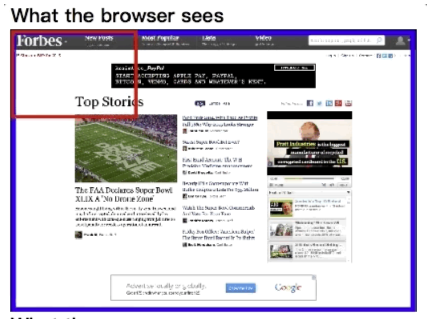

# 理解布局视口与视觉视口

> 布局视口：虚拟不存在的视口，或者叫逻辑视口，这个视口让开发者在布局时不需要关系具体的移动端屏幕的宽高,
>
> 视觉视口：用来告诉浏览器展示哪部分区域，用来告诉浏览器需要展示网页的那部分区域，`浏览器的滚动、放大、缩小功能都是借助视口视口来实现的`
>
>  
>
> 下面两张图充分展示了布局视口和视觉视口：
>
> 1. 第一张图中，蓝色区域为网页的真实宽高，即布局视口，红色区域为视觉视口，由于浏览器展示不了全部的内容，因此使用视觉视口来规定浏览器应该展示网页的那部分区域。
> 2. 第二张图为浏览器根据视觉视口展示出来的网页的内容。

## 浏览器如何实现的滚动、放大和缩小功能

> 浏览器是通过视觉视口来实现页面的放大、缩小和滚动功能：
>
> * 放大功能：其实就是缩小视觉视口的宽高，然后将视觉视口包裹的内容，投射到浏览器的内容窗口中，像上图中那样。
> * 缩小功能：其实就是增大视觉视口的宽高。
> * 滚动功能：其实就是移动视觉视口的位置，随着视觉视口的移动，浏览器实现网页内容的滚动显示。

## meta-viewport属性

> meta-viewport属性是给移动端设备准备的标签属性，如果当前网页只是显示`在PC端则该标签属性不会生效`。由于移动端设备屏幕种类繁多并且有大有小，因此引入该属性，使开发者可以灵活的根据设备屏幕的大小来设置网页的宽度，以达到让网页完美显示的效果。
>
>  
>
> viewport中有5个常用属性值：
>
> * width：设置布局视口宽度。
> * initial-scale：设置视觉视口宽度，通过设置比例，逻辑像素/视觉视口宽度 = 比例值
> * minimum-scale：设置视觉视口最小的缩小比例，逻辑像素/视觉视口宽度 = 比例值
> * maximum-scale：设置视觉视口最大的放大比例，逻辑像素/视觉视口宽度 = 比例值
> * user-scalable：设置用户是否可以随意放大缩小视觉视口，该属性对于手机的safari浏览器无效。
> * viewport-fit：对刘海屏处理。
>
> `注意：使用viewport设置的宽度都是逻辑像素而不是物理像素，例如width=375，表示的是适配屏幕的逻辑像素为375的屏幕。`

### 移动端中控制视口

> 开发者通过控制width、initial-scale、minimum-scale、maximum-scale这四个属性来告诉浏览器应该如何显示网页。
>
>  
>
> 1. 当width和initial-scale出现冲突时，初始包含块的宽度取width和initial-scale中的最大值，举例说明，手机逻辑像素为375，当width=device-wdith，initial-scale=0.5时，视口宽度为375/0.5 = 750，因此初始包含块的宽度为750px。
> 2. minimum-scale与maximum-scale两个属性用来限制initial-scale，当initial-scale设置比例超出min和max比例区间，则initial-scale设置的值无效。
> 3. 当width > initial-scale换算的宽度时，布局视口宽度为width属性值，而视觉视口宽度为initial-scale换算的宽度。
> 4. 当width < initial-scale换算的宽度时，布局视口宽度 = 视觉视口宽度 = initial-scale换算的宽度。

## JS获取视口宽高

> 布局视口宽度：document.documentElement.clientWidth、document.body.clientWidth
>
> 布局视口高度：document.documentElement.clientHeight、document.body.clientHeight
>
>  
>
> 视觉视口宽度：window.innerWidth
>
> 视剧视口高度：window.innerHeight
>
>  
>
> 浏览器宽度：window.outerWidth
>
> 浏览器高度：window.outerHeight
>
>  
>
> 屏幕宽度：screen.width
>
> 屏幕高度：screen.height
>
>  
>
> `注意：`
>
> 1. 上面所有的宽高都是逻辑像素，而不是物理像素.
> 2. initial-scale换算的宽度更大时，document.documentElement.clientWidth = window.innerWidth = device-width / initial-scale.
> 3. 当width的值更大时，document.documentElement.clientWidth = width; window.innerWidth = device-width / initial-scale.