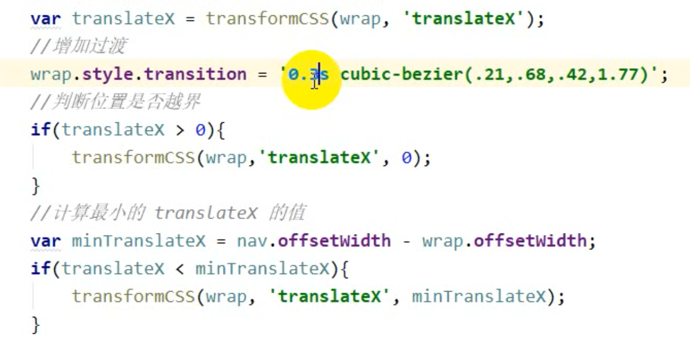

// 切换状态，执行奇数次为添加class，执行偶数次为删除class

divNode.classList.toggle('className')


元素水平撑开：

> 父元素设置：
>
> position：absolute;
>
> white-space：nowrap;
>
> Font-size:0;
>
>  
>
> 子元素设置：
>
> display：inline-block;
>
>  
>
> 子元素为block，使用浮动可以事件一行显示吗？
>
> 

实现过界回弹效果




绝对定位的元素宽高如何确定：如果使用width和height设置宽高的话，则使用内部非绝对或非固定定位的元素撑起来。


惯性移动思路：

> 当滑动页面送手时，页面会滚动一段距离：
> 实现思路：
>
> 1. 记录从touchstart～touchend执行时的手指移动的距离和经过的时间，计算出速度v。
> 2. 速度乘以一个给定的时间，算出松手后滚动的距离。
> 3. 添加移动动画，可以使用translate实现。
>
> 注意：touchstart事件回调函数中移除过渡，在touchend事件回调函数中添加过渡，防止手指滑动时，元素不是直接移动而是开启动画移动。


滑动时到达临界点时的弹簧效果思路：

> 实现思路：
>
> 1. 在touchmove监测当前滑动元素是否处于临界点，如果处于临界点则元素移动距离 == 手指滑动距离 / 2;

元素 回弹效果实现：

> 1. 使用贝塞尔曲线实现。
> 2. 使用tween算法实现，调整s参数，值越大回弹效果越好。


获取元素下标：

1. 方式1，在元素标签中添加属性index，在js使用this.getAttribute('index');
2. 方式2，在元素标签中添加属性data-index，在js中使用this.dataset.index;
3. 方式3，使用闭包的形式给元素添加下标，遍历元素对象，添加一个index属性，这样在每个闭包中就可以获取元素的index

```js
divNode.forEach(function(ele, index)(){
   ele.index = index;
   ele.addEventListener('touchstart', function(e){
  		console.log(this.index);
	 });
});
```


扩展框架，给框架添加一些个性化的功能，如何设计？

> 例如在音悦台项目中，滚动轮播图后，需要切换标题时，如果在框架中直接添加切换标题的代码，那么其它项目再使用框架时，运行切换标题代码就不对了，而且其它项目还有别的个性化功能如何处理。
>
>  
>
> 使用回调函数，框架函数的参数列表中，添加一个callback参数，用来接收用户回调函数，即执行完成通用功能后，执行自己的个性化代码，大大提高框架的灵活性。

```javascript
    var s = new Swiper('.container',{
        loop: false,
        auto: false,
        pagination: false,
        callback: {
            end: function(){
								// 个性化代码
            }
        }
    });
```

轮播图水平滚动时，切换选中的标题，从内地切换到港台


闭包理解：

将值类型数据转换成引用类型使用。

> 当构造函数内部有一个属性实时记录了代码运行时的状态，如何查看这个属性，如果直接将其保存到实例对象中，则因为属性为值类型，保存到实例对象中的变量记录的是一个某时刻运行的状态，是一个死值。
>
>  
>
> 如何实时查看属性：
>
> 1. 将属性封装成引用类型，这样就赋值给实例变量时，就可以实时监测代码运行状态。
> 2. 使用闭包，闭包内部返回这个属性值，由于闭包的特性，保存了构造函数的部分作用域，因此调用闭包可以实时获取代码运行状态。
>
>  
>
> 实例：轮播图实例使用，我们将轮播图封装成对象，保存在swiper.js文件中，通过swiper构造函数创建一个轮播图实例对象，当滑动轮播图时，想知道当前轮播图的index，index保存在构造函数中，因此使用闭包实现。

```javascript
(function(w){
    function Swiper(selector, options) {
    var index = 0;//当前显示的幻灯片的下标
    //获取当前显示幻灯片的下标
    this.getIndex = function(){
        return index;
    }
    w.Swiper = Swiper;
}(window));
  
var s = new Swiper('sel');
console.log(s.getIndex());
```


swiper构造函数的回调函数应该写在哪里？

将写在touchend事件回调函数中的回调函数的调用代码，写在switchSlide函数中，因为放在touchend回调函数中，只有滑动才能触发回调函数，而touchend回调函数和点击导航标题让轮播图滚动都通过switchSlide函数实现的，因此将其放在switchSlide函数中。