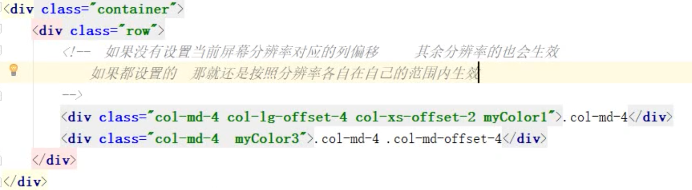
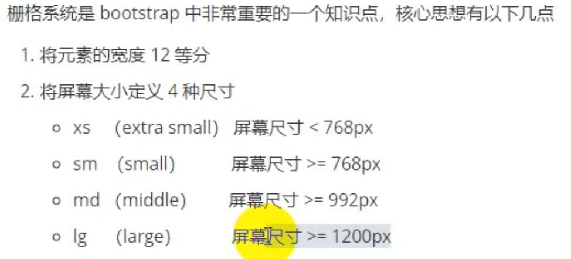

Bootstrap优缺点：

布局容器有两种形式：container和container-fluid，两者不能相互嵌套。

使用栅格系统：

设置宽度时：当前视口尺寸满足代码中设置的媒体查询时，使用媒体查询的样式设置元素的宽度；当前视口尺寸不满足代码中设置的媒体查询时，则元素的宽度依据元素的特性设置元素宽度(块元素的宽度==父元素的宽度，行内元素==内部元素的宽度)

列偏移特点：

向下兼容

列排序：

使用定位，修改元素位置，会根据元素当前的格子位置进行定位

即设置为col-lg-push-*，但是当前视口<1200时，col-lg-push-3将无效，设置为col-lg-md-*时，只有当前视口>=992并且没有col-lg-push-*时，依然生效。

相对定位占位吗

元素之间的水平间距：

1. 使用列嵌套实现元素之间的间距。
2. 使用列偏移实现元素之间的间距

# P49

