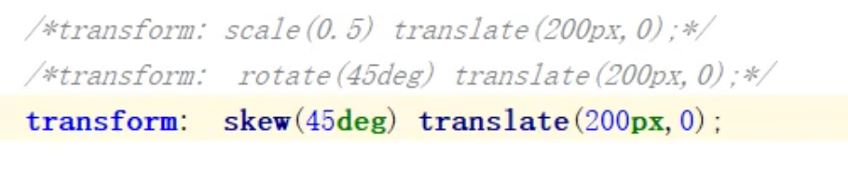
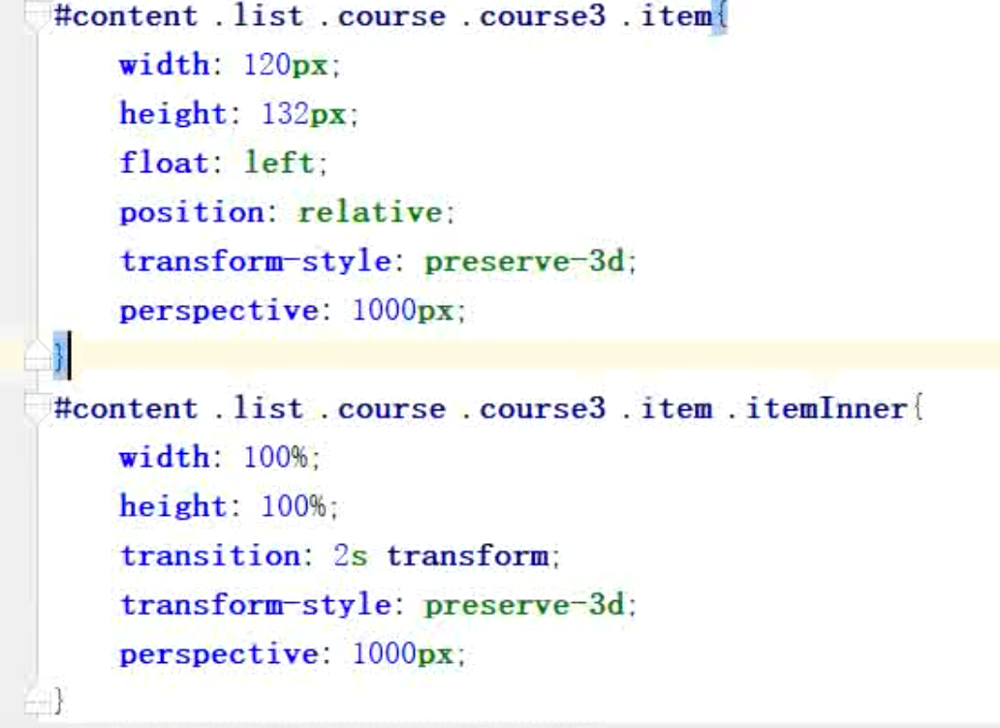
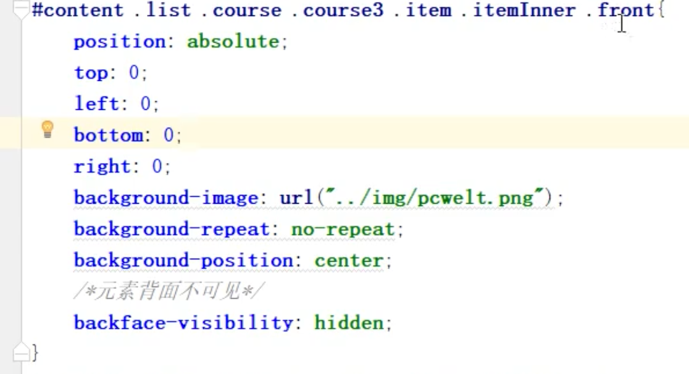
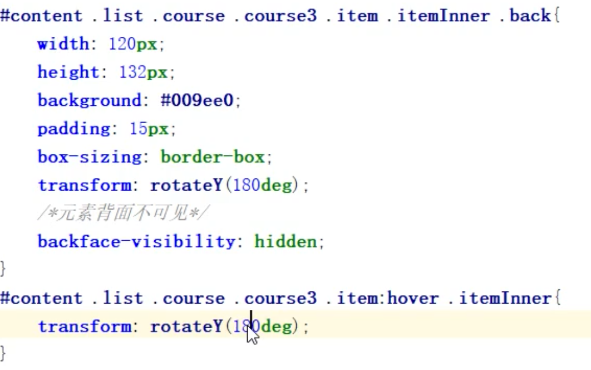
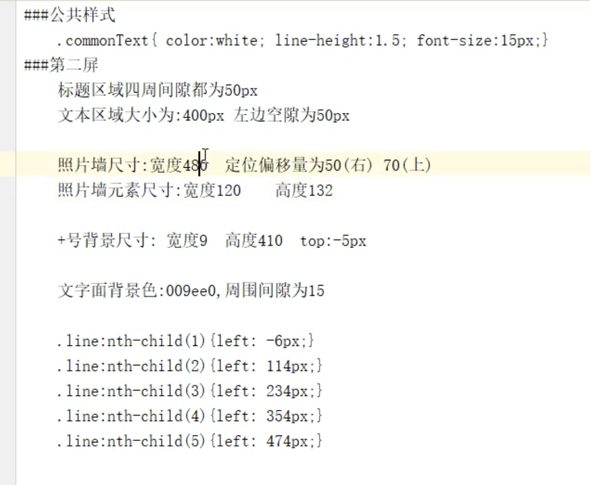
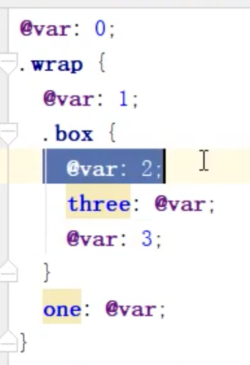
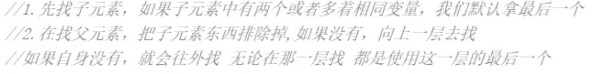

如何删除style中的css样式？ --- 例如`li.style.width=''`，设置为空字符串

fireFox滚动事件：DOMMouseScroll；IE/Chrome滚动事件：mousewheel


滚动降频：

clearTimeout(timer);

Timer = setTimerout(fun, 200);


First-child和last-child在获取子元素时，文本节点算吗？


span设置宽高：{

​	position:absolute;

​	Left:0;

​	Right:0;

​	Top:0;

​	Bottom:0;

}


```
<ul data-src="aaa"></ul>

ul.dataset.src

使用data-*格式定义的属性，在JS中可以使用dataset.属性名就可以直接方便的访问。
```


创建图片节点方式：

document.createElement('img');

new Image();


截取图片的部分显示

box-size

transform

animation


ul.querySelectorAll('')


Backface-visibility:hidden; // 反面隐藏

visibility:hidden与display:none都可以实现元素隐藏，它们的区别在哪里，一个占位一个不占位


2d变换时，

* 先缩放后平移，最终平移距离为设置的平移距离* 缩放系数；
* 先旋转后平移，旋转完后坐标系发生改变，此时在平移是按照旋转后的坐标系进行平移；
* 扭曲+平移，谁先谁后没有影响

因此在进行2d变换时一定要注意变换的顺序，先写平移再写其它的变换。


属性设置百分比时参照物：当前元素使用百分比设置margin、border、padding，参照的是父元素的宽高，translate百分比时参照物为自身，是否可以这样理解，属性是否需要参照父元素，不需要则百分比时参照物为自身宽高，否则百分比参照物为父元素宽高。

CSS3中所有变换时，都是参照自身。


Box-shadow:



## P45元素翻转

开启3D变换时，在父元素中开启景深transform-style和perspective










## P46

调整z-index，元素必须为非static定位。


动画完成监听完成事件：

div.addEventListener('transitionend", function(){});

动画监听完成会根据过渡动画属性个数而触发对应次数，例如宽高动画过渡时，动画完成事件触发2次。


用户修改视口大小时，修改内容区域大小，进行简单的适配。


监听资源的加载：

1. Node.onload属性，表示当前node资源加载完毕后的回调，例如var img = new Image(); img.onload()。
2. 使用window.onload方法，所有资源加载完毕时调用。


# P47


## 变量

> 声明属性值：

## 作用域







## 嵌套规则

> 一般用在后代选择器中，&符号一般使用在伪类、伪元素选择器中。
>
>  
>
> 嵌套使用注意：要合理使用嵌套规则，如果选择器是唯一的(id选择器)或者只有一个class时，就不要使用嵌套了，这样会让less代码复杂化，编译效率慢。

```
#wrap{
	width:400px;
	border: 1px solid black;
	margin: 0 auto;
	
	ul{
		width:100%;
		li{
			width:100%;
			height:40px;
			line-height:40px;
			// &代表当前元素li，或者说前面所有祖先选择器集合#wrap ul li
			&:hover{
				background-color:pink;
			}
		}
		
		// 也可以不使用&符号
		li:active{
			background-color:green;
		}
	}
	
}
```


## 混合mixin

> 相当于函数，定义完后需要运行。
>
> less文件中定义了一个.hideBox函数。
>
> 使用混合情况中，调用混合时必须加分号，要不报错。

```less
/*
<body>
    <div class="inner">
        <div class="hideBox">
            <div class="item"></div>
            <div class="item"></div>
            <div class="item"></div>
            <div class="item"></div>
        </div>
    </div>
</body>
*/

.hideBox(@box){
    .@{box}{
        width:1000px;
        border: 1px solid black;
        margin: 0 auto;
        overflow: hidden;
        .hideBox{
            width:1050px;
            .item{
                width:300px;
                margin-right: 50px;
                margin-bottom: 30px;
                height: 300px;
                background-color: pink;
                float: left;
            }
        }
    }
}

.hideBox(@box:inner);
```


## less运算

> less运行中运行带单位。
>
> 例如：width: 200px * 2;