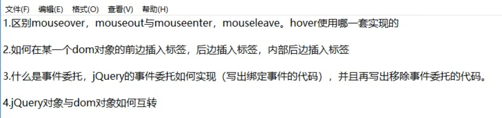
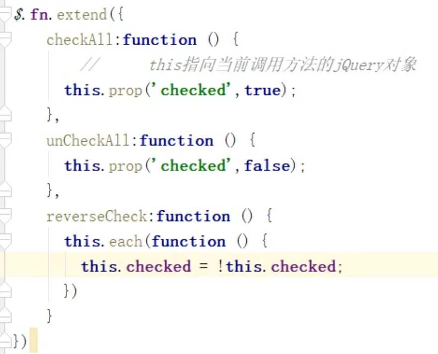
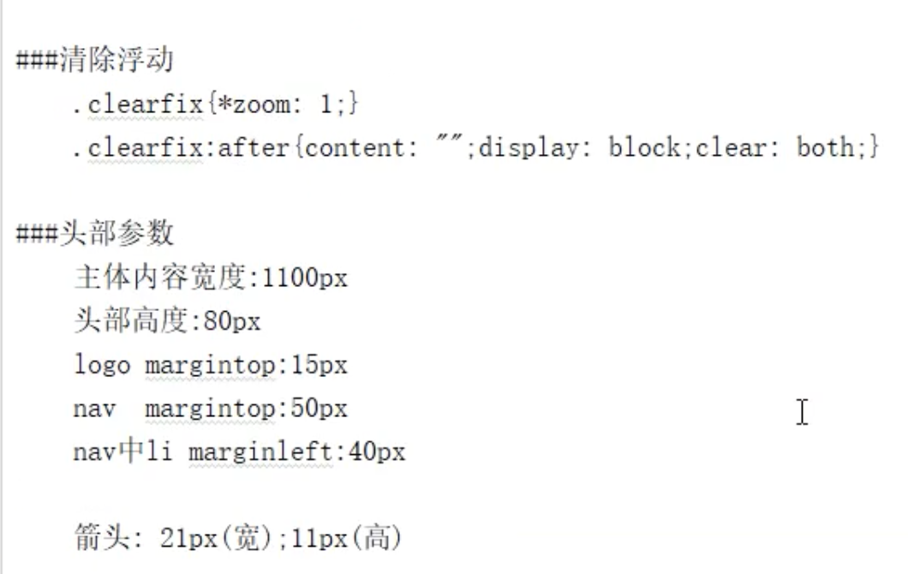

pp  


由于引入了jQuery框架，因此在操作DOM对象时很容易原生和jQuery混着用，导致分不清变量谁是谁(jQuery函数返回的对象是一个对DOM对象的封装)，因此所有调用jQuery框架生成的对象，变量名以$开头，让开发者知道当前变量保存的是jQuery对象。


## jQuery对象方法

>核心对象方法，一般使用jQuery操作DOM元素会返回一个伪数组，因此核心对象中的一些方法，用来处理这个伪数组。

```javascript
// 查看这个伪数组包含的DOM元素对象的个数，jQuery核心对象提供了两种方法。
$('input').length == $('input').size()

// 访问伪数组中的某个元素，jQuery核心对象提供了两种方法。
$('input')[0] == $('input').get(0)

// 遍历伪数组
$('input').each(function(item, index){... })

// 获取当前DOM对象在父元素节点的childNodes数组中的索引值，也就是说在兄弟元素节点中排第几
$('input').index
```


> $().each方法中调用的其实是$.each方法。
>
> 一定要分清$()返回的对象和$函数对象，并不是同一类型的对象。jQuery核心对象和jQuery对象


## jQuery操作属性


jQuery对象中内置隐式遍历

> $(div).attr('name', 'divName'); 伪数组中的标签元素添加name属性。
>
> $(div).remove('name') // 删除伪数组中的标签元素的name属性。
>
>  
>
> 给所有div设置class属性
>
> $(div).attr('class', 'class1') ;
>
> 
>
> 给所有div追加一个class属性
>
> $(div).attr('class', 'class1 class2') ; // 方式1
>
> $div.addClass('class2') // 方式2


操作元素属性的值是固定时，使用prop，例如checked属性和selected属性，固定两种属性选中和没有选择


index方法：

> $('#div').index()：查询获取当前元素时父元素中的第几个子元素节点。如果查询的元素是一个集合时取第一个元素，即第一个 元素在兄弟元素间的排名。
>
>  
>
> $('li').index('#targetLi')：查询#targetLi元素在$('li')的元素集合中排第几。


## css函数用法

> css参数：
>
> 1. 传一个字符串，为读取该元素的该属性值
> 2. 传两个字符串，给该元素的该属性值设值。
> 3. 传一个对象，批量设置元素属性值。


## offset和position

> offset获取当前元素相对于页面左上角位置。
>
> position获取当前元素相对于处于定位状态的祖先元素的左上角。
>
> $('#div').offset().left 和$('#div').offset().top
>
> 
>
> 设置值：$('#div').offset({
>
> ​	'left' : 30,
>
> ​	'top' : 20
>
> }); // 不需要加单位，不常用，因为有css方法可以设置属性。
>
>  
>
> $('#div').css({
>
> ​	'left' : '30px',
>
> ​	'top' : '20px'
>
> });
>
>  
>
> position只能读取不支持写入，并且获取的值为整型，因此设置元素位置、父元素的边框和内边距尽量不用使用小数或者百分比，产生误差。


## scroll 


## width

外部尺寸方法默认是false


## 筛选

> filter()接收一个css选择器/DOM元素对象，对jquery集合对象中的DOM元素对象进行筛选，剔除不满足条件的元素。
>
> has()接收一个css选择器/DOM元素对象，保留jquery集合对象中特定后代元素的DOM元素对象集合，将筛选后的元素保存到新集合中。例子6


## 查找父子级关系

preAll和nextAll查找原理：其实是以当前元素为原点，一点点询问previousSibling/nextSibling，并将其添加到伪数组中返回。

sibling()方法不传参数时，选中所有兄弟元素

find和children区别，children只在子标签中找，find会不仅找子标签，后代标签也会找。


## DOM元素增删改

> 内部插入：给元素添加子元素，父子级插入
>
> 外部插入：给元素添加兄弟元素，即同级插入


```html
    <ul id="ul1">
        <li>AAAA</li>
        <li title="hello">BBBB</li>
        <li class="box">CCCC</li>
        <li title="hello">DDDD</li>
        <li title="two">EEEE</li>
    </ul><br><br>
    <ul id="ul2">
            <li>aaaa</li>
            <li title="hello">bbbb</li>
            <li class="box">cccc</li>
            <li title="hello">dddd</li>
            <li title="two">eeee</li>
    </ul>
```


## 事件绑定与解绑(P42)


## 事件委托

> 事件委托优点：
>
> 1. 事件回调函数是对象，每创建一个对象就占用一点内存，委托可以减少内存占用，多个控件共享一个处理函数，大大提高代码复用性和节省空间。
> 2. 新增子节点时，不需要再给节点单独添加事件了。
>
> 使用on方式绑定的事件，使用off和undelegate方法解绑
>
> 使用delegate方式绑定的事件，使用undelegate解绑


## 淡入淡出

> 动画队列，使用jquery创建一个动画时，会添加到一个动画队列中，等待前一个动画执行完毕再执行。
>
> 
>
> slideUp：慢慢收缩
>
> slideDown：慢慢展开
>
> sllideToggle()：展开收缩一键完成。
>
> 
>
> 收缩展开原理：修改元素的height值，收缩是开启定时器将height减到0，展开是开启定时器将height还原到设定的位置。当height=0时display:none。
>
>   
>
> 显示与隐藏：
>
> show：显示
>
> hide：隐藏
>
> toggle: 显示隐藏一键完成。
>
> 显示隐藏原理：开启定时器修改元素的width、height和opacity值，减到0，display:none；增加到原来的值。
>
>  
>
> 淡入淡出、收缩展开、显示隐藏这些函数如果不传参数时，表示立即实现，设置参数表示几毫秒中完成
>
>  
>
> animate({}, 毫秒)：自定义动画
>
> stop()：停止动画：
>
> 1. stop()：停止当前动画，基于元素当前位置执行动画队列中的下一个动画
> 2. Stop(true, true)：停止动画，将元素移动到最终位置，清空动画队列。
> 3. stop(false,true)：立即停止当前动画，将元素移动到最终位置，执行动画队列中的下一个动画
> 4. stop(true, fase)：立即停止当前动画，元素停止在当前位置，清空动画队列。
>
> stop参数介绍：
>
> 1. 参数1：是否清空动画队列。默认为false，true为清空队列
> 2. 参数2：是否让当前动画执行完毕，默认为false，true动画执行完成。


原理就是：定时器修改opacity值，如果淡出则最后设置为display:none消失。




## 插件扩展

> 给jquery核心函数中扩展内容，$.extend()
>
> 给jquery对象中扩展内容，$.fn.extends()





## jquery链式调用


## jquery解决命名冲突，是否$使用权

```html
(function(w){
	w.$ = function(){
		console.log('myLib.js');
	}
})(window)

<script src='myLib.js'></script>
<script src="../jquery-1.12.4.js"></script>

jQuery.noConflict();
jQuery(function(){

	console.log('jQuery.js');
});

$();
</script>

上面代码知识点：
1. jQuery和myLib都使用了$这个字符，由于js文件引入顺序，因此window.$保存的是jQuery。

2. 打印顺序，先打印myLib再打印jquery，因为jquery函数参数为函数时，相当于window.onload，在页面加载完毕才会执行，因此先打印myLib。

3. noConflict函数，释放$字符的使用权，让给其它库使用。
```


## window.onload


## css





