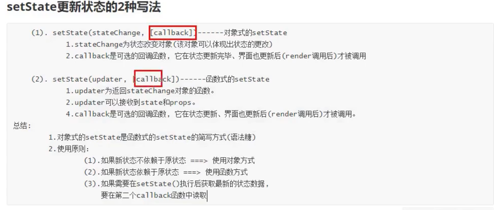

# React基础

## JSX

> JSX并不是语言，而是一种React实现的语法糖，可以实现不直接操作DOM来实现对DOM操作，以前当数据改变时，需要使用原生JS获取DOM对象，并设置新数据，现在直接在JSX中设置一个变量，React会自动完成这一操作，就像模版语言(ejs、jsp)。

```jsx
// 以前更新页面数据
<h1 id="demo"> aaa </h1>
let h1 = document.getElementById('demo');
h1.innerHtml = bbb;

// React更新,h1标签中的数据
<div id="root"></div>
let temp = 'aaa';
let vDom = <h1>{temp}</h1>
ReactDOM.render(
  vDom,
  document.getElementById('root')
);
```


### JSX中的语法

> 1. 直接可以将一段html代码赋值给变量保存，在React将这段代码视为虚拟DOM，最终会转成javascript中的对象。
> 2. 每个虚拟DOM只能有一个根节点。
> 3. 在虚拟DOM中只能使用javascript表达式(变量、运算符、函数)，不能有语句存在，这些表达式必须被包裹在一个大括号中`{}`。
> 4. 虚拟DOM中可以给标签设置属性，但是属性名必须遵循小驼峰命名法(为了区别真正的html属性)，属性值只能是字符串或者表达式(`表达式必须被大括号包裹`)。`html标签中的class，在JSX中为className`
> 5. 虚拟DOM中style属性值的设置，将css包裹在一个对象中，css属性值都要转成字符串。
> 6. 虚拟DOM本质也是一个对象，因此虚拟DOM之间可以嵌套使用。
> 7. 当虚拟DOM过长时，建议使用小括号将其包裹，放在翻译时自动在每行代码后添加分号，导致的错误。
>
> 

```jsx
// 外层真实html标签
<div id="test"></div>

// 1. 创建虚拟DOM
const element = (
  <h1 className="greeting">
    Hello, world!
  </h1>
);

// 转换后代码
const element = React.createElement(
  'h1',
  {className: 'greeting'},
  'Hello, world!'
);


// 2. 虚拟DOM只能有一个根标签
const vDOM = (
  <div>
    <h1>aaaa</h1>
    <h2>bbbb</h2>
  </div>
)
ReactDOM.render(vDOM, document.getElementById('test'))


// 3. 虚拟DOM中可以添加JS代码，但是只能是表达式
let styleType = false;
let demo = ()=>{return 'haha'};
const vDOM = (
  <div type={stypeType ? 'red' : 'green'}>
    { demo() }
  </div>
)
ReactDOM.render(vDOM, document.getElementById('test'))


// 4 所有属性名必须是小驼峰，例如html标签中的class，在JSX中为className
const vDOM = <div className="divStyle"></div>
ReactDOM.render(vDOM, document.getElementById('test'))


// 5. style
const vDOM = (
  <div style={{color:'red', backgroundColor:'white', font-size:'20px'}}>
  </div>
)
ReactDOM.render(vDOM, document.getElementById('test'))


// 6. 虚拟DOM之间嵌套
const vDOM1 = (
  <div style={{color:'red', backgroundColor:'white', fontSize:'20px'}}>
  </div>
)

const vDOM2 = (
  <div className="divStyle">
    {vDOM1}
	</div>)
ReactDOM.render(vDOM2, document.getElementById('test'))


jsx语法规则：
						1.定义虚拟DOM时，不要写引号。
						2.标签中混入JS表达式时要用{}。
						3.样式的类名指定不要用class，要用className。
						4.内联样式，要用style={{key:value}}的形式去写。
						5.只有一个根标签
						6.标签必须闭合
						7.标签首字母
								(1).若小写字母开头，则将该标签转为html中同名元素，若html中无该标签对应的同名元素，则报错。
								(2).若大写字母开头，react就去渲染对应的组件，若组件没有定义，则报错。
```


### JSX的XSS攻击

> 由于JSX将html与js融合，因此可以在html中写js代码，这样会造成XSS注入攻击，React在底层已经做了校验，将所有特殊字符都进行了转义，放在输入一个<script>标签导致页面的瘫痪。


state属性的作用：

1. 暂存组件中产生的临时变量。
2. 最重要的功能，刷新组件，React框架中不能直接操作DOM(使用js修改标签的样式、数据)，因此一切对组件中标签的修改都需要通过state来实现，修改state属性，React会根据state状态来更新页面样式。


setState()方法是异步方法，使用该方法给组件的state添加属性时，无法立即拿到，只能在render()方法中获取到，在以前的老版本中区分生命周期方法和其它方法，只有在组件的生命周期方法中setState()方法才是异步方法。


## 虚拟DOM的渲染

> JSX最终会被翻译成DOM对象插入到真实的html标签中，使用ReactDOM.render()方法将虚拟的DOM对象转换成真正的DOM对象，因此html页面上必须要有一个真实的html标签，下面的例子中`id为root的div标签`，就是一个真实的标签。
>
> render方法介绍：
>
> 1. 参数1：虚拟DOM对象。
> 2. 参数2：将虚拟DOM对象插入到哪个真实的DOM节点下。
>
> 一旦使用render方法将虚拟DOM对象渲染到页面上，就无法在更改页面上的数据，如果想要更新页面上的数据，只能再次调用render方法，将这个虚拟DOM对象再次渲染一遍。


## 组件

> React是基于组件化开发，传统的开发方式是以页面为单位，虽然js可以模块化实现代码复用，但是html和css无法做到复用，因此React提出了组件的概念，将功能所涉及到的html、css、js和其它资源文件封装到一个组件中，这样实现了代码在不同项目中复用。
>
> 组件使用注意：
>
> 1. 外部在使用组件时，以标签的方式使用，因此组件首字母必须大写，否则React在渲染时会将其当成原生html标签来解析，造成该标签在html中找不到的错误。

### 使用函数方式创建组件

```jsx
// MyComponent.jsx 文件

function MyComponent(props){
		return(
      <div>props.name</div>
    )  
}

// 外部组件中使用组件
<div>
		<MyComponent name="haha"/>
</div>
```


### 使用类方式创建组件

> 属性定义方式：
>
> 1. 可以在constructor中定义，例如MyComponent1
> 2. 可以直接写在类中，例如MyComponent2
>
> 方法定义方式：(在React中，自定义的方法的this为undefined，因此需要设置this指向当前组件对象)
>
> 1. 自定义完方法后，在constructor中使用`bind`修改函数的this。例如MyComponent1
> 2. 直接使用箭头函数，例如MyComponent2

```jsx
// MyComponent.jsx 文件
import {Component} from 'react'

class MyComponent1 extends React.Component {
  constructor(props){
    super(props);
    this.state = {
      name: 'aaa',
      age: 18
    }
    this.show = this.show.bind(this); // 给实例对象方法添加this
  }
  
  show(){
    console.log(this.state.name)
  }
  
  //重写父类的render
  render(){
    console.log(this)
    return <h2>ES6类组件(复杂组件/有状态)</h2>
  }
}
```

```jsx
class MyComponent2 extends React.Component {
	state = {
			name: 'aaa',
      age: 18
  }

	// 使用箭头函数
	show = ()=>{
    console.log(this.state.name)
  }

  //重写父类的render
  render(){
    console.log(this)
    return <h2>ES6类组件(复杂组件/有状态)</h2>
  }
}
```


## 组件的三大属性

### props

> 向组件传递数据，可以通过使用标签属性方式，最终会被保存到组件的props属性中。
>
> props特点：
>
> 1. props属性只读特性，其中的值无法修改。
> 2. 通过标签属性给组件传值时，属性名和属性值会保存到props中。
> 3. 通过组件的子元素方式向组件传值时，子元素对象会保存到该组件的`props.children`属性中，props.children是一个数组。

```jsx
// MyComponent.jsx 文件
import {Component} from 'react'

class MyComponent2 extends React.Component {
  constructor(props){
    super(props);
    console.log(this.props.name, this.props.age);
  }
  //重写父类的render
  render(){
    console.log(this)
    return <h2>ES6类组件(复杂组件/有状态)</h2>
  }
}

// 外层使用该组件
<MyComponent name="k.k" age={18}>
 	aaaa
	<h1>bbb</h1>
</MyComponent>

MyComponent对象结构：
MyComponent = {
  props = {
  		name: 'k.k',
  		age: 18,
  		children:[
  			'aaaa',
  			{
  					type:'h1',
  					props:{children:'bbb'}
				}
  		]
	}
}
```

#### propType


### state

> 组件状态属性，用来保存当前组件的状态和刷新当前组件以及其子组件。
>
> state使用注意：
>
> 1. React不允许直接给state写入数据，只能通过`setState()`方法给React写入数据。
> 2. `setState()`方法是异步方法，因此不要设置数据后直接读取，读取不到。
> 3. `setState()`方法会触发组件对象的`render()`方法调用，因此当想要更新组件显示的数据时，通过setState()方法。

#### setState函数

> 什么时候使用函数式这种调用方式？
>
> ​		使用对象式有一个弊端，由于setState函数是异步调用，因此当在同一个地方调用多次时，React会将其多次setState方法调用融合成一次，导致数据错误。



```jsx
// 当前count为0
采用函数式的setState，运行结果为2
this.setState((prevState, props) => ({
	count: prevState.count + 1
}));
this.setState((prevState, props) => ({
	count: prevState.count + 1
}));

采用对象式，运行结果为1，React将两次调用合并成一次。
this.setState({count: this.state.count+1});
this.setState({count: this.state.count+1});
```


### ref

> ​		React是不允许开发者直接操作DOM的，而是通过操作state间接操作DOM，而React提供了`ref`属性用来获取DOM对象，以获取DOM节点上的数据。例如具有交互功能的`input`标签，通过ref可以获得input对象，从而获取input对象中用户输入的数据。(这里涉及到受控组件和非受控组件)

#### 类的三种DOM获取方式ref获取方式

```jsx
class Demo extends React.Component{
  // 方式3
  myRef3 = React.createRef();
  componentDidMount(){
    console.log(this.refs.myRef1);  // 方式1
    console.log(this.myRef2); // 方式2
    console.log(this.myRef3.current)
  }
  
  render(){
    return(
      <div>
      		<input type="text" ref="myRef1" />  方式1
        	<input type="text" ref={(e)=>{this.myRef2 = e}} /> 方式2
       	  <input type="text" ref={this.myRef3} />  方式3
      </div>
    )
  }
}

// Demo组件对象结构
{
  refs: {myRef1: input}
	myRef2: input
	myRef3: {current: input}
  
  context: {}
	props: {}
	state: null
__proto__: Component
}
```


## 受控组件和非受控组件

> 受控组件非受控组件其实是说`表单元素`是否被React控制，对于普通的标签元素，一旦渲染到页面上，标签内容只能通过js来修改了，而表单元素不同，因为他可以与用户交互，因此表单元素标签的内容随着用户的输入发生改变。
>
> 受控组件：表单元素的数据内容的变化必须被React控制。
>
> 非受控组件：表单元素的数据内容变化不受React控制。
>
> 非受控组件 --> 受控组件：
>
> 1. 给组件添加`onChange`属性
> 2. 给组件添加`value={this.state.temp}`
>
> 使用受控组件可以实时监听用户输入的数据是否合法，如果不合法直接过滤掉。

```jsx

class MyComponent extends React.Component{
  input1 = React.createRef();
  state = {
    input2: ''
  }
	
	handleInput = (event)=>{
    this.setState({input2: event.target.value})
  }
	render(){
    return(
      // 非受控组件，获取用户输入的数据，需要通过ref
    	<input type="text" ref={this.input1}/>
      // 受控组件，用户输入的数据被保存到state中，如果输入数据不合法将不会保存到state中，输入框不会不会发生变化，就像输入框无法输入数据一样，
      <input type="text" onChange={this.handleInput} value={this.state.input2}/>
    )
  }
}

```


## React事件与高阶函数的柯里化

