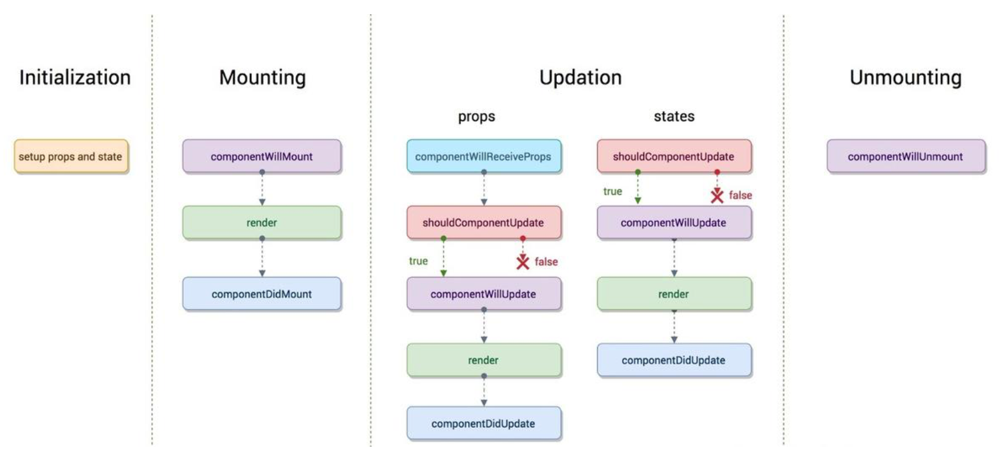
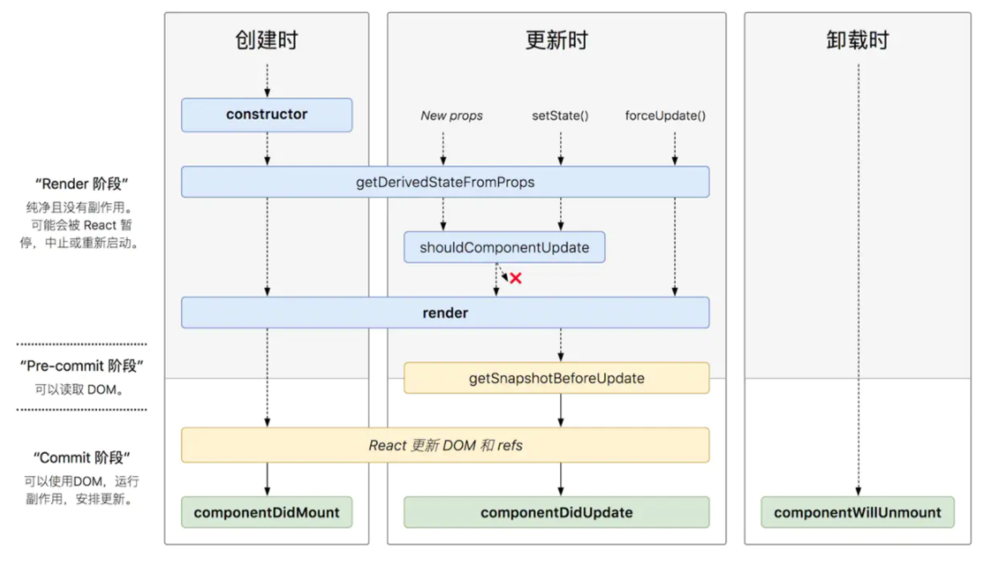

# React组件的生命周期

## 旧生命周期



> 旧生命周期分为三类方法：
>
> 1. 组件的创建和销毁，`三个方法都没有参数和返回值`
>
>    1. componenWillMount()，组件将要挂载，没什么用，不要在该方法中添加数据请求功能，因为该方法可能被执行多次。
>    2. componentDidMount()，组件挂载完成，在该方法中进行组件的配置工作，例如网络请求，开启定时器等
>    3. componentWillUnmount()，组件将要被销毁，用来释放组件中定义的内部资源，例如定时器。
>
> 2. 组件的state属性改变导致的组件更新，组件的`setState()`方法调用时，
>
>    1. shouldComponentUpdate(nextProps, nextState)，必须返回一个boolean，根据返回值判断是否进行刷新。
>    2. componentWillUpdate(props, state)，render方法调用之前
>    3. componentDidUpdate(props. state)，render方法调用之后，参数state为更新前的状态。
>
> 3. 父组件渲染导致的子组件的更新
>
>    1. componentWillReceiveProps(props)，父组件渲染时，渲染子组件，接收从父组件传递过来的参数。
>
>    2. shouldComponentUpdate(nextProps, nextState)，必须返回一个boolean，根据返回值判断是否进行刷新。
>    3. componentWillUpdate(props, state)，render方法调用之前
>    4. componentDidUpdate(props. state)，render方法调用之后，参数state为更新前的状态。


## 新生命周期

> 新生命周期变化：
>
> 废弃的生命周期：
>
> 1. componentWillMount()
> 2. componentWillUpdate()
> 3. componentWillReceiveProps()
>
> 新增的生命周期方法：
>
> 1. getDerivedStateFromProps(props, state)，当前组件的调用`setState()`或者父组件刷新都会触发该方法调用。
> 2. getSnapshotBeforeUpdate(props, state)，在render方法调用后，DOM和refs刷新前调用，参数为组件状态改变前的状态，必须配合componentDidUpdate使用。



### getDerivedStateFromProps

> `getDerivedStateFromProps`是一个静态方法。因此无法使用this获取组件实例对象的属性
>
> 三种触发条件：
>
> 1. 父组件刷新
> 2. 当前组件内部调用setState()方法。
> 3. forceUpdate().
>
> 方法参数：接收两个参数props和state，从父组件传递过来的props和自身的state。
>
> 方法返回值：必须要有返回值，
>
> 1. 返回null，从父组件中传递过来的props没有变化，不需要更新到state中。
> 2. 返回返回props，将父组件中传递过来的props，更新到state中。
>
> 该方法的作用：
>
> ​		组件的状态由父组件控制，父组件通过给子组件传递参数来控制子组件状态(子组件通过props属性接收参数，并将其中的数据更新到state中，达到父组件控制子组件目的)。

### getSnapshotBeforeUpdate

> 方法参数：
>
> 1. props：当组件的props属性
> 2. state：当前组件旧的state属性值，一旦触发该方法，state属性有可能更改了，但是接收到的state还是未更改的状态。
>
> 返回值：返回值决定了componentDidUpdate方法第三个参数值。
>
> 1. null，则componentDidUpdate第三个参数为undefined。
> 2. this.state，则将新的组件状态传递给componentDidUpdate()方法。
>
> 由于方法在DOM和Ref更新之前，因此可以拿到DOM更新之前的一些属性，例如新闻列表。

```jsx
<!DOCTYPE html>
<html lang="en">
<head>
	<meta charset="UTF-8">
	<title>4_getSnapShotBeforeUpdate的使用场景</title>
	<style>
		.list{
			width: 200px;
			height: 150px;
			background-color: skyblue;
			overflow: auto;
		}
		.news{
			height: 30px;
		}
	</style>
</head>
<body>
	<!-- 准备好一个“容器” -->
	<div id="test"></div>
	
	<!-- 引入react核心库 -->
	<script type="text/javascript" src="../js/17.0.1/react.development.js"></script>
	<!-- 引入react-dom，用于支持react操作DOM -->
	<script type="text/javascript" src="../js/17.0.1/react-dom.development.js"></script>
	<!-- 引入babel，用于将jsx转为js -->
	<script type="text/javascript" src="../js/17.0.1/babel.min.js"></script>

	<script type="text/babel">
		class NewsList extends React.Component{

			state = {newsArr:[]}

			componentDidMount(){
				setInterval(() => {
					//获取原状态
					const {newsArr} = this.state
					//模拟一条新闻
					const news = '新闻'+ (newsArr.length+1)
					//更新状态
					this.setState({newsArr:[news,...newsArr]})
				}, 1000);
			}

			getSnapshotBeforeUpdate(){
				return this.refs.list.scrollHeight // 获取旧的滚动位置
			}

			componentDidUpdate(preProps,preState,height){
				console.log(this.refs.list.scrollHeight , height, this.refs.list.scrollTop);
				this.refs.list.scrollTop += this.refs.list.scrollHeight - height
			}

			render(){
				return(
					<div className="list" ref="list">
						{
							this.state.newsArr.map((n,index)=>{
								return <div key={index} className="news">{n}</div>
							})
						}
					</div>
				)
			}
		}
		ReactDOM.render(<NewsList/>,document.getElementById('test'))
```


## 生命周期方法参数返回值总结

> 没有参数和返回值的生命周期方法
>
> 1. componenWillMount()
> 2. componentDidMount()
> 3. componentWillUnmount()

> 接收一个参数：
>
> 1. componentWillReceiveProps(props)方法，只接受一个参数，父组件传递过来的参数。

> 接收三个参数：
>
> 1. componentDidUpdate(props, oldState, newState)，第三个参数有`getSnapshotBeforeUpdate`的返回值决定。

> 参数的state为新的状态，只有下面两个方法的的state参数为新状态，其它生命周期方法都是旧状态。
>
> 1. shouldComponentUpdate(props, newState)
>
> 1. componentWillUpdate(props, newState)

> 有返回值的方法：
>
> 1. getDerivedStateFromProps(props, state)，返回值决定了是否将props属性中的数据更新到state状态中。
> 2. getSnapshotBeforeUpdate(props, state)，返回值决定componentDidUpdate方法第三个参数值是否有值。


## 实例

```jsx
class Person extends React.Component {
      constructor(props) {
        console.log('Person --constructor--')
        super(props)
        this.state = { name: 'k.k' }
      }

      componentDidUpdate(props, b, c) {
        console.log('Person --componentDidUpdate--', props, b, c, '1111',this.state, '2222')
      }

      render() {
        console.log('Person--render', this.state);
        return (
          <div>
              <Student name={this.state.name}/>
          </div>
        )
      }

      componentDidMount(props ,state) {
        console.log('student --- componentDidMount', props, state);
        this.timeID = setTimeout(() => {
          this.setState({ name:'c.c'})
        }, 5000)
      }

    }

    class Student extends React.Component {
      constructor(props) {
        super(props);
        console.log('Student ---- constructor');
        this.state = {a:'1', b:'2'}
      }


     static getDerivedStateFromProps(props, state){
       console.log('Student --- getDerivedStateFromProps', props, state);
       return props;
     }
  
      //调用此方法的时候会把新的属性对象和新的状态对象传过来
      shouldComponentUpdate(nextProps, nextState) {
        console.log('Student 2.shouldComponentUpdate', nextProps, nextState);
        return true
      }

      getSnapshotBeforeUpdate(preProps, preState){
        console.log('Person - getSnapshotBeforeUpdate -- ',preProps, preState, this.state);
        return this.state;
			}
      componentDidUpdate(props, b, c) {
        console.log('--componentDidUpdate--', props, b, c)
      }

      render() {
        return <h1>{this.state.name}</h1>
      }
    }
    ReactDOM.render(<Person />, document.getElementById('example'))
```


## 版本迁移

- `componentWillMount`，`componentWillReceiveProps`，`componentWillUpdate` 这三个生命周期因为经常会被误解和滥用，所以被称为 **不安全（不是指安全性，而是表示使用这些生命周期的代码，有可能在未来的 React 版本中存在缺陷，可能会影响未来的异步渲染）** 的生命周期。
- **React 16.3 版本**：为不安全的生命周期引入别名 `UNSAFE_componentWillMount`，`UNSAFE_componentWillReceiveProps` 和 `UNSAFE_componentWillUpdate`。（**旧的生命周期名称和新的别名都可以在此版本中使用**）
- **React 16.3 之后的版本**：为 `componentWillMount`，`componentWillReceiveProps` 和 `componentWillUpdate` 启用弃用警告。（**旧的生命周期名称和新的别名都可以在此版本中使用，但旧名称会记录DEV模式警告**）
- **React 17.0 版本：** 推出新的渲染方式——**异步渲染**（ Async Rendering），提出一种可被打断的生命周期，而可以被打断的阶段正是实际 `dom` 挂载之前的虚拟 `dom` 构建阶段，也就是要被去掉的三个生命周期 `componentWillMount`，`componentWillReceiveProps` 和 `componentWillUpdate`。（**从这个版本开始，只有新的“UNSAFE_”生命周期名称将起作用**）
- 新增的生命周期和废弃的生命周期方法不能混合使用。