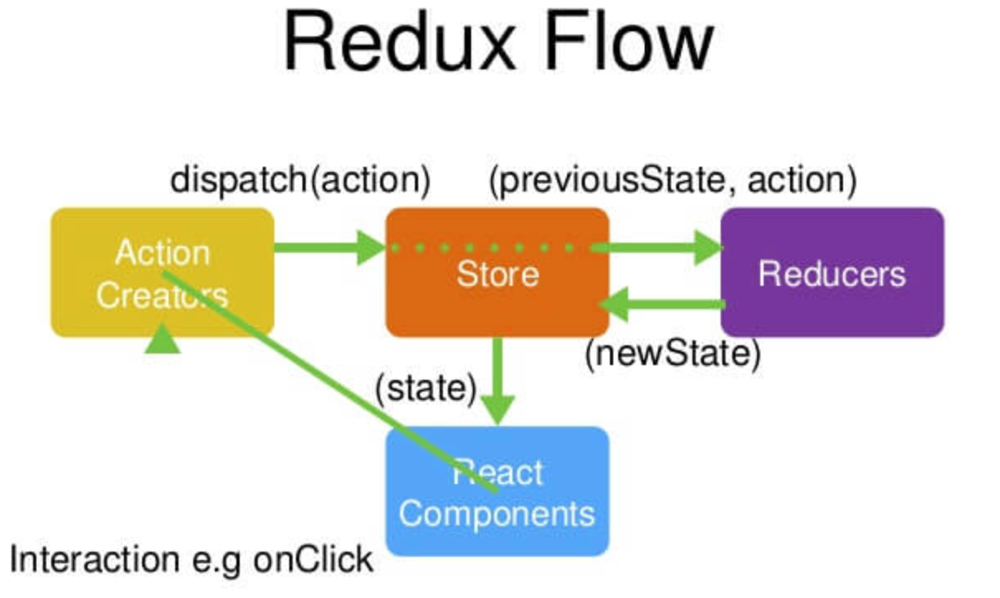

# Redux

## Redux原理图



> redux交互步骤：
>
> 1. 创建store对象，并绑定处理共享数据的Reducer。
> 2. `注册store监听`，每当store中的数据发生改变时，刷顶层组件。
> 3. 将需要共享的数据封装成一个纯函数，`(data)=>({type:'ACTIONTYPE', action:data})`。
> 4. 组件调用store的dispatch()方法，将纯函数封装的数据发送给store对象。
> 5. store对象调用所有绑定的Reducer方法，对数据进行处理，将处理的数据返回给store对象。
> 6. 在组件的render方法中使用`store.getState()`，获取更新后的共享数据。


## redux如何更新数据

> 由于store对象可以以对象属性方式保存多条共享数据，但是dispatch方法并没有指定每次修改那条共享数据，redux是如何实现修改对应的属性的。
>
> 每次浏览器刷新页面时：
>
> ​		在每次点击浏览器的刷新页面时，浏览器会删除store对象，所有组件重新加载，store重新创建，并调用绑定在store身上的所有reducer方法。
>
> UI组件更新store数据时：
>
> ​		UI组件让容器组件调用dispatch方法，将更新的数据作为参数传给dispatch方法，此时store会调用所有绑定在store身上的reducer方法，并将dispatch方法获得参数传给这些reducer，reducer根据`action.type`判断是否与自己的switch语句中的case匹配，没有匹配则返回原数据，匹配则更新数据并将新数据返回给store，`注意在给store绑定多个reducer时，每个reducer对应了一个key，这个key就是共享数据的key值，因此每个reducer只会修改对应key的值`。
>
> 总结UI组件store能准确更新对应的共享数据，通过ActionType找对应的reducer，而reducer由于共享数据的key绑定，因此可以准确的更新对应目标的共享数据。

## dispatch

>  如果传入的是对象，则将获得参数发送给store对象的所有reducers。
>
> 如果传入的是函数对象，则直接调用该函数，并将dispath方法作为参数传给该函数对象。

# react-redux

> react-redux将react中的组件分为了容器组件和UI组件两种，在纯redux中，组件与redux混在一起使用，此时react-redux做法是在组件外包裹一层容器组件，容器的组件的作用就是和redux进行交互，UI组件只负责业务逻辑和UI页面。
>
> UI组件和容器组件的交互：
>
> ​		容器组件通过将操作redux的读写操作放在UI组件的props属性中，可以让UI组件间接的与redux进行交互。
>
> 步骤：
>
> 1. 为每个共享数据action与reducer
> 2. 创建在reducers文件夹中创建index.js文件，将所有的reducer绑定在一起发给store。
> 3. store.js文件中，使用reducers创建store。
> 4. 在项目的index.js中获取store.js创建的store对象，并使用Provider标签包裹App标签，让所有组件都可以使用redux。
> 5. 创建某个UI组件对应的容器组件，即调用connect方法，配置如何获取共享数据和发送共享数据

```jsx
countAction.js

import {INCREMENT,DECREMENT} from '../constant'

//同步action，就是指action返回值为Object类型的一般对象
export const increment = data => ({type:INCREMENT,data})
export const decrement = data => ({type:DECREMENT,data})

//异步action，就是指action的值为函数,异步action中一般都会调用同步action，异步action不是必须要用的。
export const incrementAsync = (data,time) => {
	return (dispatch)=>{
		setTimeout(()=>{
			dispatch(increment(data))
		},time)
	}
}
```

```jsx
PersonAction.js
import {ADD_PERSON} from '../constant'

//创建增加一个人的action动作对象
export const addPerson = personObj => ({type:ADD_PERSON,data:personObj})
```

```jsx
pountReducer.js
/* 
	1.该文件是用于创建一个为Count组件服务的reducer，reducer的本质就是一个函数
	2.reducer函数会接到两个参数，分别为：之前的状态(preState)，动作对象(action)
*/
import {INCREMENT,DECREMENT} from '../constant'

const initState = 0 //初始化状态
export default function countReducer(preState=initState,action){
	// console.log('countReducer@#@#@#');
	//从action对象中获取：type、data
	const {type,data} = action
	//根据type决定如何加工数据
	switch (type) {
		case INCREMENT: //如果是加
			return preState + data
		case DECREMENT: //若果是减
			return preState - data
		default:
			return preState
	}
}
```

```jsx
personReducer.js
import {ADD_PERSON} from '../constant'

//初始化人的列表
const initState = [{id:'001',name:'tom',age:18}]

export default function personReducer(preState=initState,action){
	// console.log('personReducer@#@#@#');
	const {type,data} = action
	switch (type) {
		case ADD_PERSON: //若是添加一个人
			//preState.unshift(data) //此处不可以这样写，这样会导致preState被改写了，personReducer就不是纯函数了。
			return [data,...preState]
		default:
			return preState
	}
}

```

```jsx
reducers/index.js
/* 
	该文件用于汇总所有的reducer为一个总的reducer
*/
//引入combineReducers，用于汇总多个reducer
import {combineReducers} from 'redux'
//引入为Count组件服务的reducer
import CountReducer from './countReducer'
//引入为Person组件服务的reducer
import PersonReducer from './personReducer'

//汇总所有的reducer变为一个总的reducer
export default  combineReducers({ // 该方法定义了store保存的数据结构，store对象中保存了count和persons两个共享数据
	count: CountReducer,
	personList: PersonReducer
})

```

```jsx
store.js
/* 
	该文件专门用于暴露一个store对象，整个应用只有一个store对象
*/
//引入createStore，专门用于创建redux中最为核心的store对象
import {createStore,applyMiddleware} from 'redux'
//引入汇总之后的reducer
import reducer from './reducers'
//引入redux-thunk，用于支持异步action
import thunk from 'redux-thunk'
//引入redux-devtools-extension
// import {composeWithDevTools} from 'redux-devtools-extension'

//暴露store 
export default createStore(reducer,applyMiddleware(thunk))
```

```jsx
index.js
import React from 'react'
import ReactDOM from 'react-dom'
import App from './App'
import store from './redux/store'
import {Provider} from 'react-redux'

ReactDOM.render(
	/* 此处需要用Provider包裹App，目的是让App所有的后代容器组件都能接收到store */
	<Provider store={store}>
		<App/>
	</Provider>,
	document.getElementById('root')
)
```


```jsx
countContainer.jsx // 将UI组件和容器组件合在一个文件中
import React, { Component } from 'react'
//引入action
import {increment, incrementAsync} from '../../redux/actions/count'
//引入connect用于连接UI组件与redux
import { connect } from 'react-redux'

// UI组件
class Count extends Component {

	//加法
	increment = () => {
		const { value } = this.selectNumber
		this.props.add(value * 1)
	}
	//异步加
	incrementAsync = () => {
		const { value } = this.selectNumber
		this.props.addAsync(value * 1, 500)
	}
	render() {
		//console.log('UI组件接收到的props是',this.props);
		return (
			<div>
				<h4>当前求和为：{this.props.count}</h4>
				<button onClick={this.increment}>+</button>&nbsp;
				<button onClick={this.incrementAsync}>异步加</button>&nbsp;
			</div>
		)
	}
}


/* 容器组件
		connect()方法参数介绍：
		第一个参数是一个方法，返回UI容器组件可以获取的redux共享的数据。
		第二个参数也是一个方法，返回UI容器组件可以操作action方法，用来向store发送数据。
*/
export default connect(state=>{
  count: state.count,
  person: state.personList
},
dispatch=>({
  add: number => dispatch(increment(number)),
  addAsync: (number, delay)=>{dispatch(incrementAsync(number, delay))}
})
)(CountConstainer) // connect方法返回值是一个高阶组件，将UI组件传入返回一个容器组件。


// 容器组件的简写方式
export default connect(state=>{
  count: state.count,
  person: state.personList
},
{
  add: increment,
  addAsync: incrementAsync
}
)(CountConstainer) // connect方法返回值是一个高阶组件，将UI组件传入返回一个容器组件。
```

