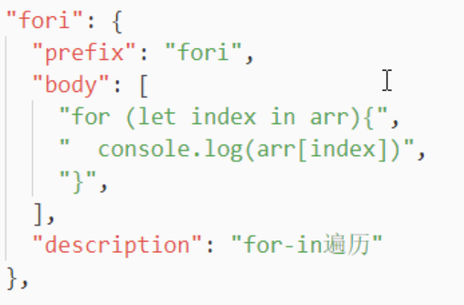
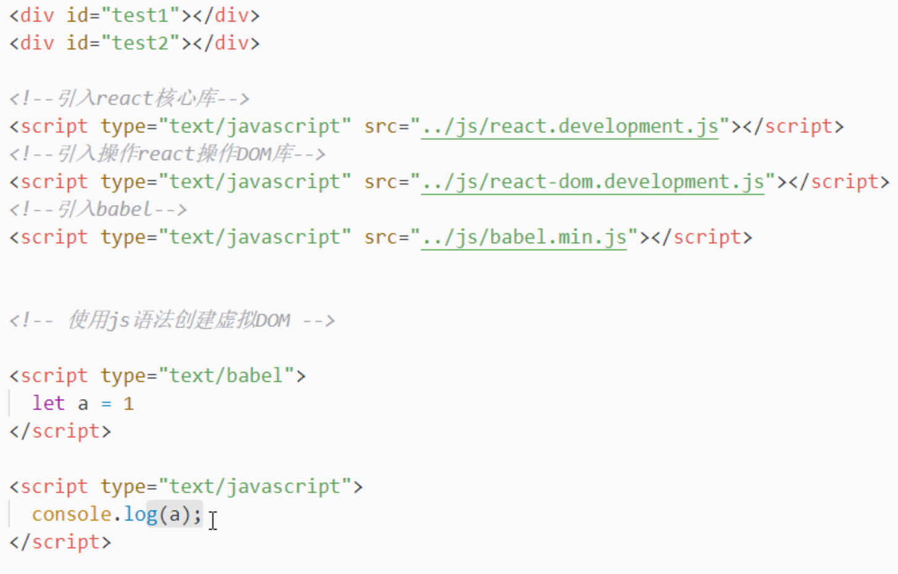
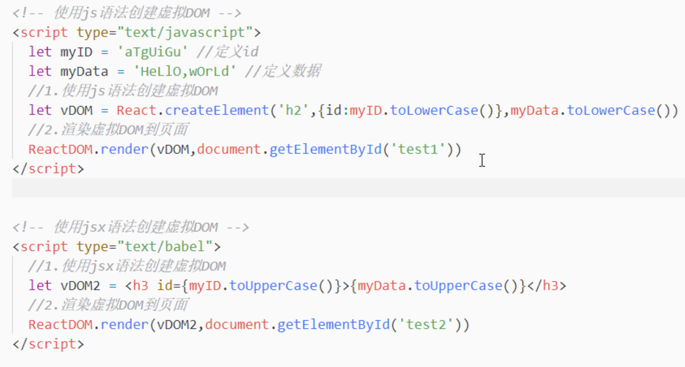
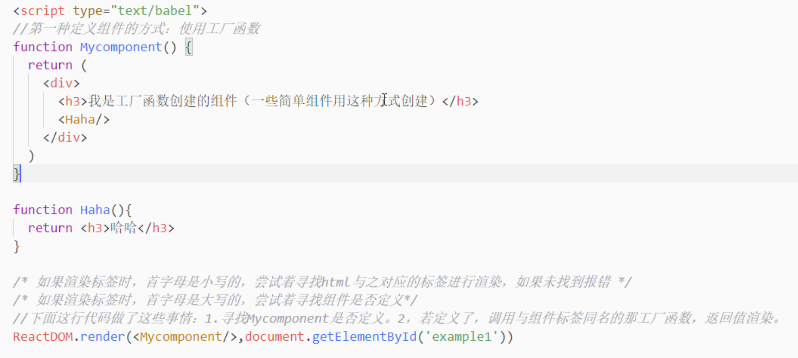
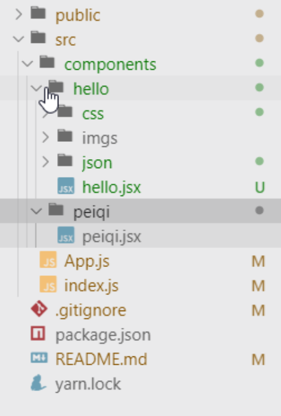
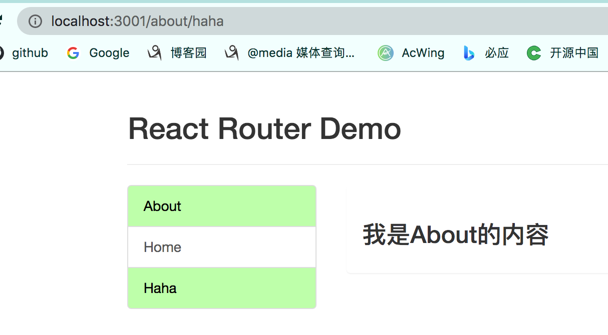

vscode配置代码模版格式：

> prefix：模版关键字
>
> body：模版内容
>
> description：模版介绍




声明式与命令式：

> 简单理解
>
> 命令式：自己编写操作DOM代码。
>
> 声明式：有框架完成对DOM的操作。


组件：一个功能模块或者页面中一个局部功能，这个功能包含实现该功能的所有代码和资源文件的集合，也就是说页面上一个功能点所有的代码+资源集合。


> 属性为`text/babel `的script标签中写jsx代码，需要浏览器借助bable.min.js代码，将其翻译成js代码才能运行。
>
> 属性为`text/babel `的script标签中定义的变量，`text/javascript`属性的script标签中无法使用，因为属性为text/bable的script标签后运行，因此`text/javascript`属性的script标签中的js代码拿不到。
>
> 反过来`text/javascript`属性的script标签中定义的变量，在属性为`text/babel `的script标签中可以使用。
>
> 


虚拟DOM两种创建方式：

> 引入三个react库文件
>
> 看代码地址`/Volumes/Untitled/前端/代码/08webpack+react谷粒后台/react_全家桶_stu/code/react_basic`




chrome中的`react dev tool`插件，用于调试，可以通过插件查看网站是否使用react写的，如果插件图片显示蓝黑色则该网站使用react写的。例如斗鱼、美团、知乎都是react写的


JSX写法要求：

1. 在设置标签的class属性时，不能使用class关键字，而是使用className，因为jsx最终翻译成js，ES6中使用了class标识符最为关键字。
2. 想要在jsx中创建虚拟DOM时，使用变量给标签设置属性值，需要使用大括号包裹{}
3. jsx创建虚拟DOM时，只能有一个根标签，像下面的写法就是存在多个根标签，react会报错。
4. jsx必须写在属性值为`text/babel`的script标签中。
5. 标签类型数据写在尖括号中，js代码写在大括号中。
6. 大括号中只能写js表达式，不能写js语句
7. 标签首字母大小写区别，如果首字母大写则表示为React组件，如果首字母小写，则看成为html标签
8. 如果标签中的style属性值是可变的，因此需要设置为一个变量，`<h1 style={{display: none, background-Color:red}}></h1>`
9. <a>标签中href需要设置值，但是不能设置`javascript:;`，目前为React不建议使用<a>
10. 对于列表项组件，每个组件必须设置key属性，并且组件中无法通过props属性获取该key值，并且通过`this.props.key`读取时会报错，`<LiItem key={id}>...</LiItem>`，


## React 三大属性

> props通过标签属性传递到组件内部。
>
> 如果重写`constructor`函数时需要注意：
>
> ```jsx
> class MyComponent extends React.Component{
>   
>   constructor(props){
>     super(props);
>   }
> }
> 
> <MyComponent name="k.k" age="18">
> 1. 构造器必须带有参数，无论标签添加了多少个属性，最后会统一的封装到一个对象中，传递给构造器，因此构造器只需要写一个参数就行。
> 2. 必须调用super方法，并且将构造器的参数传递给super方法，否则在构造器中查看this.props值为undefined。
> ```
>
> 

## React组件

> 1. 组件名称首字母必须大写，否则react报错
> 2. ReactDom.render()函数在将虚拟DOM渲染到某个真实DOM的中，作为子节点，不能使用该函数给某个真实节点多次添加，因为该函数时覆盖式渲染。
>
> 组件的嵌套： MyComponent组件嵌套Haha组件。
>
> 


## 资源的引入方式

> 图片的引入方式 `import logo from './img/logo.png'`
>
> css引入方式 import './css/demo.css'

## 组件化开发

> 创建了hello和peiqi两个组件，组件中所有资源都保存在一个文件夹中，方便移植给其它项目。




## 项目中使用库

> 在评论案例中，使用bootstrap.css时，为何放在public文件夹中，而不是放在src文件夹，原因：
>
> 1. bootstrap在项目的多个组件中使用，对于SPA项目，只有一个html文件，如果不放在public文件夹中，需要每个组件都要引入bootstrap，非常繁琐，不如直接放在public文件夹中，在index.html中直接使用link标签引入。
> 2. bootstrap有使用到相对路径的url，如果放在组件中引入，由于相对路径中没有文件，因此会直接保存。


## fetch


## day06-4

> 前端路由需要安装`React-router-dom`框架。
>
> `Link`与`NavLink`组件的区别在于`activeClassName`属性，可以给组件设置状态，例如高亮状态，默认activeClassName属性=active
>
> `Link`组件用来编写路由链接(相当于在页面上使用a标签设置跳转链接)，`Route`组件用来注册路由(相当于在后端配置处理请求的函数)
>
> `link`和`Route`组件都需要包裹在`BrowserRouter`组件中，因此实例代码中，直接index.js文件中，将整个项目包裹起来，这样不需要在每个`Link`和`Route`组件外侧分别包裹一个`BrowserRouter`组件.
>
> `switch`组件：在触发一个前端路由时，匹配到该路由的组件(`Route`)后，`react-router-dom`还会向下遍历浪费资源(相当于查找数组中是否存在一个字符串元素时，一种方式找到就返回，另一种将数组整个遍历一遍)，`switch`组件就是为了实现找到后停止向下遍历。
>
> **import** {NavLink,Route,Switch,Redirect} **from** 'react-router-dom'


## day06-5

> 路由组件和一般组件区分：一般组件自己添加到页面上，路由组件由react-router-dom库添加到页面上，组件写法一样，只是添加方式不同。
>
> 路由组件的匹配规则：(当跳转到某个path时，如何选择相应组件)
>
> 1. 路由组件匹配规则是模糊匹配，查看所有的Route标签中的path，与地址栏中的path对比，如果Route标签中的path被地址栏中的path包含，则匹配成功否则匹配失败，例如地址栏path=`/about/haha`，Route标签中的path=`/about`和`/about/haha`，则两个路由都匹配上，页面上显示这两个路由对应的组件。
>
> 精准匹配方式：
>
> 1. 在Route组件中添加`exact`属性(`exact={true}`，简写方式为`exact`)，表示在匹配时进行精准匹配，必须一摸一样才能匹配成功。
> 2. 添加exact效率不高，可以借助switch标签+调整Route标签顺序实现精准匹配。
>
> ```xml
> <!-- 
> 	前缀匹配，将长路径的Route放在前面，短的放在后面
> -->
> <Switch>
> 	<Route path="/about/haha" component={Haha} />
> 	<Route path="/home" component={Home} />
> 	<Route path="/" component={Haha} />
>   <Redirect to="/about"/>
> </Switch>
> ```
>
> 
>
> 默认显示：
>
> 1. 当没有匹配到任何路由时，使用`Redirct`标签进行重定向，显示到某一个路由上，上面的例子中重定向路由为`/about`，即当请求`/haha`时，没有匹配到任何路由，此时页面跳转到`/about`。
>
> 使用路由后public中css引入方式注意：(index.js引入css文件时，不能再使用`./css/bootstrap.css`这样的相对路径了，会导致资源路径不对，出现样式丢失情况)
>
> 1.  <link rel="stylesheet" href="%PUBLIC_URL%/css/bootstrap.css">
> 2. <link rel="stylesheet" href="/css/bootstrap.css">
>
> 使用前端路由时，切换地址时，组件是被隐藏了还是被杀死了：
>
> ​	通过组件的生命周期方法componentWillUnmount()，清楚的看到，跳转到另一个路径时，组件其实被杀死了而不是隐藏。


Link组件也是模糊匹配

```jsx
     <div className="row">
            <div className="col-xs-offset-2 col-xs-8">
              <div className="page-header"><h2>React Router Demo</h2></div>
            </div>
          </div>
          <div className="row">
            <div className="col-xs-2 col-xs-offset-2">
              <div className="list-group">
                  <NavLink className="list-group-item" to="/about" activeClassName="demo">About</NavLink>
                  <NavLink className="list-group-item" to="/home" activeClassName="demo">Home</NavLink>
                  <NavLink className="list-group-item" to="/" activeClassName="demo">Haha</NavLink>
              </div>
            </div>
            <div className="col-xs-6">
              <div className="panel">
                <div className="panel-body">
                  <Switch>
                    <Route path="/about" component={About} />
                    <Route path="/home" component={Home} />
                    <Route path="/" component={Haha} exact/>
                    <Redirect to="/about"/>
                  </Switch>
                </div>
              </div>
            </div>
          </div>

<!--
	Route组件用来控制页面右半部分显示，NavLink组件用来控制页面左半部分显示
	地址栏为/about/haha
	path="/about"的Route组件，模糊匹配成功
	to="/about"和to="/"的NavLink的组件，模糊匹配成功，因此页面显示效果为下图方式
-->
```




## day06-6

> 路由组件必须包含Router组件中，React提供了两个组件，`BrowserRouter`和`HashRouter`，使用`HashRouter`包含路由组件时，地址栏出现`#`(http://localhost:3000/#/about/ts)，`#`后面的path是使用前端路由跳转的路径。
>
> 举例：
>
> `http://localhost:3001/about/haha#/home`，表示当前网页从`http://localhost:3001/about/haha`请求回来的，#后面的path是使用路由跳转的，并没有发送网络请求。
>
> Public文件夹中index.html文件中资源路径问题：
>
> 1. 使用BrowserRouter时：
>    1. 方式1：将文件中所有以`.`开头的相对路径，改为以`/%PUBLIC_URL%`开头。 <link rel="stylesheet" href="%PUBLIC_URL%/css/bootstrap.css">
>    2. 方式2：删除相对路径中开头的`.`。<link rel="stylesheet" href="/css/bootstrap.css">
> 2. 使用HashRouter时：无需改变。
>
> `&nbsp;`问题
>
> ​	React框架会自动删除组件中的回车换行符。


## day06-7

> js修改css样式方式：
>
> 1. 
>
> 原生js通过className获取或者setAttribute方式获取，如果标签有多个选择器时，如果追加选择器？
>
> 使用前端路由后，以前的<a>标签这种跳转链接都变成了<Link>标签，点击Link标签页面会发生改变，犹如跳转到一个新页面，其实并没有发送网络请求，此时与服务器的交互变成了ajax方式。
>
> 加不加switch标签的区别，看下面代码

```jsx
<Switch>
	<Route path="/about/haha" component={Haha} />
	<Route path="/home" component={Home} />
	<Route path="/about" component={About} />
  <Redirect to="/about"/>
</Switch>


<Route path="/about/haha" component={Haha} />
<Route path="/home" component={Home} />
<Route path="/about" component={About} />


<!-- 
		加switch与不加switch标签的区别：
  	当请求地址为http://localhost:3000/about/haha时：
		1. 加swtich标签的页面，只显示HaHa组件
		2. 不加switch标签的页面，显示Haha和About两个组件
-->
```


## day-06-8

> 下面代码配置了二级路由：
>
> ​	App组件配置了两个一级路由`/about`和`/home`
>
> ​	Home组件配置了两个二级路由`/home/news`和`/home/message`，不能写成`/news`和`/message`，否则点击home链接按钮界面还是about界面，因为redirect标签，注册的一级路由没有匹配上，默认显示`/about`的页面。二级路由的redirect标签也要写成`/home/news`

```jsx
export default class App extends Component{
  render(){
    return (
        <div>
          <div className="row">
            <div className="col-xs-offset-2 col-xs-8">
              <div className="page-header"><h2>React Router Demo</h2></div>
            </div>
          </div>
          <div className="row">
            <div className="col-xs-2 col-xs-offset-2">
              <div className="list-group">
                  <NavLink className="list-group-item" to="/about" activeClassName="demo">About</NavLink>
                  <NavLink className="list-group-item" to="/home" activeClassName="demo">Home</NavLink>
              </div>
            </div>
            <div className="col-xs-6">
              <div className="panel">
                <div className="panel-body">
                  <Switch>
                    <Route path="/about" component={About} />
                    <Route path="/home" component={Home} />
                    <Redirect to="/about"/>
                  </Switch>
                </div>
              </div>
            </div>
          </div>
        </div>
    )
  }
}


export default class Home extends Component{
  render(){
    return (
        <div>
          <h2>Home组件内容</h2>
              <div>
                <ul className="nav nav-tabs">
                  <li>
                    <NavLink className="list-group-item" activeClassName="demo" to="/home/news">News</NavLink>
                  </li>
                  <li>
                    <NavLink className="list-group-item" activeClassName="demo" to="/home/message">Message</NavLink>
                  </li>
                </ul>
                <Switch>
                  <Route path="/home/news" component={HomeNews}/>
                  <Route path="/home/message" component={HomeMessage}/>
                  <Redirect to="/home/news"/>
                </Switch>
              </div>
          </div>
    )
  }
}
```


> 历史记录有两种记录方式：
>
> 1. push方式，使用栈结构，每次请求的地址都压入栈中。
> 2. replace方式，使用替换方式，将每次请求的地址将覆盖栈顶位置的地址。
>
> 点击Link或者NavLink标签跳转时，是否记录到历史记录中，是否可以使用后退按钮返回到上一个按钮。
>
> `<Link to="/home/news" replace>新闻</Link>`
>
> 添加replace属性表示不记录到历史记录中，也就是无痕访问，replace方式，默认是记录，push方式。


## day06-9

> 路由组件和一般组件的区别：
>
> 1. 路由组件需要借助`react-router-dom`库，才能渲染出来。
> 2. 两种组件的实例对象的props属性不同，路由组件额外增加了`location`、`match`、`history`属性
>
>  
>
> 路由组件传递参数注意：
>
> 1. 路由组件通过占位符获取到的所有数据都是字符串类型，因此在进行比较运算时需要注意数据类型要一致。
>
> 路由组件传参步骤(向detail这个路由组件传参(父组件传递给子组件))：
>
> 1. 在<Route>中，像node讲的参数路由一样，设置参数路由<Route path="/home/message/:id/:name">
> 2. 在<Link>通过路径传递参数，<Link to="/home/message/123/tom">
> 3. 在detail组件中，通过`this.props.match.params`获取父组件传递的参数。
>
>  
>
> 数组查找相应元素方式：
>
> 1. 使用find方法，[].find((item)=>{ return item.id === id})。
>
> 1. 


## day06-10

> 标签添加事件回调时，给事件回调函数传递参数:
>
> 1. 在事件回调函数外层包一层箭头函数
>
> 理解push和replace，在点击浏览器后退按钮时返回到哪里：
>
> `/` --> `/home` --> `/home/message` --> `/home/message/detail/1` --> `/home/message/detail/2` --> `/home/message/detail/3`
>
> 进入`/home/message`地址后，使用push方式后，历史记录：
>
> ```
> [
> 	/ ,
> 	/home,
> 	/home/message,
> 	/home/message/detail/1,
> 	/home/message/detail/2,
> 	/home/message/detail/3
> ]
> ```
>
> 进入`/home/message`地址后，使用replace方式后，历史记录：
>
> ```
> [
> 	/ ,
> 	/home,
> 	/home/message/detail/3
> ]
> ```
>
> 这就是replace和push区别
>
> 路由跳转方式：
>
> 1. 使用`Link`或者`NavLink`标签实现跳转
> 2. 使用函数实现跳转，
>    1. this.props.history.push(path)
>    2. this.props.history.replace(path)
>    3. this.props.history.goBack()
>    4. this.props.history.goForward()
>
> React是借助`history`库实现的路由跳转，也可以在原生html页面上引入`history.js`文件，实现前端路由的跳转，history库提供了一个listen(function)监听历史记录的改变


## day06-11

> 向组件中传递数据方式：
>
> 1. 组件通信
>    1. Pubsub-js
>    2. 组件标签属性设置一个回调函数，通过回调函数给组件传递数据，用来给父组件或者兄弟组件传递数据
> 2.  通过组件标签属性，直接给组件传递数据
> 3. 通过给标签添加子节点，给组件传递数据
>    1. `<Button>haha</Button>` ==> 数据haha会保存到Button的props属性中，结构this.props = {children: 'haha'}
>
> ```jsx
> import React,{Component} from 'react'
> 
> export default class Haha extends Component{
> 
>   componentDidMount(){
>     console.log('我是Haha组件（一般组件）我的实例是：',this);
>   }
> 
>   render(){
>     console.log(this);
>     return (
>      <!-- {...this.props}写法是将props属性提取以标签属性方式显示，如果遇到children属性，则将其值添加到子节点 --> 
>       <div {...this.props}></div>
>     )
>   }
> }
> 
> 
> import React,{Component} from 'react'
> import {NavLink,Route,Switch,Redirect} from 'react-router-dom'
> import Haha from './components/haha'
> import About from './pages/about'
> import Home from './pages/home'
> 
> 
> export default class App extends Component{
>   render(){
>     return(
>       <div>
>         <Haha name="k.k">test</Haha>
>       </div>
>     );
>   }
> }
> 
> 实际渲染效果：
> <body>
>   <div>
>   		<div name="k.k">test</div>
>   </div>
> </body>
> ```


## day07-1 复习

> exact使用问题，路由组件中尽量少使用exact，否则会导致路径跳转不过去

```
app.jsx文件中注册组件
 <Switch>
		<Route path="/about" component={About}/>
		<Route path="/home" component={Home} exact/>
		<Redirect to="/about"/>
</Switch>

home.jsx文件中注册组件
<Switch>
		<Route path="/home/news" component={HomeNews}/>
		<Route path="/home/message" component={HomeMessage}/>
		<Redirect to="/home/news"/>
</Switch>

此时地址栏中分别输入http://localhost:3000/home和http://localhost:3000/home/new，会发现永远打不开home组件，地址栏一直显示http://localhost:3000/about。

原因：
		因为注册Home路由组件时，使用exact属性，因此，
		1. 当path为/home/new时，没有匹配到，因此重定向到/about
		2. 当path为/home时，虽然匹配上了Home组件，但是Home组件中还有路由组件，此时默认重定向到/home/news，相当于在地址栏中输入/home/news，一级路由中/home为精准匹配，因此一级路由没有匹配上，默认重定向到/about页面。
```


# React项目

## day07-13

高阶函数：接收函数类型参数，或者返回函数类型的函数。

常见的高级函数：Promise、定时器、bind、数组遍历函数

React组件：组件的本质是一个函数。

高阶组件：它是一个特殊的高阶函数，想要成为高阶组件需要满足3个条件：

1. 必须是一个组件，或者说必须是一个函数，类本质也是一个函数
2. 接收组件参数，
3. 要返回组件类型数据。

常见的高阶组件：Form.create()函数返回值为高阶组件，withRouter(组件)，connect()返回值为高阶组件。`Form.create()(组件)、connect()(组件)`


## day08-00复习

在旧版本antd3.x版本时，提交表单时，浏览器默认行为会刷新页面，需要在回调函数中阻止默认行为`event.preventDefault()`。


## day08-05

> reducer模块调用时机：
>
> 1. createStore函数时，传一个Reducer函数对象，会调用函数对象。
> 2. 在store模块每次改变值时，Reducer函数对象会调用。


## day08-07

> redux：
>
> 1. store，核心模块，用来存储组件状态，和与其它组件交互。
> 2. reducer，业务模块，用来根据业务逻辑，修改组件状态。
> 3. action，封装模块，将业务数据封装成，组件状态可以接收的数据格式。
>
> 流程：
>
> 1. 自己的组件使用action模块，将数据进行封装，
> 2. 然后通过store模块，传递给reducer模块，用来修改state状态。
> 3. 自己的组件通过store模块的getState()方法获取修改后的state状态。
>
> store保存着共享数据，但是并不修改共享数据，将数据的更新路径抽离到reducer模块中实现。
>
> 
>
> redux使用注意：
>
> 1. redux修改state后，不会更新页面，需要在index.js文件中添加通过Pubsub方法添加订阅方法，调用ReactDom.render()方法刷新。
> 2. redux可以实现组件之间的数据共享，但是数据不会持久化，当刷新页面时，store就会被删除，因为项目最终被翻译成html+css+js，刷新一下就没了。
> 3. 在reducer模块中，可以参数时，有两点注意(reducer模块中的方法必须是一个纯函数)：
>    1. 在reducer模块的方法中，不允许修改参数变量的值。
>    2. reducer模块的方法，必须有返回值，即如果不想修改preState，则将preState作为返回值返回。


## day09-00

> 纯函数：
>
> 1. 输入相同的数据，返回结果相同，函数中除了参数外不能引用其它外部变量。
> 2. 函数执行时不产生副作用，即改变外部状态，
>    1. 不能修改函数参数值。
>    2. 不能在函数内部调用网络、IO、页面刷新、console这些与外部或者系统交互的代码。例如IO操作，同样的输入，因为IO操作的成败，导致返回结果不同，页面刷新直接改变了外部状态，console与外部系统交互。


## day09-06

> async-await方式创建异步链条，只能处理resolved状态的Promise，不能处理rejected状态的Promise。

```javascript

async function demo1(){
  // result为Promise为resolved状态时的值
   let result = await new Promise((resolve, reject)=>{resolve(111)});
   console.log(result); // 111
}

// Promise为rejected状态时,await所在的这句代码直接抛异常，因为async-await方式处理不到失败状态，需要使用try-catch方式处理
async function demo1(){
  	try{
	  	  let result = await new Promise((resolve, reject)=>{reject(111)});
  	    console.log(result);      
    }catch(error){}

}
```


## day10-7

> 全屏效果：
>
> 浏览器的全屏效果有两种：
>
> 1. 标签页全屏，使用screenfull库实现标签页全屏
> 2. 浏览器全屏，点击f11全屏
>
> 注意：
>
> 1. 当浏览器全屏时，使用代码无法控制取消全屏效果，w3c规范禁止代码控制浏览器全屏；对于标签页的全屏是由代码控制的。
> 2. 下面三种图分别展示了，
>    1. 第一张图，浏览器正常打开网页
>    2. 第二张图，浏览器开启标签页全屏和浏览器全屏
>    3. 第三张图，关闭标签页全屏，但是浏览器全屏还是在。


> 使用safari浏览器可以非常清晰看到浏览器全屏和标签页全屏区别
>
> 1. 图片1为标签页全屏
> 2. 图片2为浏览器全屏
> 3. 图片3为浏览器非全屏状态


## day10-10

> promise使用场景：
>
> 1. 函数A内部调用了一个异步函数B，想要将异步函数B获取的数据作为外层函数A的返回值时，使用promise函数。
>
> React声明式理解：
>
> ​		传统方式时，ajax获取网络数据，然后通过DOM将数据放到相应DOM节点中，而使用React框架时，并不会操作DOM，DOM与DOM所在的组件的state绑定，使用ajax获取网路数据后，将数据放到组件的state属性中，React自动更新组件(使用js获取相应DOM对象，放数据)。
>
> 组件生命周期：React开发的页面，在点击时并不会触发浏览器的刷新，因此组件的消失和隐藏，伴随着组件的创建和销毁，当组件隐藏(用户看不见时)，该组件就会被销毁。


## day10-12

> 在props属性上，路由组件比一般组件多history、match、location这三个属性。
>
> 当需要在一般组件中想要使用路由组件中的这三个属性时，例如当前组件想要获取当前的url路径，需要借助`withRouter`方法，将一般组件转成路由组件。

```javascript
正常写法：
class Header extends Component{
  render(){
    return (<div><div/>)
  }
}

Header = withRouter(Header);
export default connect(
	state => ({param: state.name}),
  {
    fun1: demoFun1,
    fun2: demoFun2
  }
)(Header);

使用装饰器写法：
@connect(state => ({param: state.name}),
  {
    fun1: demoFun1,
    fun2: demoFun2
  }   
)
@withRouter
class Header extends Component{
  render(){
    return (<div><div/>)
  }
}

export default Header;

// 使用装饰器写法时，如果遇到某个类需要被多次装饰时，在类定义位置，依次排开，注意connect应该作为最后一个装饰。放在需要被装饰的类的最上面。
```


## day11 - 05

> header中的title显示问题：
>
> 1. 用户从浏览器地址栏输入地址时，如何让侧边栏选中对应的页面，header的title显示对应的标题。
> 2. 退出后登录时，路由跳了两次`/admin`和`/admin/home`，如何让侧边栏选中对应的页面，header的title显示对应的标题。
> 3. 点击侧边栏中对应的按钮，header的title如何显示对应的标题。

## day11 - 06

> 使用redux解决侧边栏与header组件通信，点击侧边栏按钮，header的title显示相应的数据 
>
> 使用redux管理title，在刷新页面时，redux数据丢失，此时需要组件自己根据地址栏显示title。


## 问题

### 定义多个reducer时，每个reducer时如何与容器组件绑定的？

> 下面的伪代码就解释了React-redux库是，如何精准的调用相应的reducer，其实并没有实现容器组件和相应的reducer绑定，而是调用store中保存的所有reducer。实际测试中，创建一个容器组件和两个reducer组件，确实每个reducer都调用了，并且preState值并不是获取整个共享数据，而是对应自己的共享数据。PersonReducer中获取到的是`store.persons`

```jsx
// 伪代码
function combineReducers(reducers){
  return reducers;
}

function createStore(reducers){
  let store = new Object();
  store.reducers = reducers;
  let params = Object.keys(reducers);
  for(key in params){
    store[key] = reducers[key]();
  }
  
  store.dispatch
  
  return store;
}

function dispatch(store, action){
  let params = Object.keys(reducers);
  for(key in params){
    store[key] = reducers[key](store[key], action);
  }
}
combineReducers(
	{ persons: PersonReducer,
		classes: ClassReducer
	}
);
```


> 解答：
>
> 在使用combineReducers()方法添加reducer时，接收一个对象，对象中的属性名为需要保存到store对象中的共享数据的属性名，属性值为reducer，是一个方法，保存对数据的处理逻辑。
>
> redux传递输入是通过dispatch()方法向store发送更新数据，然后store调用reducer对数据处理，store会将接收到的数据，发送给使用combineReducers方法注册的每一个reducer方法，preState为
>
> 
>
> 实际处理结果为，将调用注册到store中的所有reducer模块中的方法，每个方法接收action参数，通过switch语句判断action.type然后进行处理，每个reducer只能接收到自己的


### update state after component unmount错误

> ​		组件销毁后，继续更新该组件的state，俗称操作僵尸对象。出现这种问题的原因时，组件中创建了一些定时器、或者在进行网络请求时，突然切换到其它组件时，当前组件从页面上消失，此时该组件其实被销毁了，但是定时器任务或者网络请求还是在继续，会修改state属性，导致上面的问题。
>
> 解决方案：
>
> ​		在生命周期方法(`componentWillUnmount`)中释放定时器，或者停止网络请求。


### jsonp库的坑

> jsonp默认超市时间为60s，可以自定义超时时间，但是当请求时状态码不是200～299时，jsonp会等到超时时间后，在返回错误信息，此时如果页面销毁，就会造成`update state after component unmount`问题，因此将错误信息拦截

```javascript
export const reqWeather = (city)=>{
    let url = other.weather.getUrl(city);
    return new Promise((resolve, reject)=>{
        jsonp(url, {timeout:4000}, (error, data)=>{
            if(error){
                message.error('天气获取失败');
                return new Promise(()=>{}); // 如果错误，直接中断，async-await只能处理resolved状态的promise，避免让它们改state数据
            }else{
                resolve({status: 0, data});
            }
        })
    });
}

class Header extends React.Component{
      getWeather = async () => {
        let {data,img} = await reqWeather('北京');
        this.setState({ weather: `${data.wea} ${data.tem2}°C ~ ${data.tem1}°C`, img });
    }
}
```


```javascript
方式2 

export const reqWeather = (city)=>{
    let url = other.weather.getUrl(city);
    return new Promise((resolve, reject)=>{
        jsonp(url, {timeout:4000}, (error, data)=>{
            if(error){
                message.error('天气获取失败');
                reject(error); // 如果错误，让调用者捕获这个错误。
            }else{
                resolve({status: 0, data});
            }
        })
    });
}

class Header extends React.Component{
      getWeather = async () => {
        try{
          let {data,img} = await reqWeather('北京');
        this.setState({ weather: `${data.wea} ${data.tem2}°C ~ ${data.tem1}°C`, img });
        }catch(e){
          console.log('错误')
        }
    }
}
```


### 组件的刷新？？？

> 组件刷新有两种：
>
> 1. 当前组件中state属性发生改变
>    1. 无论是否更新state中的数据，只要调用了setState()方法，就会触发该state对应组件的render()方法，刷新组件。
> 2. redux中数据更新，会调用store中所有reducer，connect
> 3. 路由
>
> 哪个组件的state发生改变，则只更新那个组件。
>
> redux的store中数据发生改变，是刷新页面上所有组件，还是刷新哪些改变的组件？


### render方法递归问题

> 不要在componentDidUpdate()生命周期方法中调用setState()方法，会造成无限递归调用。