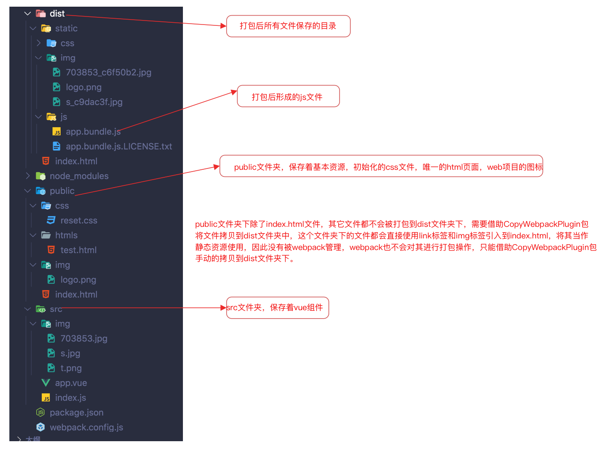
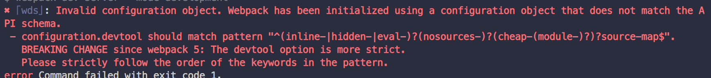

# 不使用脚手架搭建vue环境

## vue项目依赖的编译包

> 1. `webpack`：打包工具
> 2. `webpack-cli`：打包工具命令，需要使用这个包才能操作webpack进行打包
> 3. `webpack-dev-server`：开发环境服务器，这个包用来提供一个服务器环境，用来运行项目。
> 4. `html-webpack-plugin`：html打包，默认webpack打包会使用默认的html文件，使用这个包，可以给webpack提供一个html模版，让webpack依据该html进行打包。即在某个html页面基础上添加项目功能。
> 5. `babel-loader`：用来实现将ES6以及更高版本的js语法，翻译成成ES5，提高兼容性。
> 6. `@babel/preset-env`：安装babel-loader时，需要安装这个包。
> 7. `@babel/core`：安装babel-loader时，需要安装这个包。
> 8. `css-loader`：加载css，webpack默认是不对css文件进行打包，因此使用这个加载器实现，将css文件中的数据模块化，实现打包目的。
> 9. `style-loader`：将打包后的css添加到style标签中。
> 10. `url-loader`：用来打包其它资源文件，像图片、音频、视频、字体库等。
> 11. `file-loader`：url-load是对file-loader的封装，因此安装url-loader需要安装该包。
> 12. `vue-loader`：用来处理`.vue`文件，解析并提取其中的内容转换成组件对象。
> 13. `vue-template-compiler`：用来预编译vue文件中的html标签，转换成对象，方便后续操作。

## webpack.config.js文件配置

```javascript
let { resolve } = require('path');
let HtmlWebpackPlugin = require('html-webpack-plugin'); // 引入html模版插件
let VueLoaderPlugin = require('vue-loader/lib/plugin') // 进入vue文件解析插件
let CopyWebpackPlugin = require('copy-webpack-plugin'); // 引入静态文件拷贝插件
module.exports = {
    entry: {
        app: resolve(__dirname, 'src/index.js') // 设置webpack打包起点，从哪个文件开始
    },
    output: {
        path: resolve(__dirname, 'dist'),  // 设置打包后所有文件保存的基础路径
        filename: 'static/js/[name].bundle.js', // 设置打包后最终文件路径
      	publicPath: '/'  // 设置html页面使用script标签引入打包后的app.bundle.js文件路径的基础路径，这样设置的结果为<script src="localhost:8080/static/js/app.bundle.js">
    },
    module: {
        rules: [
            // ES6 => ES5
            {
                test: /\.js$/, // 设置查找方式，src下所有后缀名为js文件进行语法转换
                include: [resolve(__dirname, 'src')], // 设置只对那些路径进行转换
                use: {
                    loader: 'babel-loader',
                    options: {
                        presets: ['@babel/preset-env',{
                           useBuiltIns: 'usage',
					                'corejs': 2 // 处理一些新语法的实现，例如 async-await
                        }],
                      
                        plugins: [
               						['component', {
					                "libraryName": "mint-ui", // 针对mint-ui库实现按需引入打包
           					      "style": true // 自动打包对应的css
              						}]
            						]
                    }
                }
            },

            // 处理图片，将项目的组件中用到的所有图片都打包到dist/static/img文件夹下，如果图片没有被使用不会进行打包。
            {
                test: /\.(jpg|jpeg|png|gif)$/i, // 
                use: {
                    loader: 'url-loader',
                    options: {
                        limit: 8192, // 图片小于8kB时，转成base64保存。
                        name: 'static/img/[name]_[hash:7].[ext]',
                        esModule:false // 解决weback4.0版本，加载图片报[object%20Module]错误问题
                    }
                }
            },

            // 处理css
            {
                test: /\.css$/,
                use: ['vue-style-loader', 'css-loader'], // 会按照顺序从后向前处理项目中的css文件
            },

            // 处理vue文件
            {
                test: /\.vue$/,
                loader: 'vue-loader'
            }
        ]
    },
    plugins: [
        new HtmlWebpackPlugin({
            template: 'public/index.html', // 将哪个页面作为模板页面处理(在根目录查找)
            filename: 'index.html' // 生成页面(在output指定的path下)
        }),
        new VueLoaderPlugin(),
        new CopyWebpackPlugin({ // 用来打包public文件下的文件，将其转移到dist文件夹下。
            patterns:[
                {
                    from: __dirname + '/public',
                    to: __dirname + '/dist/static',
                    globOptions: {
                        dot: true,
                        gitignore: true,
                        ignore: ["**/*.html"], // 忽略public文件夹下的所有html文件。
                    },
                }
            ],
            options:{

            }
        }),
    ],
    // webpack-dev-server的开发服务器的配置
  	devServer: {
    	port: 8081,
	    open: true, // 自动打开浏览器
  	  // quiet: true, // 不做太多日志输出
      // 配置代理服务器解决跨域问题
    	proxy: {
      	// 让代理服务器处理以/api开头路径的请求
	      // '/api': 'http://localhost:4000'   // http://localhost:4000/api/search/users
  	    '/api': { 
    	    target: 'http://localhost:4000', // 转发的目标地址
      	  pathRewrite: {
        	  '^/api' : ''  // 代理服务器转发请求时去除路径前面的/api
	        },
  	    },
	
  	    '/gh': {
    	    target: 'https://api.github.com', // 转发的目标地址
      	  pathRewrite: {
        	  '^/gh' : ''  // 转发请求时去除路径前面的/api
	        },
  	      changeOrigin: true, // 支持跨域, 如果协议/主机也不相同, 必须加上
    	  }
	    },

  	  historyApiFallback: true, // 任意的 404 响应都被替代为 index.html，针对history前端路由
	  },
  
    // 开启source-map调试，建立map映射，即在浏览器调试时显示源码而不是压缩混淆后的代码。
	  devtool: 'cheap-module-eval-source-map',
    // 模块化引入时配置
    resolve: {
        extensions: ['.js', '.vue', '.json'], // import引入模块时，如果文件后缀名为js、vue、json时，可以省略的后缀名。
        alias: { // 路径别名(简写方式)
            'vue$': 'vue/dist/vue.esm.js',  // 解析vue文件时，使用带编译的版本的vue。
         		 // 设置import引入模块时的路径，必须要在像../../../../src/i.js这样找文件了。
            '@': __dirname, 
            '@src': resolve(__dirname, 'src'),
            '@components': resolve(__dirname, 'src/components'),
        }
    }
}
```

> 注意：
>
> ​		开发时项目分两部分，一部分时放在src下的文件，另一部分是放在public下的文件(例如index.html、base.css、favicon.ico图片)，这些文件中除了index.html文件，其它文件不会被webpack打包，因此需要使用`CopyWebpackPlugin`包，将这些文件拷贝到打包后生成的`dist`文件夹下。



## 项目中文件路径问题

> index.html文件中直接使用link、img这些标签引入时路径设置：不要使用相对路径，而要使用绝对路径。
>
> ```html
> <html>
> <!-- 这个link标签使用的是相对路径，相对于当前浏览器中的url地址-->
> 	<link rel="stylesheet" href="./static/css/reset.css">
> <!-- 这个link标签使用的是绝对路径，去掉前面的“.”，路径为相对于打包后生成的dist文件夹-->
> <link rel="stylesheet" href="/static/css/reset.css">
>   
> <!-- 这个js文件是webpack将项目src下所有文件打包后生成的文件，它是webpack添加到文件中的，因此需要在webpack中的output输出项中使用"publicPath"配置文件的根路径 -->
> <script src="/static/js/app.bundle.js"> 
> </html>
> 
> 当请求地址为http:localhost:8080/home/detail时，
> 第1条连接请求服务器的地址为：http:localhost:8080/home/detail/static/css/reset.css
> 第2条连接请求服务器的地址为：http:localhost:8080/static/css/reset.css
> 而此时reset.css文件放在dist/static/css文件夹下，这样第一条连接报404。
>   
> 不设置publicPath时的请求路径：http:localhost:8080/home/detail/static/js/app.bundle.js
> 设置publicPath时的请求路径：http:localhost:8080/static/js/app.bundle.js
> 而此时app.bundle.js文件放在dist/static/js文件夹下，不设置时报404错误。
> 
> ```
>
> 

## 配置是的错误

> 升级weback4.0 加载图片报[object%20Module]错误，在配置图片资源的loader中的options添加`esModule:false`。
>
> 问题原因：
>  url-loader默认采用ES模块语法，即import '../aaa.png'；然而Vue生成的是CommonJS模块语法，即require('../image.png')；二者不一致。要么让file-loader或url-loader采用CommonJS语法，要么让Vue采用ES语法。`url-loader中的属性esModule选项能调整，将其设置为false即可，就关闭了es模块语法`

> 使用`webpack-dev-server`启动时，报`webpack启动服务报错Cannot find module 'webpack-cli/bin/config-yargs'`错误。
>
> 问题原因：
>
> ​	webpack-cli的问题，将webpack-cli版本将到3.3就好了
>
> ```bash
> "webpack": "^5.4.0",
> "webpack-cli": "^3.3.12",
> "webpack-dev-server": "^3.11.0"=
> ```

> 升级webpack5.0后，配置source-map时，`devtool:cheap-module-eval-source-map`报下面的错误。
>
> 
>
> 将其改为`devtool:eval-cheap-module-source-map`就可以了

