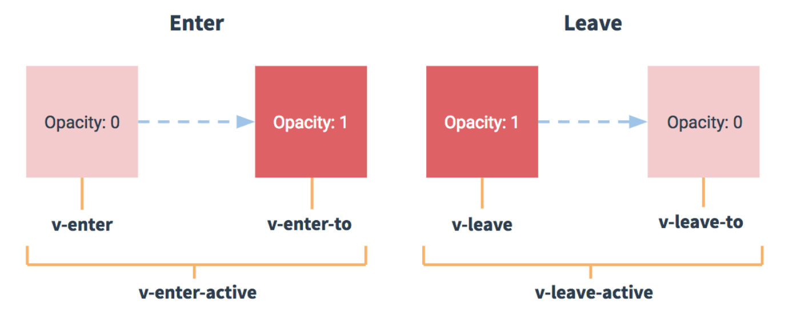

 # vue过渡与动画

> vue过渡和动画一般用在：
>
> 1. v-if和v-show修饰的标签上
> 2. 动态组件，有`is`属性的标签

## vue过渡

> vue过渡实现方式：
>
> 1. css
> 2. 过渡钩子函数
> 3. css+过渡钩子函数


### 使用css实现过渡

> css实现过渡步骤：
>
> 1. 使用`<transition name="xxx">`标签将需要进行过渡的标签包裹起来，并给transition标签添加name属性。
> 2. 给其中需要过渡的标签添加`v-if`或者`v-show`属性用来触发过渡。
> 3. 在该组件的`style`标签中，添加`.xxx-enter-active`、` .xxx-leave-active`、`.xxx-enter`、`.xxx-leave-to`这几个类选择器。
>
> 
>
> 通过给`transiton`标签中标签添加css实现过渡效果。
>
> 根据transition标签的name属性值xxx会创建6个类选择器：
>
> 1. xxx-enter：当标签过渡开始时刻(开始显示到页面上)的样式，下一帧移除该类选择器。
> 2. xxx-enter-to：当标签过渡过程(显示到页面上)的样式，过渡结束后移除。
> 3. xxx-leave：当标签过渡开始时刻(开始从页面消失)的样式，下一帧移除该类选择器。
> 4. xxx-leave-to：当标签过渡过程(从页面消失)的样式，过渡结束后移除。
> 5. xxx-enter-active：显示到页面上时的过渡样式，例如过渡时间，过渡曲线等
> 6. xxx-leave-active：从页面上消失时的过渡样式，例如过渡时间，过渡曲线等

```html
<style>
	/* 组件的过渡样式 */
  .demo-enter-active, .demo-leave-active{
    transition: all 3s;
  }
  /* 将要显示时，标签的状态 */
  .demo-enter, .demo-leave-to{
    opacity: 0;
    transform: translateX(20px);
  }
</style>

<div id="#demo">
  <Button @click="show = !show">点我</Button>
	<transition name="demo">
		<p v-show="show"> hello transition</p>
	</transition>
</div>

<script>
new Vue({
	el:'#demo',
	data:{
    show:true
  }
})
</script>
```

### 使用钩子函数

```html
<transition
  v-on:before-enter="beforeEnter"
  v-on:enter="enter"
  v-on:after-enter="afterEnter"
  v-on:enter-cancelled="enterCancelled"

  v-on:before-leave="beforeLeave"
  v-on:leave="leave"
  v-on:after-leave="afterLeave"
  v-on:leave-cancelled="leaveCancelled"
>
  <!-- ... -->
</transition>

<script>
methods: {
  // --------
  // 进入中
  // --------
  beforeEnter: function (el) {
    // ...
  },
    
  // 当与 CSS 结合使用时
  // 回调函数 done 是可选的
  enter: function (el, done) {
    // ...
    done()
  }, 
  afterEnter: function (el) {
    // ...
  },
  enterCancelled: function (el) {
    // ...
  },

  // --------
  // 离开时
  // --------
  beforeLeave: function (el) {
    // ...
  },
  // 当与 CSS 结合使用时
  // 回调函数 done 是可选的
  leave: function (el, done) {
    // ...
    done()
  },
  afterLeave: function (el) {
    // ...
  },
  // leaveCancelled 只用于 v-show 中
  leaveCancelled: function (el) {
    // ...
  }
}
</script>
```


## 动画

```html
<html lang="en">
<head>
  <meta charset="UTF-8">
  <title>10_过渡&动画2</title>
  <style>
    /* 显示动画样式 */
    .bounce-enter-active {
      animation: bounce .5s;
    }

    /* 隐藏动画样式 */
    .bounce-leave-active {
      animation: bounce .5s reverse;
    }

    @keyframes bounce {
      0% {
        transform: scale(0);
      }
      50% {
        transform: scale(1.5);
      }
      100% {
        transform: scale(1);
      }
    }
  </style>
</head>
<body>

  <div id="example-2">
    <button @click="show = !show">Toggle show</button><br>
    <transition name="bounce">
      <p v-if="show" style="display: inline-block;">Lorem</p>
    </transition>
  </div>

  <script type="text/javascript" src="../js/vue.js"></script>
  <script>
    new Vue({
      el: '#example-2',
      data: {
        show: true
      }
    })
  </script>
</body>
</html>
```


## 疑问

> 添加过渡选择器时，为何为何不设置`xxx-leave`和`xxx-enter-to`？
>
> 答：因为添加过渡动画一般是从当前状态转换成另一种状态，当前状态就是程序运行时标签的样式，因此无需在重复设置，只需要设置他需要转换成另一种状态的样式。
>
> ```html
> <transition name="fade">
>    <Blog class="blog" v-if="show" @headerCustomEvent="handleEvent" ref="blog"/>
> </transition>
> 
> <style  scoped>
>     .blog{
>         transform: translateX(40px);
>     }
>    .fade-enter-active, .fade-leave-active{
>         transition: all 1s;
>     }
>     .fade-enter, .fade-leave-to{
>         opacity: 0;
>         transform: translateX(20px);
>     }
> </style>
> 
> <!--
> 	Blog标签当前状态为display不为none时的状态，opacity：1，translateX：40px，另一状态为opacity：0，translateX：20px
> 	并不是看show值来确定标签的当前状态。
> -->
> ```
>
> 

> 可以给需要过渡的标签添加正常状态的自定义过渡样式，像上面代码给`Blog`标签设置了一个translateX=40px，`注意给需要过渡标签设置过渡样式时，选择器权限，例如Blog标签的选择器变成id="blog"，导致transform过渡效果失效，因为id选择器权限>class选择器`