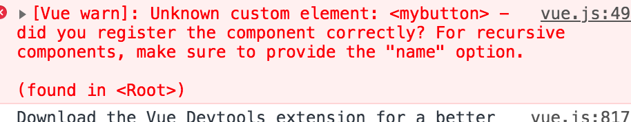

# props

> vue中也是通过props实现从父组件传递给子组件，但是与React不同的是，vue需要先注册才能使用，而React直接使用。
>
> 注意：虽然vue中可以直接修改props中属性的属性值，但是强烈建议不要去修改它，作为只读属性。因为如果传过来一个对象，修改对象的属性值父组件相应数据也会跟着变。

```vue
<!-- 使用v-bind修饰实现动态参数 -->
<MyButton param1="111" :param2="222"></MyButton>

Vue.component('MyButton',{
		props:['param1', 'param2'], // 注册传进来的参数才能使用
		template:' <p>{{param1}}</p> '
});
```


## props参数验证

> vue不像React，可以在注册时直接设置接收参数的类型:
>
> type：设置接收参数类型
>
> required： 是否必须传
>
> default：如果不传时的默认值
>
> validator：对传入的数据进行验证。

```vue
<!-- 使用v-bind修饰实现动态参数 -->
<my-button param1="111" :param2="222" :prop-e="{a:1, b:2}" prop-e="tttt"></my-button>

<script>
Vue.component('MyButton',{
		props:{
				param1: String,
			
      	param2:{
    		  type: String,
      		required: true,
					default: '000'
		    },
      
				// 配置接收的参数为对象
				propE: {
      		type: Object,
		      // 对象或数组默认值必须从一个工厂函数获取
    		  default: function () {
        	return { message: 'hello' }
      	}
		    // 自定义验证函数
    		propF: {
        validator: function (value) {
           // 这个值必须匹配下列字符串中的一个
        	 return ['success', 'warning', 'danger'].indexOf(value) !== -1
         	}
        }
    },
				
		}, // 注册传进来的参数才能使用
		template:' <p>{{param1}}</p> '
});
</script>
```


## 传递数据

> 如果传递的是对象类型，需要使用`v-bind`修饰，告诉vue将属性值当js解析，不要当成字符串。

```html
<!--传递数组-->
<blog-post :comment-ids="[234, 266, 273]"></blog-post>

<!--传递对象整体-->
<blog-post :author="{
    		name: 'Veronica',
		    company: 'Veridian Dynamics'
		  }"
></blog-post>

<!-- 将对象展开，对象属性作为参数，post={id:'', title=''} -->
<blog-post v-bind="post"></blog-post>
<!-- 等价于 -->
<blog-post
  v-bind:id="post.id"
  v-bind:title="post.title"
></blog-post>
```


## inheritAttrs与$attrs

> 一般通过给组件标签添加属性实现向组件传递数据，但是如果传入的参数不注册时，vue会自动将传入但没有注册的属性添加到组件的根标签中。
>
> 如果不想让组件根标签显示一些莫名其妙的属性，将组件的`inheritAttrs`设置为false。
>
> $attrs属性会保存当前组件接收但没有注册的props参数，一般用在props参数层层传递上。使用该属性不需要在做让中间组件将父组件传入的参数一个个注册并传递个子组件这样的事情了。

```html
<div id="demo">
    <base-input label="1111" value="22222" title="33333" dd="44444"></base-input>
</div>

<script>
		Vue.component('baseInput', {
	  inheritAttrs: false, // 禁止没有注册的属性添加到组件的根标签中，作为根标签的属性
		props: ['label', 'value'],
		template: `
		<label>
    		{{ label }} --- {{value}} --- {{title}} --- {{dd}}
		    |||||
    		{{ $attrs.label }} --- {{$attrs}} --- {{$attrs}} -- {{$attrs.dd}}
		    <input v-bind:value="value" :"$attrs" v-on:input="$emit('input', $event.target.value)">
		</label>
		`});
</script>

<!-- 
		由于向baseInput组件传入了4个参数，但是只注册了2个，剩下两个属性会保存到$attrs属性中，可以传递个子组件。
-->
```


## 使用注意

> props中的参数`在标签中`和`在props中`需要注意写法，和使用`Vue.component`方式注册组件一样，在标签中单词必须小写并且使用横杠连接，在props中使用小驼峰表示。
>
> 

