## github上的vue项目

```txt
https://github.com/huanggengzhong/vue
https://github.com/huanggengzhong/js-structures-and-algorithms
https://github.com/huanggengzhong/react/tree/master/fusiondesign
https://github.com/vue-bulma/vue-admin
https://github.com/bailicangdu/vue2-elm
https://github.com/qq281113270/vue
https://github.com/bailicangdu/vue2-happyfri
https://github.com/chuzhixin/vue-admin-beautiful
https://github.com/newbee-ltd/newbee-mall-vue3-app
https://github.com/bigbigtime/vue-admin
```


## day01-8

```js
在创建监听时，回调方法不能箭头函数，而是普通函数，因为箭头函数的this由外层函数指定，会导致vue在调用回调函数时，this指向不对。
vm.$watch('lastName', function(){
  
});
```


```js
<div id="app">
  	<input type="text" v-model="msg"/>
  	{{msg}}
</div>

// 写法一，创建时绑定DOM
// 定义Vue对象
let vm = new Vue({
  el:'#app'  // vm绑定哪个真实DOM
  data:{
  	msg:'hello'
	}
})

// 写法2，调用实例对象方法进行绑定
let vm = new Vue({ // 配置对象: 属性名是一些特定的名称
   // el: '#test',
    data: { // 包含多个可变数据的对象, 相当于state, 为模板页面提供数据
      msg: 'atguigu'
    }
});
vm.$mount('#app'); // vm绑定哪个真实DOM

```


Vue方法的配置对象中data可以是一个对象，也可以是一个函数

```js
let vm = new Vue({ // 配置对象: 属性名是一些特定的名称
   // el: '#test',
    data(){
    		return {msg: 'haha'}
    }
});
```


## day01-12

> vue数据绑定实现：即内存数据与DOM的绑定实现动态更新，`只绑定data属性`
>
> 1. data中对象的监听，通过计算型属性，给对象的所有`层次`的属性添加get和set方法，改变属性值则页面则会更新。
> 2. data中数组的监听，重写了Array类型的操作方法，通过监听这些方法的调用实现监听，并反应到界面上。
>
> 为何数组不和对象一样，通过操作属性来监听，即修改下标实现页面更新？
>
> 对象监听需要每个对象的属性都要添加get和set方法，而数组中的元素不确定，如果有100个，那需要给每个元素添加get和set方法，这样非常低效，就和在DOM事件中为何实现事件委派一样，数组方法就那几个，只要重新那几个方法就能监听所有的数组元素。但是对象的操作都是通过set和get方法，因此只能通过给每个属性添加get和set实现监听。

```js
<div id="app">
  <button @click="sortType=2">按年龄升序</button>
  <button @click="sortType=3">按年龄降序</button>
  <button @click="sortType=1">原本顺序</button>
</div>

 new Vue({
    data: {
      searchName: '',
      sortType: 1, // 排序的类型, 1: 不排序, 2: 升序, 3: 降序
    }
  }).$mount('#app')

@click的属性值绑定方法，vue绑定方法没有React那样限制，必须是表达式，可以是语句，也可以是函数调用，只有在按钮点击时才会调用，并且操作属性时，不需要指定this，this已经制定好了，vue会自动去vm对象的属性中找。不用写this仅限于上面代码中字符串中直接写语句的写法。
```


vue的计算型属性是如何建立依赖的？


## day02-1

> vm对象会将data中的属性搬到vm对象中，作为vm对象的计算型属性，在模版中访问数据，不需要写this.data.xxx，而是直接写xxx，因为模版找与该模版绑定的vm对象，在vm对象上找同名计算型属性，通过get和set方法内部再去操作data中的属性。


## day02 - 03

> vue中，在点击事件的回调函数的this永远是绑定该标签的vm对象，之前在学习中将event和this搞混了，认为事件回调函数的this为event，这是不对的。event是作为参数传入回调函数中的，并不是回调函数的this。
>
> vue与React在生命周期结束时对组件的处理是不同的：
>
> 1. React在组件生命周期结束时，直接将其卸载。
> 2. Vue在组件生命周期结束时，将其变成静态页面，也就是维持vm对象死亡时，标签的状态。并不会将至从页面中删除。

```js
<div id="test">
  <button @click="destroyVM">destroy vue</button>
</div>

  new Vue({
    el: '#test',

    // 销毁之前执行1次
    beforeDestroy() {
      clearInterval(this.intervalId)
    },

    methods: {
      destroyVM (e) {
        console.log('destroyVM',this); // this === vm
        this.$destroy()
      }
    },
  })
```


## day02-04

> vue在`beforeCreate`方法与`created`方法之间，做的事情：
>
> 1. 实现了数据代理(在vm对象中根据`_data`中的属性创建同名的计算型属性)
> 2. 数据绑定(vue构造函数调用时接收一个配置对象，根据其中的data属性在vm对象中创建`_data`属性，并与标签建立双向绑定)。
> 3. 在vm对象中创建与标签中声明的事件回调函数同名的方法。
>
> beforeMount：DOM挂载到页面上之前，在该方法之前，vue会将模版编译成真实DOM对象。
>
> mounted：模版上的标签显示在页面上，在该方法中可以编写业务逻辑代码，例如网络请求，添加定时器等等。
>
> beforeUpdate：当vm对象的data属性中的数据发送改变时，会触发beforeUpdate方法，此时data中的数据已经更新，但是页面显示的数据还没有更新，可以在该方法中获取旧数据。
>
> updated：当页面更新完毕时，会调用该方法，此时页面已经更新完毕。


## day02-05

> vue过渡：
>
> 需要自己添加过渡的样式：
>
> 1. 过渡时间和过渡的轨迹(先快后慢)
> 2. 过渡的属性

```javascript

```


> 使用vue动画时，块元素注意：(实现一个文字放大后消失的效果，但是由于块元素占用一行，会出现文字左移的现象，因为块元素占整行，所以才会出现这种现象。)
>
> 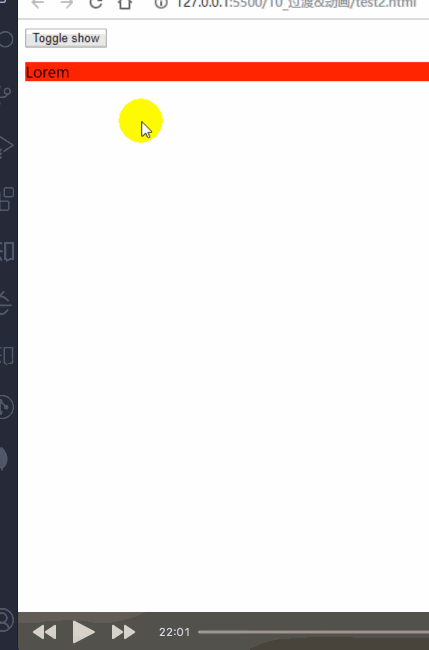


## day02-06

> vue过滤器，其实是对数据格式化，接收一个参数，根据传入的参数，按照格式化规则返回一个新数据。
>
> 


## day02-11

> webpack打包命令：
>
> 1. `npx webpack`，使用npm中的一个附属包npx，这样可以实现向webpack-cli、babel-cli这样全局安装的包无需全局安装，npx命令会在项目的根目录的nodeModules文件夹下找相应的包，找不到再去全局找，这样做的好处时，如果公司有多个项目，项目使用的版本不一致，如果都用全局打包的化，造成所有项目的包版本一致。
>
> 2. 在package.json中配置scripts属性，在项目的根目录下直接运行`yarn build`、`yarn start`
>
>    ```javascript
>    "scripts": {
>      "start": "webpack --mode development"
>      "build": "webpack --mode production"
>    }
>    ```


## day03-02

> Vue中将组件进入之后，还需要注册组件才能真正使用，不像React引入之后直接可以使用。
>
> 全局注册：可以在所有地方使用。
>
> 局部注册：只能在注册的地方使用。

```javascript
// 注册全局组件
Vue.component('button-counter', {
  data: function () { // data必须是一个方法，而不是一个对象，为了组件的数据独立不共享。
    return {
      count: 0
    }
  },
  template: '<button v-on:click="count++">You clicked me {{ count }} times.</button>'
})

// 注册局部组件
new Vue({
  el:"#app",
  components:{  // 局部组件的注册，只能在该构造函数中使用，即在template中使用。
    ATag: {
      data(){
        return {
          title: 'aaaa'
        }
      }
    }
  },
  template:"<ATag/>"
})
```


## day02-3

> style标签添加`scoped`属性，限定当前组件的样式只对当前组件有效，对子组件和父组件都是不生效的。
>
> 实现原理：其实组件的样式使用属性选择器实现，在每个组件中添加一些编号的属性。

## day04-01

> 在该对象中定义路径别名，之后写路径方便一些。
>
> 例如在一个很深的路径中，访问src目录下的app.vue，`import App from @/app.vue`，非常简单

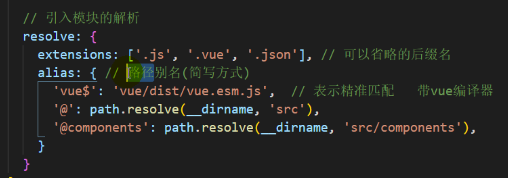


## day04-02

> 注册组件和使用组件时的写法，对于有两个单词组成的组件名：
>
> 1. 注册时使用啥写法，使用时就用啥写法，单词首字母都大写。
> 2. 注册时使用单词首字母大写，使用时可以单词小写，使用横杠连接。

```vue
<template>
  <div>
  		<SearchHeader/> // 写法1，常用写法
    	<blog-list/>  // 写法2， 奇葩写法
  </div>
</template>


<script>
  import Header from '@/components/Header.vue'
  import List from '@/components/List.vue'
  export default { // 配置对象

    components: {
      SearchHeader: Header,
      BlogList: List
    }
  }
</script>
```


## day04-03

> 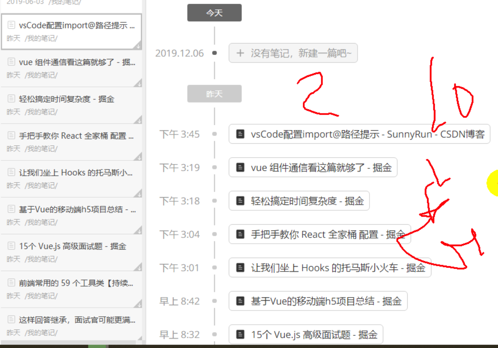
>
> 
>
> vue与React在接收父组件传值的不同点：
>
> 1. React直接将参数作为子组件的标签中添加属性，子组件就可以通过`this.props`属性接收。
> 2. Vue也是将参数作为子组件的标签添加到属性中`<Header :param="data"/>`，子组件在接收时需要注册，然后才能使用。
>
> ```javascript
> export default{
> 	props:['param'] // 注册接收参数名称
> }
> ```
>
> props限制参数类型方式：
>
> 1. React，通过React的props-type包中定义了一些数据类型和约束，用来给props设置约束。
> 2. Vue，props在接收参数时，不仅可以是数组，还可以是对象，使用对象时，对象的属性就是数据的类型和约束。
>
> ```javascript
> // Vue
> export default{
>   // 给props属性设置约束
>   props:{
>     age: Number, // 设置简单约束
>     // 设置复杂约束
>     height:{
>       type: Number,
>       default: 0,
>       required: true,
>       validator:function(value){
>         return value >= 0
>       }
>     }
>   }
> }
> 
> 
> // React
> class Header extends React.Component{
> }
> // 给Header组件的props属性设置约束
> Header.propTypes={
>   name:PropTypes.string.isRequired,
>   age:PropTypes.number
> }
> ```
>
>  
>
> 组件化流程思路：
>
> 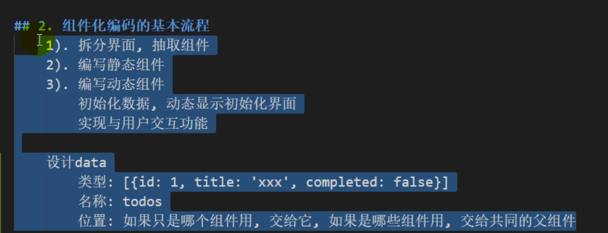
>
> 组件化开发思路：
>
> 1. 将原型图拆分成组件
> 2. 以组件化方式编写静态页面。
> 3. 设计数据
>    1. 分析数据类型
>    2. 数据名称
>    3. 数据所在位置，如果只是当前组件使用，则放在当前组件的data中，如果多个组件共享，则放在共同的父组件中。
> 4. 添加交互功能。

## day04-06

> vue计算型属性
>
> 两种计算型定义方式：
>
> ```javascript
> export default{
>   computed{
>   		temp1(){ // 只读计算属性，注意它不是方法，而是组件的一个属性
>         return 1;
>       },
>       temp2:{  // 读写计算属性，注意它不是方法，而是组件的一个属性
>         get(){
>           return 1;
>         },
>         set(){
>           
>         }
>       }
> 	}
> }
> ```
>
> 
>
> 1. 只有get
> 2. get和set


## day04-13

> Vue的事件总线：它是利用来原型链和自定义事件绑定来实现组件通信，将自定义事件绑定在Vue类的原型对象，该原型对象在所有组件对象的原型链上，因此将事件挂载在它上面，满足自定义事件创建条件(事件绑定和事件触发在一个组件对象上)。
>
> 组件对象原型链：组件对象`VueComponent类`的实例对象 --> Vue类的实例对象 --> Vue类的原型对象。

```javascript
// index.js
new Vue({

  beforeCreate () { // 创建组件事件总线对象就能与当前根组件对象，尽量早的执行挂载全局事件总线对象的操作
    Vue.prototype.$globalEventBus = this
  },

  // el: '#root'
  // 注册局部组件
  components: { // 注册组件(后面才能写组件标签)
    App: App
  },
  template: '<App/>'
}).$mount('#root')

// App.js 接收用户数据
  export default { // 配置对象
		data:{
      list:[]
    }
    mounted () {
      // 通过xxx来绑定事件监听
      this.$globalEventBus.$on('deleteTodo', this.deleteTodo)
    }

		beforeDestroy(){
      	this.$globalEventBus.$off('deleteTodo'); // 当组件销毁时，清除自定义监听
    }

		method:{
      deleteTodo(){
        
      }
    }
  }

// item.js
export default { // 配置对象
    mounted () {
      // 通过xxx来绑定事件监听
      this.$globalEventBus.$on('deleteTodo', this.deleteTodo)
    }

		method:{
      deleteBtn(){
         this.$globalEventBus.$emit('deleteTodo', 参数1, 参数2)
      }
    }
  } 
```


## day05-03

> 组件的原型链：
>
> 组件对象(VueComponent类型)--> Vue实例对象(Vue类型) --> Vue原型对象(`Object类型`) --> Object原型对象(Object类型) --> null
>
> 使用Pubsub.js时注意订阅的回调函数的`this`指向问题。需要使用箭头函数设置this。`注意Pubsub.js的发布函数分同步和异步两种方法`。

```javascript
export default{
  mounted(){
    Pubsub.subscribe('func1', (msg, {param1, param2})=>{ 
      
    });
  }
}
```


## day05-08

> vue1.0使用第三方包`vue-resource`，实现网络请求。
>
> vue2.0推荐使用第三方包`axios`，实现网络请求。


## day05-11

> webpack配置@babel-preset-env，用来处理不同浏览器对ES6支持度不一致的情况，使用这个包(这个包是一堆包集合)实现不同平台运行ES6时效果一致。
>
> `runtime-corejs2`包，将ES6的一些新语法和API转成ES5版本，例如Array.of、Array.from、async-await等，在Vue中使用async-await时，需要借助runtime-corejs包，Vue将代码中的async-await，翻译成regeneratorRuntime，来实现这个async-await功能，如果在Vue中使用async-await，但不引入改包，就会出现下面错误。
>
> 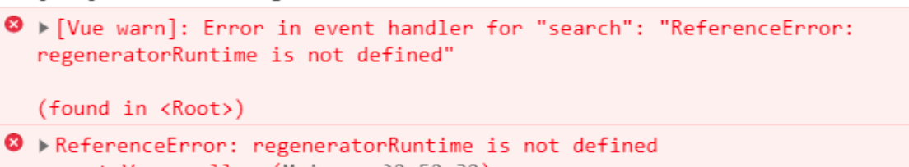


## day05-12

> vue的两种UI组件库：
>
> 1. Mint-UI，vant-ui，cube-ui，移动端UI
> 2. Element-UI，iview，PC端UI
>
> UI组件库大体有两种类型：
>
> 1. 函数和对象式组件，例如一些显示消息的组件(Toast)	，使用时不需要注册。
> 2. 普通的组件，例如Button、Image等组件，使用时需要注册
>
> Vue中mint-ui库的按需加载配置
>
> 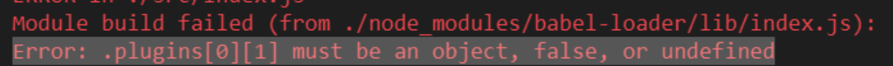

```javascript
//babel-loader中按需加载错误配置，按照下面方式配置就会报上图的错误
plugins: [
              
  ['component', [ // 简写方式，最好写全称babbel-plugin-component
    {
    "libraryName": "mint-ui", // 针对mint-ui库实现按需引入打包
    "style": true // 自动打包对应的css
  }]]
]

// babel-loader中按需加载正确配置
plugins: [
              
  ['babbel-plugin-component', {
    "libraryName": "mint-ui", // 针对mint-ui库实现按需引入打包
    "style": true // 自动打包对应的css
  }]
]
```


## day06-06

> React与Vue使用路由的不同与相同点。
>
> 相同点：
>
> 1. 在动态路由(参数路由)中，同一个路径切换下，路由组件会复用，不同路径切换下，路由组件会销毁重建，例如`/home/news/:id`这种只是id改变，不会造成路由组件的销毁和重建。
>
> 不同点：
>
> 1. Vue不分路由组件和一般组件，由于Vue的路由是统一配置成对象，并添加到顶级组件中，因此顶级组件下所有的组件都是路由组件，都有`$router`和`data.$route`属性，但是`React的组件`没有路由属性，想要让一般组件变成路由组件，只有两种方法：
>    1. 通过<Route>方式渲染组件，此时组件就变成路由组件，props属性中就包含路由方法。
>    2. 使用withRouter高阶组件，包裹一般组件，此时组件就变成了路由组件，props属性中也会包含路由方法。
> 2. 动态路由参数变化时更新页面方式变化：
>    1. vue时添加`$route`属性的监听方法，当路由参数改变时，触发监听，修改data中的数据，利用双向绑定实现页面数据的更新。React中，由于点击路由连接触发路由组件的更新，因此重新调用render方法，实现数据的更新。

## day06-07

> Vue中有两个属性，`router`和`route`，router属性是保存在Vue原型对象中，可以让所有组件使用，该属性用来实现编程式路由导航，即可以调用push、replace、go、back等方法。
>
> route属性是data中的属性，用来接收路由相关的数据，例如通过路由参数传递过来的数据：
>
> 1. params方式传递数据，通过`route.params`
> 2. query方式传递数据，通过`route.query`

## day06-08

vue中获取路由参数方式：

1. 路由传递的数据都保存在`data.route`中，直接通过`this.route`方式读取。
2. 将route中的数据提取到组件的props属性中，这样可以直接读取props获取路由组件传递的数据，这样做的好处时降低了与当前路由地址的耦合程度，直接通过props属性读取时，可以将其看成普通组件，复用到其它项目中时，直接将数据设置到props中就可以让组件正常运行(至于如何传递，通过标签属性还是参数路由，则交个调用者来考虑，实现高内聚，低耦合)，如果使用route的话，则需要搭建动态路由。

## day06-09

> history问题：
>
> 前端路由有两种实现方式：
>
> 1. 使用url中的hash实现，前端路由。
> 2. 使用h5新api，history实现前端路由。
>
> 在自己使用webpack配置vue时，切换到history模式下(vue默认使用hash实现前端路由)，浏览器默认会将地址发送给后台，由于开发的时单页面应用，因此服务器只有`http:localhost:8080/index.html`这一个后端路由，因此返回404，也就是说浏览器将前端路由当后端路由使用了，导致了404发生，解决步骤：
>
> 1. 在webpack的devServer中添加`historyApiFallback:true`，表示任意404响应都替换成index.html页面。
> 2. 修改index.html页面中引入的一些静态资源的路径，不要再使用相对路径了，`./static/css/base.css`变成`/static/css/base.css`，将斜杠前面的点去掉，表示项目根路径。
> 3. 修改index.html中的js文件路径，在webpack的output属性添加`publicPath`属性，设置打包输出的js文件的访问路径的基础地址。

```html
<!-- 没有修正js路径时，当请求localhost:8080/home/new地址时，localhost:8080/home/static/css/app.bundle.js -->
<script type="text/javascript" src="static/css/app.bundle.js"></script>

<!-- 修正js路径时，当请求localhost:8080/home/new地址时，localhost:8080/static/css/app.bundle.js -->
<script type="text/javascript" src="/static/css/app.bundle.js"/>
```


## day06-10

> 路由缓存：
>
> `<keep-alive>`标签，缓存路由组件，即当进行路由切换时，默认情况时将不在页面上显示的路由组件干掉，但是使用`<keep-alive>`标签，可以缓存路由组件，这样减少网络请求(因为如果路由组件中存在ajax时，每次销毁后重建都需要重新请求数据)。
>
> include：路由缓存时，使用那些路由组件
>
> exclude：路由缓存时，排除那些路由组件

```vue
<div class="list-group">
		<!-- 路由链接 -->
		<router-link class="list-group-item" to="/about">About</router-link>
		<router-link class="list-group-item" to="/home">Home</router-link>
</div>

<div>
  <keepalive include="['about', 'home']">
  		<router-view></router-view> // 路由组件显示位置，include参数表示哪些路由组件进行路由缓存
	</keepalive>
</div>
```


## day06-13-vuex

>  vuex作用于redux一样，用来进行组件间数据共享，步骤和redux差不多，都是创建一个store对象，然后配置到顶级组件中，这样所有组件都可以通过`this.$store`获取store对象，从而得到共享数据。
>
> vuex与redux一样，也分为action和reducer，即actions和mutations，action用来间接修改store对象中的共享数据，mutations用来直接修改store对象中的共享数据，换句话说，如果操作共享数据需要进行其它操作(例如进行一些业务逻辑处理，或者异步请求时)，只能使用actions，如果直接更改共享数据，则直接调用mutation中的方法。store对象有两个方法：
>
> 1. dispatch('action名称'，数据)，调用对应的action，更新共享数据。
> 2. commit('mutation名称'，数据)，直接调用mutation，跳过action，直接更新共享数据。


## day07-01-mapstate

> vuex提供的语法糖：mapState, mapGetters, mapMutations, mapActions
>
> 组件读取共享数据时，一般需要在组件中添加该数据的计算型属性，然后在计算型属性的getter方法中使用`this.$store.state.count`，使用语法糖就不需要手动一个个添加计算型属性。

```javascript
// 不使用语法糖之前
export default{
  computed:{
    count () {
        return this.$store.state.count
      },

		evenOrOdd () {
    	   return this.$store.getters.evenOrOdd
      }
  },
  methods: {
      increment () {
        this.$store.commit('INCREMENT')
      },

      decrement () {
        this.$store.commit('DECREMENT')
      },

      incrementIfOdd () {
        this.$store.dispatch('incrementIfOdd')
      },

      incrementAsync () {
        this.$store.dispatch('incrementAsync')
      }
    }
  
}

// 使用语法糖后
export default {
    computed: {
      ...mapState(['count']), // {count () {return this.$store.state['count']}}
      ...mapGetters(['evenOrOdd']) // {evenOrOdd () {return this.$store.getters['evenOrOdd']}}
    },
  	methods: {
      ...mapActions(['incrementIfOdd', 'incrementAsync']),
      ...mapMutations({
        increment: 'INCREMENT',
        decrement: 'DECREMENT'
      }), // 方法名与传入commit方法的参数值不同时，需要特殊指定。
    }
}
```


## day07-02-vuex结构图

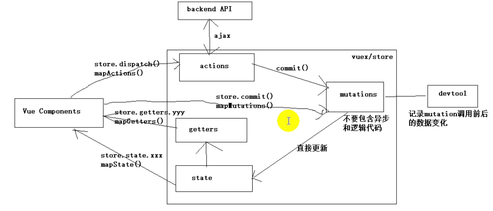

store更新后，如何通知页面更新？react中，通过订阅发布机制，更新app组件，刷新整个页面中的所有组件实现更新。

计算属性与页面是如何相互监听的？测试方法，利用firstname、lastname、fullname哪个例子，在fullname的get方法、和updated生命周期方法添加打印，修改firstname，看看是否有打印输出。

在js中让一个`方法名`、对象属性名是一个变量的写法，`[变量名]`


## day08-05

数据劫持和数据绑定有什么关系：

数据绑定：将数据与界面进行关联，当数据改变时，界面会跟着改变。

数据劫持是对数据绑定的一种技术实现。

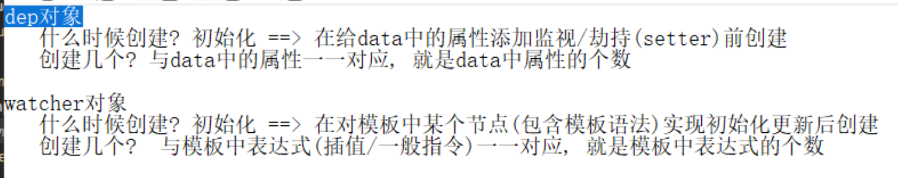

## day08-06

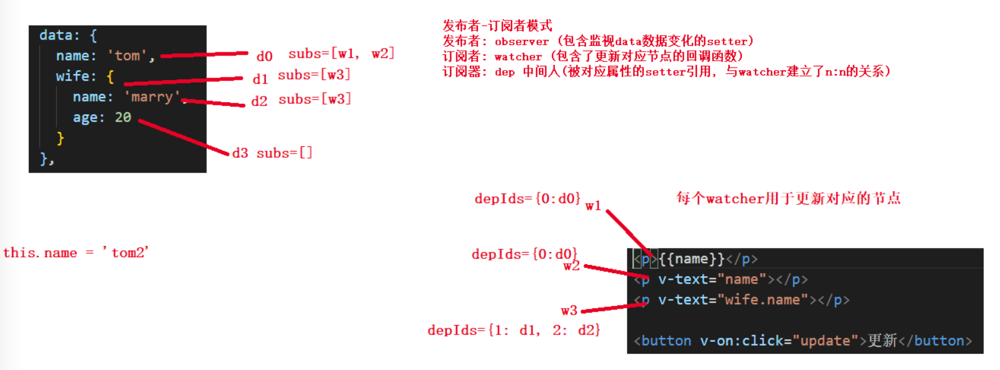

> watcher内部有一个回调函数，用来更新页面数据。
>
> observer会递归遍历data中所有属性，将每层存储属性替换成计算型属性，属性值通过闭包的作用链来保存。
>
> 为每层属性创建一个dep属性。
>
> 当页面初始化时，在解析模版页面时，在解析模版中的指令和插值的同时，创建对应的watcher对象(模版中每个指令和插值都对应一个watcher对象)，并在watcher构造方法中建立与对应读取的属性的dep的关系，建立方式，当解析模版中的指令和插值时，会将其替换成data中的属性值，此时会调用属性的get方法，将watcher保存到一个全局变量中，在get方法中访问自己属性的dep对象，从全局变量中取出watcher并保存到dep中。
>
> watcher中也会保存dep属性，为何使用对象而不是数组来保存？
>
> ​		为了防止watch重复添加到dep中，在watch根据depId保存dep，当watch中存在depId时，表示当前属性dep已经与watcher绑定完毕。
>
> 为何watcher与dep是多对多的关系？
>
> 1. dep对应多个watcher，因为data中的属性值可能被页面多次使用，因此当数据改变时，需要更新页面多处地方。
> 2. watcher对应多个dep，因为data中有对象属性，例如访问`_data.wift.name`时，当替换整个wift对象时需要watcher更新页面，当替换wift.name属性值时，也需要watcher更新页面。
>
> 何为响应式？
>
> 修改内存中的数据时，页面也会跟着改变


## day08-08

数据绑定的初始化

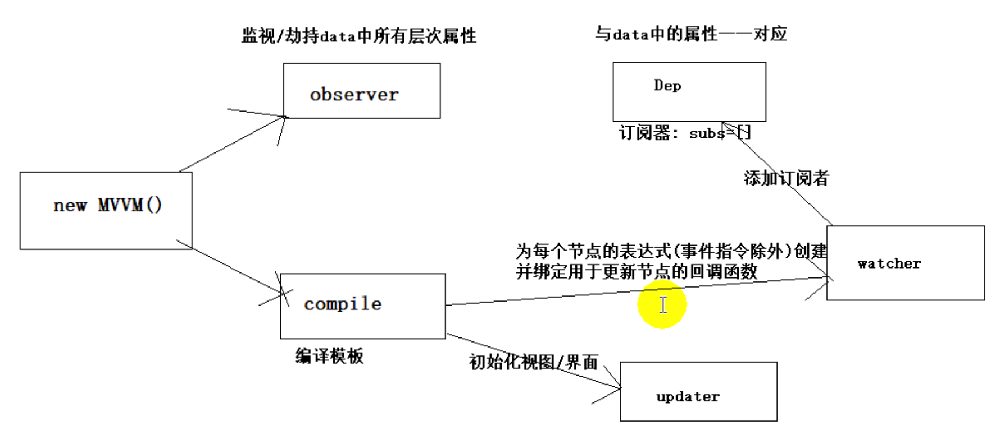

数据更新

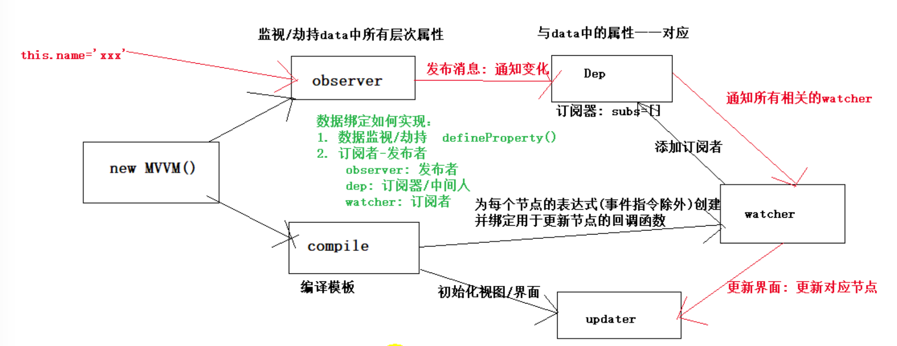


## day08-09

数据的双向绑定：在数据绑定的基础上(model--> view)，建立view-->model的绑定，使用v-model指令来实现数据的双向绑定。

v-model实现原理：

1. 在解析v-model指令时，不仅创建watcher对象建立model到view的数据绑定，还给view定义来`input`事件，在事件回调函数中修改`_data`中对应的属性，导致model改变，从而再进行页面的更新。


## day08-10

```javascript
npm install -g @vue/cli // vue的脚手架3版本
vue create vue项目名称 // 使用脚手架3创建vue项目

npm install -g vue/cli 或者 npm install -g @vue/cli-init // vue的脚手架2版本
vue init webpack vue项目名称 // 使用脚手架2+webpack创建vue项目
```


## day08-11

> vue2的语法检查
>
> `.eslintignore`：这个文件用来定义在对项目进行语法检查时，那些文件不需要检查
>
> `.eslintrc.js`：这个文件用来配置eslint库，在其中的`rules`中可以配置规则，即哪些语法忽略。
>
> 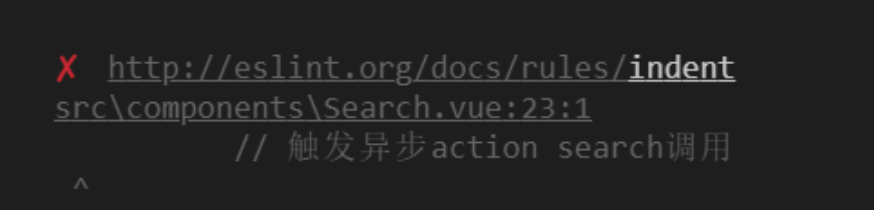图1
>
> 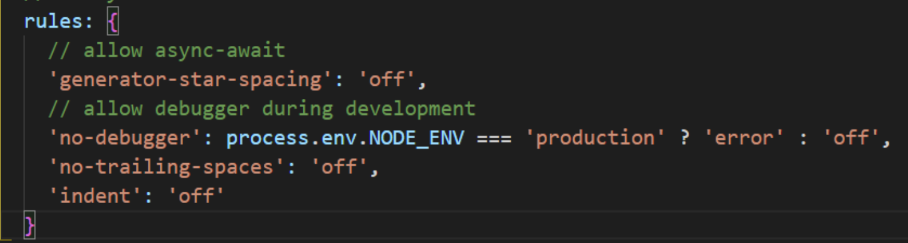图2
>
> 图1是语法检查错误，亮白色单词为语法错误的名称，可以在`.eslintrc.js`文件的rules属性中配置，关闭这个规则。图2就关闭了这项语法检查，`off`表示关闭。
>
> ```javascript
> indent：代码要顶行写，不要在前面添加空格
> no-trailing-spaces：文件最后一行必须是一个空行。
> ```
>
> 修改语法检查规则方式有3种：
>
> 1. 局部修改规则，在出现语法错误的代码的上一行加一个注释`/* eslint-disable 规则名 */`
> 2. 全局修改规则，在`.eslintrc.js`文件中，根据规则名设置是否关闭这个规则检查。
> 3. 针对文件修改规则，在`.eslintignore`文件中，在该文件配置哪些文件不需要进行语法检查。

## day08-12

> 

# React 与 Vue比较

## props比较

> 1. props使用方式的不同，React和Vue都是通过给组件标签设置属性的方式来通信，但是，
>    1. React可以直接使用，通过`this.props`。
>    2. Vue必须先声明在使用，在vm对象中的props属性声明从父组件接收了哪些值，有点像强语言的函数参数，想要让函数内部使用传入的实参，必须定义函数时添加函数形参才行。

> 2. props的约束限制方式不同，
>    1. React，类组件.propTypes={ ... }，引入`props-type包`。
>    2. Vue，在props属性中，声明属性时，设置属性的约束规则。

> 3. props是否可以操作
>    1. React中，禁止修改props中的属性，它是一个只读的属性，对于子传父方式，通过父组件传递一个回调函数来实现，子组件修改父组件的数据。
>    2. Vue中，组件可以修改props中的属性，由于组件之间传递的都是对象，因此都是引用传递，子组件修改props中的数据，父组件就可以更新。但`是强烈不建议`这样使用，props属性只是用来给子组件传递显示数据的。


## 组件对象

> React中，直接通过函数或者React.Component子类来定义组件，也就是说所有组件都是Component的子类。
>
> Vue中创建组件也有两种方式：
>
> 1. 使用Vue构造函数直接创建一个组件，生产Vue类的实例vm对象。
> 2. 使用单页面组件，该组件对象是`VueComponent`类型，是Vue类的实例对象的子类。
>
> 在Vue中，如果想在某个组件中使用一个子组件，需要注册该子组件，才能使用，React直接使用


## this

> 1. React中，除了组件自身定义的函数this是指向当前组件，其它自定义方法的this都是undefined，开发者有两种添加this方式：
>
>    1. 在组件构造函数中，使用bind函数重新让自定义方法的this指向组件本身。
>    2. 使用箭头函数方式定义组件方法，`属性 = ()=>{}`。
>
> 2. Vue中，一般this都是有框架给你设置好了，执行当前组件，无需自己操心，但是一些不被Vue控制的方法的this并没有执行组件对象本身，例如：
>
>    1. settimeOut方法，回调函数不是箭头函数时，this不执行组件对象本身。
>
>    2. 第三方库，Pubsub.js中订阅的回调函数不是箭头函数时，this不执行组件对象本身。
>
>       可以看出只要不是Vue产生的方法的this都是不正确的。

## 代理解决跨域

> 代理服务器实现方式：
>
> 在请求的同源服务器上添加接口，有服务器去请求其他服务器的资源，然后通过该接口返回给浏览器。例如当前页面请求github网站的用户头像，则在自己的服务器添加一个接口用来获取github网站的用户头像，然后请求该接口时由服务器去请求github网站的用户头像，然后通过该接口返回给页面，这样保证了浏览器始终满足同源策略。
>
> 在webpack.config.js文件中配置代理
>
> ```javascript
>  devServer: {
>     port: 8081,
>     open: true, // 自动打开浏览器
>     // quiet: true, // 不做太多日志输出
>     
>     // 配置代理服务器解决跨域问题
>     proxy: {
>       // 处理以/api开头路径的请求
>       // '/api': 'http://localhost:4000'   // http://localhost:4000/api/search/users
>       '/api': {
>         target: 'http://localhost:4000', // 需要请求转发的基础路径
>         pathRewrite: {
>           '^/api' : ''  // 转发请求时去除路径前面的/api
>         },
>       },
> 
>       '/gh': {
>         target: 'https://api.github.com', // 转发的目标地址
>         pathRewrite: {
>           '^/gh' : ''  // 转发请求时去除路径前面的/api
>         },
>         changeOrigin: true, // 支持跨域, 如果协议/主机也不相同, 必须加上
>       }
>     },
> 
>     historyApiFallback: true, // 任意的 404 响应都被替代为 index.html
>   },
> ```


# 问题

## vue如何实现对Data的监听

> 1. 对于data中的对象进行递归遍历，给每个对象的属性添加计算型属性，在计算型属性的set和get方法中添加更新DOM的操作。递归的意思是如果data的属性还是一个对象的话，将该对象的属性提取并添加对应的计算型属性。
> 2. 对于data中的数组类型， vue是重写了Array原型对象上的几个方法，因此如果想要实现页面随着数组的更新而更新，需要使用这些重新的方法来操作数组对象，push、shift、pop、unshift等方法。


## vue多个包

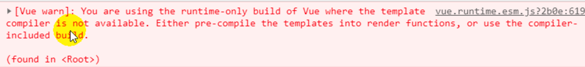

默认打包后，项目引入的是`vue.runtime.common.js`，如果项目有用到vue模版，这需要引入`vue.esm.js`包，否则报上面的错误。

