# day10 -02

> 生产环境和开发环境打包区别：
>
> 1. 开发环境不会生成本地打包文件。
> 2. 生产环境不会自动开启服务器允许，需要使用serve库手动运行。
>
> `import from 'lib-flexible'`，import在引入时不使用相对路径时，如何去查找文件，
>
> 1. 首先到webpack.config.js中的`resolve`项的`alias`中查看是否配过这个路径。
> 2. 然后再去node_modules文件夹中寻找同名文件夹，根据这个包的package.json文件中的`main`项查看当前包的入口文件或者说主文件。
> 3. 加载这个主文件。
>
> 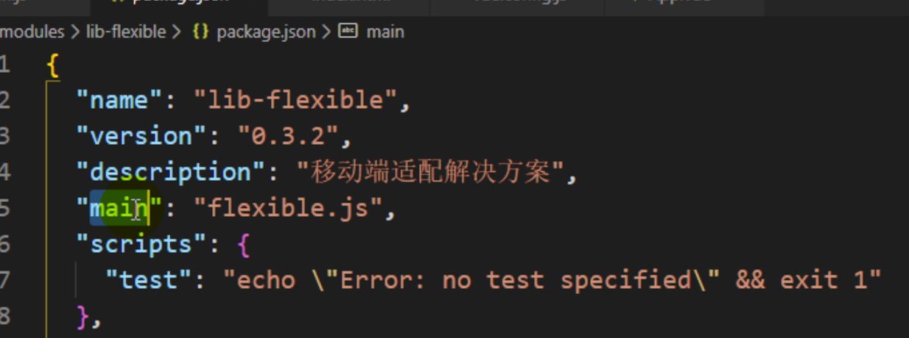


## day01-08

> 路由元信息，在路由组件的配置文件中，通过`meta`属性配置一个对象，该组件就可以通过`this.$route.meta`获取配置的对象信息。
>
> 用在项目中底部导航栏显示与隐藏，某些页面不需要显示底部导航栏(例如登录页面)
>
> 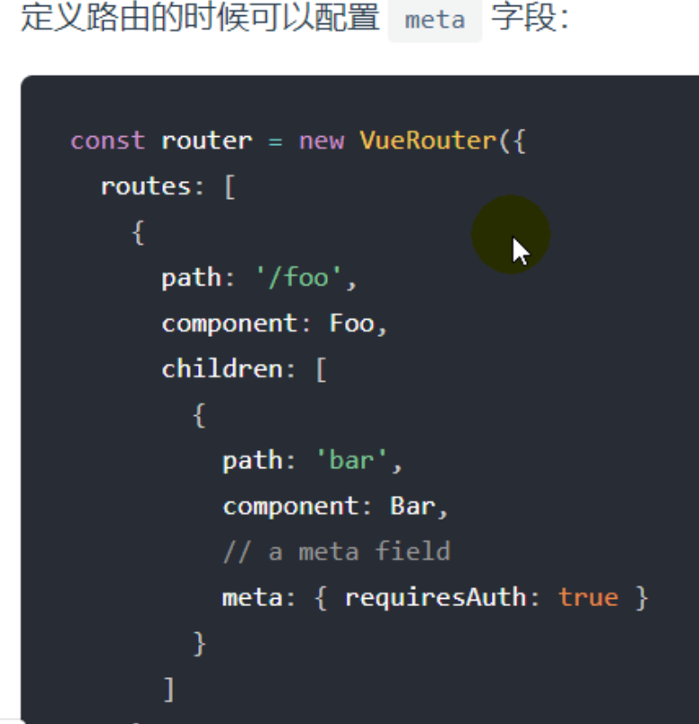
>
> 


## day02 - 01

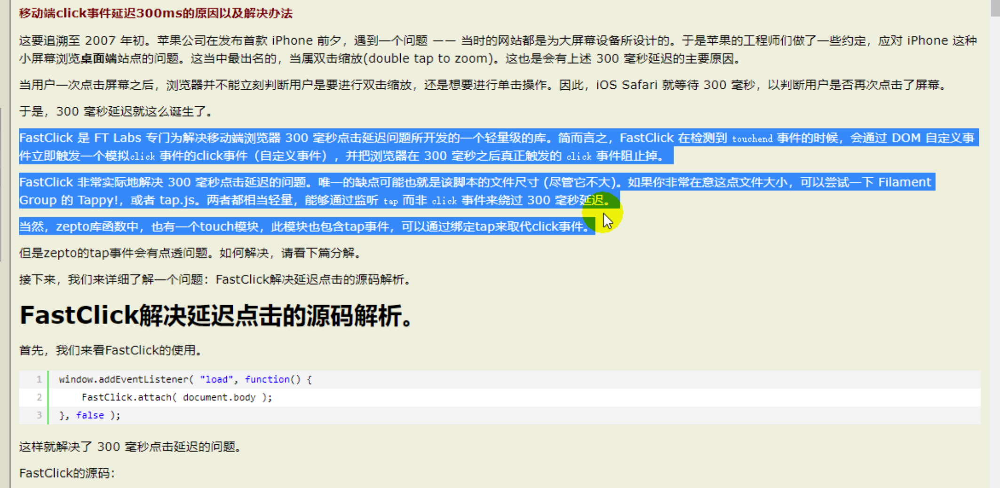


## day02-06

> 解决swiper轮播不正常的问题：
>
> swiper如何生成轮播图的，`它是对页面元素进行重新排版生成轮播效果`，如果此时数据改变但是页面还没有改变时创建swiper时，就会以当前页面进行排版，即使之后页面更新添加了新的元素，也不会将其添加到轮播中。
>
> 直到问题所在了，解决方式就是在数据全部更新到页面上之后在创建swiper对象，对页面上的元素进行排版。
>
> 解决方案：
>
> 1. watch+nextTick
> 2. dispatch+callback+nextTick
> 3. dispatch返回值+nextTick
>
> vue是异步更新页面，当数据更新后，并不是马上更新页面，而是将更新页面任务添加到任务队列中，等待更新。

```javascript
// 在categorys属性的监听函数中创建swiper对象。
watch: {
      // vue处理: 更新状态数据 ==> 调用监视的回调函数 ==> 异步更新界面
      categorys () {// categorys状态数据更新了

        // 在此次数据变化导致界面更新后执行
        // 将回调延迟到下次 DOM 更新循环之后执行。在修改数据之后立即使用它，然后等待 DOM 更新
        this.$nextTick(() => {
          // 创建Swiper对象的时机: 必须在列表数据显示之后
          new Swiper('.swiper-container', {
            loop: true, // 循环模式选项
            // 如果需要分页器
            pagination: {
              el: '.swiper-pagination',
            },
          })
        })
      }
    },
   
// 方式2
mounted () {
	// 异步获取分类列表到vuex的state
  this.$store.dispatch('getCategorys', () => {// categorys状态数据更新了
  // 在此次数据变化导致界面更新后执行
  // 将回调延迟到下次 DOM 更新循环之后执行。在修改数据之后立即使用它，然后等待 DOM 更新
  this.$nextTick(() => {
  	// 创建Swiper对象的时机: 必须在列表数据显示之后
  	new Swiper('.swiper-container', {
    	 loop: true, // 循环模式选项
     	// 如果需要分页器
     	pagination: {
      	  el: '.swiper-pagination',
     	},
   })
  })
}) 
  
// 方式3  
async mounted () {
   await this.$store.dispatch('getCategorys') // dispatch()返回的promise在状态更新且界面更新后才成功
   // 创建Swiper对象的时机: 必须在列表数据显示之后
   new Swiper('.swiper-container', {
        loop: true, // 循环模式选项
        // 如果需要分页器
        pagination: {
          el: '.swiper-pagination',
        },
      })
      
},
```


## day04- 09

> better-scroll包实现滑动效果，有1.x和2.x两个版本。
>
> 2.x版本是对1.x的优化，将1.x的功能拆解成插件，只保留核心滑动功能，如果想要使用高级功能，使用哪个引入那个插件，实现按需打包。

> 实现滑动列表的联动思路：


# day05-04

> vue中，在订餐中点击添加按钮，food数量会增加，但是vuex中没有数量属性，因此vuex对于vuex初始化后添加的属性不会添加监听。如果想让点击food增加按钮后，页面也会随之改变，需要将`food.count`变成一个响应式数据，使用`Vue.set(target, 属性名, 属性值)`，`Vue.set(food, 'count', 1)`将vuex中的food对象中的count属性变成响应式对象，count改变时会通知页面改变。
>
> 总结：在程序运行时，给vuex中存储的对象添加新属性时，该属性不是响应式，需要使用Vue.set()方法添加数据绑定。

## day05-06

> 视频开头的问题，添加某行食物，弹出食物详情弹框，视频上说时事件冒泡行为，我没看出来？

> 函数节流和防抖的坑，一般用在事件监听情况，注意不要在事件监听函数中调用节流方法，这样根本没有使用到节流。

```javascript
// 函数节流
function throttle(fn){  
  let timer = null;
	return ()=>{
    if(timer) return;
		timer = setTimeout(()=>{
      fn();
		},1000)
  }
}

// 给btn1按钮添加函数节流，在回调函数中调用节流函数，这是一个巨坑，根本没有任何节流效果
document.getElementById('btn1').onclick = function(){
  trottle(()=>{
    console.log('aaaa');
  });
}

// 正确使用节流
document.getElementById('btn1').onclick = throttle(()=>{
  console.log('aaaa');
});
```

## day05-07

> vuex多摸块拆分，按照业务逻辑进行拆分。以前是将所有功能所使用的共享数据分别放在state、action、mutation、getter这些文件中，现在是按照业务逻辑分别建立自己的state、action、mutation、getter文件，就像下图这种结构。
>
> 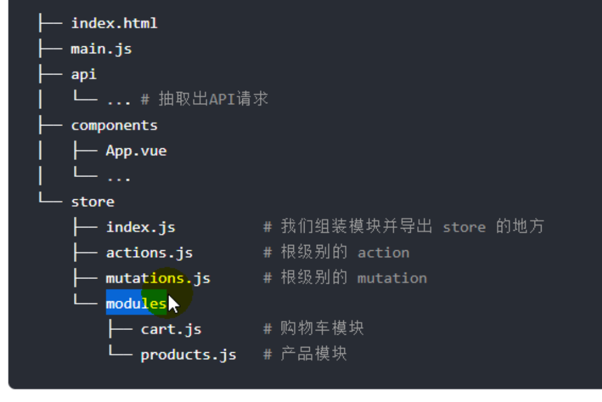
>
> 需要注意：
>
> 根级别的actions和mutations文件中访问的state为总的state，而每个模块中的actions和mutations文件中访问的state为该模块自己的state。下面代码展示了区别。
>
> commit('')方法会全局遍历查找所有匹配的mutation并调用。因此各个模块中的mutation名称不要相同，如果想要调用多个模块mutation时，可以将action添加到根级别的action文件中。

```javascript
store = {
  userModule:{
    state:{
      userInfo:{}
    },
    action:{
      
    },
		mutation:{
      
    }
  },
  shopsModule:{
    state:{
      shops:{}
    },
    action:{
      
    },
		mutation:{
      
    }
  },
  foodsModule:{
    state:{
      Foods:{}
    },
    action:{
      
    },
		mutation:{
      
    }
  }
}
```

> 使用vuex多摸块后，mapState、mapaAction、mapMutation需要接收对象而不是数组了，但是mapGetter不受影响，继续按照之前的数组写法，他会去store对象进行全局查找，因此各个模块的getter不要重名。

```javascript
之前的写法
...mapState(['foods, shops'])
...mapGetter(['foodCount'])

多摸块后写法
...mapState({
	foods: state => state.shopModule.shops.foods,
  shops: state => state.showModule.shops
})
...mapGetter(['foodCount'])
```


## day05-09

> 1. v-if与v-show，一般v-if与v-show都是可以通用的，但是有些情况时不能同名的，
>
> 不能用v-show情况：组件展示数据时，当数据还没有请求下来时需要隐藏，此时就要使用v-if而不是v-show，因此v-show虽然也隐藏，但是通过display:none隐藏，模版还是被渲染出来了，如果模版中的数据有`a.b.c`这种读取情况直接造成`read xxx of undefined`。
>
> 不能用v-if情况：例如在让列表实现滚动时，使用BScroll创建滚动列表，其实给列表DOM的style属性中添加滚动样式，实现滚动效果，如果使用v-if，当隐藏时会直接干掉这个DOM对象，导致滚动样式丢失，再次显示时BScroll对象将不会再给列表添加滚动样式，除非重新创建BScroll对象，再给这个新创建的列表添加样式。
>
>  
>
> 2. 项目中的购物车列表打开和隐藏时需要注意，使用单例模式创建BScroll对象，否则每次打开都需创建一个BScroll对象，管理着列表数据，既影响性能，又存在隐藏的bug。
>
> 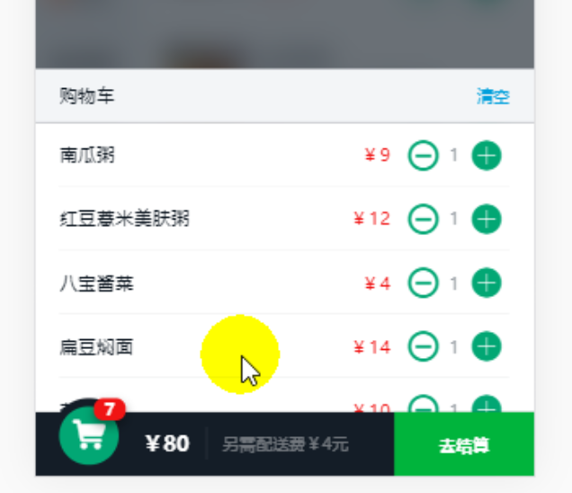
>
> 3. 在显示购物车列表时，需要调用BScroll实例对象的`refresh()`方法刷新当前列表高度，因为有可能有这种情况，一开始购物车列表高度没有超过容器，则BScroll对象不会给购物车列表添加滚动样式，当关闭购物车列表，再向购物车中多添加几项食物，使其达到滚动条件，但是此时打开购物车列表没有滚动效果，因为BScroll对象还是以为列表是之前的高度，因此需要调用`refresh()`让BScroll对象重新计算内容高度，实现滚动效果。
> 4. BScroll使用注意，在数据下载完成后在创建BScroll对象。


## day07-02

> 路由懒加载，或者叫代码分割，之前项目会打包成一个js文件，使用路由懒加载将不同组件的代码放在不同的js文件中，减少文件大小。
>
> `const component = ()=>{import('path')}`引入组件的写法，利用了js新语法import动态引入，import方法返回一个promise对象。


## day07-06

> 路由守卫有两种：全局路由守卫和组件路由守卫，全局路由守卫在所有路由组件切换时会触发调用，组件路由守卫定义在组件内部，只有在该路由组件切换、更新时才会触发。
>
> 路由导航流程：从一个路由A跳转到另一个路由B
>
> 1. 在失活的组件(A)里调用组件的离开守卫: beforeRouteLeave()
> 2. 调用全局的前置守卫: beforeEach()
> 3. 在被激活的组件(B)里调用组件的进入守卫: beforeRouteEnter(), 此时组件对象还没有创建，在函数内通过next绑定回调函数，处理进入组件后的操作`next(comp => {})`。
> 4. 创建组件对象
> 5. 组件调用next绑定的回调函数，并将组件传入。
> 6. 调用全局的后置钩子: afterEach()


## day07-07

> <keep-alive>标签会将在该标签中显示的所有组件都缓存下来，项目代码中MSite组件和Shop组件，点击MSite组件(商家列表)跳转到Shop组件(商家详情)中，正常来说应该缓存MSite、Order、Search、Profile组件，但是MSite业务模块中的Shop组件也会缓存，因此`需要注意<keep-alive>标签包裹的<router-view>标签到底会显示那些组件，避免缓存不必要的组件`
>
> 组件起名和路由起名：
>
> 组件起名：在定义组件的文件中，添加属性`name：componentName`，用在<keep-alive>标签中，用于排除那些组件不需要缓存，例如`<keep-alive exclude="MSite"></keep-alive>`
>
> 路由起名：在路由配置文件中，给当前路由配置对象添加`name:componentName`，用在路由跳转中，传递对象时作为name的属性值，例如`this.$router.push({name:'MSiteRoute', params:{id:'111'}})`

## day07-09

> 异步组件，其实使用的是import()动态引入，前面的路由组件懒加载其实就是定义了一个异步组件。
>
> 异步组件会被webpack单独封装成一个文件保存。
>
> 异步组件加载时机：
>
> 1. 当组件第一次被创建时，组件模版中使用了异步组件的标签时，模版解析时发现有异步组件，则会进行网络请求访问这个异步组件文件，之后再次使用这个异步组件不会再次网络请求，因为缓存起来了，除非点击浏览器刷新按钮，刷新页面。
> 2. 当访问地址匹配到路由组件，如果该路由组件为异步组件时，会进行网络请求访问这个异步组件文件，之后再次使用这个异步组件不会再次网络请求，因为缓存起来了，除非点击浏览器刷新按钮，刷新页面。

## day07-10

> 事件是有交互产生的，因此绑定事件是为了给标签添加交互功能。
>
> vue三种事件：
>
> 1. 原生事件，在html标签中定义的与系统事件同名的。
> 2. 自定义事件触发原生事件，在组件标签中定义的自定义事件添加`.native`
> 3. 自定义事件，通过`$emit()方法`触发自定义的回调函数。
>
> 一般在html标签中使用DOM定义的事件名称，绑定原生事件，即`<button @click="test">`，html标签中帮自定义事件没有什么意义。
>
> `自定义事件用在给子组件绑定一个父组件的回调函数`或者这样理解，子组件给父组件传值是通过父组件给子组件传递一个回调函数，回调函数的触发伴随着交互动作，因此当点击子组件是触发父组件的回调函数。
>
> 步骤：
>
> 1. 父组件在模版中给子组件标签添加一个自定义事件。
> 2. 子组件原生标签中定义原生事件，
> 3. 在原生事件回调函数中调用`$emit()`方法触发父组件的回调函数。
>
> 核心通过`$emit()`方法，将原生事件分发或者叫传递给父组件绑定的事件回调函数中。
>
> 原生事件与自定义事件区别：
>
> 原生事件浏览器会自动分发，即自定调用定义的回调函数。
>
> 自定义事件需要自己手动触发，即调用emit方法触发指定的回调函数


## day07-11

> v-model：
>
> v-model指令用来执行DOM对象的双向数据绑定。
>
> `<input type="text" v-model="name">` 等价于
>
> `<input type="text" :value="name" @input="name=$event.target.value">`
>
> v-model指令可以用在自定义组件中，需要借助自定义事件。
>
> ```html
> <template>
> 		<MyInput v-model="name1"></MyInput> 等价于
> 		<MyInput :value="name2" @input="name1=$event"> <!--$event是从子组件传递过来的数据 -->
> 		<MyInput :value="name3" @input="handleFun"> <!--可以传一个函数名称-->
> </template>
> <script>
> 		export default{
> 	     data(){
>          name1: '',
>          name2: '',
>          name3: ''
>        },
> 			 methods:{
>       		handleFun(data){
>             name3 = data;
>           }
> 	     }
>     }
> </script> 
>   
> <!-- MyInput组件内部 -->
> <template>
> 		<input type="text" :value="value" @input="$emit('input', $event.target.value)">  
> </template>
> <script>
> 		export default{
>       props:['value']
>     }
> </script>
> ```
>
> 

## day07-14

> 使用代理解决跨域问题，nginix配置
>
> 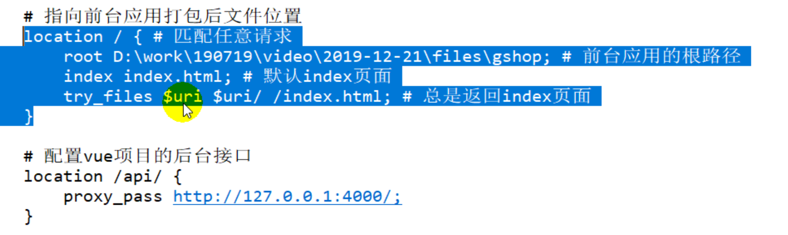
>
> 注意项目中使用前端路由时，注意不要让后端解析前端路由url地址，在history方式，`http://localhost:8080/api/login`这个地址的path是前端路由不是后端路由，但是浏览器发送请求时不是发送`http://localhost:8080`，而是`http://localhost:8080/api/login`，这样导致后端解析前端路由地址造成404，因此解决方式，如果出现404返回index.html页面，vue会自动解析地址，并进行前端路由跳转。

## 项目错误

> 项目当前处于某个路由上，此时再次跳转到该路由上，也就说点击路由跳转按钮刷新当前路由页面会报这个错误。

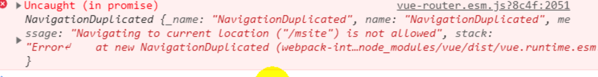

> 出现这个错误的原因是路由问题，在入口文件引入路由时，路由名称必须和路由文件名称一致。否则就会报错。
>
> `import router from './r/router.js'`，文件名和导入时的变量名必须一致。

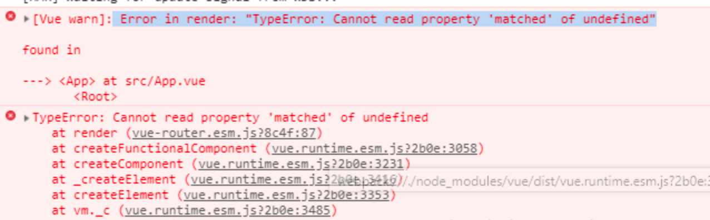


> 出现下面问题，一般是vue文件语法错误，导致无法解析，看看`template标签`中是否有拼写错误，或者少了一些符号等。
>
> 如果加载这个vue文件，文件时空文件时也会报这个错误，因为没有找到`template标签`。

 

>css预处理语言的loader包版本过高，导致下面的错误，降低一下loader版本就可以了，例如如果使用less解析时报这个错误，将less-loader包版本降低一下。

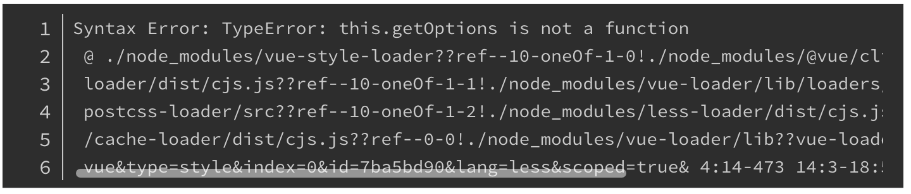


> 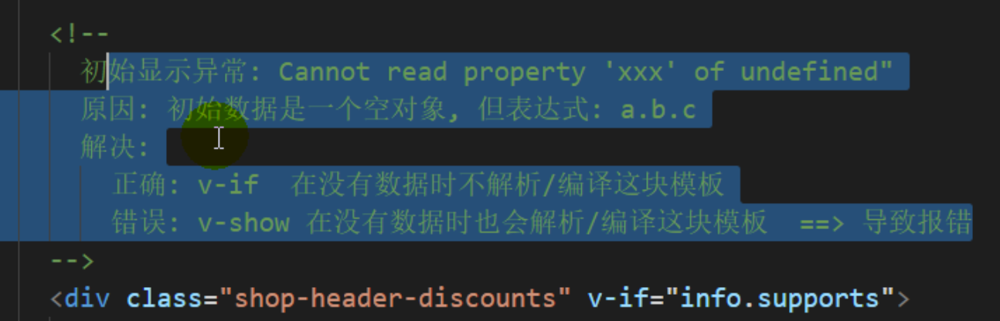
>
> 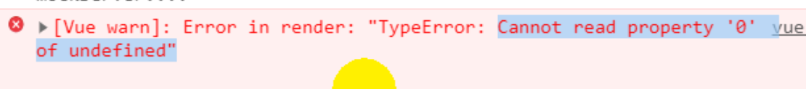

# vue 项目优化

> vue.config.js中`runtimeCompiler`属性设为false，默认就是false，组件中不使用template，因此不需要引入带解析版本的vue(vue.esm.js)，会让vue.js文件缩小10KB。


# 项目依赖的库

> 项目编译依赖库：
> 1. poss-px2rem：用来将css中的px转换成rem，基于html的font-size大小将css中的px换算成rem。
> 2. lib-flexible：自动适配，根据移动端手机尺寸自动调整html的font-size值。
> 3. fastclick.js：解决如何处理移动端click事件延迟300ms问题。

# 项目配置vue.config.js


## 问题

> vue项目引入本地图片加载不出来
>
> 方式2这种方式是无法加载出图片的，因为显示到页面上为``
>
> ```html
> <!-- 方式1，vue会转换成项目的绝对路径 -->
> 
> 
> <!-- 方式2，这种方式无法加载本地图片 -->
>   <!-- temp.url = './images/nav/1.jpg' -->
> 
> <!-- 方式3 -->
> import imgs from './images/nav/1.jpg'
> 
> 
> ```
>
> 

> 导航标签设置margin-top导致页面出现滚动条，这是由于margin-top塌陷导致的问题。给父元素添加一个伪类实现。

> mint-ui实现按需打包在vue-cli2和vue-cli3不一样
>
> vue-cli2在`babelrc.js`中配置。
>
> vue-cli3在`babel.config.js`中配置。
>
> 官方给出的配置已经落后了，要写新版本babel配置。

> vue给组件添加过渡时，组件中没有`v-if`或者`v-show`修饰，并且也不是动态组件，导致过渡动画不生效。