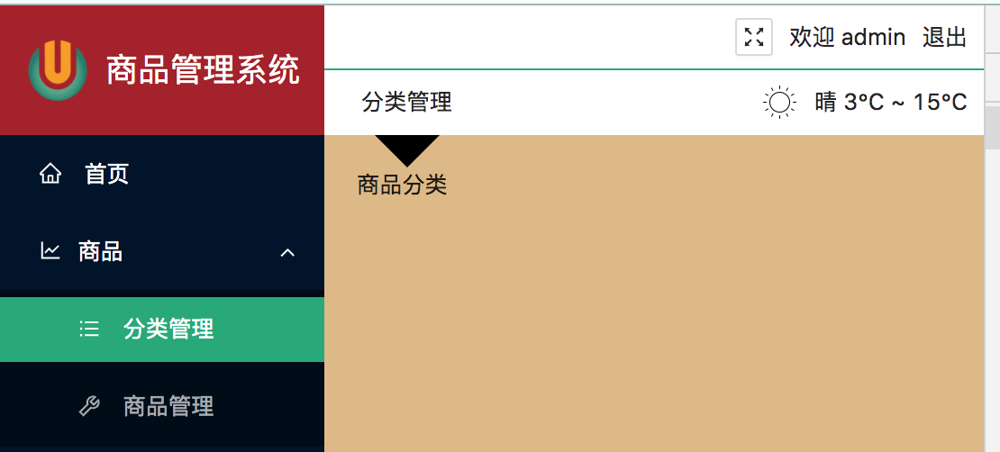

## Menu中下拉列表选中

> 在使用Menu时，有四个选项`defaultSelectedKeys`、`selectedKeys`、`defaultOpenKeys`、`openKeys`这四个选项的坑，selectKeys表示选中的列表项，openkeys表示打开的列表组。defaultSelectedKeys与defaultOpenKeys只能被设置一次，而另外两种可以被设置多次。
>
> ​		需求：当登录系统后打开系统主页，默认调转到`/admin`，系统会重定向到`admin/product/category`，此时使用openkeys会导致有些二级列表打不开，而使用defaultOpenKeys只能被设置一次，因此defaultOpenkeys被设置为`admin`展不开。
>
> 解决方案：
>
> 1. 使用defaultOpenKeys，登录后直接跳转到`admin/product/category`，不要进行二次路由。
> 2. 使用openKeys，添加监听(onOpenChange，二级列表展开/关闭的回调)，在回调函数中直接删除openKeys中的值。
>
> 


## 输入框值改变的回调函数

> Select组件中onChange回调函数参数为value，input组件中onChange回调函数参数为event。


## Upload组件

> 在标签中添加注释子节点会导致antd无法正常工作，例如下面在`{fileList.length >= 4 ? null : uploadButton}`上一行添加了句注释，导致Upload添加图片限制功能失效。

```jsx
        <Upload
          action={`${BASE_URL}/manage/img/upload`}//发送上传请求的地址
          method="post"
          name="image"
          listType="picture-card"//照片墙的展示方式
          fileList={fileList}//图片列表，一个数组里面包含着多个图片对象{uid:xxxx,name:xxx,status:xxx,url:xxx}
          onPreview={this.handlePreview}//点击预览按钮的回调
          onChange={this.handleChange}//图片状态改变的回调（图片上传中、图片被删除、图片成功上传）
        >
          {/* 下面这句话时当添加图片>=4时，上传按钮隐藏，但是如果加上这个注释，导致下面这句代码失效*/}
          {fileList.length >= 4 ? null : uploadButton}
        </Upload>
```


> Upload组件中回调函数onChange，参数返回file和fileList，file参数是fileList对象对应的file对象通过克隆获得的，因此不要在file对象中修改属性值，没啥用，UpLoad组件是基于fileList数组展示图片，fileList中的file对象属性没有改变，一切都白瞎。


## tree

> expandedkeys属性：接收一个数组，表示树形组件显示时，默认打开哪些分支节点。
>
> defaultExpandAll属性：接收一个boolean值，表示树形组件显示时，默认打开所有分支节点。`expandedkeys与defaultExpandAll两个参数是互斥的，tree组件只能使用一个`
>
> checkKeys属性：接收一个数组，表示树形组件显示时，默认选中哪些叶子节点。
>
> autoExpandParent属性：接收一个boolean值，表示当子节点全部选中并分支节点都展开时，父节点自动展开，使用示例中默认写法。如果不需要收集展开折叠的分支节点，则可以直接删除不使用该属性。
>
> onExpand：展开和收缩的回调函数，当分支节点展开或者收缩时，会调用该回调函数，并返回展开了哪些分支节点。
>
> onCheck：选中或者取消选中树的叶子节点时，会调用这个回调函数，并返回选中了哪些叶子节点。
>
> 