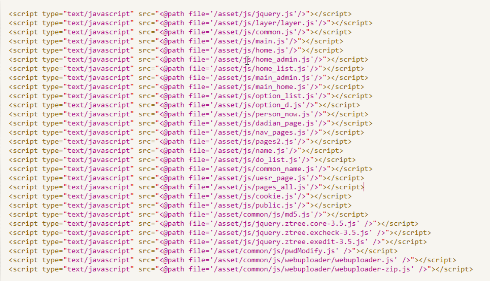
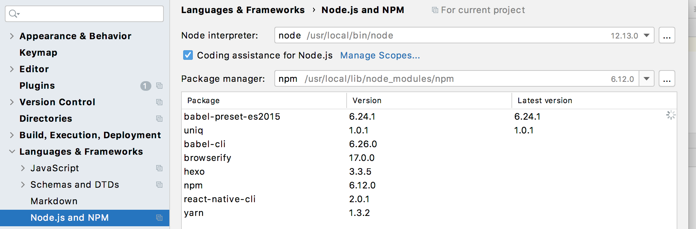
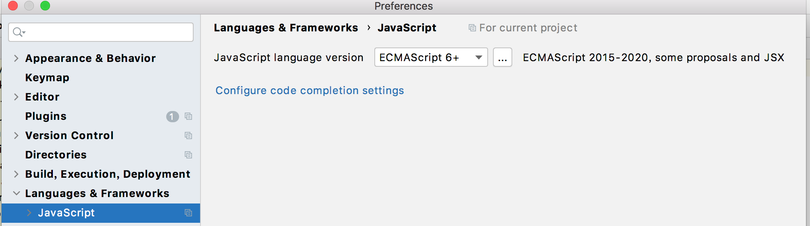

# 模块化

> 非模块化时代：
>
> ​		在早期PC时代，JS只是负责页面的交互功能，逻辑简单复杂程度低，因此无需模块化处理，但是随着移动端的火爆，JS越来越被重视，JS处理的功能变得越来越复杂，因此页面需要展示不同功能时，html中需要引入大量的script标签，并且JS语言没有依赖管理，需要人为管理JS文件之间的依赖关系(例如A依赖B时，b的script标签要写在a的script标签前面)，增加了维护的代价。
>
>  
>
> 下面图片展示了，没有使用模块化时的实现样子：
>
> 
>
> html页面引入了多个JS文件，并且这些script的顺序记录了其中js文件的依赖关系。
>
>  
>
> 非模块化的缺点：
>
> 1. 功能代码放在一个或者多个文件中，往往一个文件需要承载多个功能(为了减少请求次数)，维护麻烦，出现问题需要从几千或者几万行代码中寻找bug，js是单线程运行，修改错了容易引发更大问题。
> 2. 多人协作时，都修改该文件，会一不小心影响到其它人的代码，例如取个变量名，结果上面有人使用了，有时会导致问题。
> 3. 版本控制时，冲突太多。
> 4. 多个文件共享一个命名空间，非常容易造成命名冲突。
> 5. 文件之间的依赖关系时隐藏的，开发者无法知道当前JS文件依赖哪些JS文件，需要阅读整个文件代码才能知道，因此调整某些库的时候非常麻烦，需要查询所有文件的代码，看看哪些文件使用了该库，不像其它语言，文件开头使用import就指明了当前文件依赖哪些文件。

## 上古模块化管理

> 前端项目开发经历了下面几个阶段：
>
> 1. 全局function时代。
> 2. namespace时代。
> 3. IFFE时代。
> 4. 现代的模块化管理工具，它们都是基于IFFE方式来变形实现的

### 全局function模式

> 将所有功能封装成一个个的function来使用。
>
> 全局function模式缺点： Global被污染了, 很容易引起命名冲突

module1.js

```javascript
//数据
let data = 'atguigu.com'

//操作数据的函数
function foo() {
  console.log(`foo() ${data}`)
}
function bar() {
  console.log(`bar() ${data}`)
}
```

module2.js

```javascript
let data2 = 'other data';

function foo() {  //这里与另一个模块中的函数冲突了
  console.log(`foo() ${data2}`)
}
```

test.html

```html
<script type="text/javascript" src="module1.js"></script>
<script type="text/javascript" src="module2.js"></script>
<script type="text/javascript">
  let data = "我是修改后的数据"
  foo()
  bar()
</script>
```

### namespace

> 将所有功能以对象形式封装，或者说使用面向对象的思想来开发，解决了全局命名污染的问题。
>
>  namespace缺点： 没有私有化属性的概念，依然可以修改模块内部代码，不安全。

module1.js

```javascript
let myModule = {
  data: 'module1 atguigu.com',
  foo() {
    console.log(`foo() ${this.data}`)
  },
  bar() {
    console.log(`bar() ${this.data}`)
  }
}
```

module2.js

```javascript
let myModule2 = {
  data: 'module2 atguigu.com',
  foo() {
    console.log(`foo() ${this.data}`)
  },
  bar() {
    console.log(`bar() ${this.data}`)
  }
}
```

test.html

```html
<script type="text/javascript" src="module2.js"></script>
<script type="text/javascript" src="module22.js"></script>
<script type="text/javascript">
  myModule.foo()
  myModule.bar()

  myModule2.foo()
  myModule2.bar()

  //可以直接修改模块内部的数据
  myModule.data = 'other data' 
  myModule.foo()
</script>
```

### IFFE

> IFFE：immediately-invoked function expression(匿名函数自调用)
>
> 
>
> IFFE的思想：
>
> 1. 利用了外层作用域无法访问内层作用域实现，数据私有化。
> 2. 利用闭包保存外层作用域，实现部分数据的公有化。
> 3. 调用函数传入参数，实现依赖关系的显视化。

module1.js

```javascript
(function (window, $) {
  //数据
  let data = 'aaaa'

  //操作数据的函数
  function foo() { //用于暴露有函数
    console.log(`foo() ${data}`)
    $('body').css('background', 'red')
  }

  function bar() {//用于暴露有函数
    console.log(`bar() ${data}`)
    otherFun() //内部调用
  }

  function otherFun() { //内部私有的函数
    console.log('otherFun()')
  }

  //暴露行为
  window.myModule1 = {foo, bar}
})(window, jQuery)
```

module2.js

```javascript
(function (window) {
  //数据
  let data = 'bbbb'

  //操作数据的函数
  function foo() { //向外暴露的内部私有函数
    console.log(`foo() ${data}`)
  }

  function bar() {//向外暴露的内部私有函数
    console.log(`bar() ${data}`)
    otherFun() //内部调用
  }

  function otherFun() { //未暴露的内部私有函数
    console.log('otherFun()')
  }

  //暴露行为
  window.myModule2 = {foo, bar}
})(window)
```


test.html

```html
<script type="text/javascript" src="jquery-1.10.1.js"></script>
<script type="text/javascript" src="module1.js"></script>
<script type="text/javascript" src="module2.js"></script>
  myModule.foo()
</script>
```


### 上面项目管理方式的问题

> 从IFFE开始，实现了数据的私有化和方法的公有化，每个文件也展示了自己的依赖关系，但是并没有解决下面的问题：
>
> 1. html页面的script标签过多，由于文件根据功能拆分成多个JS文件，因此增加了请求次数，需要大量的请求。
> 2. 无法清晰的查看项目的依赖关系，并且还是需要人工手动管理依赖，通过html页面中script标签的顺序管理依赖。

## 现代模块化管理

> 现代模块化管理工具就是来解决上古模块化解决不掉的问题：
>
> 1. html页面的script标签过多，由于文件根据功能拆分成多个JS文件，因此增加了请求次数，需要大量的请求。
> 2. 无法清晰的查看项目的依赖关系，并且还是需要人工手动管理依赖，通过html页面中script标签的顺序管理依赖。
>
> 现代模块化管理工具：
>
> 1. CommonJS，唯一的双端的模块化管理，可以实现服务器和浏览器项目的模块化管理。
> 2. ES6模块化管理
> 3. AMD模块化管理，
> 4. CMD模块化管理，现在没有多少人使用了。
>
>  
>
> 只有CommonJS可以实现服务器和浏览器项目的模块化管理。因为该工具就是node.js中使用的。

### 模块化开发配置

> webstorm配置：
>
> 配置Node.js and NPM选项，保证项目路径下的命令行，可以运行node.js库，例如babel和browserify这两个库。
>
> 
>
>  
>
> 如果使用ES6模块化开发，将Javascript语言版本设置为ES6。
>
> 

## 文件的命名

