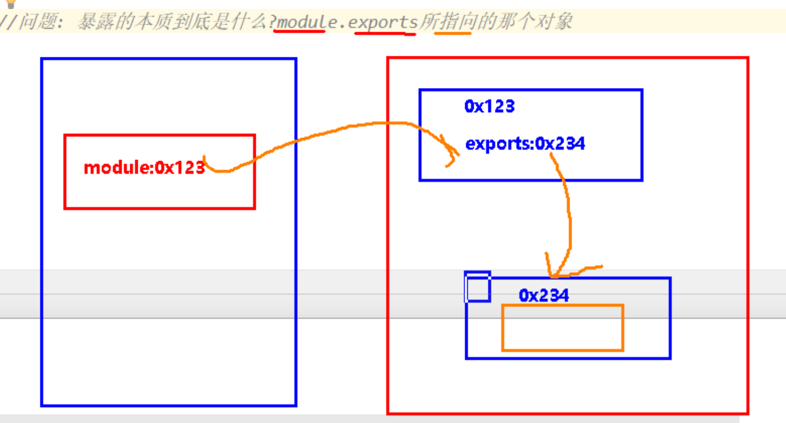

# CommonJS

> CommonJS是node.js中提供的模块化管理工具。
>
>  
>
> CommonJS的项目结构：
>
>   |-modules   --- 自己写的模块，(一个模块就是一个js文件)
>     	|-module1.js
> 	    |-module2.js
>     	|-module3.js
>
>   |-node_modules   ----  第三方库，需要通过 `npm install`安装。
>
>   |-app.js  --- 汇总文件，将当前项目中所有js文件(包括第三方库)，引入到该文件中。
>   |-package.json. --- npm配置文件，用来记录当前项目名称、版本、所依赖的第三方库等信息。
>
> ​    {
>​      "name": "test-0719",
> ​      "version": "1.0.0"
> ​    }
> 
> 
>
>  `JS模块化管理中，一个模块就是一个js文件`

## CommonJS模块化实现

> `模块化的暴露与引入操作`：
>
> 1. 暴露，将当前文件中哪些内容暴露给外部使用，就像类的权限控制一样，暴露的方式：
>    1. module.exports = 对象，将一个对象赋值给module.exports属性，也可以是函数，因为函数就是一个对象。
>    2. export = 对象，exports是module.exports的简写形式。
> 2. 引入，在其它文件中要使用某个文件中暴露的内容时，需要将文件引入，引入方式：
>    1. require('js文件路径')，第一种写法为自定义模块，也就是自己写的模块，CommonJS会根据开发者写的路径取找。
>    2. require('库名称')，第二种写法为第三方库引入，也就是使用npm下载的模块，CommonJS会自动去`node_modules`文件夹中寻找该模块。
>
> 注意点：
>
> 1. 一个模块的暴露方式不能混用，两者不同同时出现在一个文件中，CommonJS会先找module.exports，如果没有再找exports，因此exports会失效。
> 2. 引入时填写的路径或者库名称，加不加文件后缀名都行，推荐是不加后缀名，因为其它模块化工具都没有加，好记。
> 3. 由于CommonJS是一个双端的模块化工具，因此下面的代码实现只能运行在安装了mode.js的电脑上，浏览器无法运行这个项目，需要使用翻译工具，将项目代码进行翻译才能运行。

### 前期环境搭建

> CommJS模块化实现步骤：
>
> 1. 需要安装两个东西：
>    1. 安装node.js，js的运行环境，commonJS是node.js提供的模块化实现库。
>    2. 安装npm，包管理工具，用来管理当前项目中依赖的所有库。
> 2. 项目的文件夹变成一个包，就像使用git管理项目时需要将项目文件夹变成一个git库。
>    1. 在项目文件夹路径下，运行命令`npm init`，创建npm配置文件`package.json`。
>    2. 在项目的根目录下，添加该项目依赖的各个第三方库，例如`npm install jquery`。
>
> 项目结构在最上面展示了。

### 代码实现

> 代码结构：
>
> 1. 创建三个自定义模块，module1，module2和module3，在这三个模块中展示CommonJS模块化工具规定暴露写法。
> 2. 创建app.js汇总文件，用来引入三个自定义模块和一个第三方库。
>
> 编写完代码后，在项目根目录下执行`node app.js`命令来运行项目。

module1.js

```javascript
module.exports = {
    data : "我是module1中的数据",
    getData : function(){
        return this.data;
    },
    setData: function(data){
        this.data = data;
    }
}
```

module2.js

```javascript
exports.foo = function () {
    console.log('foo()  module2');
}

exports.bar = function () {
    console.log('bar()  module2');
}
```

module3.js

```javascript
exports = 12;
```

app.js

```javascript
let module1 = require('./modules/module1');
let module2 = require('./modules/module2');
let module3 = require('./modules/module3');
let uniq = require('uniq');

// 调用module1
console.log(module1.getData());
module1.setData("aaaaa");
console.log(module1.getData());
console.log(module1);

// 调用module2
module2.bar();
module2.foo();
console.log(module2);

// 调用module3
console.log(module3);

// 调用uniq
console.log(uniq([1,2,3,4,4,5,6,7,8,99]));
```

> 执行结果：
>
> // `module1执行结果`
>
> 我是module1中的数据
> aaaaa
> {
>   data: 'aaaaa',
>   getData: [Function: getData],
>   setData: [Function: setData]
> }
>
>  
>
> // `module2执行结果`
>
> bar()  module2
> foo()  module2
> { foo: [Function], bar: [Function] }
>
>  
>
> // `module3执行结果`
>
> {}
>
>  
>
> // `uniq执行结果`
>
> [1, 2, 3,  4, 5, 6, 7, 8, 99]


## module.exports和exports本质

> CommonJS模块化暴露数据的本质：
>
> ​		将`module.exports或者exports指向的对象暴露`给外部使用。默认将它们设置为一个空对象，`module.exports = exports = {}`
>
>   
>
> 注意：
>
>  1. 一个文件中只能使用`module.exports`或者`exports`其中的一个暴露内容，不同同时使用，同时使用时以`module.exports`为主。
>
>     
>
> 暴露数据设置方式：
>
> 1. 将暴露的数据包装成对象，赋值给module.exports或者exports。
> 2. 使用它创建的空对象，给其添加属性。

```javascript
module.exports.foo = function () {
    console.log('foo()  module2');
}

module.exports.bar = function () {
    console.log('bar()  module2');
}

 
// 或者使用下面方式
module.exports = {
  foo: function () {
    console.log('foo()  module2');
	}
  
  bar: function () {
    console.log('bar()  module2');
	}
}
```



## 浏览器如何实现模块化管理

> ​		由于CommonJS模块化方式是借助于node.js实现的，因此浏览器并不认识require()和module.exports，因此需要将使用工具，给项目添加require()和module.exports这些模块化的API实现。
>
>  
>
> 实现方式：
>
> 1. 执行`npm install browserify -g`命令，将其全局安装，即在任何路径下都能使用。
> 2. 执行`browserify app.js -o build/index.js`，将汇总文件翻译成浏览器可以执行的js文件，并将翻译后的js文件放到build/index.js路径下。
>
> 说明：
>
> 1. `browserify`包，它是专门用来将使用CommonJS模块化的项目翻译成浏览器可以运行的JS。
> 2. 无需将整个项目所有文件都翻译，它的翻译原理为因为所有JS文件都共享一个window对象，因此在汇总文件中添加require、module.exports这些模块化的API实现，这样就可以实现浏览器的模块化管理。


## 使用问题

> `let t = require('modules/modules1')`这样写会引发什么问题？
>
> ​		browserify翻译报错：由于require中传入的字符串，是一个自定义模块，但是却没有用路径的方式引入，导致CommonJS将其看成第三方库模块，导致commonJS自动去node_modules文件夹下寻找该模块，导致翻译翻译失败。
>
>  
>
> 下图犯了一样的错误。


